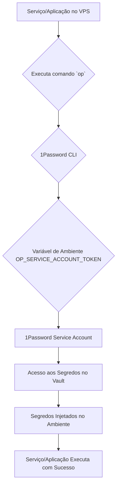

# Automação Completa do 1Password para VPS Ubuntu

## 1. Visão Geral

Este documento detalha a implementação de uma solução de automação para o gerenciamento de segredos em ambientes de servidor VPS Ubuntu, utilizando o 1Password como a fonte central de verdade. O foco é na **segurança**, **automação robusta** e **integração com fluxos de CI/CD** e outras ferramentas de automação, sem a necessidade de interação manual.

### 1.1. Objetivo

O objetivo é estabelecer um fluxo de trabalho onde os serviços e aplicações em um VPS Ubuntu possam acessar e injetar segredos de forma segura e automatizada, sem a necessidade de armazenar segredos em texto claro em arquivos de configuração ou variáveis de ambiente estáticas. Isso é crucial para ambientes de produção e staging, onde a segurança e a conformidade são primordiais.

### 1.2. Benefícios

*   **Segurança Aprimorada:** Segredos nunca são expostos em texto claro no disco. O acesso é controlado via `OP_SERVICE_ACCOUNT_TOKEN`, que pode ter permissões restritivas.
*   **Automação Robusta:** Integração perfeita com scripts de inicialização, deploy e CI/CD, permitindo a injeção automática de segredos.
*   **Governança Centralizada:** Gerenciamento de segredos em vaults do 1Password, com controle de acesso baseado em grupos e auditoria completa, ideal para equipes e ambientes de produção.
*   **Consistência:** Padronização do acesso a segredos em ambientes de servidor, reduzindo erros de configuração.

## 2. Arquitetura da Solução

A arquitetura da solução para VPS Ubuntu é baseada na utilização do 1Password CLI em conjunto com um **Service Account Token**, que permite a automação sem a necessidade de uma interface gráfica ou interação humana.

### 2.1. Componentes Chave

| Componente | Descrição | Importância | Referência |
| :--- | :--- | :--- | :--- |
| **1Password CLI (`op`)** | Ferramenta de linha de comando para interagir com o 1Password. | O coração da automação, permitindo acesso programático a segredos. | [1Password CLI Docs](https://developer.1password.com/docs/cli) |
| **1Password Service Account Token** | Um token de API gerado no 1Password, com permissões específicas para acessar vaults. | Essencial para a autenticação não-interativa em ambientes de servidor e automação. | [1Password Connect](https://developer.1password.com/docs/connect) |
| **Shell (Bash)** | O interpretador de comandos padrão do Ubuntu. | Ambiente para execução de scripts, aliases e funções customizadas que interagem com o `op` CLI. | [Bash Documentation](https://www.gnu.org/software/bash/manual/bash.html) |
| **APT** | Gerenciador de pacotes para Ubuntu. | Utilizado para instalar e manter o `1password-cli` e outras dependências do sistema. | [APT Documentation](https://wiki.debian.org/Apt) |
| **Scripts de Automação** | Scripts customizados (Bash) para inicialização, injeção de segredos e validação de ambiente. | Encapusulam a lógica de automação, garantindo consistência e reprodutibilidade em ambientes de servidor. | [Scripts de Exemplo 1Password](https://developer.1password.com/docs/cli/scripts) |
| **`template.env.op`** | Arquivo de template que define variáveis de ambiente usando referências do 1Password. | Permite a injeção dinâmica de segredos em arquivos `.env` sem expor valores. | [Secret Reference Syntax](https://developer.1password.com/docs/cli/secret-reference-syntax) |

### 2.2. Fluxo de Autenticação e Acesso a Segredos

Em um ambiente VPS, a autenticação é realizada via `OP_SERVICE_ACCOUNT_TOKEN`:

1.  **Configuração do Token:** O `OP_SERVICE_ACCOUNT_TOKEN` é exportado como uma variável de ambiente no servidor (idealmente via um gerenciador de segredos do provedor de nuvem ou diretamente no `.bashrc` do usuário de automação, com permissões restritivas).
2.  **Acesso Automatizado:** Qualquer comando `op` executado no servidor utiliza este token para autenticar e acessar os vaults configurados. Não há interação manual.



## 3. Estrutura de Vaults e Governança

A estrutura de vaults deve ser cuidadosamente planejada para isolar segredos e gerenciar permissões, especialmente em ambientes de produção.

### 3.1. Vaults Recomendados para VPS Ubuntu

*   `shared_infra`: Ideal para segredos de infraestrutura compartilhados, como chaves de API de provedores de nuvem, credenciais de bancos de dados externos, tokens de serviços de monitoramento, etc.
*   `project_X_dev`: Segredos específicos de um projeto X para o ambiente de desenvolvimento (se o VPS hospedar ambientes de dev).
*   `project_X_staging`: Segredos específicos de um projeto X para o ambiente de staging.
*   `project_X_prod`: Segredos críticos de um projeto X para o ambiente de produção.

### 3.2. Governança e Políticas de Acesso

*   **Princípio do Menor Privilégio:** O `OP_SERVICE_ACCOUNT_TOKEN` deve ter permissões mínimas, concedendo acesso apenas aos vaults e itens estritamente necessários para a função do servidor ou aplicação.
*   **Rotação de Tokens:** O `OP_SERVICE_ACCOUNT_TOKEN` deve ser rotacionado periodicamente para minimizar o risco em caso de comprometimento.
*   **Auditoria:** O 1Password registra todos os acessos a segredos, permitindo rastrear o uso do `OP_SERVICE_ACCOUNT_TOKEN` e identificar atividades anômalas.
*   **Isolamento de Ambientes:** Segredos de produção nunca devem ser acessíveis por tokens de desenvolvimento ou staging, e vice-versa.

## 4. Injeção de Segredos e Automação

O método principal para usar os segredos no VPS será através de **Secret References** e do comando `op run`.

### 4.1. O Comando `op run`

Similar ao macOS, o `op run` é a base da automação. Ele executa um comando ou script, injetando os segredos como variáveis de ambiente, sem que eles sejam persistidos no disco ou no histórico do shell.

**Sintaxe:**

```bash
op run -- <seu_comando_com_argumentos>
```

**Exemplo:**

```bash
# Inicia um serviço Node.js que precisa de uma chave de API de produção
op run -- node server.js
```

### 4.2. Arquivo de Template `.env.op`

Utilize um arquivo de template (`.env.op`) com referências aos segredos do 1Password. Este arquivo será processado pelo `op inject` ou pelo script `inject_secrets_ubuntu.sh`.

**Exemplo de `template.env.op` (para VPS):**

```ini
# Chaves para serviços de nuvem
AWS_ACCESS_KEY_ID=op://shared_infra/aws/access_key_id
AWS_SECRET_ACCESS_KEY=op://shared_infra/aws/secret_access_key

# Credenciais de banco de dados de produção
POSTGRES_HOST=op://project_X_prod/database/host
POSTGRES_USER=op://project_X_prod/database/username
POSTGRES_PASSWORD=op://project_X_prod/database/password
```

**Injeção de Segredos a partir do Template:**

O script `inject_secrets_ubuntu.sh` (ou a função `op_inject_env` no `.bashrc`) pode ser usado para gerar um arquivo `.env` temporário com os valores reais dos segredos.

```bash
# Gera um arquivo .env a partir do template.env.op
bash inject_secrets_ubuntu.sh --template template.env.op .env

# Executa um comando usando o .env gerado (seguro com op run)
op run --env-file=.env -- docker-compose up -d
```

## 5. Scripts de Automação para VPS Ubuntu

Os seguintes scripts foram desenvolvidos para facilitar a automação no VPS Ubuntu:

### 5.1. `init_1password_ubuntu.sh`

**Propósito:** Instalar e configurar o 1Password CLI no ambiente Ubuntu, e orientar sobre a configuração do `OP_SERVICE_ACCOUNT_TOKEN`.

**Funcionalidades:**
*   Verifica o sistema operacional (Ubuntu/Linux).
*   Instala o `1password-cli` via APT.
*   Fornece instruções claras para a criação e configuração do `OP_SERVICE_ACCOUNT_TOKEN`.
*   Adiciona funções e aliases úteis ao `.bashrc` (ex: `op_status`, `op_inject_env`).
*   Cria a estrutura de diretórios `~/1password_automation` e `~/.config/1password`.

**Uso:**

```bash
bash init_1password_ubuntu.sh
```

### 5.2. `inject_secrets_ubuntu.sh`

**Propósito:** Injetar dinamicamente segredos de um vault específico do 1Password em um arquivo `.env` ou diretamente no ambiente de execução.

**Funcionalidades:**
*   Verifica a presença do `OP_SERVICE_ACCOUNT_TOKEN`.
*   Verifica a existência do vault especificado (padrão: `shared_infra`).
*   Coleta itens do vault e extrai seus campos para criar variáveis de ambiente.
*   Alternativamente, usa `op inject` com um arquivo `.env.op` para gerar o `.env`.
*   Define permissões `600` para o arquivo `.env` gerado.
*   Carrega as variáveis de ambiente no shell atual.

**Uso:**

```bash
# Injetar todos os segredos do vault 'shared_infra' no .env
bash inject_secrets_ubuntu.sh shared_infra .env

# Injetar segredos de um template .env.op para um arquivo .env
bash inject_secrets_ubuntu.sh --template template.env.op .env
```

## 6. Integração com LLMs CLI e Terminal (em VPS)

Embora LLMs locais como Ollama e LM Studio sejam mais comuns no macOS, a integração de LLMs em um VPS geralmente envolve APIs remotas. O 1Password CLI pode gerenciar os tokens de acesso a essas APIs.

### 6.1. Configuração de Segredos para LLMs Remotos

Tokens de API para serviços de LLM (OpenAI, Anthropic, Gemini, etc.) devem ser armazenados em um vault apropriado, como `shared_infra` ou um vault específico do projeto.

**Exemplo de Item no 1Password:**

*   **Item:** `openai`
*   **Vault:** `shared_infra`
*   **Campos:**
    *   `api_key`: `sk-xxxxxxxxxxxxxxxxxxxxxxxxxxxx`
    *   `org_id`: `org-xxxxxxxxxxxxxxxxxxxxxxxxxxxx`

### 6.2. Uso com `op run` e `template.env.op`

Para executar aplicações ou scripts que interagem com LLMs remotos, utilize o `op run` com um `template.env.op` que referencie esses segredos:

```ini
# template.env.op (para VPS)
OPENAI_API_KEY=op://shared_infra/openai/api_key
OPENAI_ORG_ID=op://shared_infra/openai/org_id
```

```bash
# Executa um script Python que usa a API OpenAI
op run --env-file=template.env.op -- python my_openai_app.py
```

### 6.3. Funções e Aliases no `.bashrc` para LLMs

O arquivo `bashrc_1password_config.sh` inclui funções para injeção de segredos. Você pode estender isso para criar atalhos específicos para LLMs:

```bash
# Função para enviar um prompt a um LLM remoto (ex: OpenAI)
ask_remote_llm() {
    local prompt="$1"
    local model="${2:-gpt-4o}"
    
    if [[ -z "$prompt" ]]; then
        _op_log_error "Uso: ask_remote_llm <prompt> [model]"
        return 1
    fi

    _op_log_info "Enviando prompt para LLM remoto ($model)..."
    op run --env-file=template.env.op -- \
        curl -s -X POST https://api.openai.com/v1/chat/completions \
        -H "Content-Type: application/json" \
        -H "Authorization: Bearer $OPENAI_API_KEY" \
        -d "{\"model\": \"$model\", \"messages\": [{\"role\": \"user\", \"content\": \"$prompt\"}]" | jq -r ".choices[0].message.content"
}

# Exemplo de uso:
# ask_remote_llm "Qual a diferença entre Docker e Kubernetes?"
```

## 7. Governança e Melhores Práticas

As práticas de governança para VPS são ainda mais críticas devido à natureza dos ambientes de servidor:

*   **Princípio do Menor Privilégio:** O `OP_SERVICE_ACCOUNT_TOKEN` deve ter permissões estritamente limitadas aos vaults e itens necessários.
*   **Rotação de Tokens:** Implemente uma política de rotação regular para todos os `OP_SERVICE_ACCOUNT_TOKEN`.
*   **Monitoramento e Auditoria:** Monitore ativamente os logs do servidor e os logs de auditoria do 1Password para detectar qualquer acesso não autorizado ou uso indevido de segredos.
*   **Variáveis de Ambiente Seguras:** Sempre que possível, utilize o sistema de gerenciamento de segredos do provedor de nuvem (ex: AWS Secrets Manager, GCP Secret Manager) para armazenar o `OP_SERVICE_ACCOUNT_TOKEN`, em vez de diretamente em arquivos no sistema de arquivos.
*   **Controle de Acesso:** Restrinja o acesso SSH ao VPS apenas aos usuários e IPs necessários. Utilize chaves SSH e desabilite a autenticação por senha.
*   **Versionamento de Scripts:** Mantenha todos os scripts de automação sob controle de versão (Git) e garanta que apenas versões auditadas sejam implantadas nos servidores.
*   **Firewall:** Configure um firewall (ex: UFW) para permitir apenas o tráfego essencial para o servidor.

## 8. Referências

[1] [1Password CLI Docs](https://developer.1password.com/docs/cli)
[2] [1Password Connect](https://developer.1password.com/docs/connect)
[3] [Secret Reference Syntax](https://developer.1password.com/docs/cli/secret-reference-syntax)
[4] [1Password CLI Scripts Examples](https://developer.1password.com/docs/cli/scripts)
[5] [Bash Documentation](https://www.gnu.org/software/bash/manual/bash.html)
[6] [APT Documentation](https://wiki.debian.org/Apt)
[7] [OpenAI API Documentation](https://platform.openai.com/docs/api-reference)

