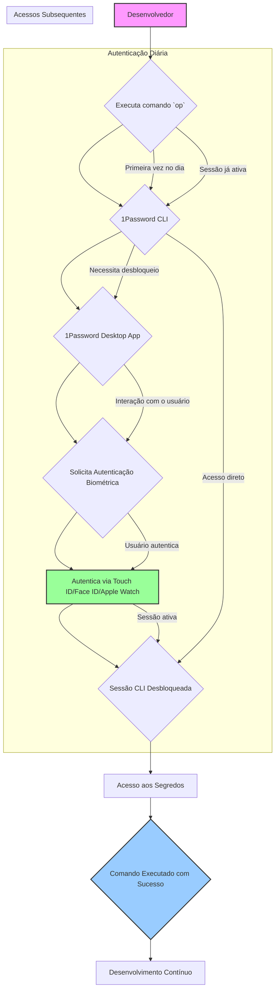

# Automação Completa do 1Password para macOS Silicon

## 1. Visão Geral

Este documento detalha a implementação de uma solução de automação robusta e fluida para o gerenciamento de segredos no macOS Silicon, utilizando o 1Password como a fonte central de verdade. O foco principal é otimizar a experiência do desenvolvedor, garantindo alta segurança e governança, ao mesmo tempo em que se integra com ferramentas modernas, incluindo LLMs (Large Language Models) e a linha de comando (CLI).

### 1.1. Objetivo

O objetivo é estabelecer um fluxo de trabalho onde os desenvolvedores no macOS Silicon possam acessar e injetar segredos de forma segura, rápida e sem atrito em seus ambientes de desenvolvimento, testes e CI/CD local. Isso elimina a necessidade de armazenar segredos em arquivos `.env` estáticos ou no código-fonte, reduzindo riscos de segurança e burocracia.

### 1.2. Benefícios

*   **Segurança Aprimorada:** Segredos nunca são expostos em texto claro no disco ou no histórico do shell. Autenticação biométrica para acesso rápido e seguro.
*   **Fluidez para Desenvolvedores:** Acesso instantâneo a segredos após a primeira autenticação biométrica do dia, sem interrupções.
*   **Governança Centralizada:** Gerenciamento de segredos em vaults do 1Password, com controle de acesso baseado em grupos e auditoria completa.
*   **Automação Inteligente:** Integração com scripts de shell e LLMs para automatizar a injeção de segredos e o fornecimento de contexto.
*   **Consistência:** Padronização do acesso a segredos em ambientes de desenvolvimento local.

## 2. Arquitetura da Solução

A arquitetura da solução é baseada na integração do 1Password CLI com o 1Password Desktop App no macOS, aproveitando a autenticação biométrica e o ecossistema de ferramentas de desenvolvimento.

### 2.1. Componentes Chave

| Componente | Descrição | Importância | Referência |
| :--- | :--- | :--- | :--- |
| **1Password Desktop App** | Aplicação nativa do macOS que gerencia os vaults e interage com o Touch ID/Face ID/Apple Watch. | Essencial para a autenticação biométrica e para manter a sessão do 1Password ativa no sistema. | [1Password Desktop App](https://1password.com/downloads/mac/) |
| **1Password CLI (`op`)** | Ferramenta de linha de comando para interagir com o 1Password. | Permite acesso programático a segredos, criação/edição de itens e integração com scripts. | [1Password CLI Docs](https://developer.1password.com/docs/cli) |
| **Autenticação Biométrica** | Uso de Touch ID, Face ID ou Apple Watch para desbloquear o 1Password. | Proporciona um método de autenticação rápido e seguro, eliminando a digitação de senhas. | [1Password Biometric Unlock](https://support.1password.com/touch-id/) |
| **Shell (Zsh)** | O interpretador de comandos padrão do macOS. | Ambiente para execução de scripts, aliases e funções customizadas que interagem com o `op` CLI. | [Zsh Documentation](https://www.zsh.org/) |
| **Homebrew** | Gerenciador de pacotes para macOS. | Utilizado para instalar e manter o `1password-cli` e outras ferramentas de desenvolvimento. | [Homebrew](https://brew.sh/) |
| **Scripts de Automação** | Scripts customizados (Bash/Zsh) para inicialização, injeção de segredos e validação de ambiente. | Encapusulam a lógica de automação, garantindo consistência e reprodutibilidade. | [Scripts de Exemplo 1Password](https://developer.1password.com/docs/cli/scripts) |
| **`template.env.op`** | Arquivo de template que define variáveis de ambiente usando referências do 1Password. | Permite a injeção dinâmica de segredos em arquivos `.env` sem expor valores. | [Secret Reference Syntax](https://developer.1password.com/docs/cli/secret-reference-syntax) |

### 2.2. Fluxo de Autenticação e Acesso a Segredos

O fluxo de trabalho foi projetado para ser o mais transparente e seguro possível para o desenvolvedor:

1.  **Primeira Autenticação Diária:**
    *   Ao executar o primeiro comando `op` no terminal (ex: `op vault list`), o 1Password CLI detecta que a sessão está bloqueada.
    *   O CLI se comunica com o 1Password Desktop App, que solicita a autenticação via **Touch ID**, **Face ID** ou **Apple Watch**.
    *   Após a autenticação biométrica bem-sucedida, a sessão da CLI é desbloqueada e permanece ativa por um período configurável no Desktop App (ex: 8 horas).
2.  **Acessos Subsequentes:**
    *   Todos os comandos `op` subsequentes, executados manualmente ou via scripts/aliases, utilizam a sessão já autenticada, sem exigir qualquer nova interação do usuário.
    *   Isso garante uma experiência de 

experiência de desenvolvimento fluida e sem interrupções.

### 2.3. Diagrama de Fluxo (Conceitual)



## 3. Estrutura de Vaults e Governança

Para garantir a organização, o isolamento de segredos e a aplicação de políticas de segurança, propomos a seguinte estrutura de vaults:

### 3.1. Vault Exclusivo para macOS Silicon (`macos_silicon_workspace`)

Este vault é a pedra angular da automação local, projetado para conter **apenas** segredos e configurações específicas do ambiente de desenvolvimento no macOS. Isso evita a contaminação de ambientes e garante que segredos críticos de produção não sejam acidentalmente expostos localmente.

*   **Nome do Vault:** `macos_silicon_workspace`
*   **Propósito:** Armazenar segredos e configurações que são **exclusivos** para o ambiente de desenvolvimento local no macOS. Isso inclui chaves de API para LLMs locais, licenças de software, configurações de banco de dados locais, etc.
*   **Conteúdo Exemplar:**
    *   `op://macos_silicon_workspace/ollama/api_key` (Token de API para Ollama local)
    *   `op://macos_silicon_workspace/lm_studio/api_key` (Token de API para LM Studio local)
    *   `op://macos_silicon_workspace/postgres/username` (Usuário do PostgreSQL local)
    *   `op://macos_silicon_workspace/postgres/password` (Senha do PostgreSQL local)
    *   `op://macos_silicon_workspace/raycast/api_key` (Chave de API do Raycast)
    *   `op://macos_silicon_workspace/termius/api_key` (Chave de API do Termius)

### 3.2. Outros Vaults (Exemplos)

*   `shared_infra`: Segredos de infraestrutura compartilhados entre diferentes ambientes (macOS, VPS, CI/CD), como credenciais de provedores de nuvem (AWS, GCP), chaves de API de serviços de DNS (Cloudflare), etc.
*   `project_X_dev`: Segredos específicos de um projeto X para o ambiente de desenvolvimento.
*   `project_X_prod`: Segredos específicos de um projeto X para o ambiente de produção.

### 3.3. Governança e Políticas de Acesso

*   **Princípio do Menor Privilégio:** O acesso aos vaults será gerenciado por grupos no 1Password, garantindo que cada desenvolvedor ou sistema tenha acesso apenas aos segredos estritamente necessários para suas funções.
*   **Auditoria Completa:** O 1Password fornece um log de auditoria detalhado de todos os acessos a segredos, permitindo rastrear quem acessou o quê e quando. Isso é crucial para conformidade e segurança.
*   **Revisões Periódicas:** Realizar revisões periódicas dos acessos e dos segredos armazenados para garantir que as políticas de segurança estejam sendo seguidas e que segredos obsoletos sejam removidos.

## 4. Injeção de Segredos e Automação

O coração da automação é a injeção segura e dinâmica de segredos em tempo de execução, sem que eles sejam armazenados em texto claro.

### 4.1. O Comando `op run`

O comando `op run` é a ferramenta principal para executar comandos ou scripts com segredos injetados como variáveis de ambiente. Ele garante que os segredos nunca toquem o disco ou sejam expostos no histórico do shell.

**Sintaxe:**

```bash
op run -- <seu_comando_com_argumentos>
```

**Exemplo:**

```bash
# Executa um script Python que precisa de uma chave de API do OpenAI
op run -- python my_llm_app.py
```

### 4.2. Arquivo de Template `.env.op`

Em vez de arquivos `.env` tradicionais, utilizaremos um arquivo de template (`.env.op`) que contém referências aos segredos armazenados no 1Password. Este arquivo não contém os valores reais dos segredos, apenas suas referências.

**Exemplo de `template.env.op`:**

```ini
# Chaves para LLMs locais
OLLAMA_API_KEY=op://macos_silicon_workspace/ollama/api_key
OLLAMA_BASE_URL=http://localhost:11434

# Chave da API do Github para a CLI
GITHUB_TOKEN=op://shared_infra/github/cli_token
```

**Injeção de Segredos a partir do Template:**

O script `inject_secrets_macos.sh` (ou a função `op_inject_env` no `.zshrc`) pode ser usado para ler este template e gerar um arquivo `.env` temporário com os valores reais dos segredos, que pode então ser usado por `op run` ou `source`.

```bash
# Gera um arquivo .env a partir do template.env.op
op_inject_env template.env.op .env

# Executa um comando usando o .env gerado (seguro com op run)
op run --env-file=.env -- docker-compose up
```

**Importante:** O arquivo `.env` gerado localmente **NÃO DEVE** ser versionado no controle de código-fonte (Git). Ele deve ser criado e destruído em tempo de execução ou mantido localmente com permissões restritivas (chmod 600).

## 5. Scripts de Automação para macOS Silicon

Os seguintes scripts foram desenvolvidos para facilitar a automação no macOS Silicon:

### 5.1. `init_1password_macos.sh`

**Propósito:** Instalar e configurar o 1Password CLI, verificar pré-requisitos e configurar o ambiente Zsh para integração com o 1Password.

**Funcionalidades:**
*   Verifica a arquitetura (Apple Silicon) e a presença do Homebrew.
*   Instala o `1password-cli` via Homebrew.
*   Verifica a presença do 1Password Desktop App (recomendado para biometria).
*   Orienta sobre a configuração da autenticação biométrica.
*   Adiciona funções e aliases úteis ao `.zshrc` (ex: `op_signin`, `op_status`, `op_inject_env`).
*   Cria a estrutura de diretórios `~/Dotfiles/1password_automation` e `~/.config/1password`.

**Uso:**

```bash
bash init_1password_macos.sh
```

### 5.2. `inject_secrets_macos.sh`

**Propósito:** Injetar dinamicamente segredos de um vault específico do 1Password em um arquivo `.env` ou diretamente no ambiente de execução.

**Funcionalidades:**
*   Verifica a autenticação do 1Password CLI.
*   Verifica a existência do vault especificado (padrão: `macos_silicon_workspace`).
*   Coleta itens do vault e extrai seus campos para criar variáveis de ambiente.
*   Alternativamente, usa `op inject` com um arquivo `.env.op` para gerar o `.env`.
*   Define permissões `600` para o arquivo `.env` gerado.
*   Carrega as variáveis de ambiente no shell atual.

**Uso:**

```bash
# Injetar todos os segredos do vault 'macos_silicon_workspace' no .env
bash inject_secrets_macos.sh macos_silicon_workspace .env

# Injetar segredos de um template .env.op para um arquivo .env
bash inject_secrets_macos.sh --template template.env.op .env
```

### 5.3. `validate_environment_macos.sh`

**Propósito:** Validar o ambiente de desenvolvimento no macOS, verificando a instalação e configuração de todas as dependências e ferramentas relacionadas ao 1Password.

**Funcionalidades:**
*   Verifica o sistema operacional (macOS Silicon) e versão.
*   Valida a instalação e autenticação do 1Password CLI.
*   Verifica a presença do 1Password Desktop App e a configuração biométrica.
*   Valida o shell (Zsh) e a configuração do `.zshrc`.
*   Verifica ferramentas essenciais (Homebrew, Git, JQ, cURL, OpenSSL).
*   Valida variáveis de ambiente importantes e arquivos de configuração (`.env.op`, `.env`).
*   Gera um relatório detalhado (`environment_validation_report.txt`) com sucessos, avisos e erros.

**Uso:**

```bash
bash validate_environment_macos.sh
```

## 6. Integração com LLMs CLI e Terminal

A automação do 1Password facilita a integração com LLMs locais e remotos, fornecendo segredos de API e contexto de forma segura.

### 6.1. Configuração de Segredos para LLMs

Os tokens de API para serviços de LLM (Ollama, LM Studio, OpenAI, etc.) devem ser armazenados no vault `macos_silicon_workspace` (para LLMs locais) ou `shared_infra` (para LLMs remotos).

**Exemplo de Item no 1Password:**

*   **Item:** `ollama`
*   **Vault:** `macos_silicon_workspace`
*   **Campos:**
    *   `api_key`: `sk-xxxxxxxxxxxxxxxxxxxxxxxxxxxx`
    *   `base_url`: `http://localhost:11434`

### 6.2. Uso com `op run` e `template.env.op`

Para executar aplicações ou scripts que interagem com LLMs, utilize o `op run` com um `template.env.op` que referencie esses segredos:

```ini
# template.env.op
OLLAMA_API_KEY=op://macos_silicon_workspace/ollama/api_key
OLLAMA_BASE_URL=op://macos_silicon_workspace/ollama/base_url
```

```bash
# Executa um script Python que usa Ollama
op run --env-file=template.env.op -- python my_ollama_script.py

# Ou para um aplicativo Node.js
op run --env-file=template.env.op -- node my_llm_app.js
```

### 6.3. Funções e Aliases no `.zshrc` para LLMs

O arquivo `zshrc_1password_config.sh` já inclui funções para injeção de segredos. Você pode estender isso para criar atalhos específicos para LLMs:

```zsh
# Alias para injetar segredos e ativar um ambiente micromamba para LLMs
alias llm_env_activate=\

```zsh
# Alias para injetar segredos e ativar um ambiente micromamba para LLMs
alias llm_env_activate="op_inject_env template.env.op .env.llm && micromamba activate llm-dev && source .env.llm"

# Função para enviar um prompt a um LLM local (Ollama) com contexto
ask_ollama() {
    local prompt="$1"
    local model="${2:-llama3:8b}"
    local context_file="${3:-/tmp/llm_context.json}"

    if [[ -f "$context_file" ]]; then
        local context=$(cat "$context_file")
        _op_log_info "Enviando prompt com contexto do arquivo: $context_file"
        op run --env-file=template.env.op -- curl -s -X POST http://localhost:11434/api/generate -d "{\"model\": \"$model\", \"prompt\": \"$prompt\", \"stream\": false, \"options\": {\"num_ctx\": 4096}, \"system\": \"Você é um assistente de IA. Use o contexto fornecido para responder. Contexto: $context\"}" | jq -r ".response"
    else
        _op_log_info "Enviando prompt sem contexto adicional."
        op run --env-file=template.env.op -- curl -s -X POST http://localhost:11434/api/generate -d "{\"model\": \"$model\", \"prompt\": \"$prompt\", \"stream\": false, \"options\": {\"num_ctx\": 4096}}" | jq -r ".response"
    fi
}

# Exemplo de uso:
# ask_ollama "Qual a capital da França?"
# ask_ollama "Resuma o arquivo README.md" llama3:8b /tmp/readme_summary_context.json
```

## 7. Governança e Melhores Práticas

Para garantir a segurança, a consistência e a fluidez a longo prazo, é fundamental seguir as seguintes práticas de governança:

*   **Princípio do Menor Privilégio:** Conceda aos usuários (e Service Accounts, se aplicável) apenas o acesso mínimo necessário aos vaults e itens do 1Password. Revise regularmente as permissões.
*   **Nomenclatura Padrão:** Utilize uma convenção de nomenclatura clara e consistente para vaults, itens e campos (ex: `macos_silicon_workspace`, `ollama`, `api_key`).
*   **Auditoria Contínua:** Monitore os logs de auditoria do 1Password para detectar atividades suspeitas ou acessos não autorizados. O 1Password oferece recursos de relatórios de auditoria que podem ser integrados a sistemas SIEM.
*   **Rotação de Segredos:** Implemente uma política de rotação regular para segredos críticos, como chaves de API e senhas de banco de dados. O 1Password facilita a geração e atualização de novos segredos.
*   **Versionamento de Scripts:** Mantenha todos os scripts de automação (como `init_1password_macos.sh`, `inject_secrets_macos.sh`, `validate_environment_macos.sh`) sob controle de versão (Git), preferencialmente em um repositório como `~/Dotfiles`.
*   **Documentação como Código:** Mantenha a documentação da arquitetura e dos procedimentos atualizada e versionada junto com o código. Isso garante que a documentação reflita o estado atual da implementação.
*   **Treinamento:** Eduque os desenvolvedores sobre as melhores práticas de segurança de segredos e o uso correto das ferramentas do 1Password.
*   **Backup:** Garanta que os dados do 1Password sejam regularmente copiados (o 1Password cuida disso por padrão, mas é bom ter uma estratégia de recuperação de desastres).

## 8. Integração com Raycast (Exemplo Conceitual)

O Raycast pode ser customizado para interagir com os scripts do 1Password, oferecendo uma interface gráfica para as automações.

### 8.1. Script Command para Injeção de Segredos

Crie um novo Script Command no Raycast (linguagem Bash) que execute o `inject_secrets_macos.sh`.

*   **Name:** `Inject 1Password Secrets`
*   **Command:** `bash ~/Dotfiles/1password_automation/inject_secrets_macos.sh macos_silicon_workspace .env`
*   **Output:** `Toast` (para notificações de sucesso/erro)

### 8.2. Script Command para Status do 1Password

Crie um Script Command que execute a função `op_status`.

*   **Name:** `1Password Status`
*   **Command:** `source ~/.zshrc && op_status`
*   **Output:** `Full Output`

### 8.3. Script Command para Coleta de Contexto para LLM

Este comando pode coletar informações do sistema e do ambiente de desenvolvimento (usando o `validate_environment_macos.sh` como base) e formatá-las como JSON para um LLM.

*   **Name:** `Generate LLM Context`
*   **Command:** 
    ```bash
    #!/bin/bash
    # Script para gerar contexto para LLM
    
    # Coletar informações do sistema
    SYSTEM_INFO=$(uname -a)
    CPU_INFO=$(sysctl -n machdep.cpu.brand_string)
    MEM_INFO=$(sysctl -n hw.memsize | awk '{print $1/1024/1024/1024 " GB"}')
    
    # Coletar informações do 1Password CLI
    OP_STATUS=$(op whoami 2>/dev/null || echo "Not logged in")
    
    # Coletar variáveis de ambiente relevantes (filtrando segredos)
    ENV_VARS=$(printenv | grep -E '^(PATH|HOME|USER|LANG|MICROMAMBA_ENV)' | awk '{printf "\"%s\": \"%s\",\n", $1, $2}' | sed '$ s/,\n$//')
    
    # Formatar como JSON
    echo "{"
    echo "  \"system_info\": \"$SYSTEM_INFO\",

    echo "  \"cpu_info\": \"$CPU_INFO\",

  \"mem_info\": \"$MEM_INFO\",
    echo "  \"op_status\": \"$OP_STATUS\",
    echo "  \"env_vars\": { $ENV_VARS }
    echo "}"
    ```
*   **Output:** `Copy to Clipboard` (para colar diretamente no prompt do LLM).

## 9. Referências

[1] [1Password Desktop App](https://1password.com/downloads/mac/)
[2] [1Password CLI Docs](https://developer.1password.com/docs/cli)
[3] [1Password Biometric Unlock](https://support.1password.com/touch-id/)
[4] [Zsh Documentation](https://www.zsh.org/)
[5] [Homebrew](https://brew.sh/)
[6] [Secret Reference Syntax](https://developer.1password.com/docs/cli/secret-reference-syntax)
[7] [1Password CLI Scripts Examples](https://developer.1password.com/docs/cli/scripts)
[8] [Ollama - Run LLMs locally](https://ollama.com/)
[9] [LM Studio - Run local LLMs](https://lmstudio.ai/)
[10] [Raycast - Script Commands](https://www.raycast.com/manual/script-commands)


