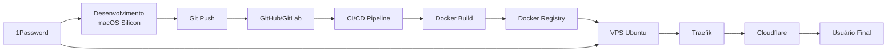

# Guia Completo: Integração Docker + Traefik + 1Password

## Visão Geral

Este guia documenta como integrar projetos na sua infraestrutura Docker existente no VPS Ubuntu, utilizando **Traefik** como reverse proxy e **1Password** para gestão de secrets. O objetivo é proporcionar um fluxo de desenvolvimento fluido entre o **macOS Silicon** (desenvolvimento local) e o **VPS Ubuntu** (produção).

---

## 1. Arquitetura da Infraestrutura

### 1.1. Componentes Principais

| Componente | Função | Localização |
|:-----------|:-------|:------------|
| **Traefik** | Reverse Proxy com SSL automático | VPS Ubuntu |
| **Docker** | Containerização de aplicações | VPS Ubuntu + macOS |
| **1Password CLI** | Gestão de secrets | VPS Ubuntu + macOS |
| **Cloudflare** | DNS e proteção DDoS | Cloud |
| **Portainer** | Interface de gerenciamento Docker | VPS Ubuntu |

### 1.2. Fluxo de Deployment



---

## 2. Estrutura de Diretórios no VPS Ubuntu

### 2.1. Organização Recomendada

```bash
/home/ubuntu/
├── docker/                          # Raiz dos projetos Docker
│   ├── traefik/                     # Configuração do Traefik
│   │   ├── docker-compose.yml
│   │   ├── traefik.yml
│   │   ├── dynamic/                 # Configurações dinâmicas
│   │   └── letsencrypt/             # Certificados SSL
│   ├── 1password-docs/              # Projeto de documentação
│   │   ├── docker-compose.yml
│   │   ├── .env.op                  # Template com referências 1Password
│   │   ├── Dockerfile
│   │   └── public/
│   │       └── index.html
│   ├── api-principal/               # API principal
│   │   ├── docker-compose.yml
│   │   ├── .env.op
│   │   └── src/
│   └── [outros-projetos]/
├── data/                            # Dados persistentes
│   ├── postgres/
│   ├── mongodb/
│   ├── redis/
│   └── minio/
├── backups/                         # Backups automáticos
└── logs/                            # Logs centralizados
```

### 2.2. Criar Estrutura de Diretórios

```bash
# No VPS Ubuntu
mkdir -p ~/docker/{traefik/{dynamic,letsencrypt},1password-docs}
mkdir -p ~/data/{postgres,mongodb,redis,minio}
mkdir -p ~/backups ~/logs
```

---

## 3. Configuração do Traefik

### 3.1. Arquivo `docker-compose.yml` do Traefik

```yaml
# /home/ubuntu/docker/traefik/docker-compose.yml
version: '3.8'

services:
  traefik:
    image: traefik:v2.10
    container_name: traefik
    restart: unless-stopped
    security_opt:
      - no-new-privileges:true
    networks:
      - traefik_network
    ports:
      - "80:80"
      - "443:443"
    environment:
      - CF_API_EMAIL=${CLOUDFLARE_EMAIL}
      - CF_DNS_API_TOKEN=${CLOUDFLARE_DNS_API_TOKEN}
    volumes:
      - /etc/localtime:/etc/localtime:ro
      - /var/run/docker.sock:/var/run/docker.sock:ro
      - ./traefik.yml:/traefik.yml:ro
      - ./dynamic:/dynamic:ro
      - ./letsencrypt:/letsencrypt
    labels:
      - "traefik.enable=true"
      - "traefik.http.routers.traefik.entrypoints=https"
      - "traefik.http.routers.traefik.rule=Host(`traefik.senamfo.com.br`)"
      - "traefik.http.routers.traefik.tls=true"
      - "traefik.http.routers.traefik.tls.certresolver=cloudflare"
      - "traefik.http.routers.traefik.service=api@internal"
      - "traefik.http.routers.traefik.middlewares=traefik-auth"
      - "traefik.http.middlewares.traefik-auth.basicauth.users=${TRAEFIK_DASHBOARD_PASSWORD_HASH}"

networks:
  traefik_network:
    external: true
```

### 3.2. Arquivo `traefik.yml` (Configuração Estática)

```yaml
# /home/ubuntu/docker/traefik/traefik.yml
api:
  dashboard: true
  debug: false

entryPoints:
  http:
    address: ":80"
    http:
      redirections:
        entryPoint:
          to: https
          scheme: https
  https:
    address: ":443"

providers:
  docker:
    endpoint: "unix:///var/run/docker.sock"
    exposedByDefault: false
    network: traefik_network
  file:
    directory: /dynamic
    watch: true

certificatesResolvers:
  cloudflare:
    acme:
      email: luizfernandomoreirasena@gmail.com
      storage: /letsencrypt/acme.json
      dnsChallenge:
        provider: cloudflare
        resolvers:
          - "1.1.1.1:53"
          - "8.8.8.8:53"

log:
  level: INFO
  filePath: /var/log/traefik/traefik.log

accessLog:
  filePath: /var/log/traefik/access.log
```

### 3.3. Criar Rede Docker do Traefik

```bash
# No VPS Ubuntu
docker network create traefik_network
```

### 3.4. Gerar Hash de Senha para Dashboard do Traefik

```bash
# No VPS Ubuntu (usando 1Password)
op run --env-file=.env.op -- sh -c 'echo $(htpasswd -nb admin "$TRAEFIK_DASHBOARD_PASSWORD")'

# Ou usando Docker
docker run --rm httpd:2.4-alpine htpasswd -nb admin sua_senha_aqui
```

### 3.5. Iniciar o Traefik

```bash
cd ~/docker/traefik
op run --env-file=.env.op -- docker-compose up -d
```

---

## 4. Deploy da Documentação 1Password

### 4.1. Estrutura do Projeto

```bash
/home/ubuntu/docker/1password-docs/
├── docker-compose.yml
├── .env.op
├── Dockerfile
└── public/
    └── index.html
```

### 4.2. Dockerfile

```dockerfile
# /home/ubuntu/docker/1password-docs/Dockerfile
FROM nginx:alpine

# Copiar arquivos estáticos
COPY public/ /usr/share/nginx/html/

# Copiar configuração customizada do Nginx (opcional)
# COPY nginx.conf /etc/nginx/nginx.conf

# Expor porta 80
EXPOSE 80

# Healthcheck
HEALTHCHECK --interval=30s --timeout=3s --start-period=5s --retries=3 \
  CMD wget --quiet --tries=1 --spider http://localhost/ || exit 1

# Comando padrão
CMD ["nginx", "-g", "daemon off;"]
```

### 4.3. docker-compose.yml

```yaml
# /home/ubuntu/docker/1password-docs/docker-compose.yml
version: '3.8'

services:
  1password-docs:
    build:
      context: .
      dockerfile: Dockerfile
    container_name: 1password-docs
    restart: unless-stopped
    networks:
      - traefik_network
    labels:
      # Habilitar Traefik
      - "traefik.enable=true"
      
      # Roteamento HTTP -> HTTPS
      - "traefik.http.routers.1password-docs-http.entrypoints=http"
      - "traefik.http.routers.1password-docs-http.rule=Host(`1password.senamfo.com.br`)"
      - "traefik.http.routers.1password-docs-http.middlewares=https-redirect"
      
      # Roteamento HTTPS
      - "traefik.http.routers.1password-docs.entrypoints=https"
      - "traefik.http.routers.1password-docs.rule=Host(`1password.senamfo.com.br`)"
      - "traefik.http.routers.1password-docs.tls=true"
      - "traefik.http.routers.1password-docs.tls.certresolver=cloudflare"
      
      # Serviço
      - "traefik.http.services.1password-docs.loadbalancer.server.port=80"
      
      # Middleware de redirecionamento HTTPS
      - "traefik.http.middlewares.https-redirect.redirectscheme.scheme=https"
      - "traefik.http.middlewares.https-redirect.redirectscheme.permanent=true"
      
      # Headers de segurança
      - "traefik.http.middlewares.1password-docs-headers.headers.sslredirect=true"
      - "traefik.http.middlewares.1password-docs-headers.headers.stsSeconds=31536000"
      - "traefik.http.middlewares.1password-docs-headers.headers.stsIncludeSubdomains=true"
      - "traefik.http.middlewares.1password-docs-headers.headers.stsPreload=true"
      - "traefik.http.routers.1password-docs.middlewares=1password-docs-headers"

networks:
  traefik_network:
    external: true
```

### 4.4. Arquivo .env.op

```bash
# /home/ubuntu/docker/1password-docs/.env.op
# Este arquivo usa referências do 1Password
# Uso: op run --env-file=.env.op -- docker-compose up -d

CLOUDFLARE_EMAIL=luizfernandomoreirasena@gmail.com
CLOUDFLARE_DNS_API_TOKEN=op://shared_infra/cloudflare/dns_api_token
```

### 4.5. Deploy

```bash
# No VPS Ubuntu
cd ~/docker/1password-docs

# Copiar o index.html gerado
# (Você pode fazer isso via scp do macOS ou git pull)

# Build e deploy com 1Password
op run --env-file=.env.op -- docker-compose up -d --build

# Verificar logs
docker logs -f 1password-docs

# Verificar status
docker ps | grep 1password-docs
```

---

## 5. Workflow de Desenvolvimento (macOS → VPS)

### 5.1. Desenvolvimento Local no macOS Silicon

```bash
# No macOS
cd ~/Projects/1password-docs

# Desenvolver localmente
npm run dev

# Testar com Docker local
docker build -t 1password-docs:local .
docker run -p 8080:80 1password-docs:local

# Commit e push
git add .
git commit -m "Update documentation"
git push origin main
```

### 5.2. Deploy Manual no VPS

```bash
# No VPS Ubuntu
cd ~/docker/1password-docs

# Pull das mudanças
git pull origin main

# Rebuild e redeploy
op run --env-file=.env.op -- docker-compose up -d --build
```

### 5.3. Deploy Automatizado com GitHub Actions

```yaml
# .github/workflows/deploy-vps.yml
name: Deploy to VPS

on:
  push:
    branches: [ main ]

jobs:
  deploy:
    runs-on: ubuntu-latest
    steps:
      - name: Checkout code
        uses: actions/checkout@v3
      
      - name: Deploy to VPS via SSH
        uses: appleboy/ssh-action@master
        with:
          host: ${{ secrets.VPS_HOST }}
          username: ${{ secrets.VPS_USER }}
          key: ${{ secrets.VPS_SSH_KEY }}
          script: |
            cd ~/docker/1password-docs
            git pull origin main
            op run --env-file=.env.op -- docker-compose up -d --build
```

---

## 6. Gestão de Secrets com 1Password

### 6.1. Estrutura de Vaults no 1Password

```
1Password Account
├── macos_silicon_workspace (Vault)
│   ├── raycast (Item)
│   │   └── api_key (Field)
│   ├── termius (Item)
│   │   └── api_key (Field)
│   └── ollama (Item)
│       └── api_key (Field)
│
└── shared_infra (Vault)
    ├── traefik (Item)
    │   ├── dashboard_password (Field)
    │   └── dashboard_password_hash (Field)
    ├── cloudflare (Item)
    │   ├── api_key (Field)
    │   └── dns_api_token (Field)
    ├── postgresql (Item)
    │   ├── user (Field)
    │   └── password (Field)
    ├── openai (Item)
    │   ├── api_key (Field)
    │   └── organization_id (Field)
    └── github (Item)
        └── personal_access_token (Field)
```

### 6.2. Criar Itens no 1Password via CLI

```bash
# No macOS ou VPS (com 1Password CLI instalado)

# Criar item para Traefik
op item create \
  --category=login \
  --title="traefik" \
  --vault="shared_infra" \
  dashboard_password[password]="sua_senha_forte_aqui"

# Criar item para Cloudflare
op item create \
  --category=api-credential \
  --title="cloudflare" \
  --vault="shared_infra" \
  api_key[password]="sua_api_key_aqui" \
  dns_api_token[password]="seu_dns_token_aqui"

# Criar item para PostgreSQL
op item create \
  --category=database \
  --title="postgresql" \
  --vault="shared_infra" \
  user[text]="postgres_user" \
  password[password]="senha_forte_postgres"
```

### 6.3. Usar Secrets em Scripts

```bash
#!/bin/bash
# deploy.sh - Script de deploy com 1Password

set -e

# Carregar secrets do 1Password
export $(op run --env-file=.env.op -- env | grep -v '^#' | xargs)

# Deploy
docker-compose up -d --build

echo "✅ Deploy concluído com sucesso!"
```

---

## 7. Monitoramento e Logs

### 7.1. Acessar Logs de Containers

```bash
# Logs em tempo real
docker logs -f 1password-docs

# Últimas 100 linhas
docker logs --tail 100 1password-docs

# Logs com timestamp
docker logs -t 1password-docs
```

### 7.2. Monitoramento com Grafana

Acesse: `https://grafana.senamfo.com.br`

**Dashboards Recomendados:**
- Docker Container Metrics
- Traefik Metrics
- Nginx Metrics

### 7.3. Verificar Status do Traefik

Acesse: `https://traefik.senamfo.com.br`

---

## 8. Comandos Úteis

### 8.1. Docker

```bash
# Listar containers em execução
docker ps

# Listar todos os containers
docker ps -a

# Parar container
docker stop 1password-docs

# Remover container
docker rm 1password-docs

# Ver uso de recursos
docker stats

# Limpar recursos não utilizados
docker system prune -a
```

### 8.2. Docker Compose

```bash
# Iniciar serviços
docker-compose up -d

# Parar serviços
docker-compose down

# Rebuild
docker-compose up -d --build

# Ver logs
docker-compose logs -f

# Escalar serviços
docker-compose up -d --scale app=3
```

### 8.3. 1Password CLI

```bash
# Listar vaults
op vault list

# Listar itens de um vault
op item list --vault shared_infra

# Obter valor de um campo
op item get traefik --vault shared_infra --fields dashboard_password

# Executar comando com secrets injetados
op run --env-file=.env.op -- docker-compose up -d
```

### 8.4. Traefik

```bash
# Ver configuração do Traefik
docker exec traefik cat /traefik.yml

# Ver certificados SSL
docker exec traefik cat /letsencrypt/acme.json | jq

# Recarregar configuração
docker restart traefik
```

---

## 9. Troubleshooting

### 9.1. Container não inicia

```bash
# Ver logs de erro
docker logs 1password-docs

# Verificar configuração
docker-compose config

# Verificar rede
docker network inspect traefik_network
```

### 9.2. SSL não funciona

```bash
# Verificar certificados
docker exec traefik ls -la /letsencrypt/

# Ver logs do Traefik
docker logs traefik | grep -i "certificate"

# Verificar DNS no Cloudflare
dig 1password.senamfo.com.br
```

### 9.3. Site não acessível

```bash
# Verificar se o container está rodando
docker ps | grep 1password-docs

# Verificar labels do Traefik
docker inspect 1password-docs | grep -i traefik

# Testar conexão direta ao container
docker exec -it 1password-docs wget -O- http://localhost
```

---

## 10. Backup e Disaster Recovery

### 10.1. Backup de Volumes Docker

```bash
#!/bin/bash
# backup-docker.sh

BACKUP_DIR=~/backups/docker
DATE=$(date +%Y%m%d_%H%M%S)

# Backup de volumes
docker run --rm \
  -v 1password-docs_data:/data \
  -v $BACKUP_DIR:/backup \
  alpine tar czf /backup/1password-docs_$DATE.tar.gz /data

echo "✅ Backup salvo em: $BACKUP_DIR/1password-docs_$DATE.tar.gz"
```

### 10.2. Restaurar Backup

```bash
#!/bin/bash
# restore-docker.sh

BACKUP_FILE=$1

docker run --rm \
  -v 1password-docs_data:/data \
  -v ~/backups/docker:/backup \
  alpine sh -c "cd /data && tar xzf /backup/$BACKUP_FILE --strip 1"

echo "✅ Backup restaurado!"
```

---

## 11. Segurança

### 11.1. Hardening do Docker

```bash
# Adicionar usuário ao grupo docker (evitar usar root)
sudo usermod -aG docker $USER

# Configurar firewall UFW
sudo ufw allow 80/tcp
sudo ufw allow 443/tcp
sudo ufw enable

# Limitar acesso SSH
sudo ufw allow from 192.168.1.0/24 to any port 22
```

### 11.2. Atualizar Containers Regularmente

```bash
# Script de atualização
#!/bin/bash
# update-containers.sh

cd ~/docker/1password-docs
docker-compose pull
docker-compose up -d --build
docker image prune -f
```

---

## 12. Próximos Passos

1. **Configurar CI/CD** completo com GitHub Actions
2. **Implementar monitoramento** avançado com Prometheus + Grafana
3. **Automatizar backups** com Restic + MinIO
4. **Adicionar testes** automatizados antes do deploy
5. **Configurar alertas** via Telegram/Slack para falhas

---

## Referências

- [Traefik Documentation](https://doc.traefik.io/traefik/)
- [Docker Compose Documentation](https://docs.docker.com/compose/)
- [1Password CLI Documentation](https://developer.1password.com/docs/cli)
- [Cloudflare DNS API](https://developers.cloudflare.com/api/)
- [Nginx Documentation](https://nginx.org/en/docs/)

