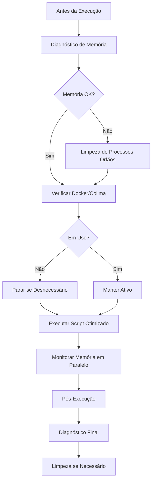

# Otimização de Memória para Processamento de Projetos

**Last Updated:** 2025-10-30  
**Version:** 1.0.0

## 1. Visão Geral

Este runbook documenta o problema de esgotamento de RAM identificado durante a sincronização de `.cursorrules` para 900+ projetos e as soluções implementadas para garantir execuções seguras e eficientes de scripts de automação em massa.

### 1.1. Problema Identificado

A execução simultânea de scripts de sincronização e análise processou **935 projetos** de uma única vez, causando:

- **Esgotamento de RAM** no sistema
- **Múltiplos processos `find`** rodando simultaneamente
- **Travessia de diretórios grandes** (`node_modules`, `venv`, `.git`)
- **966 inicializações de `.git`** detectadas
- **Logs pesados** gerados (202KB + 63KB)
- **Processos órfãos** remanescentes após execuções

### 1.2. Objetivo

Estabelecer um fluxo de trabalho seguro e monitorado para:

- Processar grandes volumes de projetos sem esgotar recursos
- Diagnosticar e limpar processos órfãos automaticamente
- Monitorar uso de memória em tempo real
- Otimizar execuções em lotes com pausas estratégicas

### 1.3. Benefícios

- **Segurança Operacional**: Previne esgotamento de RAM e crashes do sistema
- **Eficiência**: Processamento em lotes reduz carga e melhora performance
- **Visibilidade**: Monitoramento em tempo real permite ajustes proativos
- **Manutenibilidade**: Scripts automatizados para diagnóstico e limpeza
- **Escalabilidade**: Configurações adaptáveis ao hardware disponível

## 2. Arquitetura da Solução

### 2.1. Componentes Implementados

| Componente                              | Arquivo                                           | Função                                                   | Quando Usar                                       |
| :-------------------------------------- | :------------------------------------------------ | :------------------------------------------------------- | :------------------------------------------------ |
| **Diagnóstico de Memória**              | `scripts/maintenance/diagnose_memory.sh`          | Analisa estado completo de memória, processos e recursos | Antes/depois de execuções pesadas                 |
| **Limpeza de Processos Órfãos**         | `scripts/maintenance/cleanup_orphan_processes.sh` | Identifica e remove processos find/git/fd órfãos         | Após execuções ou quando sistema lento            |
| **Sincronização Otimizada**             | `scripts/projetos/sync_cursorrules_optimized.sh`  | Processa projetos em lotes com exclusões inteligentes    | Execuções de sincronização de `.cursorrules`      |
| **Monitoramento de Memória**            | `scripts/maintenance/monitor_memory.sh`           | Monitora uso de RAM em tempo real por PID                | Durante execuções longas                          |
| **Sincronização Original (Atualizada)** | `scripts/projetos/sync_cursorrules.sh`            | Versão atualizada com exclusões básicas                  | Execuções menores ou quando lotes não necessários |

### 2.2. Fluxo de Trabalho Recomendado



## 3. Scripts e Funcionalidades

### 3.1. Diagnóstico de Memória

**Arquivo**: `scripts/maintenance/diagnose_memory.sh`

**Funcionalidades**:

- Verifica RAM total disponível
- Lista top 20 processos por consumo de memória
- Identifica processos `find`, `fd`, `git`, `python`, `node` ativos
- Verifica status de Docker/Colima
- Analisa tamanho de logs recentes
- Detecta processos zombie

**Uso**:

```bash
bash scripts/maintenance/diagnose_memory.sh
```

**Saída**: Relatório em `exports/memory_diagnosis_YYYYMMDD_HHMMSS.txt`

### 3.2. Limpeza de Processos Órfãos

**Arquivo**: `scripts/maintenance/cleanup_orphan_processes.sh`

**Funcionalidades**:

- Identifica processos `find` órfãos (rodando > 5 minutos)
- Limpa processos `git` relacionados a `git init`/`git status`
- Remove processos `fd` órfãos
- Verifica processos Python/Node de automação
- Opcional: para containers Docker e Colima (com confirmação)

**Uso**:

```bash
bash scripts/maintenance/cleanup_orphan_processes.sh
```

**Importante**: O script pede confirmação antes de finalizar processos.

**Saída**: Log em `exports/cleanup_orphan_processes_YYYYMMDD_HHMMSS.log`

### 3.3. Sincronização Automática (Recomendado)

**Arquivo**: `scripts/projetos/sync_cursorrules_auto.sh`

**Funcionalidades**:

- Executa todo o fluxo automaticamente:
  1. Diagnóstico inicial de memória
  2. Limpeza de processos órfãos (automatizada)
  3. Verificação Docker/Colima
  4. Sincronização otimizada com monitoramento
  5. Diagnóstico final
- Ajusta `BATCH_SIZE` automaticamente se memória baixa
- Gera logs consolidados de toda a execução
- Saída colorida e informativa

**Uso**:

```bash
# Execução padrão (com tudo)
bash scripts/projetos/sync_cursorrules_auto.sh

# Via Makefile
make sync.cursorrules.auto

# Personalizar configurações
BATCH_SIZE=25 bash scripts/projetos/sync_cursorrules_auto.sh

# Pular verificações (não recomendado)
SKIP_CLEANUP=true SKIP_DOCKER_CHECK=true bash scripts/projetos/sync_cursorrules_auto.sh

# Desativar monitoramento (mais rápido, menos visibilidade)
MONITOR_MEMORY=false bash scripts/projetos/sync_cursorrules_auto.sh
```

**Variáveis de Ambiente**:

- `BATCH_SIZE`: Projetos por lote (padrão: 50)
- `SKIP_CLEANUP`: Pular limpeza de processos (padrão: false)
- `SKIP_DOCKER_CHECK`: Pular verificação Docker/Colima (padrão: false)
- `MONITOR_MEMORY`: Ativar monitoramento em tempo real (padrão: true)

**Saída**: Log consolidado em `exports/sync_auto_YYYYMMDD_HHMMSS.log`

### 3.4. Sincronização Otimizada (Manual)

**Arquivo**: `scripts/projetos/sync_cursorrules_optimized.sh`

**Melhorias Implementadas**:

#### Processamento em Lotes

- Processa **50 projetos por vez** (configurável via `BATCH_SIZE`)
- Pausa de 2 segundos entre lotes para liberar memória
- Monitora páginas livres entre lotes

#### Exclusões Inteligentes

Ignora completamente:

- `node_modules/`
- `.git/`
- `venv/`, `.venv/`
- `__pycache__/`
- `.next/`
- `dist/`, `build/`, `target/`

#### Validação de Projetos

- Função `is_valid_project()` melhorada
- Ignora diretórios conhecidos como não-projetos
- Valida indicadores de projeto antes de processar

**Uso**:

```bash
# Configuração padrão (50 projetos por lote)
bash scripts/projetos/sync_cursorrules_optimized.sh

# Lote menor (mais conservador)
BATCH_SIZE=25 bash scripts/projetos/sync_cursorrules_optimized.sh

# Lote maior (para máquinas com mais RAM)
BATCH_SIZE=75 bash scripts/projetos/sync_cursorrules_optimized.sh

# Profundidade reduzida
MAX_DEPTH=2 BATCH_SIZE=30 bash scripts/projetos/sync_cursorrules_optimized.sh
```

**Configurações**:

- `BATCH_SIZE`: Projetos por lote (padrão: 50)
- `MAX_DEPTH`: Profundidade máxima de busca (padrão: 3)

### 3.5. Monitoramento de Memória

**Arquivo**: `scripts/maintenance/monitor_memory.sh`

**Funcionalidades**:

- Monitora processo específico por PID
- Gera log CSV com métricas de memória
- Intervalo configurável (padrão: 5 segundos)
- Rastreia páginas livres, ativas, inativas, wired
- Monitora RSS e CPU% do processo

**Uso**:

```bash
# Monitorar processo específico
bash scripts/maintenance/monitor_memory.sh <PID>

# Monitorar em paralelo com sincronização
bash scripts/projetos/sync_cursorrules_optimized.sh &
SYNC_PID=$!
bash scripts/maintenance/monitor_memory.sh $SYNC_PID

# Intervalo customizado
INTERVAL=10 bash scripts/maintenance/monitor_memory.sh <PID>
```

**Saída**: CSV em `exports/memory_monitor_YYYYMMDD_HHMMSS.log`

### 3.6. Script Original (Atualizado)

**Arquivo**: `scripts/projetos/sync_cursorrules.sh`

**Melhorias**:

- Adicionadas exclusões de diretórios grandes no comando `find`
- Mantém processamento simples para execuções menores
- Útil quando processamento em lotes não é necessário

## 4. Guia de Uso Operacional

### 4.1. Antes de Executar Scripts Pesados

#### Passo 1: Diagnóstico Inicial

```bash
cd ~/Dotfiles/automation_1password
bash scripts/maintenance/diagnose_memory.sh
```

**Verificar**:

- Páginas livres disponíveis (ideal: > 50.000)
- Processos consumindo muita memória
- Status de Docker/Colima

#### Passo 2: Limpeza Preventiva

```bash
bash scripts/maintenance/cleanup_orphan_processes.sh
```

**Confirmar finalização** de processos órfãos se encontrados.

#### Passo 3: Verificar Docker/Colima

```bash
# Ver containers ativos
docker ps

# Ver status Colima
colima status

# Parar se não estiver em uso
docker stop $(docker ps -q)  # Containers Docker
colima stop                   # Colima completo
```

### 4.2. Durante a Execução

#### Opção A: Execução Automática Completa (RECOMENDADO)

```bash
# Via script automático (recomendado)
bash scripts/projetos/sync_cursorrules_auto.sh

# Ou via Makefile
make sync.cursorrules.auto
```

**Vantagens**:

- Executa todo o fluxo automaticamente
- Diagnóstico antes e depois
- Limpeza automática de processos órfãos
- Monitoramento integrado
- Logs consolidados

#### Opção B: Execução Simples (Monitoramento Manual)

```bash
bash scripts/projetos/sync_cursorrules_optimized.sh
```

Monitorar manualmente com:

```bash
# Em outro terminal
watch -n 5 'vm_stat | head -5'
```

#### Opção B: Execução com Monitoramento Automatizado (Recomendado)

```bash
# Executar sincronização em background
bash scripts/projetos/sync_cursorrules_optimized.sh &
SYNC_PID=$!

# Iniciar monitoramento
bash scripts/maintenance/monitor_memory.sh $SYNC_PID

# Aguardar conclusão
wait $SYNC_PID
```

### 4.3. Após a Execução

#### Passo 1: Diagnóstico Final

```bash
bash scripts/maintenance/diagnose_memory.sh
```

**Comparar** com diagnóstico inicial:

- Páginas livres devem ter retornado aos níveis normais
- Processos órfãos devem ter sido finalizados

#### Passo 2: Limpeza Pós-Execução

```bash
bash scripts/maintenance/cleanup_orphan_processes.sh
```

#### Passo 3: Revisar Logs

```bash
# Logs mais recentes
ls -lth exports/*.log | head -5

# Analisar log de sincronização
tail -50 exports/projetos_sync_cursorrules_*.log

# Analisar monitoramento (se executado)
tail -20 exports/memory_monitor_*.log
```

## 5. Configurações por Capacidade de RAM

### 5.1. Ajuste de BATCH_SIZE

| RAM Total | BATCH_SIZE Recomendado | Observações                            |
| :-------- | :--------------------- | :------------------------------------- |
| 8 GB      | 25                     | Conservador, monitorar de perto        |
| 16 GB     | 50                     | Padrão, equilíbrio performance/memória |
| 24 GB+    | 75-100                 | Mais agressivo, ainda monitorar        |

**Exemplo**:

```bash
# Para sistema com 8GB RAM
BATCH_SIZE=25 bash scripts/projetos/sync_cursorrules_optimized.sh

# Para sistema com 24GB RAM
BATCH_SIZE=75 bash scripts/projetos/sync_cursorrules_optimized.sh
```

### 5.2. Sinais de Alerta

**Memória Baixa** (páginas livres < 10.000):

```bash
# Reduzir lote
BATCH_SIZE=15 bash scripts/projetos/sync_cursorrules_optimized.sh

# Ou pausar e limpar primeiro
bash scripts/maintenance/cleanup_orphan_processes.sh
```

**Alta Compressão de Memória** (vm_stat mostra muitas compressões):

```bash
# Sistema sob pressão, reduzir carga
BATCH_SIZE=20 bash scripts/projetos/sync_cursorrules_optimized.sh
```

## 6. Troubleshooting

### 6.1. Sistema Lento Durante Execução

**Sintoma**: Sistema responsivo lento, aplicações travando

**Solução**:

```bash
# 1. Interromper execução (Ctrl+C)
# 2. Verificar processos órfãos
bash scripts/maintenance/cleanup_orphan_processes.sh

# 3. Reduzir BATCH_SIZE e tentar novamente
BATCH_SIZE=15 bash scripts/projetos/sync_cursorrules_optimized.sh
```

### 6.2. Processos Órfãos Persistentes

**Sintoma**: Processos `find` ou `git` permanecem após execução

**Solução**:

```bash
# Identificar manualmente
pgrep -fl "find.*Projetos|git.*init"

# Finalizar manualmente se necessário (cuidado!)
pkill -f "find.*Projetos"  # Apenas se tiver certeza
```

### 6.3. Docker/Colima Consumindo Memória

**Sintoma**: Docker/Colima ativos mas não sendo usados

**Solução**:

```bash
# Parar containers
docker stop $(docker ps -q)

# Ou parar Colima completamente
colima stop
```

### 6.4. Logs Muito Grandes

**Sintoma**: Logs ocupando muito espaço em disco

**Solução**:

```bash
# Manter apenas últimos 5 logs
cd exports
ls -t *.log | tail -n +6 | xargs rm -f

# Ou comprimir logs antigos
find exports -name "*.log" -mtime +7 -exec gzip {} \;
```

## 7. Comparação: Versão Original vs Otimizada

| Aspecto                 | Original         | Otimizada                              |
| :---------------------- | :--------------- | :------------------------------------- |
| **Processamento**       | Todos de uma vez | Lotes configuráveis                    |
| **Exclusões**           | Básicas          | Completas (node_modules, venv, etc)    |
| **Controle de Memória** | Nenhum           | Pausas e monitoramento                 |
| **Profundidade**        | Fixa (3 níveis)  | Configurável (MAX_DEPTH)               |
| **Validação**           | Básica           | Melhorada (is_valid_project)           |
| **Logs**                | Apenas execução  | Execução + diagnóstico + monitoramento |
| **Uso Recomendado**     | < 100 projetos   | Qualquer volume                        |

## 8. Checklist Pré-Execução

Antes de executar scripts pesados de sincronização ou análise:

- [ ] Executar diagnóstico de memória
- [ ] Verificar páginas livres (> 10.000 ideal)
- [ ] Limpar processos órfãos se encontrados
- [ ] Verificar Docker/Colima e parar se não estiver em uso
- [ ] Ajustar `BATCH_SIZE` conforme RAM disponível
- [ ] Preparar monitoramento em paralelo (opcional mas recomendado)
- [ ] Verificar espaço em disco para logs

## 9. Referências e Arquivos Relacionados

- **Resumo Técnico**: `exports/resumo_otimizacao_memoria_20251030.md`
- **Scripts de Manutenção**: `scripts/maintenance/`
- **Scripts de Projetos**: `scripts/projetos/`
- **Logs de Execução**: `exports/projetos_sync_cursorrules_*.log`
- **Logs de Diagnóstico**: `exports/memory_diagnosis_*.txt`
- **Logs de Monitoramento**: `exports/memory_monitor_*.log`

## 10. Manutenção e Melhorias Futuras

### 10.1. Tarefas Regulares

- **Mensal**: Revisar e limpar logs antigos
- **Após cada execução grande**: Executar diagnóstico e limpeza
- **Trimestral**: Revisar e ajustar `BATCH_SIZE` padrão se necessário

### 10.2. Melhorias Potenciais

- [x] Integrar monitoramento diretamente no script otimizado (`sync_cursorrules_auto.sh`)
- [ ] Adicionar alertas automáticos quando memória baixa (< 5.000 páginas)
- [ ] Criar dashboard de métricas históricas
- [ ] Implementar retry automático com backoff
- [ ] Adicionar estimativa de tempo restante na sincronização

### 10.3. Tasks de Implementação

**Tasks Concluídas** ✅:

- [x] Script de diagnóstico de memória
- [x] Script de limpeza de processos órfãos
- [x] Script otimizado de sincronização em lotes
- [x] Script de monitoramento de memória em tempo real
- [x] Atualização do script original com exclusões
- [x] Script de execução automática completa
- [x] Runbook completo documentado
- [x] Targets no Makefile
- [x] Atualização do INDEX.md

**Tasks Pendentes** 📋:

- [ ] Executar teste do script automático em ambiente de desenvolvimento
- [ ] Validar logs gerados e ajustar formato se necessário
- [ ] Criar documentação de quick start para novos usuários
- [ ] Implementar alertas automáticos quando memória baixa
- [ ] Adicionar estimativa de tempo restante na sincronização
- [ ] Criar dashboard de métricas históricas de uso de memória

---

**Última atualização**: 2025-10-30  
**Versão**: 1.0.0  
**Autor**: Sistema de Automação 1Password
