# 📦 Arquivo Único de Arquitetura e Sistema

**Gerado em:** $NOW
**Fonte do bundle de auditoria:** exports/docker_migration_audit_20251030_135931.tar.gz
**Orquestrador executado:** scripts/migration/migrate_docker_desktop_to_colima.sh

Este arquivo consolida a estrutura completa do projeto, dados de sistema, resultados de auditoria, testes executados e erros registrados, fornecendo uma visão abrangente para análise por modelos de larga escala.

---

## 1. Dados de Sistema (Audit Bundle)
Fonte: docker_migration_audit_20251030_135931/00_system_info.txt
```
--- sw_vers ---
ProductName:		macOS
ProductVersion:		26.0.1
BuildVersion:		25A362

--- uname -a ---
Darwin MacBook-Pro.local 25.0.0 Darwin Kernel Version 25.0.0: Wed Sep 17 21:42:08 PDT 2025; root:xnu-12377.1.9~141/RELEASE_ARM64_T8132 arm64

--- sysctl machdep.cpu.brand_string ---
Apple M4

--- system_profiler SPHardwareDataType (Chip) ---
Apple M4

--- /usr/bin/arch ---
arm64

--- brew --version ---
Homebrew 4.6.19-14-gf69d9a5

--- brew list (colima, lima, docker, etc) ---
brew: docker 28.5.1
```

### 1.1 Docker Version / Info
```
Client: Docker Engine - Community
 Version:           28.5.1
 API version:       1.51
 Go version:        go1.25.2
 Git commit:        e180ab8ab8
 Built:             Wed Oct  8 02:50:32 2025
 OS/Arch:           darwin/arm64
 Context:           desktop-linux

Server: Docker Desktop 4.48.0 (207573)
 Engine:
  Version:          28.5.1
  API version:      1.51 (minimum version 1.24)
  Go version:       go1.24.8
  Git commit:       f8215cc
  Built:            Wed Oct  8 12:18:25 2025
  OS/Arch:          linux/arm64
  Experimental:     false
 containerd:
  Version:          1.7.27
  GitCommit:        05044ec0a9a75232cad458027ca83437aae3f4da
 runc:
  Version:          1.2.5
  GitCommit:        v1.2.5-0-g59923ef
 docker-init:
  Version:          0.19.0
  GitCommit:        de40ad0
```

```
Client: Docker Engine - Community
 Version:    28.5.1
 Context:    desktop-linux
 Debug Mode: false
 Plugins:
  ai: Docker AI Agent - Ask Gordon (Docker Inc.)
    Version:  v1.9.11
    Path:     /Users/luiz.sena88/.docker/cli-plugins/docker-ai
  buildx: Docker Buildx (Docker Inc.)
    Version:  v0.29.1-desktop.1
    Path:     /Users/luiz.sena88/.docker/cli-plugins/docker-buildx
  cloud: Docker Cloud (Docker Inc.)
    Version:  v0.4.39
    Path:     /Users/luiz.sena88/.docker/cli-plugins/docker-cloud
  compose: Docker Compose (Docker Inc.)
    Version:  v2.40.2-desktop.1
    Path:     /Users/luiz.sena88/.docker/cli-plugins/docker-compose
  debug: Get a shell into any image or container (Docker Inc.)
    Version:  0.0.44
    Path:     /Users/luiz.sena88/.docker/cli-plugins/docker-debug
  desktop: Docker Desktop commands (Docker Inc.)
    Version:  v0.2.0
    Path:     /Users/luiz.sena88/.docker/cli-plugins/docker-desktop
  extension: Manages Docker extensions (Docker Inc.)
    Version:  v0.2.31
    Path:     /Users/luiz.sena88/.docker/cli-plugins/docker-extension
  init: Creates Docker-related starter files for your project (Docker Inc.)
    Version:  v1.4.0
    Path:     /Users/luiz.sena88/.docker/cli-plugins/docker-init
  mcp: Docker MCP Plugin (Docker Inc.)
    Version:  v0.24.0
    Path:     /Users/luiz.sena88/.docker/cli-plugins/docker-mcp
  model: Docker Model Runner (Docker Inc.)
    Version:  v0.1.42
    Path:     /Users/luiz.sena88/.docker/cli-plugins/docker-model
  sbom: View the packaged-based Software Bill Of Materials (SBOM) for an image (Anchore Inc.)
    Version:  0.6.0
    Path:     /Users/luiz.sena88/.docker/cli-plugins/docker-sbom
  scout: Docker Scout (Docker Inc.)
    Version:  v1.18.3
    Path:     /Users/luiz.sena88/.docker/cli-plugins/docker-scout

Server:
 Containers: 11
  Running: 4
  Paused: 0
  Stopped: 7
 Images: 15
 Server Version: 28.5.1
 Storage Driver: overlayfs
  driver-type: io.containerd.snapshotter.v1
 Logging Driver: json-file
 Cgroup Driver: cgroupfs
 Cgroup Version: 2
 Plugins:
  Volume: local
  Network: bridge host ipvlan macvlan null overlay
  Log: awslogs fluentd gcplogs gelf journald json-file local splunk syslog
 CDI spec directories:
  /etc/cdi
  /var/run/cdi
 Discovered Devices:
  cdi: docker.com/gpu=webgpu
 Swarm: inactive
 Runtimes: io.containerd.runc.v2 runc
 Default Runtime: runc
 Init Binary: docker-init
 containerd version: 05044ec0a9a75232cad458027ca83437aae3f4da
 runc version: v1.2.5-0-g59923ef
 init version: de40ad0
 Security Options:
  seccomp
   Profile: builtin
  cgroupns
 Kernel Version: 6.10.14-linuxkit
 Operating System: Docker Desktop
 OSType: linux
 Architecture: aarch64
 CPUs: 10
 Total Memory: 7.654GiB
 Name: docker-desktop
 ID: 0b8d7705-1d63-4128-853f-6a188d62681a
 Docker Root Dir: /var/lib/docker
 Debug Mode: false
 HTTP Proxy: http.docker.internal:3128
 HTTPS Proxy: http.docker.internal:3128
 No Proxy: hubproxy.docker.internal
 Labels:
  com.docker.desktop.address=unix:///Users/luiz.sena88/Library/Containers/com.docker.docker/Data/docker-cli.sock
 Experimental: false
 Insecure Registries:
  hubproxy.docker.internal:5555
  ::1/128
  127.0.0.0/8
 Live Restore Enabled: false

```

```
Images space usage:

REPOSITORY                                        TAG             IMAGE ID       CREATED         SIZE      SHARED SIZE   UNIQUE SIZE   CONTAINERS
n8nio/n8n                                         latest          90bf64ec238b   2 days ago      1.62GB    236.3MB       1.38GB        1
<none>                                            <none>          c7dae935e865   3 days ago      1.62GB    236.3MB       1.38GB        0
langgenius/dify-api                               latest          9546c6d9d1ab   6 days ago      3.26GB    0B            3.259GB       1
langgenius/dify-web                               latest          85c2e857e8a5   6 days ago      821MB     0B            821.2MB       1
infra-varela-tax-frontend                         latest          f09fd1d7449e   7 days ago      537MB     0B            537.1MB       0
grafana/grafana-oss                               latest          35c41e0fd029   10 days ago     909MB     9.175MB       900.1MB       1
postgres                                          16-alpine       029660641a0c   2 weeks ago     381MB     9.175MB       371.9MB       1
alpine                                            latest          4b7ce07002c6   3 weeks ago     13.3MB    9.175MB       4.14MB        0
redis                                             alpine          59b6e6946534   3 weeks ago     98.9MB    9.175MB       89.71MB       1
portainer/portainer-ce                            latest          264443d4063e   5 weeks ago     238MB     0B            237.7MB       1
1password/connect-sync                            latest          d5e937b2b7e3   6 weeks ago     78MB      35.25MB       42.74MB       1
1password/connect-api                             latest          8fe7bcd50c9e   6 weeks ago     88.8MB    35.25MB       53.55MB       1
nocodb/nocodb                                     latest          8fd57018accf   8 weeks ago     881MB     0B            880.7MB       1
mcr.microsoft.com/devcontainers/typescript-node   1-22-bookworm   7c2e711a4f7b   5 months ago    2.51GB    0B            2.513GB       0
traefik                                           v2.10           6341b98aec5e   21 months ago   193MB     0B            192.8MB       1

Containers space usage:

CONTAINER ID   IMAGE                           COMMAND                  LOCAL VOLUMES   SIZE      CREATED        STATUS                          NAMES
12363da1c0d3   1password/connect-sync:latest   "connect-sync"           0               24.6kB    27 hours ago   Up 27 hours (unhealthy)         op-connect-sync
3c0d7523db66   1password/connect-api:latest    "connect-api"            0               28.7kB    27 hours ago   Up 27 hours (unhealthy)         op-connect-api
d94ca2c3c7c8   nocodb/nocodb:latest            "/usr/bin/dumb-init …"   0               4.1kB     2 days ago     Created                         nocodb
07779d32e5ab   portainer/portainer-ce:latest   "/portainer -H unix:…"   0               4.1kB     2 days ago     Created                         portainer
fe61075b9e25   postgres:16-alpine              "docker-entrypoint.s…"   0               4.1kB     2 days ago     Created                         postgres
9a57ed71c1d2   traefik:v2.10                   "/entrypoint.sh --pr…"   0               4.1kB     2 days ago     Created                         traefik
7cb83eed8e53   n8nio/n8n:latest                "tini -- /docker-ent…"   0               4.1kB     2 days ago     Created                         n8n
ab64d3e22a48   langgenius/dify-api:latest      "/bin/bash /entrypoi…"   0               46.8MB    2 days ago     Restarting (3) 30 seconds ago   dify-api
1a05f74d81f8   langgenius/dify-web:latest      "/bin/sh ./entrypoin…"   0               49.2kB    2 days ago     Up 27 hours                     dify-web
94e4d1ee25fa   grafana/grafana-oss:latest      "/run.sh"                0               4.1kB     2 days ago     Created                         grafana
488c2a6669f7   redis:alpine                    "docker-entrypoint.s…"   1               4.1kB     2 days ago     Up 27 hours                     redis

Local Volumes space usage:

VOLUME NAME                                                        LINKS     SIZE
429e44a31110350d405f387aaf39b5aea3bdd56bb8dbc7b4cda58a69add7db22   0         88B
6fce7c43acac62298624e5f336e4a6757ff88ca77241ab801bfadf290b45fa39   0         88B
8a881603326d3a99d9998211e51b61e94de36122971c7f0ce07c49afa3cdc336   0         34.55kB
8e786f41d0abc4561a9ce61890d344e255f1d4c9e333d157555db471b8bb3197   0         300.6kB
ac84f24fa66b4aa12bbdd4de78fe43280540824a270b1a0d992f5dc99654f5b6   0         0B
ec10fd73d69631153ee93a815dcdfafea1357e239df47c6f72adea462911a4d0   0         88B
18043a5fd8815a04379f19ffac04dd93b23a3bd03f6ee455fddc13b6f17b1cc0   0         69.35MB
66bba99f3c43ae1f6433d9e27b3580270595b2e7c8f51b3a82867e5f284529bf   1         88B
d6a6cd65170410569b8ba2d4b54e9dbd6c37dae6435ae5e3dc5a4a0e35ae0081   0         34.55kB
a5d1059074b09694fccd3fffb4c990667922b7ccbc320def11d19a8d2f304ecf   0         69.35MB
dcf1574f266aa82547fef7730538bd205f090b2978f9e0d29923727db173ea82   0         69.35MB
de55a637bcae1758712899f52f4b0738205a29ebc7e02b10bde585a716bf41bc   0         88B
infra_portainer_data                                               0         263.9kB
02f4ac7280977981c601b8850a41ca81605fe7b4290021d4e98e6547eb8d094f   0         0B
8210adeb326f7417b11b611f492bf5e09716222bfbceee91c9711400dde14a86   0         88B
9f21b154874aa64961505f373ae98ded3a8a473376f79cc6d85bef1331c15d59   0         88B
0f8bbeab9ce21f5765a28686efe8e512c2156e5648af4eb8bd916b286cbcf3b2   0         34.55kB

Build cache usage: 0B

CACHE ID       CACHE TYPE   SIZE      CREATED      LAST USED    USAGE     SHARED
w2fmtx3ol7n9   regular      12.8MB    7 days ago   7 days ago   1         true
i2w8kq16uvrd   regular      160MB     7 days ago   7 days ago   1         true
l3nnl7r391yl   regular      6.73MB    7 days ago   7 days ago   1         true
s54w89dc4iys   regular      20.9kB    7 days ago   7 days ago   1         true
a7oc5pdhi7xt   regular      8.29kB    7 days ago   7 days ago   3         true
slpi0tj7t3c8   regular      332MB     7 days ago   7 days ago   1         true
bjv2v1zscae1   regular      12.6kB    7 days ago   7 days ago   1         true
s3ya4uu3ptsa   regular      25.5MB    7 days ago   7 days ago   1         true
qyyekapaieev   regular      12.4kB    7 days ago   7 days ago   2         true
```

### 1.2 Contextos e Buildx
```
NAME              DESCRIPTION                               DOCKER ENDPOINT                                     ERROR
default           Current DOCKER_HOST based configuration   unix:///var/run/docker.sock                         
desktop-linux *   Docker Desktop                            unix:///Users/luiz.sena88/.docker/run/docker.sock   
```

```
[
    {
        "Name": "desktop-linux",
        "Metadata": {
            "Description": "Docker Desktop",
            "GODEBUG": "x509negativeserial=1",
            "otel": {
                "OTEL_EXPORTER_OTLP_ENDPOINT": "unix:///Users/luiz.sena88/.docker/run/user-analytics.otlp.grpc.sock"
            }
        },
        "Endpoints": {
            "docker": {
                "Host": "unix:///Users/luiz.sena88/.docker/run/docker.sock",
                "SkipTLSVerify": false
            }
        },
        "TLSMaterial": {},
        "Storage": {
            "MetadataPath": "/Users/luiz.sena88/.docker/contexts/meta/fe9c6bd7a66301f49ca9b6a70b217107cd1284598bfc254700c989b916da791e",
            "TLSPath": "/Users/luiz.sena88/.docker/contexts/tls/fe9c6bd7a66301f49ca9b6a70b217107cd1284598bfc254700c989b916da791e"
        }
    }
]
```

```
github.com/docker/buildx v0.29.1-desktop.1 28f6246ff24e2c05095e8741e48c48dcb2d3b4bc
```

```
Name:   desktop-linux
Driver: docker

Nodes:
Name:             desktop-linux
Endpoint:         desktop-linux
Status:           running
BuildKit version: v0.25.1
Platforms:        linux/arm64, linux/amd64, linux/amd64/v2, linux/riscv64, linux/ppc64le, linux/s390x, linux/386
Labels:
 org.mobyproject.buildkit.worker.containerd.namespace: moby
 org.mobyproject.buildkit.worker.containerd.uuid:      ee0bee8f-b13a-4053-ab9a-0efe09edd8e2
 org.mobyproject.buildkit.worker.executor:             containerd
 org.mobyproject.buildkit.worker.hostname:             docker-desktop
 org.mobyproject.buildkit.worker.moby.host-gateway-ip: 192.168.65.254
 org.mobyproject.buildkit.worker.network:              host
 org.mobyproject.buildkit.worker.selinux.enabled:      false
 org.mobyproject.buildkit.worker.snapshotter:          overlayfs
Devices:
 Name:                  docker.com/gpu=webgpu
 Automatically allowed: false
GC Policy rule#0:
 All:            false
 Filters:        type==source.local,type==exec.cachemount,type==source.git.checkout
 Keep Duration:  48h0m0s
 Max Used Space: 2.764GiB
GC Policy rule#1:
 All:            false
 Keep Duration:  1440h0m0s
 Reserved Space: 20GiB
GC Policy rule#2:
 All:            false
 Reserved Space: 20GiB
GC Policy rule#3:
 All:            true
 Reserved Space: 20GiB
```

```
NAME/NODE           DRIVER/ENDPOINT     STATUS    BUILDKIT   PLATFORMS
default             docker                                   
 \_ default          \_ default         running   v0.25.1    linux/amd64 (+2), linux/arm64, linux/ppc64le, linux/s390x, (2 more)
desktop-linux*      docker                                   
 \_ desktop-linux    \_ desktop-linux   running   v0.25.1    linux/amd64 (+2), linux/arm64, linux/ppc64le, linux/s390x, (2 more)
```

```
Docker version 28.5.1, build e180ab8ab8
```

### 1.3 Kubernetes / Compose
```
Docker Compose version v2.40.2-desktop.1
```

```
Client Version: v1.34.1
Kustomize Version: v5.7.1

--- kubectl config get-contexts ---
CURRENT   NAME   CLUSTER   AUTHINFO   NAMESPACE

--- kubectl config current-context ---

--- kubectl get nodes -A ---

--- kubectl get ns ---

--- kubectl get storageclass ---
```

## 2. Inventário de Containers, Imagens, Volumes e Redes
```
CONTAINER ID   IMAGE                           STATUS                          NAMES             PORTS
12363da1c0d3   1password/connect-sync:latest   Up 27 hours (unhealthy)         op-connect-sync   
3c0d7523db66   1password/connect-api:latest    Up 27 hours (unhealthy)         op-connect-api    0.0.0.0:8080->8080/tcp, [::]:8080->8080/tcp, 0.0.0.0:8443->8443/tcp, [::]:8443->8443/tcp
d94ca2c3c7c8   nocodb/nocodb:latest            Created                         nocodb            
07779d32e5ab   portainer/portainer-ce:latest   Created                         portainer         
fe61075b9e25   postgres:16-alpine              Created                         postgres          
9a57ed71c1d2   traefik:v2.10                   Created                         traefik           
7cb83eed8e53   n8nio/n8n:latest                Created                         n8n               
ab64d3e22a48   langgenius/dify-api:latest      Restarting (3) 30 seconds ago   dify-api          
1a05f74d81f8   langgenius/dify-web:latest      Up 27 hours                     dify-web          0.0.0.0:3001->80/tcp, [::]:3001->80/tcp
94e4d1ee25fa   grafana/grafana-oss:latest      Created                         grafana           
488c2a6669f7   redis:alpine                    Up 27 hours                     redis             6379/tcp
```

```
REPOSITORY                                        TAG             DIGEST                                                                    IMAGE ID       CREATED         SIZE
n8nio/n8n                                         latest          sha256:90bf64ec238b88908389694b5ace00e5c17ea5d4a0af812dd266d7cfcd40984f   90bf64ec238b   2 days ago      1.62GB
<none>                                            <none>          <none>                                                                    c7dae935e865   3 days ago      1.62GB
langgenius/dify-api                               latest          sha256:9546c6d9d1abc4ab48e14f349e26fb9016b5d432c48b44d817d09f14797a0882   9546c6d9d1ab   6 days ago      3.26GB
langgenius/dify-web                               latest          sha256:85c2e857e8a5d039a9727bf19b08c5db3b4961a7459e2bf8fd47d719db5368fb   85c2e857e8a5   6 days ago      821MB
infra-varela-tax-frontend                         latest          sha256:f09fd1d7449e0e548b7c287661e86189398196d8db13456e7e90d3e4922b6bb6   f09fd1d7449e   7 days ago      537MB
grafana/grafana-oss                               latest          sha256:35c41e0fd0295f5d0ee5db7e780cf33506abfaf47686196f825364889dee878b   35c41e0fd029   10 days ago     909MB
postgres                                          16-alpine       sha256:029660641a0cfc575b14f336ba448fb8a75fd595d42e1fa316b9fb4378742297   029660641a0c   2 weeks ago     381MB
alpine                                            latest          sha256:4b7ce07002c69e8f3d704a9c5d6fd3053be500b7f1c69fc0d80990c2ad8dd412   4b7ce07002c6   3 weeks ago     13.3MB
redis                                             alpine          sha256:59b6e694653476de2c992937ebe1c64182af4728e54bb49e9b7a6c26614d8933   59b6e6946534   3 weeks ago     98.9MB
portainer/portainer-ce                            latest          sha256:264443d4063e0f2633f3ba210ccd69aacf07344dfc792128131dec8963df0f0a   264443d4063e   5 weeks ago     238MB
1password/connect-sync                            latest          sha256:d5e937b2b7e314dbbaffacf469dc8f30376b5954a3ad836c8d96e6cb579d7fab   d5e937b2b7e3   6 weeks ago     78MB
1password/connect-api                             latest          sha256:8fe7bcd50c9e73899e0a1aa5aa43421ca75fbceacb33dd07f6418c4116e637a1   8fe7bcd50c9e   6 weeks ago     88.8MB
nocodb/nocodb                                     latest          sha256:8fd57018accf775fb5390392910e4b0ef6bb154f17c5732b478eb76c40ee8d1e   8fd57018accf   8 weeks ago     881MB
mcr.microsoft.com/devcontainers/typescript-node   1-22-bookworm   sha256:7c2e711a4f7b02f32d2da16192d5e05aa7c95279be4ce889cff5df316f251c1d   7c2e711a4f7b   5 months ago    2.51GB
traefik                                           v2.10           sha256:6341b98aec5ec8969b99e9730f4c5b22cca3103d42b6bbe4b7a3c910758fe565   6341b98aec5e   21 months ago   193MB
```

```
DRIVER    VOLUME NAME
local     0f8bbeab9ce21f5765a28686efe8e512c2156e5648af4eb8bd916b286cbcf3b2
local     02f4ac7280977981c601b8850a41ca81605fe7b4290021d4e98e6547eb8d094f
local     6fce7c43acac62298624e5f336e4a6757ff88ca77241ab801bfadf290b45fa39
local     8a881603326d3a99d9998211e51b61e94de36122971c7f0ce07c49afa3cdc336
local     8e786f41d0abc4561a9ce61890d344e255f1d4c9e333d157555db471b8bb3197
local     9f21b154874aa64961505f373ae98ded3a8a473376f79cc6d85bef1331c15d59
local     66bba99f3c43ae1f6433d9e27b3580270595b2e7c8f51b3a82867e5f284529bf
local     429e44a31110350d405f387aaf39b5aea3bdd56bb8dbc7b4cda58a69add7db22
local     8210adeb326f7417b11b611f492bf5e09716222bfbceee91c9711400dde14a86
local     18043a5fd8815a04379f19ffac04dd93b23a3bd03f6ee455fddc13b6f17b1cc0
local     a5d1059074b09694fccd3fffb4c990667922b7ccbc320def11d19a8d2f304ecf
local     ac84f24fa66b4aa12bbdd4de78fe43280540824a270b1a0d992f5dc99654f5b6
local     d6a6cd65170410569b8ba2d4b54e9dbd6c37dae6435ae5e3dc5a4a0e35ae0081
local     dcf1574f266aa82547fef7730538bd205f090b2978f9e0d29923727db173ea82
local     de55a637bcae1758712899f52f4b0738205a29ebc7e02b10bde585a716bf41bc
local     ec10fd73d69631153ee93a815dcdfafea1357e239df47c6f72adea462911a4d0
local     infra_portainer_data
```

```
NETWORK ID     NAME                      DRIVER    SCOPE
017f35177a33   bridge                    bridge    local
7bea39d45142   connect_net               bridge    local
845d9d41e16a   host                      host      local
661b69a98f7f   none                      null      local
2ef5589fb191   stack-local_traefik_net   bridge    local
ad0525007399   traefik_net               bridge    local
```

```
[
    {
        "Name": "bridge",
        "Id": "017f35177a3399e4f5a82ac16a92385a25c552e99ea694df813e43c3b2408ca3",
        "Created": "2025-10-29T13:44:07.284387085Z",
        "Scope": "local",
        "Driver": "bridge",
        "EnableIPv4": true,
        "EnableIPv6": false,
        "IPAM": {
            "Driver": "default",
            "Options": null,
            "Config": [
                {
                    "Subnet": "172.17.0.0/16",
                    "Gateway": "172.17.0.1"
                }
            ]
        },
        "Internal": false,
        "Attachable": false,
        "Ingress": false,
        "ConfigFrom": {
            "Network": ""
        },
        "ConfigOnly": false,
        "Containers": {},
        "Options": {
            "com.docker.network.bridge.default_bridge": "true",
            "com.docker.network.bridge.enable_icc": "true",
            "com.docker.network.bridge.enable_ip_masquerade": "true",
            "com.docker.network.bridge.host_binding_ipv4": "0.0.0.0",
            "com.docker.network.bridge.name": "docker0",
            "com.docker.network.driver.mtu": "65535"
        },
        "Labels": {}
    },
    {
        "Name": "host",
        "Id": "845d9d41e16a4579654aed846a2ec6ffa9eb2656d376db7af4f40821288c68e6",
        "Created": "2025-10-14T12:21:56.901121875Z",
        "Scope": "local",
        "Driver": "host",
        "EnableIPv4": true,
        "EnableIPv6": false,
        "IPAM": {
            "Driver": "default",
            "Options": null,
            "Config": null
        },
        "Internal": false,
        "Attachable": false,
        "Ingress": false,
        "ConfigFrom": {
            "Network": ""
        },
        "ConfigOnly": false,
        "Containers": {},
        "Options": {},
        "Labels": {}
    },
    {
        "Name": "none",
        "Id": "661b69a98f7f746b33e642a0ca727304eda998fca636022420cf4dfca066b8e9",
        "Created": "2025-10-14T12:21:56.898334458Z",
        "Scope": "local",
        "Driver": "null",
        "EnableIPv4": true,
        "EnableIPv6": false,
        "IPAM": {
            "Driver": "default",
            "Options": null,
            "Config": null
        },
        "Internal": false,
        "Attachable": false,
        "Ingress": false,
        "ConfigFrom": {
            "Network": ""
        },
        "ConfigOnly": false,
        "Containers": {},
        "Options": {},
        "Labels": {}
    }
]
```

```
[
    {
        "Name": "bridge",
        "Id": "017f35177a3399e4f5a82ac16a92385a25c552e99ea694df813e43c3b2408ca3",
        "Created": "2025-10-29T13:44:07.284387085Z",
        "Scope": "local",
        "Driver": "bridge",
        "EnableIPv4": true,
        "EnableIPv6": false,
        "IPAM": {
            "Driver": "default",
            "Options": null,
            "Config": [
                {
                    "Subnet": "172.17.0.0/16",
                    "Gateway": "172.17.0.1"
                }
            ]
        },
        "Internal": false,
        "Attachable": false,
        "Ingress": false,
        "ConfigFrom": {
            "Network": ""
        },
        "ConfigOnly": false,
        "Containers": {},
        "Options": {
            "com.docker.network.bridge.default_bridge": "true",
            "com.docker.network.bridge.enable_icc": "true",
            "com.docker.network.bridge.enable_ip_masquerade": "true",
            "com.docker.network.bridge.host_binding_ipv4": "0.0.0.0",
            "com.docker.network.bridge.name": "docker0",
            "com.docker.network.driver.mtu": "65535"
        },
        "Labels": {}
    },
    {
        "Name": "connect_net",
        "Id": "7bea39d4514249b9992c12529c2fd91d9fbfc961b4385810e76ef3c7f3973ddd",
        "Created": "2025-10-29T13:51:30.604067554Z",
        "Scope": "local",
        "Driver": "bridge",
        "EnableIPv4": true,
        "EnableIPv6": false,
        "IPAM": {
            "Driver": "default",
            "Options": null,
            "Config": [
                {
                    "Subnet": "172.20.0.0/16",
                    "Gateway": "172.20.0.1"
                }
            ]
        },
        "Internal": false,
        "Attachable": false,
        "Ingress": false,
        "ConfigFrom": {
            "Network": ""
        },
        "ConfigOnly": false,
        "Containers": {
            "12363da1c0d3fa9953111b2b5f70947a8eac849e0f560416f88870e9e87d40de": {
                "Name": "op-connect-sync",
                "EndpointID": "7a1389247e742c20bce1b836b2c9c47b50c990ed271e93ed0f34c7a6ffcbf7ff",
                "MacAddress": "22:20:c8:e4:40:a2",
                "IPv4Address": "172.20.0.3/16",
                "IPv6Address": ""
            },
            "3c0d7523db66568a7c7482756a1aa9761405ec29f8c1dc2791d1350057d22e24": {
                "Name": "op-connect-api",
                "EndpointID": "889fab1005c5d8ea28fe20e295a2cef67bd36238863736a02fc787e863a7e716",
                "MacAddress": "e6:77:68:a2:a4:f1",
                "IPv4Address": "172.20.0.2/16",
                "IPv6Address": ""
            }
        },
        "Options": {
            "com.docker.network.enable_ipv4": "true",
            "com.docker.network.enable_ipv6": "false"
        },
        "Labels": {
            "com.docker.compose.config-hash": "715d95412dac62ee10630234ef89a89ef00fb19cda05dc27f28ad624c823948b",
            "com.docker.compose.network": "connect_net",
            "com.docker.compose.project": "connect",
            "com.docker.compose.version": "2.40.2"
        }
    },
    {
        "Name": "host",
        "Id": "845d9d41e16a4579654aed846a2ec6ffa9eb2656d376db7af4f40821288c68e6",
        "Created": "2025-10-14T12:21:56.901121875Z",
        "Scope": "local",
        "Driver": "host",
        "EnableIPv4": true,
        "EnableIPv6": false,
        "IPAM": {
            "Driver": "default",
            "Options": null,
            "Config": null
        },
        "Internal": false,
        "Attachable": false,
        "Ingress": false,
        "ConfigFrom": {
            "Network": ""
        },
        "ConfigOnly": false,
        "Containers": {},
        "Options": {},
        "Labels": {}
    },
    {
        "Name": "none",
        "Id": "661b69a98f7f746b33e642a0ca727304eda998fca636022420cf4dfca066b8e9",
        "Created": "2025-10-14T12:21:56.898334458Z",
        "Scope": "local",
        "Driver": "null",
        "EnableIPv4": true,
        "EnableIPv6": false,
        "IPAM": {
            "Driver": "default",
            "Options": null,
            "Config": null
        },
        "Internal": false,
        "Attachable": false,
        "Ingress": false,
        "ConfigFrom": {
            "Network": ""
        },
        "ConfigOnly": false,
        "Containers": {},
        "Options": {},
        "Labels": {}
    },
    {
        "Name": "stack-local_traefik_net",
        "Id": "2ef5589fb1913bc912ec770b97a94309a1948bacac1af50774b08515372c8165",
        "Created": "2025-10-28T16:41:16.131455631Z",
        "Scope": "local",
        "Driver": "bridge",
        "EnableIPv4": true,
        "EnableIPv6": false,
        "IPAM": {
            "Driver": "default",
            "Options": null,
            "Config": [
                {
                    "Subnet": "172.18.0.0/16",
                    "Gateway": "172.18.0.1"
                }
            ]
        },
        "Internal": false,
        "Attachable": false,
        "Ingress": false,
        "ConfigFrom": {
            "Network": ""
        },
        "ConfigOnly": false,
        "Containers": {
            "1a05f74d81f89092bd0ea060a5d4df0b7476d3a4de687fba4735b507c784f6a5": {
                "Name": "dify-web",
                "EndpointID": "bf9f5550129dbabe886995531bef4d891bfd5a414ce89913f97402375ae64e39",
                "MacAddress": "9e:8c:6b:ec:f4:0a",
                "IPv4Address": "172.18.0.2/16",
                "IPv6Address": ""
            },
            "488c2a6669f78bc453e412d5174f53b3e025a15c8c58a8fcde2395dcc5afe239": {
                "Name": "redis",
                "EndpointID": "4caf1311f6185ef70bbfaee3cd94b3dd59a619ca2c86f6bb815cf183f7c0c7ca",
                "MacAddress": "c6:14:a4:44:28:46",
                "IPv4Address": "172.18.0.4/16",
                "IPv6Address": ""
            }
        },
        "Options": {
            "com.docker.network.enable_ipv4": "true",
            "com.docker.network.enable_ipv6": "false"
        },
        "Labels": {
            "com.docker.compose.config-hash": "dfcd10667283643b0f3e4f4026242d2f156bed9710a02a4738312eb5a032d9c2",
            "com.docker.compose.network": "traefik_net",
            "com.docker.compose.project": "stack-local",
            "com.docker.compose.version": "2.40.2"
        }
    },
    {
        "Name": "traefik_net",
        "Id": "ad05250073992286c7a1719fbc87026962919fbd8fa158a6beb2d7184c4edcf7",
        "Created": "2025-10-28T16:25:00.894296013Z",
        "Scope": "local",
        "Driver": "bridge",
        "EnableIPv4": true,
        "EnableIPv6": false,
        "IPAM": {
            "Driver": "default",
            "Options": {},
            "Config": [
                {
                    "Subnet": "172.19.0.0/16",
                    "Gateway": "172.19.0.1"
                }
            ]
        },
        "Internal": false,
        "Attachable": false,
        "Ingress": false,
        "ConfigFrom": {
            "Network": ""
        },
        "ConfigOnly": false,
        "Containers": {},
        "Options": {
            "com.docker.network.enable_ipv4": "true",
            "com.docker.network.enable_ipv6": "false"
        },
        "Labels": {}
    }
]
```

## 3. Configurações, Credenciais e Integrações
### 3.1 daemon/config.json
```
```

```
{
	"auths": {},
	"credsStore": "desktop",
	"currentContext": "desktop-linux"
}```

```
total 48
drwxr-xr-x@ 20 luiz.sena88  staff   640 Oct 30 13:26 .
drwxr-x---+ 94 luiz.sena88  staff  3008 Oct 30 13:59 ..
-rw-r--r--@  1 luiz.sena88  staff  8196 Oct 29 10:37 .DS_Store
-rw-------@  1 luiz.sena88  staff    74 Oct 23 07:23 .token_seed
-rw-------@  1 luiz.sena88  staff     0 Oct 14 09:24 .token_seed.lock
drwxr-xr-x@  5 luiz.sena88  staff   160 Oct 29 10:37 bin
drwx------@ 10 luiz.sena88  staff   320 Oct 30 13:59 buildx
drwx------@ 14 luiz.sena88  staff   448 Oct 22 17:54 cli-plugins
drwxr-xr-x@  4 luiz.sena88  staff   128 Oct 14 11:13 cloud
-rw-r--r--@  1 luiz.sena88  staff    78 Oct 29 10:44 config.json
drwxr-xr-x@  3 luiz.sena88  staff    96 Oct 14 09:21 contexts
-rw-r--r--@  1 luiz.sena88  staff   124 Oct 30 13:26 daemon.json
drwx------@  4 luiz.sena88  staff   128 Oct 22 15:08 desktop-build
drwx------@  5 luiz.sena88  staff   160 Oct 29 09:55 gordon
drwxr-xr-x@  7 luiz.sena88  staff   224 Oct 14 09:22 mcp
drwxr-xr-x@  4 luiz.sena88  staff   128 Oct 14 09:21 models
drwxr-xr-x@  7 luiz.sena88  staff   224 Oct 29 10:37 modules
drwx------@  5 luiz.sena88  staff   160 Oct 29 10:37 mutagen
drwxr-xr-x@  4 luiz.sena88  staff   128 Oct 29 10:44 run
drwxr-xr-x@  3 luiz.sena88  staff    96 Oct 24 14:54 scout
```

```
/Users/luiz.sena88/.docker/config.json:2:	"auths": {},
/Users/luiz.sena88/.docker/config.json:3:	"credsStore": "desktop",
/Users/luiz.sena88/.docker/mcp/catalogs/docker-mcp.yaml:7872:      - name: list-container-registry-auths
/Users/luiz.sena88/.docker/scout/sbom/sha256/f09fd1d7449e0e548b7c287661e86189398196d8db13456e7e90d3e4922b6bb6/f09fd1d7449e0e548b7c287661e86189398196d8db13456e7e90d3e4922b6bb6.json:4999:      "description": "Parses Cache-Control and other headers. Helps building correct HTTP caches and proxies",
/Users/luiz.sena88/.docker/gordon/threads/6692425bfc97a7f5/desktop/deb95740-6b36-47f7-9b25-f891552758ee.json:28:      "content": "Para configurar o sistema no macOS para usar o Docker Desktop, não há muitas alterações necessárias, pois o Docker Desktop já cuida da maior parte das configurações automaticamente. No entanto, aqui estão algumas configurações importantes que você pode verificar ou ajustar:\n\n### 1. **Requisitos do sistema**\n   - Certifique-se de que seu macOS atende aos requisitos mínimos para o Docker Desktop. Geralmente, é necessário:\n     - macOS 10.15 (Catalina) ou superior.\n     - Processador com suporte a **Hypervisor Framework** (Intel ou Apple Silicon).\n     - Pelo menos 4 GB de RAM.\n\n### 2. **Permissões do sistema**\n   - Durante a instalação, o Docker Desktop pode solicitar permissões para:\n     - Acesso ao sistema de arquivos.\n     - Controle de rede.\n     - Instalação de componentes necessários para o Hypervisor Framework.\n   - Certifique-se de conceder essas permissões para que o Docker funcione corretamente.\n\n### 3. **Configuração de recursos**\n   - Após instalar o Docker Desktop, você pode ajustar os recursos disponíveis para os containers:\n     - **CPU, memória e disco**: No Docker Desktop, vá em **Preferences \u003e Resources** e configure a quantidade de CPU, memória e espaço em disco que deseja alocar para o Docker.\n     - Isso é especialmente útil se você estiver rodando containers que exigem muitos recursos.\n\n### 4. **Configuração de rede**\n   - O Docker Desktop configura automaticamente uma rede interna para os containers. Caso precise de configurações específicas (como proxies ou DNS), você pode ajustá-las em **Preferences \u003e Proxies** ou **Preferences \u003e Network**.\n\n### 5. **Instalar o Homebrew (opcional)**\n   - Embora não seja obrigatório, instalar o Homebrew pode facilitar a instalação de ferramentas adicionais que complementam o uso do Docker, como `kubectl` para Kubernetes ou outros utilitários.\n\n### 6. **Atualizações**\n   - Certifique-se de manter o Docker Desktop atualizado para garantir suporte e segurança. Versões mais antigas que 6 meses não estão disponíveis para download, conforme mencionado na minha base de conhecimento.\n\nSe precisar de ajuda com alguma configuração específica, é só perguntar!",
Binary file /Users/luiz.sena88/.docker/modules/cli-plugins/docker-mcp matches
Binary file /Users/luiz.sena88/.docker/modules/cli-plugins/docker-compose matches
```

### 3.2 Credenciais e Auths
```
```

```
[]
```

### 3.3 Proxies, Certificados e Processos
```
```

```
An asterisk (*) denotes that a network service is disabled.
10/100M LAN
Thunderbolt Bridge
Wi-Fi
```

```
```

```
luiz.sena88      35538   0.4  0.5 437501616 119840   ??  S    Wed10AM  21:04.59 /Applications/Docker.app/Contents/MacOS/com.docker.backend services
luiz.sena88      35740   0.0  0.4 1890514816  95072   ??  S    Wed10AM   7:00.10 /Applications/Docker.app/Contents/MacOS/Docker Desktop.app/Contents/Frameworks/Docker Desktop Helper (Renderer).app/Contents/MacOS/Docker Desktop Helper (Renderer) --type=renderer --user-data-dir=/Users/luiz.sena88/Library/Application Support/Docker Desktop --standard-schemes=app --secure-schemes=app --fetch-schemes=dd --app-path=/Applications/Docker.app/Contents/MacOS/Docker Desktop.app/Contents/Resources/app.asar --enable-sandbox --lang=en-US --num-raster-threads=4 --enable-zero-copy --enable-gpu-memory-buffer-compositor-resources --enable-main-frame-before-activation --renderer-client-id=4 --time-ticks-at-unix-epoch=-1761645124530565 --launch-time-ticks=100318375984 --shared-files --field-trial-handle=1718379636,r,1403932094545973034,11802145772831394019,262144 --enable-features=PdfUseShowSaveFilePicker,ScreenCaptureKitPickerScreen,ScreenCaptureKitStreamPickerSonoma --disable-features=MacWebContentsOcclusion,ScreenAIOCREnabled,SpareRendererForSitePerProcess,TimeoutHangingVideoCaptureStarts --variations-seed-version --desktop-ui-preload-params={"needsBackendErrorsIpcClient":true,"needsPrimaryIpcClient":true} --seatbelt-client=44
luiz.sena88      35648   0.0  0.1 469239376  18704   ??  S    Wed10AM   0:04.65 /Applications/Docker.app/Contents/MacOS/Docker Desktop.app/Contents/Frameworks/Docker Desktop Helper.app/Contents/MacOS/Docker Desktop Helper --type=utility --utility-sub-type=network.mojom.NetworkService --lang=en-US --service-sandbox-type=network --user-data-dir=/Users/luiz.sena88/Library/Application Support/Docker Desktop --standard-schemes=app --secure-schemes=app --fetch-schemes=dd --shared-files --field-trial-handle=1718379636,r,1403932094545973034,11802145772831394019,262144 --enable-features=PdfUseShowSaveFilePicker,ScreenCaptureKitPickerScreen,ScreenCaptureKitStreamPickerSonoma --disable-features=MacWebContentsOcclusion,ScreenAIOCREnabled,SpareRendererForSitePerProcess,TimeoutHangingVideoCaptureStarts --variations-seed-version --seatbelt-client=38
luiz.sena88      35645   0.0  0.1 469455200  23840   ??  S    Wed10AM   0:10.69 /Applications/Docker.app/Contents/MacOS/Docker Desktop.app/Contents/Frameworks/Docker Desktop Helper (GPU).app/Contents/MacOS/Docker Desktop Helper (GPU) --type=gpu-process --user-data-dir=/Users/luiz.sena88/Library/Application Support/Docker Desktop --gpu-preferences=UAAAAAAAAAAgAAAEAAAAAAAAAAAAAAAAAABgAAMAAAAAAAAAAAAAAAAAAAACAAAAAAAAAAAAAAAAAAAAAAAAABAAAAAAAAAAEAAAAAAAAAAIAAAAAAAAAAgAAAAAAAAA --shared-files --field-trial-handle=1718379636,r,1403932094545973034,11802145772831394019,262144 --enable-features=PdfUseShowSaveFilePicker,ScreenCaptureKitPickerScreen,ScreenCaptureKitStreamPickerSonoma --disable-features=MacWebContentsOcclusion,ScreenAIOCREnabled,SpareRendererForSitePerProcess,TimeoutHangingVideoCaptureStarts --variations-seed-version --seatbelt-client=38
luiz.sena88      35610   0.0  0.1 436847776  22336   ??  S    Wed10AM   0:56.82 /Applications/Docker.app/Contents/MacOS/com.docker.virtualization --kernel /Applications/Docker.app/Contents/Resources/linuxkit/kernel --cmdline init=/init loglevel=1 root=/dev/vdb rootfstype=erofs ro vsyscall=emulate panic=0 eth0.dhcp eth1.dhcp linuxkit.unified_cgroup_hierarchy=1 console=hvc0   virtio_net.disable_csum=1 vpnkit.connect=connect://2/1999 --boot /Applications/Docker.app/Contents/Resources/linuxkit/boot.img --disk /Users/luiz.sena88/Library/Containers/com.docker.docker/Data/vms/0/data/Docker.raw --networkType gvisor --cpus 10 --memoryMiB 8092 --console-log /Users/luiz.sena88/Library/Containers/com.docker.docker/Data/log/vm/console.log --watchdog --virtiofs /Users/luiz.sena88/Dotfiles --virtiofs /Users/luiz.sena88/Projetos --virtiofs /private --virtiofs /tmp --virtiofs /var/folders --rosetta
luiz.sena88      35596   0.0  0.3 1890917040  78432   ??  S    Wed10AM   2:25.36 /Applications/Docker.app/Contents/MacOS/Docker Desktop.app/Contents/MacOS/Docker Desktop --reason=open-tray --analytics-enabled=true --name=dashboard
luiz.sena88      35594   0.0  0.1 411651200  17808   ??  S    Wed10AM   0:09.78 /Applications/Docker.app/Contents/MacOS/com.docker.build --log-no-timestamp
luiz.sena88      35539   0.0  0.1 436825888  18848   ??  S    Wed10AM   0:15.56 /Applications/Docker.app/Contents/MacOS/com.docker.backend fork
luiz.sena88      35524   0.0  0.1 436824800  20592   ??  S    Wed10AM   0:48.77 /Applications/Docker.app/Contents/MacOS/com.docker.backend
root               607   0.0  0.0 436572784    800   ??  Ss   Mon07PM   0:00.44 /Library/PrivilegedHelperTools/com.docker.vmnetd
---
!! AÇÃO MANUAL PENDENTE (AUDITORIA GUI) !!
Verifique e anote as seguintes configurações no Docker Desktop GUI:
1. Settings > Resources > File sharing (Paths compartilhados)
2. Settings > Resources > Proxies (Configuração de proxy manual/auto)
3. Settings > Resources > Certificates (Certificados internos)
4. Settings > Extensions (Extensões habilitadas)
```

### 3.4 Estado Colima / Lima
```

--- colima list ---

--- limactl --version ---

--- limactl list ---

--- colima status default ---

--- colima ssh (os-release) ---

--- colima ssh (docker version) ---

--- nerdctl version ---
```

```
NAME/NODE           DRIVER/ENDPOINT     STATUS    BUILDKIT   PLATFORMS
default             docker                                   
 \_ default          \_ default         running   v0.25.1    linux/amd64 (+2), linux/arm64, linux/ppc64le, linux/s390x, (2 more)
desktop-linux*      docker                                   
 \_ desktop-linux    \_ desktop-linux   running   v0.25.1    linux/amd64 (+2), linux/arm64, linux/ppc64le, linux/s390x, (2 more)
```

```
```

## 4. Estrutura do Projeto (find . -maxdepth 5)
```
.
./.DS_Store
./.backups
./.backups/cleanup-20251029-181817
./.backups/cleanup-20251029-181817/1password-credentials.json
./.backups/cleanup-20251029-181817/MANIFEST.txt
./.backups/cleanup-20251029-181817/cleanup.log
./.cursorrules
./.devcontainer
./.devcontainer/devcontainer.json
./.github
./.github/dependabot.yml
./.gitignore
./.tmp_tree.txt
./.vscode
./.vscode/settings.json
./.vscode/tasks.json
./1Password.opvault
./1Password.opvault/default
./1Password.opvault/default/band_A.js
./1Password.opvault/default/profile.js
./ARCHITECTURE_REPORT.md
./IMPLEMENTACAO_COMPLETA.md
./INDEX.md
./Makefile
./README-COMPLETE.md
./RESUMO_CLEANUP_20251029.md
./RESUMO_CORRECOES_ARQUITETURA.md
./config.md
./configs
./configs/1password_automation_complete.json
./configs/dns_cloudflare_localhost_full.txt
./configs/dns_cloudflare_localhost_template.txt
./configs/marketplace.1password.com_24th_Oct_2025.txt
./configs/template.env.op
./configs/vps_registros_dns_cloudflare.txt
./connect
./connect/.DS_Store
./connect/.cursorrules
./connect/.env
./connect/.gitignore
./connect/Makefile
./connect/certs
./connect/certs/.gitkeep
./connect/credentials.json
./connect/data
./connect/data/.gitkeep
./connect/data/1password.sqlite
./connect/data/1password.sqlite-shm
./connect/data/1password.sqlite-wal
./connect/data/files
./connect/dns.template.env
./connect/docker-compose.yml
./connect/macos_connect_server
./connect/macos_connect_server/.DS_Store
./connect/validate-and-deploy.sh
./connect/validation-20251029-101553.log
./connect/validation-20251029-101556.log
./connect/validation-20251029-102030.log
./connect/validation-20251029-104422.log
./connect/validation-20251029-104614.log
./connect/validation-20251029-104901.log
./connect/validation-20251029-105035.log
./connect/validation-20251029-115255.log
./connect/vps-setup.sh
./context
./context/.DS_Store
./context/curated
./context/datasets
./context/decisions
./context/embeddings
./context/indexes
./context/indexes/context_full_20251030.json
./context/indexes/context_manifest_20251030.json
./context/indexes/gaps_checklist_20251030.json
./context/metadata
./context/metadata/.DS_Store
./context/metadata/schemas
./context/metadata/schemas/context_note_template.md
./context/playbooks
./context/prompts
./context/prompts/prompt_cursorpro_2025_10_30_engineering_audit.md
./context/prompts/prompt_recurrent_audit_v2_2025_10_30.md
./context/raw
./context/raw/.DS_Store
./context/raw/chats
./context/raw/chats/MCP-STRATEGY-COMPLETE.md
./context/raw/chats/chat_perplexity_2025_10_2025_1password_mcp_llms_datasets_analisar.md
./context/raw/chats/prompts_expert_automation_docker.md
./context/raw/chats/🚀plano_migracao_ docker_desktop_para_colima.md
./context/raw/snippets
./context/raw/uploads
./context/workspace
./cursor-ide-config.md
./docs
./docs/.DS_Store
./docs/PLANO_ACAO_COMPLETO.md
./docs/README.md
./docs/archive
./docs/archive/1password-automacao-completa.pdf
./docs/archive/apis-google-iam.pdf
./docs/archive/cloud-google-2025-10-22.txt
./docs/archive/gemini-cloud-assist-iam.pdf
./docs/archive/processo-unico-implantacao-compacto.pdf
./docs/archive/processo-unico-implantacao.pdf
./docs/archive/readme_parcial_v1.md
./docs/archive/volumes-raycast-investigar.md
./docs/operations
./docs/operations/.DS_Store
./docs/operations/analisar_adequar_automation_1password
./docs/operations/analisar_adequar_automation_1password/IMPLEMENTATION-SCRIPTS.md
./docs/operations/analisar_adequar_automation_1password/master-setup.sh
./docs/operations/analisar_adequar_automation_1password/organize-project.sh
./docs/operations/direnv-op-workflow.md
./docs/operations/dns-records.md
./docs/operations/integracao-docker-traefik.md
./docs/operations/master-plan.md
./docs/overview.md
./docs/prompts
./docs/prompts/PROMPT OTIMIZADO PARA GERAÇÃO DE DOCUMENTO__Gere u.md
./docs/prompts/Prompt Completo para Codex_ Automação do 1Password.md
./docs/prompts/agent-expert.md
./docs/prompts/prompt-v3-em-analise-framework-implantacao-1p.md
./docs/prompts/prompt_codex_automation_1password_macos.md
./docs/prompts/prompt_codex_automation_1password_macos.txt
./docs/prompts/prompt_guia-nomenclatura-1p.md
./docs/prompts/sumarizar_versao_final.md
./docs/references
./docs/runbooks
./docs/runbooks/automacao-cursor-pro.md
./docs/runbooks/automacao-dual.md
./docs/runbooks/automacao-macos.md
./docs/runbooks/automacao-vps.md
./env
./env/.env
./env/README.md
./env/infra.example.env.op
./env/macos.env
./env/shared.env
./env/vps.env
./exports
./exports/.DS_Store
./exports/_audit_tmp
./exports/_audit_tmp/.DS_Store
./exports/_audit_tmp/docker_migration_audit_20251030_135931
./exports/_audit_tmp/docker_migration_audit_20251030_135931/.DS_Store
./exports/_audit_tmp/docker_migration_audit_20251030_135931/00_system_info.txt
./exports/_audit_tmp/docker_migration_audit_20251030_135931/01_docker_buildx_inspect.txt
./exports/_audit_tmp/docker_migration_audit_20251030_135931/01_docker_buildx_ls.txt
./exports/_audit_tmp/docker_migration_audit_20251030_135931/01_docker_buildx_version.txt
./exports/_audit_tmp/docker_migration_audit_20251030_135931/01_docker_context_inspect.json
./exports/_audit_tmp/docker_migration_audit_20251030_135931/01_docker_context_ls.txt
./exports/_audit_tmp/docker_migration_audit_20251030_135931/01_docker_info.txt
./exports/_audit_tmp/docker_migration_audit_20251030_135931/01_docker_scan_version.txt
./exports/_audit_tmp/docker_migration_audit_20251030_135931/01_docker_system_df.txt
./exports/_audit_tmp/docker_migration_audit_20251030_135931/01_docker_version.txt
./exports/_audit_tmp/docker_migration_audit_20251030_135931/02_docker_images.txt
./exports/_audit_tmp/docker_migration_audit_20251030_135931/02_docker_network_inspect_all.json
./exports/_audit_tmp/docker_migration_audit_20251030_135931/02_docker_network_inspect_defaults.json
./exports/_audit_tmp/docker_migration_audit_20251030_135931/02_docker_network_ls.txt
./exports/_audit_tmp/docker_migration_audit_20251030_135931/02_docker_ps.txt
./exports/_audit_tmp/docker_migration_audit_20251030_135931/02_docker_volume_ls.txt
./exports/_audit_tmp/docker_migration_audit_20251030_135931/03_compose_configs
./exports/_audit_tmp/docker_migration_audit_20251030_135931/03_docker_compose_files.txt
./exports/_audit_tmp/docker_migration_audit_20251030_135931/03_docker_compose_version.txt
./exports/_audit_tmp/docker_migration_audit_20251030_135931/04_kubernetes_info.txt
./exports/_audit_tmp/docker_migration_audit_20251030_135931/05_docker_config_json.json
./exports/_audit_tmp/docker_migration_audit_20251030_135931/05_docker_config_secrets_grep.txt
./exports/_audit_tmp/docker_migration_audit_20251030_135931/05_docker_daemon_json.json
./exports/_audit_tmp/docker_migration_audit_20251030_135931/05_docker_dir_listing.txt
./exports/_audit_tmp/docker_migration_audit_20251030_135931/06_docker_auths_keys.json
./exports/_audit_tmp/docker_migration_audit_20251030_135931/06_osxkeychain_check.txt
./exports/_audit_tmp/docker_migration_audit_20251030_135931/07_docker_certs_d_listing.txt
./exports/_audit_tmp/docker_migration_audit_20251030_135931/07_env_proxies.txt
./exports/_audit_tmp/docker_migration_audit_20251030_135931/07_network_services.txt
./exports/_audit_tmp/docker_migration_audit_20251030_135931/08_docker_desktop_processes.txt
./exports/_audit_tmp/docker_migration_audit_20251030_135931/09_colima_lima_info.txt
./exports/_audit_tmp/docker_migration_audit_20251030_135931/10_docker_buildx_ls_final.txt
./exports/_audit_tmp/docker_migration_audit_20251030_135931/10_xx_info.txt
./exports/_audit_tmp/docker_migration_audit_20251030_135931/_audit_run.log
./exports/architecture_system_snapshot_20251030.md
./exports/audit_gaps_20251030_140530.md
./exports/audit_metadata_20251030_140530.json
./exports/audit_state_20251030_140530.md
./exports/docker_migration_audit_20251030_135931.tar.gz
./exports/export_full_20251030_112212.md
./exports/metadata_20251030_112252.json
./exports/migration_run_20251030_161059
./exports/migration_run_20251030_161059/.DS_Store
./exports/migration_run_20251030_161059/migration.log
./exports/migration_run_20251030_161059/tmp
./exports/migration_run_20251030_161059/tmp/docker_migration_audit_20251030_135931
./exports/migration_run_20251030_161059/tmp/docker_migration_audit_20251030_135931/00_system_info.txt
./exports/migration_run_20251030_161059/tmp/docker_migration_audit_20251030_135931/01_docker_buildx_inspect.txt
./exports/migration_run_20251030_161059/tmp/docker_migration_audit_20251030_135931/01_docker_buildx_ls.txt
./exports/migration_run_20251030_161059/tmp/docker_migration_audit_20251030_135931/01_docker_buildx_version.txt
./exports/migration_run_20251030_161059/tmp/docker_migration_audit_20251030_135931/01_docker_context_inspect.json
./exports/migration_run_20251030_161059/tmp/docker_migration_audit_20251030_135931/01_docker_context_ls.txt
./exports/migration_run_20251030_161059/tmp/docker_migration_audit_20251030_135931/01_docker_info.txt
./exports/migration_run_20251030_161059/tmp/docker_migration_audit_20251030_135931/01_docker_scan_version.txt
./exports/migration_run_20251030_161059/tmp/docker_migration_audit_20251030_135931/01_docker_system_df.txt
./exports/migration_run_20251030_161059/tmp/docker_migration_audit_20251030_135931/01_docker_version.txt
./exports/migration_run_20251030_161059/tmp/docker_migration_audit_20251030_135931/02_docker_images.txt
./exports/migration_run_20251030_161059/tmp/docker_migration_audit_20251030_135931/02_docker_network_inspect_all.json
./exports/migration_run_20251030_161059/tmp/docker_migration_audit_20251030_135931/02_docker_network_inspect_defaults.json
./exports/migration_run_20251030_161059/tmp/docker_migration_audit_20251030_135931/02_docker_network_ls.txt
./exports/migration_run_20251030_161059/tmp/docker_migration_audit_20251030_135931/02_docker_ps.txt
./exports/migration_run_20251030_161059/tmp/docker_migration_audit_20251030_135931/02_docker_volume_ls.txt
./exports/migration_run_20251030_161059/tmp/docker_migration_audit_20251030_135931/03_compose_configs
./exports/migration_run_20251030_161059/tmp/docker_migration_audit_20251030_135931/03_docker_compose_files.txt
./exports/migration_run_20251030_161059/tmp/docker_migration_audit_20251030_135931/03_docker_compose_version.txt
./exports/migration_run_20251030_161059/tmp/docker_migration_audit_20251030_135931/04_kubernetes_info.txt
./exports/migration_run_20251030_161059/tmp/docker_migration_audit_20251030_135931/05_docker_config_json.json
./exports/migration_run_20251030_161059/tmp/docker_migration_audit_20251030_135931/05_docker_config_secrets_grep.txt
./exports/migration_run_20251030_161059/tmp/docker_migration_audit_20251030_135931/05_docker_daemon_json.json
./exports/migration_run_20251030_161059/tmp/docker_migration_audit_20251030_135931/05_docker_dir_listing.txt
./exports/migration_run_20251030_161059/tmp/docker_migration_audit_20251030_135931/06_docker_auths_keys.json
./exports/migration_run_20251030_161059/tmp/docker_migration_audit_20251030_135931/06_osxkeychain_check.txt
./exports/migration_run_20251030_161059/tmp/docker_migration_audit_20251030_135931/07_docker_certs_d_listing.txt
./exports/migration_run_20251030_161059/tmp/docker_migration_audit_20251030_135931/07_env_proxies.txt
./exports/migration_run_20251030_161059/tmp/docker_migration_audit_20251030_135931/07_network_services.txt
./exports/migration_run_20251030_161059/tmp/docker_migration_audit_20251030_135931/08_docker_desktop_processes.txt
./exports/migration_run_20251030_161059/tmp/docker_migration_audit_20251030_135931/09_colima_lima_info.txt
./exports/migration_run_20251030_161059/tmp/docker_migration_audit_20251030_135931/10_docker_buildx_ls_final.txt
./exports/migration_run_20251030_161059/tmp/docker_migration_audit_20251030_135931/10_xx_info.txt
./exports/migration_run_20251030_161059/tmp/docker_migration_audit_20251030_135931/_audit_run.log
./exports/migration_run_20251030_161059/volume_backups
./exports/migration_run_20251030_161206
./exports/migration_run_20251030_161206/.DS_Store
./exports/migration_run_20251030_161206/migration.log
./exports/migration_run_20251030_161206/tmp
./exports/migration_run_20251030_161206/tmp/docker_migration_audit_20251030_135931
./exports/migration_run_20251030_161206/tmp/docker_migration_audit_20251030_135931/00_system_info.txt
./exports/migration_run_20251030_161206/tmp/docker_migration_audit_20251030_135931/01_docker_buildx_inspect.txt
./exports/migration_run_20251030_161206/tmp/docker_migration_audit_20251030_135931/01_docker_buildx_ls.txt
./exports/migration_run_20251030_161206/tmp/docker_migration_audit_20251030_135931/01_docker_buildx_version.txt
./exports/migration_run_20251030_161206/tmp/docker_migration_audit_20251030_135931/01_docker_context_inspect.json
./exports/migration_run_20251030_161206/tmp/docker_migration_audit_20251030_135931/01_docker_context_ls.txt
./exports/migration_run_20251030_161206/tmp/docker_migration_audit_20251030_135931/01_docker_info.txt
./exports/migration_run_20251030_161206/tmp/docker_migration_audit_20251030_135931/01_docker_scan_version.txt
./exports/migration_run_20251030_161206/tmp/docker_migration_audit_20251030_135931/01_docker_system_df.txt
./exports/migration_run_20251030_161206/tmp/docker_migration_audit_20251030_135931/01_docker_version.txt
./exports/migration_run_20251030_161206/tmp/docker_migration_audit_20251030_135931/02_docker_images.txt
./exports/migration_run_20251030_161206/tmp/docker_migration_audit_20251030_135931/02_docker_network_inspect_all.json
./exports/migration_run_20251030_161206/tmp/docker_migration_audit_20251030_135931/02_docker_network_inspect_defaults.json
./exports/migration_run_20251030_161206/tmp/docker_migration_audit_20251030_135931/02_docker_network_ls.txt
./exports/migration_run_20251030_161206/tmp/docker_migration_audit_20251030_135931/02_docker_ps.txt
./exports/migration_run_20251030_161206/tmp/docker_migration_audit_20251030_135931/02_docker_volume_ls.txt
./exports/migration_run_20251030_161206/tmp/docker_migration_audit_20251030_135931/03_compose_configs
./exports/migration_run_20251030_161206/tmp/docker_migration_audit_20251030_135931/03_docker_compose_files.txt
./exports/migration_run_20251030_161206/tmp/docker_migration_audit_20251030_135931/03_docker_compose_version.txt
./exports/migration_run_20251030_161206/tmp/docker_migration_audit_20251030_135931/04_kubernetes_info.txt
./exports/migration_run_20251030_161206/tmp/docker_migration_audit_20251030_135931/05_docker_config_json.json
./exports/migration_run_20251030_161206/tmp/docker_migration_audit_20251030_135931/05_docker_config_secrets_grep.txt
./exports/migration_run_20251030_161206/tmp/docker_migration_audit_20251030_135931/05_docker_daemon_json.json
./exports/migration_run_20251030_161206/tmp/docker_migration_audit_20251030_135931/05_docker_dir_listing.txt
./exports/migration_run_20251030_161206/tmp/docker_migration_audit_20251030_135931/06_docker_auths_keys.json
./exports/migration_run_20251030_161206/tmp/docker_migration_audit_20251030_135931/06_osxkeychain_check.txt
./exports/migration_run_20251030_161206/tmp/docker_migration_audit_20251030_135931/07_docker_certs_d_listing.txt
./exports/migration_run_20251030_161206/tmp/docker_migration_audit_20251030_135931/07_env_proxies.txt
./exports/migration_run_20251030_161206/tmp/docker_migration_audit_20251030_135931/07_network_services.txt
./exports/migration_run_20251030_161206/tmp/docker_migration_audit_20251030_135931/08_docker_desktop_processes.txt
./exports/migration_run_20251030_161206/tmp/docker_migration_audit_20251030_135931/09_colima_lima_info.txt
./exports/migration_run_20251030_161206/tmp/docker_migration_audit_20251030_135931/10_docker_buildx_ls_final.txt
./exports/migration_run_20251030_161206/tmp/docker_migration_audit_20251030_135931/10_xx_info.txt
./exports/migration_run_20251030_161206/tmp/docker_migration_audit_20251030_135931/_audit_run.log
./exports/migration_run_20251030_161206/volume_backups
./exports/migration_run_20251030_161230
./exports/migration_run_20251030_161230/.DS_Store
./exports/migration_run_20251030_161230/compose_inventory.txt
./exports/migration_run_20251030_161230/migration.log
./exports/migration_run_20251030_161230/tmp
./exports/migration_run_20251030_161230/tmp/.DS_Store
./exports/migration_run_20251030_161230/tmp/docker_migration_audit_20251030_135931
./exports/migration_run_20251030_161230/tmp/docker_migration_audit_20251030_135931/00_system_info.txt
./exports/migration_run_20251030_161230/tmp/docker_migration_audit_20251030_135931/01_docker_buildx_inspect.txt
./exports/migration_run_20251030_161230/tmp/docker_migration_audit_20251030_135931/01_docker_buildx_ls.txt
./exports/migration_run_20251030_161230/tmp/docker_migration_audit_20251030_135931/01_docker_buildx_version.txt
./exports/migration_run_20251030_161230/tmp/docker_migration_audit_20251030_135931/01_docker_context_inspect.json
./exports/migration_run_20251030_161230/tmp/docker_migration_audit_20251030_135931/01_docker_context_ls.txt
./exports/migration_run_20251030_161230/tmp/docker_migration_audit_20251030_135931/01_docker_info.txt
./exports/migration_run_20251030_161230/tmp/docker_migration_audit_20251030_135931/01_docker_scan_version.txt
./exports/migration_run_20251030_161230/tmp/docker_migration_audit_20251030_135931/01_docker_system_df.txt
./exports/migration_run_20251030_161230/tmp/docker_migration_audit_20251030_135931/01_docker_version.txt
./exports/migration_run_20251030_161230/tmp/docker_migration_audit_20251030_135931/02_docker_images.txt
./exports/migration_run_20251030_161230/tmp/docker_migration_audit_20251030_135931/02_docker_network_inspect_all.json
./exports/migration_run_20251030_161230/tmp/docker_migration_audit_20251030_135931/02_docker_network_inspect_defaults.json
./exports/migration_run_20251030_161230/tmp/docker_migration_audit_20251030_135931/02_docker_network_ls.txt
./exports/migration_run_20251030_161230/tmp/docker_migration_audit_20251030_135931/02_docker_ps.txt
./exports/migration_run_20251030_161230/tmp/docker_migration_audit_20251030_135931/02_docker_volume_ls.txt
./exports/migration_run_20251030_161230/tmp/docker_migration_audit_20251030_135931/03_compose_configs
./exports/migration_run_20251030_161230/tmp/docker_migration_audit_20251030_135931/03_docker_compose_files.txt
./exports/migration_run_20251030_161230/tmp/docker_migration_audit_20251030_135931/03_docker_compose_version.txt
./exports/migration_run_20251030_161230/tmp/docker_migration_audit_20251030_135931/04_kubernetes_info.txt
./exports/migration_run_20251030_161230/tmp/docker_migration_audit_20251030_135931/05_docker_config_json.json
./exports/migration_run_20251030_161230/tmp/docker_migration_audit_20251030_135931/05_docker_config_secrets_grep.txt
./exports/migration_run_20251030_161230/tmp/docker_migration_audit_20251030_135931/05_docker_daemon_json.json
./exports/migration_run_20251030_161230/tmp/docker_migration_audit_20251030_135931/05_docker_dir_listing.txt
./exports/migration_run_20251030_161230/tmp/docker_migration_audit_20251030_135931/06_docker_auths_keys.json
./exports/migration_run_20251030_161230/tmp/docker_migration_audit_20251030_135931/06_osxkeychain_check.txt
./exports/migration_run_20251030_161230/tmp/docker_migration_audit_20251030_135931/07_docker_certs_d_listing.txt
./exports/migration_run_20251030_161230/tmp/docker_migration_audit_20251030_135931/07_env_proxies.txt
./exports/migration_run_20251030_161230/tmp/docker_migration_audit_20251030_135931/07_network_services.txt
./exports/migration_run_20251030_161230/tmp/docker_migration_audit_20251030_135931/08_docker_desktop_processes.txt
./exports/migration_run_20251030_161230/tmp/docker_migration_audit_20251030_135931/09_colima_lima_info.txt
./exports/migration_run_20251030_161230/tmp/docker_migration_audit_20251030_135931/10_docker_buildx_ls_final.txt
./exports/migration_run_20251030_161230/tmp/docker_migration_audit_20251030_135931/10_xx_info.txt
./exports/migration_run_20251030_161230/tmp/docker_migration_audit_20251030_135931/_audit_run.log
./exports/migration_run_20251030_161230/volume_backups
./exports/migration_run_20251030_161230/volume_backups/infra_portainer_data.tgz
./exports/migration_run_20251030_161254
./exports/migration_run_20251030_161254/.DS_Store
./exports/migration_run_20251030_161254/migration.log
./exports/migration_run_20251030_161254/tmp
./exports/migration_run_20251030_161254/tmp/docker_migration_audit_20251030_135931
./exports/migration_run_20251030_161254/tmp/docker_migration_audit_20251030_135931/00_system_info.txt
./exports/migration_run_20251030_161254/tmp/docker_migration_audit_20251030_135931/01_docker_buildx_inspect.txt
./exports/migration_run_20251030_161254/tmp/docker_migration_audit_20251030_135931/01_docker_buildx_ls.txt
./exports/migration_run_20251030_161254/tmp/docker_migration_audit_20251030_135931/01_docker_buildx_version.txt
./exports/migration_run_20251030_161254/tmp/docker_migration_audit_20251030_135931/01_docker_context_inspect.json
./exports/migration_run_20251030_161254/tmp/docker_migration_audit_20251030_135931/01_docker_context_ls.txt
./exports/migration_run_20251030_161254/tmp/docker_migration_audit_20251030_135931/01_docker_info.txt
./exports/migration_run_20251030_161254/tmp/docker_migration_audit_20251030_135931/01_docker_scan_version.txt
./exports/migration_run_20251030_161254/tmp/docker_migration_audit_20251030_135931/01_docker_system_df.txt
./exports/migration_run_20251030_161254/tmp/docker_migration_audit_20251030_135931/01_docker_version.txt
./exports/migration_run_20251030_161254/tmp/docker_migration_audit_20251030_135931/02_docker_images.txt
./exports/migration_run_20251030_161254/tmp/docker_migration_audit_20251030_135931/02_docker_network_inspect_all.json
./exports/migration_run_20251030_161254/tmp/docker_migration_audit_20251030_135931/02_docker_network_inspect_defaults.json
./exports/migration_run_20251030_161254/tmp/docker_migration_audit_20251030_135931/02_docker_network_ls.txt
./exports/migration_run_20251030_161254/tmp/docker_migration_audit_20251030_135931/02_docker_ps.txt
./exports/migration_run_20251030_161254/tmp/docker_migration_audit_20251030_135931/02_docker_volume_ls.txt
./exports/migration_run_20251030_161254/tmp/docker_migration_audit_20251030_135931/03_compose_configs
./exports/migration_run_20251030_161254/tmp/docker_migration_audit_20251030_135931/03_docker_compose_files.txt
./exports/migration_run_20251030_161254/tmp/docker_migration_audit_20251030_135931/03_docker_compose_version.txt
./exports/migration_run_20251030_161254/tmp/docker_migration_audit_20251030_135931/04_kubernetes_info.txt
./exports/migration_run_20251030_161254/tmp/docker_migration_audit_20251030_135931/05_docker_config_json.json
./exports/migration_run_20251030_161254/tmp/docker_migration_audit_20251030_135931/05_docker_config_secrets_grep.txt
./exports/migration_run_20251030_161254/tmp/docker_migration_audit_20251030_135931/05_docker_daemon_json.json
./exports/migration_run_20251030_161254/tmp/docker_migration_audit_20251030_135931/05_docker_dir_listing.txt
./exports/migration_run_20251030_161254/tmp/docker_migration_audit_20251030_135931/06_docker_auths_keys.json
./exports/migration_run_20251030_161254/tmp/docker_migration_audit_20251030_135931/06_osxkeychain_check.txt
./exports/migration_run_20251030_161254/tmp/docker_migration_audit_20251030_135931/07_docker_certs_d_listing.txt
./exports/migration_run_20251030_161254/tmp/docker_migration_audit_20251030_135931/07_env_proxies.txt
./exports/migration_run_20251030_161254/tmp/docker_migration_audit_20251030_135931/07_network_services.txt
./exports/migration_run_20251030_161254/tmp/docker_migration_audit_20251030_135931/08_docker_desktop_processes.txt
./exports/migration_run_20251030_161254/tmp/docker_migration_audit_20251030_135931/09_colima_lima_info.txt
./exports/migration_run_20251030_161254/tmp/docker_migration_audit_20251030_135931/10_docker_buildx_ls_final.txt
./exports/migration_run_20251030_161254/tmp/docker_migration_audit_20251030_135931/10_xx_info.txt
./exports/migration_run_20251030_161254/tmp/docker_migration_audit_20251030_135931/_audit_run.log
./exports/migration_run_20251030_161254/volume_backups
./exports/migration_run_20251030_161341
./exports/migration_run_20251030_161341/.DS_Store
./exports/migration_run_20251030_161341/migration.log
./exports/migration_run_20251030_161341/tmp
./exports/migration_run_20251030_161341/tmp/docker_migration_audit_20251030_135931
./exports/migration_run_20251030_161341/tmp/docker_migration_audit_20251030_135931/00_system_info.txt
./exports/migration_run_20251030_161341/tmp/docker_migration_audit_20251030_135931/01_docker_buildx_inspect.txt
./exports/migration_run_20251030_161341/tmp/docker_migration_audit_20251030_135931/01_docker_buildx_ls.txt
./exports/migration_run_20251030_161341/tmp/docker_migration_audit_20251030_135931/01_docker_buildx_version.txt
./exports/migration_run_20251030_161341/tmp/docker_migration_audit_20251030_135931/01_docker_context_inspect.json
./exports/migration_run_20251030_161341/tmp/docker_migration_audit_20251030_135931/01_docker_context_ls.txt
./exports/migration_run_20251030_161341/tmp/docker_migration_audit_20251030_135931/01_docker_info.txt
./exports/migration_run_20251030_161341/tmp/docker_migration_audit_20251030_135931/01_docker_scan_version.txt
./exports/migration_run_20251030_161341/tmp/docker_migration_audit_20251030_135931/01_docker_system_df.txt
./exports/migration_run_20251030_161341/tmp/docker_migration_audit_20251030_135931/01_docker_version.txt
./exports/migration_run_20251030_161341/tmp/docker_migration_audit_20251030_135931/02_docker_images.txt
./exports/migration_run_20251030_161341/tmp/docker_migration_audit_20251030_135931/02_docker_network_inspect_all.json
./exports/migration_run_20251030_161341/tmp/docker_migration_audit_20251030_135931/02_docker_network_inspect_defaults.json
./exports/migration_run_20251030_161341/tmp/docker_migration_audit_20251030_135931/02_docker_network_ls.txt
./exports/migration_run_20251030_161341/tmp/docker_migration_audit_20251030_135931/02_docker_ps.txt
./exports/migration_run_20251030_161341/tmp/docker_migration_audit_20251030_135931/02_docker_volume_ls.txt
./exports/migration_run_20251030_161341/tmp/docker_migration_audit_20251030_135931/03_compose_configs
./exports/migration_run_20251030_161341/tmp/docker_migration_audit_20251030_135931/03_docker_compose_files.txt
./exports/migration_run_20251030_161341/tmp/docker_migration_audit_20251030_135931/03_docker_compose_version.txt
./exports/migration_run_20251030_161341/tmp/docker_migration_audit_20251030_135931/04_kubernetes_info.txt
./exports/migration_run_20251030_161341/tmp/docker_migration_audit_20251030_135931/05_docker_config_json.json
./exports/migration_run_20251030_161341/tmp/docker_migration_audit_20251030_135931/05_docker_config_secrets_grep.txt
./exports/migration_run_20251030_161341/tmp/docker_migration_audit_20251030_135931/05_docker_daemon_json.json
./exports/migration_run_20251030_161341/tmp/docker_migration_audit_20251030_135931/05_docker_dir_listing.txt
./exports/migration_run_20251030_161341/tmp/docker_migration_audit_20251030_135931/06_docker_auths_keys.json
./exports/migration_run_20251030_161341/tmp/docker_migration_audit_20251030_135931/06_osxkeychain_check.txt
./exports/migration_run_20251030_161341/tmp/docker_migration_audit_20251030_135931/07_docker_certs_d_listing.txt
./exports/migration_run_20251030_161341/tmp/docker_migration_audit_20251030_135931/07_env_proxies.txt
./exports/migration_run_20251030_161341/tmp/docker_migration_audit_20251030_135931/07_network_services.txt
./exports/migration_run_20251030_161341/tmp/docker_migration_audit_20251030_135931/08_docker_desktop_processes.txt
./exports/migration_run_20251030_161341/tmp/docker_migration_audit_20251030_135931/09_colima_lima_info.txt
./exports/migration_run_20251030_161341/tmp/docker_migration_audit_20251030_135931/10_docker_buildx_ls_final.txt
./exports/migration_run_20251030_161341/tmp/docker_migration_audit_20251030_135931/10_xx_info.txt
./exports/migration_run_20251030_161341/tmp/docker_migration_audit_20251030_135931/_audit_run.log
./exports/migration_run_20251030_161341/volume_backups
./logs
./logs/.gitkeep
./logs/validate_dependencies_20251030_112241.log
./logs/validate_permissions_20251030_112229.log
./organized
./organized/ORGANIZACAO_CONCLUIDA.md
./organized/README.md
./scripts
./scripts/.DS_Store
./scripts/audit
./scripts/audit/.DS_Store
./scripts/audit/audit_docker_migration.sh
./scripts/audit/audit_full.sh
./scripts/audit/collect_metadata.sh
./scripts/audit/update_headers.sh
./scripts/audit/validate_dependencies.sh
./scripts/audit/validate_permissions.sh
./scripts/bootstrap
./scripts/bootstrap/bashrc_1password_config.sh
./scripts/bootstrap/init_1password_macos.sh
./scripts/bootstrap/init_1password_ubuntu.sh
./scripts/bootstrap/setup-complete.sh
./scripts/bootstrap/setup-macos-complete.sh
./scripts/bootstrap/setup-macos.sh
./scripts/bootstrap/setup-vps-complete.sh
./scripts/bootstrap/setup-vps.sh
./scripts/bootstrap/zshrc_1password_config.sh
./scripts/connect
./scripts/connect/setup-1password-connect-secure.sh
./scripts/connect/setup-connect-complete.sh
./scripts/connect/setup-connect-local.sh
./scripts/connect/start-connect.sh
./scripts/connect/stop-connect.sh
./scripts/context
./scripts/context/build_index.sh
./scripts/context/new_context_note.sh
./scripts/context/validate_env_paths.sh
./scripts/export_architecture.sh
./scripts/maintenance
./scripts/maintenance/cleanup-obsolete-files.sh
./scripts/maintenance/rotate_logs.sh
./scripts/migration
./scripts/migration/migrate_docker_desktop_to_colima.sh
./scripts/secrets
./scripts/secrets/export_1password_env.sh
./scripts/secrets/inject_secrets_macos.sh
./scripts/secrets/inject_secrets_ubuntu.sh
./scripts/secrets/load-infra-env.sh
./scripts/secrets/load-secure-env.sh
./scripts/secrets/sync_1password_env.sh
./scripts/util
./scripts/validation
./scripts/validation/validate-setup.sh
./scripts/validation/validate_architecture.sh
./scripts/validation/validate_environment_macos.sh
./scripts/validation/validate_organization.sh
./templates
./templates/.DS_Store
./templates/env
./templates/env/macos.secrets.env.op
./templates/env/vps.secrets.env.op
./tokens
./tokens/.gitignore
./tokens/.gitkeep
./tokens/CONFIGURACAO_TOKENS.md
./tokens/README.md
./tokens/configure-1password-with-token.sh
./tokens/configure-both-tokens.sh
./tokens/export-summary.sh
./tokens/extract-tokens.sh
./tokens/fix-1password-real.sh
./tokens/status-final.md
./tokens/test-installation.sh
./tokens/tokens-summary.json
```

## 5. Logs de Migração, Testes e Erros Observados
Fonte: exports/migration_run_20251030_161230/migration.log
```
[INFO] Migração iniciada em 20251030_161230
[INFO] Audit bundle: exports/docker_migration_audit_20251030_135931.tar.gz
[INFO] colima já instalado.
[INFO] lima já instalado.
[INFO] qemu já instalado.
[INFO] docker-compose já instalado.
[INFO] docker-buildx já instalado.
[INFO] jq já instalado.
[INFO] macOS 26.0.1 (, arm64)
[INFO] Recursos Docker Desktop -> CPUs: 10, Memória: 8 GiB
[INFO] Ignorando volume 0f8bbeab9ce21f5765a28686efe8e512c2156e5648af4eb8bd916b286cbcf3b2 (aparentemente anônimo).
[INFO] Ignorando volume 02f4ac7280977981c601b8850a41ca81605fe7b4290021d4e98e6547eb8d094f (aparentemente anônimo).
[INFO] Ignorando volume 6fce7c43acac62298624e5f336e4a6757ff88ca77241ab801bfadf290b45fa39 (aparentemente anônimo).
[INFO] Ignorando volume 8a881603326d3a99d9998211e51b61e94de36122971c7f0ce07c49afa3cdc336 (aparentemente anônimo).
[INFO] Ignorando volume 8e786f41d0abc4561a9ce61890d344e255f1d4c9e333d157555db471b8bb3197 (aparentemente anônimo).
[INFO] Ignorando volume 9f21b154874aa64961505f373ae98ded3a8a473376f79cc6d85bef1331c15d59 (aparentemente anônimo).
[INFO] Ignorando volume 66bba99f3c43ae1f6433d9e27b3580270595b2e7c8f51b3a82867e5f284529bf (aparentemente anônimo).
[INFO] Ignorando volume 429e44a31110350d405f387aaf39b5aea3bdd56bb8dbc7b4cda58a69add7db22 (aparentemente anônimo).
[INFO] Ignorando volume 8210adeb326f7417b11b611f492bf5e09716222bfbceee91c9711400dde14a86 (aparentemente anônimo).
[INFO] Ignorando volume 18043a5fd8815a04379f19ffac04dd93b23a3bd03f6ee455fddc13b6f17b1cc0 (aparentemente anônimo).
[INFO] Ignorando volume a5d1059074b09694fccd3fffb4c990667922b7ccbc320def11d19a8d2f304ecf (aparentemente anônimo).
[INFO] Ignorando volume ac84f24fa66b4aa12bbdd4de78fe43280540824a270b1a0d992f5dc99654f5b6 (aparentemente anônimo).
[INFO] Ignorando volume d6a6cd65170410569b8ba2d4b54e9dbd6c37dae6435ae5e3dc5a4a0e35ae0081 (aparentemente anônimo).
[INFO] Ignorando volume dcf1574f266aa82547fef7730538bd205f090b2978f9e0d29923727db173ea82 (aparentemente anônimo).
[INFO] Ignorando volume de55a637bcae1758712899f52f4b0738205a29ebc7e02b10bde585a716bf41bc (aparentemente anônimo).
[INFO] Ignorando volume ec10fd73d69631153ee93a815dcdfafea1357e239df47c6f72adea462911a4d0 (aparentemente anônimo).
[INFO] Contexto Docker atual: desktop-linux
[INFO] Garantindo que Docker Desktop esteja ativo para exportar volumes...
[INFO] Exportando volumes nomeados para /Users/luiz.sena88/Dotfiles/automation_1password/exports/migration_run_20251030_161230/volume_backups
[INFO] Exportando volume infra_portainer_data -> /Users/luiz.sena88/Dotfiles/automation_1password/exports/migration_run_20251030_161230/volume_backups/infra_portainer_data.tgz
[INFO] Encerrando Docker Desktop...
[INFO] Iniciando Colima com perfil default...
time="2025-10-30T16:12:42-03:00" level=warning msg="already running, ignoring"
[INFO] Ajustando contexto Docker para Colima...
colima
Current context is now "colima"
[INFO] Importando volumes para Colima...
Unable to find image 'busybox:latest' locally
latest: Pulling from library/busybox
5bc51b87d4ec: Pulling fs layer
5bc51b87d4ec: Download complete
5bc51b87d4ec: Pull complete
Digest: sha256:e3652a00a2fabd16ce889f0aa32c38eec347b997e73bd09e69c962ec7f8732ee
Status: Downloaded newer image for busybox:latest
[INFO] Recriando redes customizadas...

Cannot load builder default: request returned 500 Internal Server Error for API route and version http://%2Fvar%2Frun%2Fdocker.sock/_ping, check if the server supports the requested API version
Cannot load builder desktop-linux: request returned 500 Internal Server Error for API route and version http://%2FUsers%2Fluiz.sena88%2F.docker%2Frun%2Fdocker.sock/_ping, check if the server supports the requested API version
[INFO] Criando builder colima_builder...
colima_builder
#1 [internal] booting buildkit
#1 pulling image moby/buildkit:buildx-stable-1
#1 pulling image moby/buildkit:buildx-stable-1 7.9s done
#1 creating container buildx_buildkit_colima_builder0
#1 creating container buildx_buildkit_colima_builder0 0.3s done
#1 DONE 8.2s
[INFO] Atualizando credsStore para osxkeychain em ~/.docker/config.json
[INFO] Buscando arquivos docker-compose em ~/Dotfiles e ~/Projetos...
[INFO] Migração concluída. Relatórios:
 - Log completo: /Users/luiz.sena88/Dotfiles/automation_1password/exports/migration_run_20251030_161230/migration.log
 - Backups de volumes: /Users/luiz.sena88/Dotfiles/automation_1password/exports/migration_run_20251030_161230/volume_backups
 - Lista de arquivos compose: /Users/luiz.sena88/Dotfiles/automation_1password/exports/migration_run_20251030_161230/compose_inventory.txt
 - Contexto Docker atual: desktop-linux
[INFO] Execute 'docker compose up -d' nos diretórios listados para restaurar os serviços.
```

### 5.1 Inventário de Compose
```
```

### 5.2 Backups de Volumes Gerados
```
total 56
-rw-r--r--  1 luiz.sena88  staff  26198 Oct 30 16:12 infra_portainer_data.tgz
```

## 6. Estado do Repositório (git status -sb)
```
## main...origin/main [ahead 7]
 M ../.zshrc
 M ../atlas-cli/README.md
 M ../atlas-cli/pin-extensoes-macos.sh
 M .cursorrules
 M .gitignore
 D configs/1password-credentials.json
 M connect/.cursorrules
 M connect/Makefile
 M connect/docker-compose.yml
 D connect/macos_connect_server/macos_conect_server.json
 D connect/macos_connect_server/macos_conect_server_com_desduplicacao.json
 M docs/README.md
 M docs/overview.md
 M docs/prompts/sumarizar_versao_final.md
 M docs/runbooks/automacao-dual.md
 M docs/runbooks/automacao-macos.md
 M docs/runbooks/automacao-vps.md
 M organized/README.md
 M scripts/bootstrap/bashrc_1password_config.sh
 M scripts/bootstrap/init_1password_macos.sh
 M scripts/bootstrap/init_1password_ubuntu.sh
 M scripts/bootstrap/setup-complete.sh
 M scripts/bootstrap/setup-macos-complete.sh
 M scripts/bootstrap/setup-macos.sh
 M scripts/bootstrap/setup-vps.sh
 M scripts/bootstrap/zshrc_1password_config.sh
 M scripts/connect/setup-1password-connect-secure.sh
 M scripts/connect/setup-connect-complete.sh
 M scripts/connect/setup-connect-local.sh
 M scripts/secrets/inject_secrets_macos.sh
 M scripts/secrets/inject_secrets_ubuntu.sh
 M scripts/secrets/sync_1password_env.sh
 M scripts/validation/validate_environment_macos.sh
 M templates/env/macos.secrets.env.op
 M templates/env/vps.secrets.env.op
 m ../codex
 D ../credentials.zip
 D ../notebooklm_accounting/GUIA_USO.md
 D ../notebooklm_accounting/PLANO_AVANCO.md
 D ../notebooklm_accounting/README.md
 D ../notebooklm_accounting/automacao_1password_analysis.json
 D ../notebooklm_accounting/automacao_1password_report.txt
 D ../notebooklm_accounting/config/chart_of_accounts.json
 D ../notebooklm_accounting/config/company_info.json
 D ../notebooklm_accounting/config/notebooklm_config.json
 D ../notebooklm_accounting/data/exports/sample_data.json
 D "../notebooklm_accounting/data/processed/diagram (1).svg"
 D ../notebooklm_accounting/data/processed/diagram.svg
 D ../notebooklm_accounting/data/processed/expert_base_dados_completa.docx
 D "../notebooklm_accounting/data/processed/table-KI7tmDeedZ1shkl5 (1).csv"
 D ../notebooklm_accounting/data/processed/table-KI7tmDeedZ1shkl5.csv
 D ../notebooklm_accounting/data/processed/table-tWI0kY2criRuoNHG.csv
 D ../notebooklm_accounting/permissions-report-20251023-212601.txt
 D ../notebooklm_accounting/scripts/README_PERMISSIONS.md
 D ../notebooklm_accounting/scripts/data_processing.py
 D ../notebooklm_accounting/scripts/notebooklm_integration.py
 D ../notebooklm_accounting/scripts/path-demo.sh
 D ../notebooklm_accounting/scripts/permissions-analyzer.py
 D ../notebooklm_accounting/scripts/permissions-checker.sh
 D ../notebooklm_accounting/scripts/quick-permissions-check.sh
 D ../notebooklm_accounting/scripts/setup.sh
 D ../notebooklm_accounting/templates/balance_sheet/template.json
 D ../notebooklm_accounting/templates/income_statement/template.json
 D ../raycast-automation/CHECKLIST_RAPIDO.md
 D ../raycast-automation/IMPLEMENTACAO_COMPLETA.md
 D ../raycast-automation/MANUAL_COMPLETO.md
 D ../raycast-automation/README.md
 D ../raycast-automation/backup-raycast.sh
 D ../raycast-automation/install.sh
 D ../raycast-automation/raycast-manager.sh
 D ../raycast-automation/replace-spotlight.sh
 D ../raycast-automation/restore-raycast.sh
 D ../raycast-automation/setup-1password.sh
 D ../raycast-automation/sync-raycast.sh
 D ../raycast-automation/test-installation.sh
 D ../raycast-profile/backup-info.json
 D ../raycast-profile/extensions/7d8f2db3-1793-4441-9316-fca194f35fa8/com.raycast.api.cache/fc9a898b13e811da52cfa4c120534a4d7861b050/journal
 D ../raycast-profile/extensions/7d8f2db3-1793-4441-9316-fca194f35fa8/com.raycast.api.cache/journal
 D ../raycast-profile/extensions/ba9ecf89-7162-4f6a-a417-5087d8d48a98/com.raycast.api.cache/5ae5ee845bfaad87a38502aa6bde6517c0dee766/journal
 D ../raycast-profile/extensions/ba9ecf89-7162-4f6a-a417-5087d8d48a98/com.raycast.api.cache/677ce7eb5809aa0e989cd54084fb4918f33028d8/journal
 D ../raycast-profile/extensions/ba9ecf89-7162-4f6a-a417-5087d8d48a98/com.raycast.api.cache/journal
 D ../raycast-profile/posthog.anonymousId
 D ../raycast-profile/posthog.distinctId
 D ../raycast-profile/posthog.enabledFeatureFlagPayloads
 D ../raycast-profile/posthog.enabledFeatureFlags
 D ../raycast-profile/posthog.registerProperties
 D ../raycast-profile/raycast-activities-enc.sqlite
 D ../raycast-profile/raycast-activities-enc.sqlite-shm
 D ../raycast-profile/raycast-activities-enc.sqlite-wal
 D ../raycast-profile/raycast-emoji.sqlite
 D ../raycast-profile/raycast-emoji.sqlite-shm
 D ../raycast-profile/raycast-emoji.sqlite-wal
 D ../raycast-profile/raycast-enc.sqlite
 D ../raycast-profile/raycast-enc.sqlite-shm
 D ../raycast-profile/raycast-enc.sqlite-wal
?? ../.bashrc
?? ../.config/
?? ../atlas-cli/Makefile
?? ../atlas-cli/atlas.env
?? ../atlas-cli/configure-atlas-cli.sh
?? ../atlas-cli/install-atlas-cli.sh
?? .backups/
?? .tmp_tree.txt
?? .vscode/
?? ARCHITECTURE_REPORT.md
?? INDEX.md
?? Makefile
?? README-COMPLETE.md
?? RESUMO_CLEANUP_20251029.md
?? RESUMO_CORRECOES_ARQUITETURA.md
?? config.md
?? configs/dns_cloudflare_localhost_full.txt
?? configs/dns_cloudflare_localhost_template.txt
?? connect/dns.template.env
?? context/
?? cursor-ide-config.md
?? docs/PLANO_ACAO_COMPLETO.md
?? docs/operations/analisar_adequar_automation_1password/
?? docs/runbooks/automacao-cursor-pro.md
?? env/README.md
?? env/infra.example.env.op
?? exports/
?? scripts/audit/
?? scripts/context/
?? scripts/export_architecture.sh
?? scripts/maintenance/
?? scripts/migration/
?? scripts/secrets/load-infra-env.sh
?? scripts/validation/validate_architecture.sh
?? ../cursor/
?? ../gemini/
?? ../huggingface/
?? ../raycast/
?? ../templates/
?? ../tmux/
?? ../zsh/
```

## 7. Documentação Principal
### 7.1 ARCHITECTURE_REPORT.md
```
Last Updated: 2025-10-30
Version: 2.0.0

# 🧱 Arquitetura Atual – automation_1password

**Gerado automaticamente:** 2025-10-29 19:22:47

## Estrutura Completa

```
.
├── .backups
│   └── cleanup-20251029-181817
│       ├── 1password-credentials.json
│       └── MANIFEST.txt
├── .cursorrules
├── .devcontainer
│   └── devcontainer.json
├── .github
│   └── dependabot.yml
├── .gitignore
├── .tmp_tree.txt
├── 1Password.opvault
│   └── default
│       ├── band_A.js
│       └── profile.js
├── ARCHITECTURE_REPORT.md
├── IMPLEMENTACAO_COMPLETA.md
├── INDEX.md
├── README-COMPLETE.md
├── README.md
├── RESUMO_CLEANUP_20251029.md
├── RESUMO_CORRECOES_ARQUITETURA.md
├── configs
│   ├── 1password_automation_complete.json
│   ├── dns_cloudflare_localhost_full.txt
│   ├── dns_cloudflare_localhost_template.txt
│   ├── marketplace.1password.com_24th_Oct_2025.txt
│   ├── template.env.op
│   └── vps_registros_dns_cloudflare.txt
├── connect
│   ├── .cursorrules
│   ├── .env
│   ├── .gitignore
│   ├── Makefile
│   ├── certs
│   │   └── .gitkeep
│   ├── credentials.json
│   ├── data
│   │   ├── .gitkeep
│   │   ├── 1password.sqlite
│   │   ├── 1password.sqlite-shm
│   │   ├── 1password.sqlite-wal
│   │   └── files
│   ├── dns.template.env
│   ├── docker-compose.yml
│   ├── macos_connect_server
│   ├── validate-and-deploy.sh
│   └── vps-setup.sh
├── cursor-ide-config.md
├── docs
│   ├── README.md
│   ├── archive
│   │   ├── 1password-automacao-completa.pdf
│   │   ├── apis-google-iam.pdf
│   │   ├── cloud-google-2025-10-22.txt
│   │   ├── gemini-cloud-assist-iam.pdf
│   │   ├── processo-unico-implantacao-compacto.pdf
│   │   ├── processo-unico-implantacao.pdf
│   │   ├── readme_parcial_v1.md
│   │   └── volumes-raycast-investigar.md
│   ├── operations
│   │   ├── analisar_adequar_automation_1password
│   │   │   ├── IMPLEMENTATION-SCRIPTS.md
│   │   │   ├── master-setup.sh
│   │   │   └── organize-project.sh
│   │   ├── direnv-op-workflow.md
│   │   ├── dns-records.md
│   │   ├── integracao-docker-traefik.md
│   │   └── master-plan.md
│   ├── overview.md
│   ├── prompts
│   │   ├── PROMPT OTIMIZADO PARA GERAÇÃO DE DOCUMENTO__Gere u.md
│   │   ├── Prompt Completo para Codex_ Automação do 1Password.md
│   │   ├── agent-expert.md
│   │   ├── prompt-v3-em-analise-framework-implantacao-1p.md
│   │   ├── prompt_codex_automation_1password_macos.md
│   │   ├── prompt_codex_automation_1password_macos.txt
│   │   ├── prompt_guia-nomenclatura-1p.md
│   │   └── sumarizar_versao_final.md
│   ├── references
│   └── runbooks
│       ├── automacao-dual.md
│       ├── automacao-macos.md
│       └── automacao-vps.md
├── env
│   ├── .env
│   ├── README.md
│   ├── infra.example.env.op
│   ├── macos.env
│   ├── shared.env
│   └── vps.env
├── logs
│   └── .gitkeep
├── organized
│   ├── ORGANIZACAO_CONCLUIDA.md
│   └── README.md
├── scripts
│   ├── bootstrap
│   │   ├── bashrc_1password_config.sh
│   │   ├── init_1password_macos.sh
│   │   ├── init_1password_ubuntu.sh
│   │   ├── setup-complete.sh
│   │   ├── setup-macos-complete.sh
│   │   ├── setup-macos.sh
│   │   ├── setup-vps-complete.sh
│   │   ├── setup-vps.sh
│   │   └── zshrc_1password_config.sh
│   ├── connect
│   │   ├── setup-1password-connect-secure.sh
│   │   ├── setup-connect-complete.sh
│   │   ├── setup-connect-local.sh
│   │   ├── start-connect.sh
│   │   └── stop-connect.sh
│   ├── export_architecture.sh
│   ├── maintenance
│   │   └── cleanup-obsolete-files.sh
│   ├── secrets
│   │   ├── export_1password_env.sh
│   │   ├── inject_secrets_macos.sh
│   │   ├── inject_secrets_ubuntu.sh
│   │   ├── load-infra-env.sh
│   │   ├── load-secure-env.sh
│   │   └── sync_1password_env.sh
│   ├── util
│   └── validation
│       ├── validate-setup.sh
│       ├── validate_architecture.sh
│       ├── validate_environment_macos.sh
│       └── validate_organization.sh
├── templates
│   └── env
│       ├── macos.secrets.env.op
│       └── vps.secrets.env.op
└── tokens
    ├── .gitignore
    ├── .gitkeep
    ├── CONFIGURACAO_TOKENS.md
    ├── README.md
    ├── configure-1password-with-token.sh
    ├── configure-both-tokens.sh
    ├── export-summary.sh
    ├── extract-tokens.sh
    ├── fix-1password-real.sh
    ├── status-final.md
    ├── test-installation.sh
    └── tokens-summary.json

33 directories, 114 files
```

## 🔍 Duplicidades e Inconsistências

### 🔸 Diretórios duplicados

- connect
- env

### 🔸 Arquivos duplicados

- README.md

### 🔸 Arquivos maiores que 10MB

### 🔸 Scripts sem permissão executável

## 🧩 Sugestão de Reorganização

- Mover arquivos .env e .json sensíveis para 'connect/' ou 'configs/'
- Consolidar templates duplicados em 'templates/env/'
- Garantir Makefile principal na raiz
- Atualizar README.md com links reais de cada módulo

## 📘 README.md Validação

- Linhas Totais: 767
- Contém seção Quick Start? ✅ Sim
- Contém seção Segurança? ✅ Sim
- Contém seção Workflows? ✅ Sim

## ✅ Próximos Passos

1. Validar duplicidades listadas acima
2. Atualizar README.md conforme o novo layout
3. Executar scripts de validação:
   - bash scripts/validation/validate_environment_macos.sh
   - bash scripts/validation/validate_organization.sh
4. Regerar diagramas no Cursor IDE
```

### 7.2 INDEX.md
```
Last Updated: 2025-10-30
Version: 2.0.0
# 📚 Índice Hierárquico - Automation 1Password

**Última Atualização:** 29 de Outubro de 2025  
**Versão:** 2.0.0  
**Autor:** Luiz Sena

---

## 🎯 Entendendo Este Projeto

Este é um repositório de **automação de infraestrutura híbrida** para gerenciamento seguro de secrets usando **1Password Connect Server** em ambientes **macOS Silicon (DEV)** e **VPS Ubuntu (PROD)**.

### 🚀 Início Rápido

**Para entender o projeto rapidamente, leia nesta ordem:**

1. **README.md** - Visão geral completa (755 linhas)
2. **INDEX.md** - Este arquivo (estrutura hierárquica)
3. **ARCHITECTURE_REPORT.md** - Arquitetura atual do sistema
4. **Resumos Executivos** - Documentos de correções e implementações

---

## 📖 Documentos na Raiz - Interpretação Inicial

### 📄 Documentos Principais

| Documento | Propósito | Quando Usar |
|-----------|-----------|-------------|
| **README.md** | Documentação principal completa | Sempre comece aqui |
| **README-COMPLETE.md** | Versão completa de referência | Para referência detalhada |
| **INDEX.md** | Este arquivo - índice hierárquico | Para navegação |
| **ARCHITECTURE_REPORT.md** | Relatório de arquitetura atual | Para entender estrutura |
| **cursor-ide-config.md** | Configuração Cursor IDE | Para desenvolvimento |

### 📋 Resumos Executivos

| Documento | Propósito | Status |
|-----------|-----------|--------|
| **IMPLEMENTACAO_COMPLETA.md** | Status da implementação | ✅ Implementado |
| **RESUMO_CORRECOES_ARQUITETURA.md** | Correções de arquitetura | ✅ Corrigido |
| **RESUMO_CLEANUP_20251029.md** | Limpeza de arquivos obsoletos | ✅ Limpo |

---

## 🗂️ Estrutura Hierárquica Completa

### 🔹 Nível 1 - Raiz do Projeto

```
automation_1password/                    # Raiz do projeto
├── 📄 README.md                         # ⭐ Documentação principal
├── 📄 INDEX.md                          # ⭐ Este arquivo
├── 📄 .cursorrules                      # Governança Cursor AI
├── 📄 .gitignore                        # Proteção de secrets
│
├── 📄 README-COMPLETE.md                # Referência completa
├── 📄 ARCHITECTURE_REPORT.md            # Relatório arquitetura
├── 📄 cursor-ide-config.md              # Config Cursor IDE
│
├── 📄 IMPLEMENTACAO_COMPLETA.md         # Status implementação
├── 📄 RESUMO_CORRECOES_ARQUITETURA.md   # Correções realizadas
├── 📄 RESUMO_CLEANUP_20251029.md        # Limpeza executada
│
├── 📂 connect/                          # 1Password Connect Server
├── 📂 configs/                          # Configurações globais
├── 📂 docs/                             # Documentação completa
├── 📂 env/                              # Ambiente (.env files)
├── 📂 scripts/                          # Scripts de automação
├── 📂 templates/                        # Templates (.op files)
├── 📂 tokens/                           # Tokens e credenciais
├── 📂 logs/                             # Logs de execução
└── 📂 organized/                        # Documentação organizada
```

### 🔹 Nível 2 - Diretórios Principais

#### 📂 `connect/` - 1Password Connect Server
**Propósito:** Container Docker do servidor 1Password Connect

```
connect/
├── docker-compose.yml           # ⭐ Stack Docker
├── .env                         # Variáveis ambiente (gitignored)
├── credentials.json             # Credenciais (gitignored)
├── Makefile                     # Comandos automatizados
├── validate-and-deploy.sh       # Validação e deploy
├── certs/                       # Certificados TLS
└── data/                        # Dados persistentes
```

**Quando usar:**
- Deploy e manutenção do Connect Server
- Validação de configuração Docker
- Gerenciamento de containers

#### 📂 `configs/` - Configurações Globais
**Propósito:** Templates e configurações compartilhadas

```
configs/
├── 1password_automation_complete.json
├── template.env.op              # Template 1Password
└── dns_cloudflare_*.txt         # Registros DNS
```

**Quando usar:**
- Templates para novos ambientes
- Configurações DNS
- Automações globais

#### 📂 `docs/` - Documentação
**Propósito:** Documentação completa e detalhada

```
docs/
├── overview.md                  # Visão geral técnica
├── operations/                  # Runbooks operacionais
│   ├── dns-records.md
│   ├── integracao-docker-traefik.md
│   ├── direnv-op-workflow.md
│   └── master-plan.md
├── runbooks/                    # Runbooks detalhados
│   ├── automacao-macos.md
│   ├── automacao-vps.md
│   └── automacao-dual.md
└── archive/                     # Documentação histórica
```

**Quando usar:**
- Entender workflows específicos
- Troubleshooting avançado
- Planejamento de mudanças

#### 📂 `env/` - Variáveis de Ambiente
**Propósito:** Configurações por ambiente

```
env/
├── README.md                    # ⭐ Documentação do módulo
├── shared.env                   # Configurações globais
├── macos.env                    # Configurações macOS
└── vps.env                      # Configurações VPS
```

**Quando usar:**
- Configurar variáveis por ambiente
- Referenciar variáveis em scripts

#### 📂 `scripts/` - Automação
**Propósito:** Scripts de automação e manutenção

```
scripts/
├── bootstrap/                   # Setup inicial
├── connect/                     # Scripts Connect
├── secrets/                     # Gerenciamento secrets
├── validation/                  # Validação e testes
├── maintenance/                 # Manutenção
└── util/                        # Utilitários
```

**Quando usar:**
- Setup inicial de ambiente
- Automação de tarefas
- Validação de configuração

#### 📂 `templates/` - Templates
**Propósito:** Templates com referências 1Password

```
templates/
└── env/
    ├── macos.secrets.env.op
    └── vps.secrets.env.op
```

**Quando usar:**
- Criar novos ambientes
- Configurar novos projetos
- Referenciar secrets

#### 📂 `tokens/` - Tokens e Credenciais
**Propósito:** Gerenciamento de tokens

```
tokens/
├── README.md                    # ⭐ Documentação do módulo
├── CONFIGURACAO_TOKENS.md       # Configuração detalhada
├── tokens-summary.json          # Resumo de tokens
└── [scripts de configuração]
```

**Quando usar:**
- Configurar tokens
- Validar autenticação
- Gerenciar credenciais

---

## 🎯 Fluxos de Uso

### 🟢 Para Iniciantes

1. Leia `README.md` (seção Quick Start)
2. Execute setup: `bash scripts/bootstrap/setup-macos-complete.sh`
3. Valide: `bash scripts/validation/validate_architecture.sh`

### 🟡 Para Desenvolvedores

1. Leia `ARCHITECTURE_REPORT.md`
2. Configure ambiente: `cd connect && make setup`
3. Teste: `make test`

### 🔴 Para Operações

1. Consulte `docs/runbooks/`
2. Use scripts de validação
3. Monitore logs em `logs/`

---

## 🔍 Navegação Rápida

### Por Tipo de Ação

| Ação | Documento | Script |
|------|-----------|--------|
| **Entender o projeto** | README.md | - |
| **Setup inicial** | README.md § Quick Start | `setup-macos-complete.sh` |
| **Deploy Connect** | connect/README.md | `validate-and-deploy.sh` |
| **Configurar tokens** | tokens/README.md | `configure-both-tokens.sh` |
| **Validar estrutura** | ARCHITECTURE_REPORT.md | `validate_architecture.sh` |
| **Troubleshooting** | docs/runbooks/ | - |

### Por Nível Hierárquico

**Nível 0 - Visão Geral:**
- README.md
- INDEX.md (este arquivo)

**Nível 1 - Configuração:**
- ARCHITECTURE_REPORT.md
- cursor-ide-config.md

**Nível 2 - Implementação:**
- IMPLEMENTACAO_COMPLETA.md
- RESUMO_CORRECOES_ARQUITETURA.md

**Nível 3 - Operação:**
- docs/overview.md
- docs/runbooks/

**Nível 4 - Detalhes:**
- Scripts específicos
- Configurações por módulo

---

## 📊 Status Atual do Projeto

### ✅ Concluído

- ✅ Arquitetura validada e corrigida
- ✅ Scripts de automação completos
- ✅ Documentação hierárquica
- ✅ Governança implementada
- ✅ Cleanup de arquivos obsoletos

### 🚧 Em Andamento

- 🔄 Documentação em evolução
- 🔄 Otimizações de automação

### 📅 Próximos Passos

1. Implementar monitoramento avançado
2. Expandir runbooks operacionais
3. Criar CI/CD pipeline

---

## 🔗 Referências Cruzadas

### Documentos Relacionados

```
README.md
  ↓
  ├─► INDEX.md (este arquivo)
  ├─► ARCHITECTURE_REPORT.md
  ├─► docs/overview.md
  └─► docs/runbooks/

INDEX.md (este arquivo)
  ↓
  ├─► README.md (visão geral)
  ├─► connect/ (deploy)
  ├─► env/ (configuração)
  └─► tokens/ (autenticação)
```

---

## ✅ Manutenção

### Atualização Regular

- **Semanal:** Revisar logs em `connect/validation-*.log`
- **Mensal:** Executar `cleanup-obsolete-files.sh`
- **Trimestral:** Atualizar documentação

### Governança

Veja `.cursorrules` para regras completas de governança e manutenção.

---

**Última atualização:** 29 de Outubro de 2025  
**Versão:** 2.0.0  
**Mantido por:** Sistema de governança automatizada
```

### 7.3 README-COMPLETE.md
```
Last Updated: 2025-10-30
Version: 2.0.0
# 🔐 Automation 1Password - Infraestrutura Híbrida Integrada

**Autor:** Luiz Sena  
**Repositório:** `~/Dotfiles/automation_1password`  
**Ambiente:** macOS Silicon (DEV) + VPS Ubuntu (PROD)  
**Status:** ✅ Production Ready  
**Data Última Atualização:** 29 de Outubro de 2025  
**Versão:** 2.0.0

---

## 📖 Visão Geral

**Automation 1Password** é uma solução completa de automação de infraestrutura híbrida que integra **1Password Connect Server**, **Docker Compose**, **Traefik** e **automação com CI/CD** em ambientes DEV (macOS Silicon M1/M2/M3) e PROD (VPS Ubuntu 22.04 LTS).

### 🎯 Objetivo Principal
Gerenciar segredos e infraestrutura de forma segura, escalável e completamente automatizada, eliminando a necessidade de intervenção manual repetitiva.

### ✨ Destaques
- ✅ **Segurança Total:** Secrets sempre em 1Password, nunca em código
- ✅ **Multi-Ambiente:** Configurações separadas para DEV e PROD
- ✅ **Automação 100%:** Scripts, tasks, workflows integrados
- ✅ **96 Subdomínios:** DNS Cloudflare gerenciado automaticamente
- ✅ **Certificados SSL:** Let's Encrypt com renovação automática
- ✅ **Monitoramento:** Health checks, logs centralizados, métricas
- ✅ **Developer Experience:** IDE integrada (Cursor/VSCode), Raycast, aliases

---

## 📁 Estrutura do Projeto

```
automation_1password/
├── 📄 README.md                       # Este arquivo
├── 📄 .cursorrules                    # Rules para Cursor AI (200+ linhas)
├── 📄 .gitignore                      # Proteção de secrets
├── 📄 cursor-ide-config.md            # Configuração completa Cursor IDE
│
├── 📂 .devcontainer/                  # Dev container config
├── 📂 .github/                        # GitHub Actions & templates
├── 📂 1Password.opvault/              # Vault local (macOS)
│
├── 📂 configs/                        # Configurações e templates
│   ├── 1password-credentials.json     # Credentials do Connect
│   ├── 1password_automation_complete.json
│   ├── template.env.op                # Template secrets
│   └── dns_cloudflare_*.txt           # DNS records
│
├── 📂 connect/                        # 1Password Connect Server
│   ├── docker-compose.yml             # Compose stack
│   ├── .env                           # Configurações (gitignored)
│   ├── credentials.json               # Credentials (gitignored)
│   ├── docker-compose.yml
│   ├── Makefile                       # Helper commands
│   ├── validate-and-deploy.sh         # Validation script
│   └── macos_connect_server/          # Configs macOS específicas
│
├── 📂 docs/                           # Documentação completa
│   ├── README.md                      # Docs índice
│   ├── overview.md                    # Visão geral técnica
│   ├── operations/                    # Runbooks de operação
│   │   ├── dns-records.md
│   │   ├── integracao-docker-traefik.md
│   │   ├── direnv-op-workflow.md
│   │   └── master-plan.md
│   ├── archive/                       # Documentação antiga
│   ├── prompts/                       # Prompts para IA
│   └── runbooks/                      # Runbooks detalhados
│       ├── automacao-macos.md
│       ├── automacao-vps.md
│       └── automacao-dual.md
│
├── 📂 env/                            # Configurações por ambiente
│   ├── README.md                      # Explicação envs
│   ├── shared.env                     # Variáveis compartilhadas
│   ├── macos.env                      # Desenvolvimento
│   └── vps.env                        # Produção
│
├── 📂 templates/                      # Templates com referências op://
│   └── env/
│       ├── macos.secrets.env.op       # Template macOS
│       └── vps.secrets.env.op         # Template VPS
│
├── 📂 scripts/                        # Scripts de automação
│   ├── bootstrap/                     # Setup inicial
│   │   ├── setup-macos.sh
│   │   ├── setup-macos-complete.sh
│   │   ├── setup-vps.sh
│   │   ├── setup-vps-complete.sh
│   │   ├── setup-complete.sh
│   │   ├── init_1password_macos.sh
│   │   ├── init_1password_ubuntu.sh
│   │   ├── bashrc_1password_config.sh
│   │   └── zshrc_1password_config.sh
│   │
│   ├── connect/                       # 1Password Connect
│   │   ├── setup-connect-local.sh
│   │   ├── setup-connect-complete.sh
│   │   ├── setup-1password-connect-secure.sh
│   │   ├── start-connect.sh
│   │   └── stop-connect.sh
│   │
│   ├── secrets/                       # Gerenciamento de secrets
│   │   ├── load-secure-env.sh
│   │   ├── export_1password_env.sh
│   │   ├── sync_1password_env.sh
│   │   ├── inject_secrets_macos.sh
│   │   └── inject_secrets_ubuntu.sh
│   │
│   └── validation/                    # Validação & health checks
│       ├── validate_environment_macos.sh
│       ├── validate_organization.sh
│       └── validate-setup.sh
│
├── 📂 tokens/                         # Tokens e credenciais (gitignored)
│   ├── .gitignore
│   ├── configure-1password-with-token.sh
│   ├── configure-both-tokens.sh
│   ├── extract-tokens.sh
│   ├── test-installation.sh
│   └── tokens-summary.json
│
├── 📂 logs/                           # Logs de execução
└── 📂 organized/                      # Documentação de organização
```

---

## 🚀 Quick Start (5 minutos)

### Pré-Requisitos
- macOS 13.0+ (Apple Silicon M1/M2/M3)
- Homebrew instalado
- Git
- 1Password Desktop App 8.10+
- Docker Desktop 4.10+

### Passo 1: Clonar Repositório

```bash
cd ~/Dotfiles
git clone https://github.com/senal88/automation_1password.git
cd automation_1password
```

### Passo 2: Instalar Dependências

```bash
# Via Homebrew
brew install docker 1password-cli jq shellcheck shfmt yq

# Verificar instalação
docker --version
op --version
jq --version
```

### Passo 3: Autenticar 1Password

```bash
# Login (será aberto browser)
eval $(op signin)

# Verificar autenticação
op whoami
```

### Passo 4: Setup Automático

```bash
# Executar setup completo (5 minutos)
bash scripts/bootstrap/setup-macos-complete.sh

# Ou usar Makefile
cd connect
make setup-complete
```

### Passo 5: Verificar Status

```bash
# Health check
bash scripts/validation/validate_environment_macos.sh

# Status do 1Password Connect
curl -fsS http://127.0.0.1:8080/health
```

---

## 🔑 Configuração do 1Password

### Criar Vaults

**DEV (macOS):**
```bash
op vault create "1p_macos" --description "Desenvolvimento local"
```

**PROD (VPS):**
```bash
op vault create "1p_vps" --description "Produção VPS"
```

### Adicionar Secrets

```bash
# 1Password Connect Token (DEV)
op item create \
  --vault="1p_macos" \
  --category=login \
  --title="connect_token_macos__2025_10_29" \
  token="seu-token-aqui"

# Database Password (DEV)
op item create \
  --vault="1p_macos" \
  --category=database \
  --title="database_dev" \
  username="dev_user" \
  password="$(openssl rand -base64 32)"

# AWS Credentials (PROD)
op item create \
  --vault="1p_vps" \
  --category=login \
  --title="aws_credentials" \
  username="seu-access-key" \
  password="seu-secret-key"
```

### Atualizar Templates

Editar `templates/env/macos.secrets.env.op`:
```
OP_CONNECT_TOKEN={{OPX_ITEM_CONNECT_TOKEN_DEV}}
DB_PASSWORD={{OPX_SECRET_DATABASE_DEV}}
GITHUB_TOKEN={{OPX_SECRET_GITHUB_PAT}}
```

Materializar secrets:
```bash
# Gerar .env.real com valores do 1Password
op inject -i templates/env/macos.secrets.env.op -o env/macos.secrets.env.real

# Carregar no shell
source env/macos.secrets.env.real
```

---

## 🐳 Docker Compose Setup

### 1. Iniciar 1Password Connect Server

```bash
cd connect

# Subir containers
docker compose up -d

# Verificar status
docker compose ps

# Ver logs
docker compose logs -f
```

### 2. Validar Conectividade

```bash
# Health check API
curl -fsS http://127.0.0.1:8080/health

# Listar vaults
curl -H "Authorization: Bearer $OP_CONNECT_TOKEN" \
  http://127.0.0.1:8080/v1/vaults

# Listar items
curl -H "Authorization: Bearer $OP_CONNECT_TOKEN" \
  http://127.0.0.1:8080/v1/vaults/YOUR_VAULT_ID/items
```

### 3. Parar Containers

```bash
docker compose down

# Com limpeza de volumes
docker compose down -v
```

---

## 🔄 Workflows de Automação

### Workflow DEV (macOS)

```bash
# 1. Setup inicial (uma vez)
bash scripts/bootstrap/setup-macos-complete.sh

# 2. Diário: Abrir Cursor IDE
cursor .

# 3. Diário: Autenticar 1Password
eval $(op signin)

# 4. Diário: Materializar secrets
bash scripts/secrets/inject_secrets_macos.sh

# 5. Diário: Subir containers
cd connect && docker compose up -d

# 6. Trabalhar normalmente
# - Usar Cursor AI com contexto automático
# - Secrets carregados automaticamente
# - Logs ao vivo via docker compose logs -f

# 7. Fazer commit
git add .
git commit -m "feat: adicionar nova feature"
git push origin develop

# 8. Deploy (quando pronto)
bash scripts/validation/validate-setup.sh
bash connect/validate-and-deploy.sh
```

### Workflow PROD (VPS)

```bash
# 1. SSH no VPS
ssh vps

# 2. Navegar para repo
cd /home/luiz.sena88/dev-prod/1password-connect

# 3. Autenticar com Service Account
export OP_SERVICE_ACCOUNT_TOKEN="your-token"

# 4. Pull latest
git pull origin main

# 5. Materializar secrets
bash scripts/secrets/inject_secrets_ubuntu.sh

# 6. Validar
bash scripts/validation/validate_environment_macos.sh

# 7. Deploy
cd connect
docker compose --env-file ../env/vps.env up -d

# 8. Verificar
curl -fsS https://connect.senamfo.com.br/health

# 9. Monitorar logs
docker compose logs -f --tail=100
```

---

## 🛠️ Comandos Úteis

### Makefile (no diretório connect/)

```bash
make help                      # Ver todos os comandos

# Setup
make setup                     # Setup básico
make setup-complete            # Setup completo
make setup-clean               # Limpeza total

# Docker
make up                        # Subir containers
make down                      # Parar containers
make restart                   # Reiniciar
make logs                      # Ver logs
make ps                        # Status containers

# Validação
make validate                  # Validar setup
make health                    # Health check
make test                      # Executar testes

# Limpeza
make clean                     # Limpeza básica
make clean-volumes             # Remover volumes
make clean-all                 # Limpeza total
```

### Aliases Úteis (no ~/.zshrc)

```bash
# Desenvolvidos
alias repo='cd $HOME/Dotfiles/automation_1password'
alias work='cd $REPO_ROOT && cursor .'
alias vps='ssh vps'
alias dcom='docker compose'
alias cleanup='bash $REPO_ROOT/scripts/validation/validate-setup.sh'

# Atalhos 1Password
op-signin() { eval $(op signin); }
op-token() { op read "op://1p_macos/connect_token_macos__2025_10_29/token"; }

# Functions
qsetup() {
    eval $(op signin)
    cd "$REPO_ROOT/connect"
    docker compose up -d
    sleep 5
    curl -fsS http://127.0.0.1:8080/health && echo "✅ Ready"
}
```

---

## 📊 Estrutura de Vaults 1Password

### Vault: 1p_macos (DEV)

```
1p_macos/
├── 🔑 connect_token_macos__2025_10_29
│   └── token: xxxxxxxxxx
├── 🗄️ database_dev
│   ├── username: dev_user
│   ├── password: xxxxxxxxxx
│   └── connection: postgresql://...
├── 🔑 github_pat
│   └── token: ghp_xxxxxxxxxx
├── 🔑 huggingface_token
│   └── token: hf_xxxxxxxxxx
└── 📄 dns_cloudflare_localhost
    └── api_token: xxxxxxxxxxxxx
```

### Vault: 1p_vps (PROD)

```
1p_vps/
├── 🔑 connect_token_vps__2025_10_29
│   └── token: xxxxxxxxxx
├── 🗄️ database_prod
│   ├── username: appuser
│   ├── password: xxxxxxxxxx
│   └── connection: postgresql://...
├── 🔑 aws_credentials
│   ├── access_key: AKIA...
│   └── secret_key: xxxxxxxxxxxxx
├── 📄 cloudflare_api
│   └── token: xxxxxxxxxxxxx
├── 📧 smtp_config
│   ├── host: smtp.gmail.com
│   ├── user: ops@senamfo.com.br
│   └── password: xxxxxxxxxxxxx
└── 🔐 ssl_certificate
    ├── certificate: -----BEGIN...
    └── key: -----BEGIN...
```

---

## 🔒 Segurança & Boas Práticas

### Secrets Management

✅ **SEMPRE:**
- Armazenar secrets no 1Password
- Usar templates `op://` para referências
- Materializar com `op inject` em runtime
- Manter `.env` em `.gitignore`
- Rotacionar tokens a cada 90 dias

❌ **NUNCA:**
- Commitar `.env` com valores reais
- Hardcode secrets em scripts
- Compartilhar tokens via Slack/Email
- Usar mesmos secrets em DEV/PROD
- Deixar `credentials.json` público

### Permissões de Arquivo

```bash
# Secrets (apenas proprietário)
chmod 600 .env
chmod 600 credentials.json
chmod 600 ~/.ssh/id_ed25519_universal

# Scripts executáveis
chmod +x scripts/**/*.sh

# Documentação
chmod 644 *.md
```

### Git Configuration

```bash
# Proteger arquivos no git
git update-index --skip-worktree .env
git update-index --skip-worktree credentials.json

# Verificar
git ls-files -v | grep "^S"
```

---

## 📈 Monitoramento & Logs

### Health Checks Automáticos

```bash
# Executar validação completa
bash scripts/validation/validate_environment_macos.sh

# Verificar 1Password Connect
curl -fsS http://127.0.0.1:8080/health | jq .

# Verificar Docker
docker stats

# Verificar espaço em disco
df -h
```

### Logs Importantes

```bash
# 1Password Connect logs
docker compose logs 1password-connect-api
docker compose logs 1password-connect-sync

# System logs
log stream --level debug --predicate 'eventMessage contains[c] "1password"'

# Validation logs
cat connect/validation-*.log
```

---

## 🐛 Troubleshooting

### Problema: "Health check timeout"

**Solução:**
```bash
# 1. Verificar containers
docker compose ps

# 2. Ver logs detalhados
docker compose logs 1password-connect-api

# 3. Reiniciar
docker compose restart

# 4. Aumentar timeouts (docker-compose.yml)
healthcheck:
  start_period: 120s  # Aumentar para 120s
  timeout: 30s
```

### Problema: "Token inválido"

**Solução:**
```bash
# 1. Re-autenticar
eval $(op signin)

# 2. Gerar novo token no 1Password
# Settings → Integrations → 1Password Connect → New Token

# 3. Atualizar no 1Password vault
op item edit "connect_token_macos__2025_10_29" token="novo-token"

# 4. Materializar
op inject -i templates/env/macos.secrets.env.op -o env/macos.secrets.env.real
```

### Problema: "Docker compose: command not found"

**Solução:**
```bash
# Instalar Docker Compose V2
brew install docker-compose

# Ou via Docker Desktop (incluído automaticamente)
docker compose version

# Se ainda não funcionar
alias docker-compose='docker compose'
```

### Problema: "SSH: Connection refused"

**Solução:**
```bash
# Verificar SSH config
cat ~/.ssh/config

# Testar conexão
ssh -v vps

# Reconfigurar SSH key
ssh-add ~/.ssh/id_ed25519_universal

# Se 1Password SSH Agent
export SSH_AUTH_SOCK=~/Library/Group\ Containers/2BUA8C4S2C.com.1password/t/agent.sock
```

---

## 📚 Documentação Adicional

| Documento | Descrição |
|-----------|-----------|
| [`docs/README.md`](docs/README.md) | Índice de documentação |
| [`docs/overview.md`](docs/overview.md) | Visão geral técnica |
| [`docs/operations/dns-records.md`](docs/operations/dns-records.md) | Configuração DNS |
| [`docs/operations/integracao-docker-traefik.md`](docs/operations/integracao-docker-traefik.md) | Docker + Traefik |
| [`docs/runbooks/automacao-macos.md`](docs/runbooks/automacao-macos.md) | Runbook macOS |
| [`docs/runbooks/automacao-vps.md`](docs/runbooks/automacao-vps.md) | Runbook VPS |
| [`.cursorrules`](.cursorrules) | Rules para Cursor AI |
| [`cursor-ide-config.md`](cursor-ide-config.md) | Config Cursor IDE |

---

## 🤝 Contribuindo

### Workflow de Contribuição

1. **Fork** o repositório
2. **Create** uma branch (`git checkout -b feature/amazing-feature`)
3. **Commit** suas mudanças (`git commit -m 'Add amazing feature'`)
4. **Push** para a branch (`git push origin feature/amazing-feature`)
5. **Open** um Pull Request

### Padrões de Código

- Shell Scripts: `bash` com `set -euo pipefail`
- Commits: Seguir [Conventional Commits](https://www.conventionalcommits.org/)
- Documentation: Markdown com tree structure
- Secrets: Nunca commitar, sempre usar `op://`

---

## 📝 Changelog

### v2.0.0 (29 de Outubro de 2025)
- ✅ Documentação completa README.md
- ✅ Configuração Cursor IDE integrada
- ✅ Scripts de automação profissionais
- ✅ Raycast integration
- ✅ Governance IA com .cursorrules
- ✅ Multi-environment support (DEV/PROD)

### v1.5.0 (28 de Outubro de 2025)
- ✅ 1Password Connect Server setup
- ✅ Docker Compose configuration
- ✅ DNS Cloudflare automation

### v1.0.0 (15 de Outubro de 2025)
- ✅ Initial release
- ✅ Basic automation scripts

---

## 📞 Suporte

### Comunidade
- 💬 Issues: [GitHub Issues](https://github.com/senal88/automation_1password/issues)
- 📧 Email: luizfernandomoreirasena@gmail.com
- 💼 LinkedIn: [Luiz Sena](https://linkedin.com/in/senal88)

### Recursos
- 🔗 1Password Docs: https://developer.1password.com/docs/cli/
- 🔗 Docker Docs: https://docs.docker.com/
- 🔗 Traefik Docs: https://doc.traefik.io/traefik/
- 🔗 Cursor IDE: https://cursor.sh/

---

## 📄 Licença

Este projeto é privado e destinado ao uso interno.  
Todos os scripts, documentações e configurações são de propriedade de Senamfo Automation.

---

## 🙏 Agradecimentos

Desenvolvido com ❤️ utilizando:
- 1Password
- Docker
- Traefik
- Cursor IDE
- GitHub
- macOS & Linux

---

## ✅ Checklist de Setup

Use este checklist para garantir que tudo está configurado corretamente:

```markdown
INSTALAÇÃO
- [ ] Homebrew instalado
- [ ] Docker Desktop instalado (v4.10+)
- [ ] 1Password CLI instalado (v2.32.0+)
- [ ] Dependências: jq, shellcheck, shfmt, yq

CONFIGURAÇÃO
- [ ] Vaults criados no 1Password (1p_macos, 1p_vps)
- [ ] Secrets adicionados aos vaults
- [ ] Templates op:// configurados
- [ ] SSH keys setup (~/.ssh/id_ed25519_universal)

AMBIENTE DEV
- [ ] Autenticação 1Password OK (op whoami)
- [ ] 1Password Connect Server rodando
- [ ] Health check OK (curl http://127.0.0.1:8080/health)
- [ ] Docker Compose funcionando

AMBIENTE PROD
- [ ] SSH acesso ao VPS OK
- [ ] 1Password Service Account Token configurado
- [ ] DNS Cloudflare aponta para VPS correto
- [ ] SSL certificados válidos

IDE & TOOLS
- [ ] Cursor IDE/VSCode instalado
- [ ] settings.json carregado
- [ ] tasks.json visível
- [ ] Extensions instaladas

DOCUMENTAÇÃO
- [ ] README.md lido
- [ ] docs/overview.md consultado
- [ ] Runbooks disponíveis
- [ ] .cursorrules aplicado
```

---

**Última Atualização:** 29 de Outubro de 2025, 13:27 -03  
**Versão:** 2.0.0  
**Status:** ✅ Production Ready

🚀 **Pronto para começar? Vá para [Quick Start](#-quick-start-5-minutos)**
```

### 7.4 .cursorrules
```
# 1Password Connect Server - Cursor AI Rules

# Last Updated: 2025-10-29

# Version: 2.0.0

## Project Overview

This is a production-ready 1Password Connect Server deployment for macOS Silicon (M1/M2/M3).
The project uses Docker Compose for container orchestration and focuses on secure secrets management.

## Governance and Maintenance

### Automated Maintenance

- Script location: `scripts/maintenance/cleanup-obsolete-files.sh`
- Run monthly to clean obsolete files
- Backup location: `.backups/cleanup-YYYYMMDD-HHMMSS/`
- Manifest generated: `MANIFEST.txt` with restore instructions

### File Organization Standards

- Obsolete files: Always backup before removal
- Credentials: Must be in `connect/credentials.json` (never in root)
- Environment files: Store in `connect/.env` (gitignored)
- Tokens documentation: Maintained in `tokens/` directory
- Cleanup automation: Governed by `scripts/validation/validate_architecture.sh`

### Date Standardization

- Default date for new content: 2025-10-29
- Version format: 2.0.0 (Semantic Versioning)
- Update timestamps on file modifications

## Code Style and Conventions

### Shell Scripts

- Use `#!/bin/bash` with `set -euo pipefail` for all scripts
- Always quote variables: `"$VARIABLE"`
- Use meaningful variable names in UPPER_CASE for globals
- Include comprehensive error handling with colored output
- Add logging for all critical operations
- Use functions for reusable code blocks

### Docker Compose

- Use version 3.8 or higher
- Include explicit platform specifications for Apple Silicon: `platform: linux/arm64`
- Always specify image tags (avoid `:latest` in production)
- Use health checks for all services
- Implement proper volume management
- Include resource limits for production deployments

### Documentation

- Use Markdown for all documentation
- Include code examples with proper syntax highlighting
- Provide step-by-step instructions
- Add troubleshooting sections
- Use emojis for visual clarity (✅ ❌ ⚠️ ℹ️)

## Security Best Practices

### Secrets Management

- Never commit credentials.json, .env, or certificate files
- Always use restrictive file permissions (600 for sensitive files)
- Validate JWT tokens before use
- Use Docker secrets for production (Swarm mode)
- Keep all sensitive files in .gitignore

### Docker Security

- Run containers with minimal capabilities (`cap_drop: ALL`)
- Use read-only volumes where possible
- Implement proper network segmentation
- Enable TLS for production deployments
- Regular security updates for base images

## Apple Silicon Optimizations

### Performance

- Prioritize ARM64 native images over x86_64/amd64
- Use VirtioFS for file sharing when available
- Allocate appropriate resources in Docker Desktop
- Avoid Rosetta emulation when native images exist
- Use Docker Compose V2 (plugin) for better performance

### Compatibility

- Test both ARM64 and x86_64 architectures when applicable
- Include platform specifications in docker-compose.yml
- Document any architecture-specific requirements
- Provide fallback options for unsupported architectures

## Project Structure

### Root Level Documentation

```
automation_1password/
├── README.md                    # ⭐ Main documentation (755 lines)
├── INDEX.md                     # ⭐ Hierarchical index (navigation)
├── ARCHITECTURE_REPORT.md       # Architecture report
├── RESUMO_CORRECOES_ARQUITETURA.md  # Architecture fixes
├── RESUMO_CLEANUP_20251029.md   # Cleanup operations
└── cursor-ide-config.md         # Cursor IDE configuration
```

### Main Directories

```
connect/                         # 1Password Connect Server
├── credentials.json             # 1Password credentials (git-ignored)
├── .env                         # Environment variables (git-ignored)
├── docker-compose.yml           # Main Docker Compose config
├── validate-and-deploy.sh       # Complete validation & deployment
├── Makefile                     # Helper commands
├── certs/                       # TLS certificates (git-ignored)
└── data/                        # Persistent data (auto-created)

env/                             # Environment configurations
├── README.md                    # Environment documentation
├── shared.env                   # Shared variables
├── macos.env                    # macOS specific
└── vps.env                      # VPS specific

scripts/                         # Automation scripts
├── bootstrap/                   # Initial setup
├── connect/                     # Connect operations
├── secrets/                     # Secrets management
├── validation/                  # Validation scripts
└── maintenance/                 # Maintenance tasks

tokens/                          # Token management
├── README.md                    # Token documentation
├── CONFIGURACAO_TOKENS.md       # Detailed configuration
└── tokens-summary.json          # Token summary

docs/                            # Complete documentation
├── overview.md                  # Technical overview
├── operations/                  # Operational runbooks
└── runbooks/                    # Detailed runbooks
```

## Validation and Testing

### Pre-Deployment Checks

- Verify Docker and Docker Compose installation
- Check for Apple Silicon architecture
- Validate credentials.json format (JSON syntax)
- Confirm JWT token format
- Ensure required ports are available (8080, 8443)
- Check file permissions on sensitive files

### Post-Deployment Validation

- Health check endpoints (`/health`)
- API authentication tests (`/v1/vaults`)
- Container status verification
- Log inspection for errors
- Network connectivity tests

## Error Handling

### Script Errors

- Always exit with non-zero status on errors
- Provide clear, actionable error messages
- Include troubleshooting hints
- Log all errors to validation.log
- Use colored output for visibility

### Docker Errors

- Check container logs first
- Verify environment variables
- Confirm volume mounts
- Test network connectivity
- Validate image architecture

## Development Workflow

### Making Changes

1. Always validate changes in a test environment first
2. Update documentation when changing configurations
3. Test on both Intel and Apple Silicon if possible
4. Verify backward compatibility
5. Update version tags appropriately

### Testing Strategy

1. Run validation script: `./validate-and-deploy.sh`
2. Check service health: `docker compose ps`
3. Test API endpoints with curl
4. Verify authentication with actual credentials
5. Monitor logs for warnings/errors

### Deployment Process

1. Validate all prerequisites
2. Review security configurations
3. Run automated validation
4. Deploy with monitoring
5. Perform post-deployment tests
6. Document any issues or changes

## Common Issues and Solutions

### Port Already in Use

- Check: `lsof -Pi :8080 -sTCP:LISTEN`
- Solution: Stop conflicting service or change port

### Docker Not Running

- Check: `docker info`
- Solution: Start Docker Desktop application

### Authentication Failed

- Check: JWT token format and validity
- Solution: Regenerate token from 1Password dashboard

### Container Health Check Failed

- Check: `docker compose logs -f`
- Solution: Verify credentials.json and environment variables

### Slow Performance on Apple Silicon

- Check: Image architecture in `docker images`
- Solution: Use ARM64 images, enable VirtioFS

## API Usage Patterns

### Health Check

```bash
curl http://localhost:8080/health
```

### List Vaults

```bash
curl -H "Authorization: Bearer $OP_CONNECT_TOKEN" \
     http://localhost:8080/v1/vaults
```

### Get Items from Vault

```bash
curl -H "Authorization: Bearer $OP_CONNECT_TOKEN" \
     http://localhost:8080/v1/vaults/{vault-id}/items
```

### Get Specific Item

```bash
curl -H "Authorization: Bearer $OP_CONNECT_TOKEN" \
     http://localhost:8080/v1/vaults/{vault-id}/items/{item-id}
```

## Code Generation Guidelines

### When Generating Scripts

- Include comprehensive error handling
- Add helpful comments
- Use consistent formatting
- Implement logging
- Provide usage examples

### When Generating Docker Configs

- Specify explicit versions
- Include health checks
- Add resource limits
- Document all environment variables
- Provide examples for different scenarios

### When Generating Documentation

- Structure with clear headings
- Include code examples
- Add troubleshooting sections
- Provide links to official documentation
- Use visual elements (tables, lists, code blocks)

## Integration Points

### 1Password CLI

- Use `OP_CONNECT_HOST` environment variable
- Authenticate with `OP_CONNECT_TOKEN`
- Reference vaults by ID or name

### External Applications

- Provide token via environment variable
- Use HTTPS in production
- Implement retry logic for transient failures
- Cache responses appropriately
- Handle rate limiting gracefully

## Maintenance Tasks

### Regular Updates

- Update Docker images monthly
- Rotate access tokens quarterly
- Review and update security configurations
- Check for deprecated APIs
- Update documentation

### Monitoring

- Monitor container health
- Track API response times
- Log authentication attempts
- Alert on failures
- Review logs weekly

### Backup Strategy

- Backup credentials.json securely
- Document token storage locations
- Keep configuration in version control (except secrets)
- Test restoration procedures
- Maintain offsite backups

### Obsolete File Management

- Identify obsolete files automatically
- Create timestamped backups before removal
- Generate manifest for each cleanup operation
- Maintain cleanup logs in `.backups/` directory
- Script: `scripts/maintenance/cleanup-obsolete-files.sh`
- Recovery: Follow manifest instructions for restoration

## macOS Silicon Governance

### Core Automation Principles

- **Primary Platform:** macOS Silicon (M1/M2/M3)
- **Development First:** All automation optimized for Apple Silicon
- **Security Central:** 1Password as single source of truth for secrets
- **Documentation Driven:** Complete documentation at every level

### Documentation Hierarchy

1. **README.md** - Main entry point and overview
2. **INDEX.md** - Complete hierarchical navigation
3. **ARCHITECTURE_REPORT.md** - Current architecture state
4. **Module-specific READMEs** - Detailed module documentation

### File Organization Rules

- **Never** place credentials in root directory
- **Always** backup before removing obsolete files
- **Standardize** all dates to ISO format (YYYY-MM-DD)
- **Version** all releases using semantic versioning
- **Document** every significant change

### Automation Standards

- All scripts must include error handling
- All operations must be logged
- All changes must be validated
- All deprecated files must be backed up before removal

## AI Assistant Instructions

When helping with this project:

1. Always consider Apple Silicon optimizations
2. Prioritize security in all suggestions
3. Provide complete, tested code examples
4. Include error handling and validation
5. Reference official 1Password documentation
6. Consider both development and production scenarios
7. Suggest automated testing approaches
8. Recommend security best practices
9. Include troubleshooting steps
10. Keep documentation up to date
11. Follow the documentation hierarchy (README → INDEX → specifics)
12. Maintain macOS Silicon as the primary platform focus

# ==== AI Context Packs (managed) ====

context:

- path: ./context/curated/\*_/_.md
- path: ./docs/runbooks/\*_/_.md
- path: ./env/\*.env
- path: ./connect/docker-compose.yml
- path: ./scripts/\*_/_.sh

ignore:

- path: ./context/raw/\*\*
- path: ./connect/data/\*\*
- path: ./tokens/\*\*
- path: ./logs/\*\*
- path: ./\*_/_.sqlite\*

rules:

- "NUNCA copie segredos; use OP/op inject/op read."
- "Padronize OP*\* (oficiais) e OPX*\* (semântica de gestão)."
- "Shell: set -euo pipefail; idempotência obrigatória."
```

### 7.5 IMPLEMENTACAO_COMPLETA.md
```
# 🎉 IMPLEMENTAÇÃO COMPLETA - 1Password Connect Server

## 📊 Status da Implementação

### ✅ **macOS Silicon (Desenvolvimento)**
- **Status**: ✅ **100% CONCLUÍDO**
- **Localização**: `/Users/luiz.sena88/Dotfiles/automation_1password/`
- **Vault**: `1p_macos`
- **Host**: `http://localhost:8080`

### ✅ **VPS Ubuntu (Produção)**
- **Status**: ✅ **95% CONCLUÍDO** (aguardando token)
- **Localização**: `/home/luiz.sena88/Dotfiles/automation_1password/`
- **Vault**: `1p_vps`
- **Host**: `http://localhost:8080`

---

## 🏗️ Arquitetura Implementada

### **Estrutura de Diretórios**

```
Dotfiles/automation_1password/
├── connect/                          # Configurações Docker
│   ├── docker-compose.yml           # Compose para macOS (ARM64)
│   ├── validate-and-deploy.sh       # Script de validação completo
│   ├── Makefile                     # Comandos automatizados
│   ├── .cursorrules                 # Regras para Cursor AI
│   ├── .gitignore                   # Proteção de arquivos sensíveis
│   └── data/                        # Dados persistentes
├── env/                             # Variáveis de ambiente
│   ├── macos.env                    # Configuração macOS
│   ├── vps.env                      # Configuração VPS
│   └── shared.env                   # Configurações compartilhadas
├── scripts/                         # Scripts de automação
│   ├── setup-macos.sh              # Setup macOS
│   ├── setup-vps-complete.sh       # Setup VPS completo
│   ├── start-connect.sh            # Iniciar serviços
│   └── validate-setup.sh           # Validar configuração
├── tokens/                          # Tokens 1Password (git-ignored)
│   ├── macos_token.txt             # Token macOS
│   └── vps_token.txt               # Token VPS
└── logs/                           # Logs de execução
```

---

## 🚀 Funcionalidades Implementadas

### **1. Script de Validação Avançado**
- ✅ Detecção automática de ambiente (macOS/VPS)
- ✅ Validação de pré-requisitos (Docker, 1Password CLI, etc.)
- ✅ Verificação de arquivos de configuração
- ✅ Auditoria de segurança (permissões, .gitignore)
- ✅ Otimizações específicas por ambiente
- ✅ Deploy automatizado com health checks

### **2. Integração Cursor AI**
- ✅ `.cursorrules` otimizado para Apple Silicon
- ✅ Configurações específicas para 1Password Connect
- ✅ Padrões de segurança e boas práticas
- ✅ Suporte a Docker Compose e scripts bash

### **3. Makefile para Operações Comuns**
```bash
make validate    # Validação completa
make start       # Iniciar servidor
make stop        # Parar servidor
make restart     # Reiniciar servidor
make test        # Testes de API
make health      # Health check
make logs        # Ver logs
make clean       # Limpar containers
make cert        # Gerar certificados TLS
```

### **4. Configuração Dual Environment**

#### **macOS Silicon**
- ✅ Platform: `linux/arm64`
- ✅ Otimizações para Apple M1/M2/M3
- ✅ Suporte a VirtioFS
- ✅ Detecção de Rosetta

#### **VPS Ubuntu**
- ✅ Platform: `linux/amd64`
- ✅ Configuração para Ubuntu 24.04 LTS
- ✅ Otimizações de recursos
- ✅ Storage driver overlay2

---

## 🔧 Próximos Passos

### **Para Finalizar VPS:**

1. **Conectar ao VPS e autenticar:**
   ```bash
   ssh vps
   eval $(op signin)
   ```

2. **Criar token VPS:**
   ```bash
   op connect token create --name vps_connect_token --expiry 90d > ~/Dotfiles/automation_1password/tokens/vps_token.txt
   chmod 600 ~/Dotfiles/automation_1password/tokens/vps_token.txt
   ```

3. **Executar validação e deploy:**
   ```bash
   cd ~/Dotfiles/automation_1password/connect
   ./validate-and-deploy.sh --auto-deploy
   ```

### **Para Usar no macOS:**

1. **Iniciar serviços:**
   ```bash
   cd ~/Dotfiles/automation_1password/connect
   make start
   ```

2. **Validar funcionamento:**
   ```bash
   make health
   make test
   ```

---

## 📋 Comandos Úteis

### **macOS**
```bash
# Navegar para o projeto
cd ~/Dotfiles/automation_1password/connect

# Validação completa
./validate-and-deploy.sh

# Deploy automático
./validate-and-deploy.sh --auto-deploy

# Usar Makefile
make validate && make start
```

### **VPS**
```bash
# Conectar via SSH
ssh vps

# Navegar para o projeto
cd ~/Dotfiles/automation_1password/connect

# Validação e deploy
./validate-and-deploy.sh --auto-deploy

# Usar Makefile
make validate && make start
```

---

## 🔐 Segurança Implementada

- ✅ Arquivos sensíveis em `.gitignore`
- ✅ Permissões 600 para tokens e credenciais
- ✅ Validação de JWT tokens
- ✅ Isolamento de ambientes (vaults separados)
- ✅ Logs de auditoria
- ✅ Health checks automáticos

---

## 🎯 Benefícios Alcançados

1. **Infraestrutura como Código**: Toda configuração versionada
2. **Ambientes Isolados**: macOS e VPS independentes
3. **Automação Completa**: Scripts para todas as operações
4. **Integração Cursor AI**: Assistente otimizado para o projeto
5. **Segurança por Padrão**: Proteções automáticas
6. **Portabilidade**: Fácil deploy em novos ambientes
7. **Monitoramento**: Logs e health checks integrados

---

## 📞 Suporte

Para qualquer dúvida ou problema:

1. **Verificar logs**: `make logs`
2. **Executar validação**: `make validate`
3. **Reiniciar serviços**: `make restart`
4. **Verificar status**: `make health`

---

**🎉 A implementação está 95% concluída! Apenas aguarda a criação do token VPS para finalizar completamente.**
```

### 7.6 RESUMO_CORRECOES_ARQUITETURA.md
```
# ✅ Resumo das Correções de Arquitetura

**Data:** 29 de Outubro de 2025  
**Versão:** 2.0.0  
**Status:** ✅ Concluído

---

## 📋 Problemas Identificados e Corrigidos

### 1. ✅ Arquivo com Nome Inválido
**Problema:** `1password-credentials .json` (com espaço)  
**Correção:** Renomeado para `1password-credentials.json`  
**Status:** Corrigido

### 2. ✅ Credentials Duplicado
**Problema:** `configs/1password-credentials.json` duplicado  
**Correção:** Removido de `configs/`, mantido apenas em raiz e `connect/`  
**Status:** Corrigido

### 3. ✅ Arquivos Temporários
**Problema:** `.tmp_tree.txt` e `estrutura_diretorios.txt` na raiz  
**Correção:** Removidos (ruído em versionamento)  
**Status:** Corrigido

### 4. ✅ Backups Obsoletos
**Problema:** `connect/macos_connect_server/*.zip`  
**Correção:** Removidos (backups antigos)  
**Status:** Corrigido

### 5. ✅ Permissões de Scripts
**Problema:** 9 scripts sem permissão executável  
**Correção:** `chmod +x` aplicado em todos  
**Status:** Corrigido

### 6. ✅ README.md Incompleto
**Problema:** README.md com apenas 143 linhas, sem Quick Start  
**Correção:** Substituído por `README-COMPLETE.md` (754 linhas)  
**Status:** Corrigido

---

## 🔧 Script Criado

### `scripts/validation/validate_architecture.sh`

Script profissional de validação e correção automática que:

- ✅ Detecta problemas de arquitetura
- ✅ Corrige automaticamente (ou mostra em dry-run)
- ✅ Verifica estrutura de diretórios
- ✅ Corrige permissões de scripts
- ✅ Remove arquivos temporários e duplicados
- ✅ Valida README.md completo
- ✅ Gera relatório detalhado

**Uso:**
```bash
# Validação com correções
bash scripts/validation/validate_architecture.sh

# Apenas validação (dry-run)
bash scripts/validation/validate_architecture.sh --dry-run

# Via Makefile
cd connect && make validate-architecture
```

---

## 📊 Antes vs Depois

| Métrica | Antes | Depois | Status |
|---------|-------|--------|--------|
| Arquivos com nomes inválidos | 1 | 0 | ✅ |
| Credentials duplicados | 2 | 1 | ✅ |
| Arquivos temporários | 2 | 0 | ✅ |
| Backups obsoletos | 1 | 0 | ✅ |
| Scripts sem permissão | 9 | 0 | ✅ |
| README.md linhas | 143 | 754 | ✅ |
| Estrutura validada | ❌ | ✅ | ✅ |

---

## 🎯 Estrutura Final Validada

```
automation_1password/
├── README.md                          # ✅ Versão completa (754 linhas)
├── README-COMPLETE.md                 # Fonte de verdade
├── ARCHITECTURE_REPORT.md             # ✅ V2 gerado
├── .cursorrules
├── .gitignore
├── cursor-ide-config.md
│
├── configs/                           # ✅ Sem duplicação
│   ├── 1password_automation_complete.json
│   ├── template.env.op
│   └── dns_cloudflare_*.txt
│
├── connect/                           # ✅ Único
│   ├── docker-compose.yml
│   ├── credentials.json              # ✅ Consolidado
│   ├── .env
│   ├── Makefile                      # ✅ Com validate-architecture
│   └── validate-and-deploy.sh
│
├── env/                               # ✅ Único
│   ├── macos.env
│   ├── vps.env
│   └── shared.env
│
├── templates/
│   └── env/
│       ├── macos.secrets.env.op
│       └── vps.secrets.env.op
│
├── scripts/                           # ✅ Permissões corrigidas
│   ├── bootstrap/
│   ├── connect/
│   ├── secrets/
│   └── validation/
│       └── validate_architecture.sh  # ✅ Novo
│
├── tokens/
├── docs/
└── logs/
```

---

## 📝 Melhorias Implementadas

### 1. Makefile Atualizado
Adicionado target `validate-architecture`:

```makefile
validate-architecture:
    @echo "Validating project architecture..."
    @chmod +x ../scripts/validation/validate_architecture.sh
    @bash ../scripts/validation/validate_architecture.sh
```

**Uso:**
```bash
cd connect && make validate-architecture
```

### 2. README.md Completo
- ✅ Seção Quick Start (5 minutos)
- ✅ Seção Segurança & Boas Práticas
- ✅ Seção Workflows (DEV e PROD)
- ✅ Estrutura completa do projeto
- ✅ Troubleshooting detalhado
- ✅ Checklist de setup
- ✅ 754 linhas vs 143 linhas anteriores

### 3. Arquitetura Validada
- ✅ Sem duplicidades críticas
- ✅ Sem arquivos temporários
- ✅ Permissões corretas
- ✅ Estrutura padronizada

---

## 🚀 Próximos Passos Recomendados

1. **Validar Ambiente:**
   ```bash
   bash scripts/validation/validate_environment_macos.sh
   ```

2. **Validar Organização:**
   ```bash
   bash scripts/validation/validate_organization.sh
   ```

3. **Testar 1Password Connect:**
   ```bash
   cd connect && make validate
   ```

4. **Commit das Mudanças:**
   ```bash
   git add .
   git commit -m "fix: corrigir arquitetura do projeto

   - Renomear arquivo com espaço inválido
   - Consolidar credentials.json
   - Remover arquivos temporários e backups
   - Corrigir permissões de scripts
   - Substituir README.md pela versão completa
   - Adicionar script validate_architecture.sh
   - Atualizar Makefile com validate-architecture"
   
   git push origin main
   ```

---

## 📈 Validação Final

Execute o script de validação para confirmar que tudo está correto:

```bash
bash scripts/validation/validate_architecture.sh --dry-run
```

**Resultado esperado:** "Nenhum problema encontrado! Arquitetura válida ✅"

---

## 🎉 Conclusão

A estrutura do projeto agora está:

- ✅ **99% alinhada** com o `README-COMPLETE.md`
- ✅ **Sem duplicidades** críticas
- ✅ **Com permissões** corretas
- ✅ **Com documentação** completa
- ✅ **Com validação** automática integrada
- ✅ **Pronta para** desenvolvimento e produção

**Script de correção:** Disponível em `scripts/validation/validate_architecture.sh`  
**Integração:** Disponível via `make validate-architecture` no diretório `connect/`

---

**Desenvolvido por:** Luiz Sena  
**Data:** 29 de Outubro de 2025  
**Versão:** 2.0.0
```

### 7.7 RESUMO_CLEANUP_20251029.md
```
# 🧹 Resumo da Limpeza de Arquivos Obsoletos

**Data:** 29 de Outubro de 2025  
**Versão:** 2.0.0  
**Script:** `scripts/maintenance/cleanup-obsolete-files.sh`

---

## 📋 Execução do Cleanup

### Arquivos Removidos

| Arquivo | Localização | Motivo | Status |
|---------|-------------|--------|--------|
| `1password-credentials.json` | Raiz | Versão obsoleta (duplicada) | ✅ Removido |

### Arquivos Já Limpos Anteriormente

- `.tmp_tree.txt` - Já removido
- `estrutura_diretorios.txt` - Já removido

---

## 💾 Backup Criado

**Localização:** `.backups/cleanup-20251029-181817/`

### Conteúdo do Backup

```
.backups/cleanup-20251029-181817/
├── 1password-credentials.json    # Backup do arquivo removido
├── cleanup.log                    # Log da operação
└── MANIFEST.txt                   # Manifesto com instruções de restauração
```

### Para Restaurar

```bash
cp -r .backups/cleanup-20251029-181817/* .
```

---

## 📅 Atualização de Datas em Scripts

### Arquivos Atualizados (10 arquivos)

| Script | Data Anterior | Data Nova |
|--------|---------------|-----------|
| `setup-macos-complete.sh` | 27/01/2025 | 29/10/2025 |
| `setup-macos.sh` | 27/01/2025 | 29/10/2025 |
| `setup-complete.sh` | 27/01/2025 | 29/10/2025 |
| `setup-vps.sh` | 27/01/2025 | 29/10/2025 |
| `setup-connect-complete.sh` | 27/01/2025 | 29/10/2025 |
| `init_1password_macos.sh` | 27/01/2025 | 29/10/2025 |
| `init_1password_ubuntu.sh` | 27/01/2025 | 29/10/2025 |
| `inject_secrets_ubuntu.sh` | 27/01/2025 | 29/10/2025 |
| `inject_secrets_macos.sh` | 27/01/2025 | 29/10/2025 |
| `cleanup-obsolete-files.sh` | - | 29/10/2025 |

---

## 📜 Atualização do `.cursorrules`

### Mudanças Implementadas

#### 1. Cabeçalho Atualizado
```yaml
# Last Updated: 2025-10-30
# Version: 2.0.0
```

#### 2. Nova Seção: Governance and Maintenance

```markdown
### Automated Maintenance
- Script location: `scripts/maintenance/cleanup-obsolete-files.sh`
- Run monthly to clean obsolete files
- Backup location: `.backups/cleanup-YYYYMMDD-HHMMSS/`
- Manifest generated: `MANIFEST.txt` with restore instructions

### File Organization Standards
- Obsolete files: Always backup before removal
- Credentials: Must be in `connect/credentials.json` (never in root)
- Environment files: Store in `connect/.env` (gitignored)
- Tokens documentation: Maintained in `tokens/` directory
- Cleanup automation: Governed by `scripts/validation/validate_architecture.sh`

### Date Standardization
- Default date for new content: 2025-10-29
- Version format: 2.0.0 (Semantic Versioning)
- Update timestamps on file modifications
```

#### 3. Nova Seção: Obsolete File Management

```markdown
### Obsolete File Management
- Identify obsolete files automatically
- Create timestamped backups before removal
- Generate manifest for each cleanup operation
- Maintain cleanup logs in `.backups/` directory
- Script: `scripts/maintenance/cleanup-obsolete-files.sh`
- Recovery: Follow manifest instructions for restoration
```

---

## ✅ Validação Pós-Cleanup

### Estrutura Validada

```bash
bash scripts/validation/validate_architecture.sh --dry-run
```

**Resultado:** ✅ Nenhum problema encontrado! Arquitetura válida

### Arquivos Mantidos

| Arquivo | Localização | Status |
|---------|-------------|--------|
| `credentials.json` | `connect/` | ✅ Ativo |
| `.env` | `connect/` | ✅ Ativo |
| Todos os scripts | `scripts/` | ✅ Atualizados |

---

## 📊 Estatísticas Finais

### Cleanup
- **Arquivos removidos:** 1
- **Diretórios limpos:** 0 (nenhum vazio encontrado)
- **Backup gerado:** ✅ Sim
- **Manifesto criado:** ✅ Sim

### Atualização
- **Scripts atualizados:** 10
- **Datas padronizadas:** 2025-10-29
- **Versão:** 2.0.0

### Documentação
- **`.cursorrules` atualizado:** ✅ Sim
- **Governança implementada:** ✅ Sim
- **Padronização aplicada:** ✅ Sim

---

## 🔄 Próximos Passos Recomendados

### Manutenção Periódica

1. **Executar cleanup mensalmente:**
   ```bash
   bash scripts/maintenance/cleanup-obsolete-files.sh
   ```

2. **Revisar backups antigos (após 90 dias):**
   ```bash
   ls -lh .backups/
   ```

3. **Validar estrutura trimestralmente:**
   ```bash
   bash scripts/validation/validate_architecture.sh
   ```

### Manutenção de Scripts

1. **Atualizar datas em novos scripts:**
   - Sempre usar: `2025-10-29` ou data atual
   - Manter versão: `2.0.0` ou incrementar conforme necessário

2. **Revisar governança:**
   - Consultar `.cursorrules` antes de adicionar novos arquivos
   - Seguir padrão de backup antes de remoções

---

## 🔒 Segurança e Compliance

### Arquivos Protegidos

- ✅ Todos os backups em `.backups/` (gitignored)
- ✅ Credentials em `connect/credentials.json` (gitignored)
- ✅ Tokens nunca commitados (gitignored)

### Auditoria

- ✅ Log de operações: `cleanup.log`
- ✅ Manifesto com instruções: ````

### 7.8 cursor-ide-config.md
```
# 🎯 Configuração Completa: Cursor IDE + 1Password + Ambiente Híbrido

**Ambiente:** macOS Silicon (DEV) + VPS Ubuntu (PROD)  
**IDE:** Cursor v0.42+  
**Integração:** 1Password CLI + Docker + SSH  
**Data:** 29 de Outubro de 2025

---

## 📁 Estrutura de Configuração

```
~/Dotfiles/automation_1password/
├── .cursor/
│   ├── settings.json                    # Configurações globais do workspace
│   ├── tasks.json                       # Tasks automatizadas
│   ├── launch.json                      # Debug configurations
│   └── extensions.json                  # Extensões recomendadas
├── .vscode/                             # Compatibilidade VSCode
│   ├── settings.json -> ../.cursor/settings.json
│   ├── tasks.json -> ../.cursor/tasks.json
│   └── launch.json -> ../.cursor/launch.json
├── .cursorrules                         # Rules para Cursor AI
├── .editorconfig                        # Formatação consistente
└── scripts/
    └── cursor/
        ├── setup-workspace.sh           # Setup inicial
        ├── sync-to-vps.sh              # Deploy para VPS
        └── watch-logs.sh               # Monitor de logs
```

---

## 1️⃣ Configuração Global do Cursor

### settings.json (Workspace Global)

```json
{
  // ═══════════════════════════════════════════════════════════
  // EDITOR GERAL
  // ═══════════════════════════════════════════════════════════
  "editor.fontSize": 14,
  "editor.fontFamily": "JetBrains Mono, Fira Code, Menlo, Monaco, 'Courier New', monospace",
  "editor.fontLigatures": true,
  "editor.lineHeight": 22,
  "editor.tabSize": 2,
  "editor.insertSpaces": true,
  "editor.detectIndentation": true,
  "editor.formatOnSave": true,
  "editor.formatOnPaste": true,
  "editor.codeActionsOnSave": {
    "source.fixAll": "explicit",
    "source.organizeImports": "explicit"
  },
  "editor.rulers": [80, 120],
  "editor.wordWrap": "on",
  "editor.minimap.enabled": true,
  "editor.bracketPairColorization.enabled": true,
  "editor.guides.bracketPairs": "active",
  "editor.inlineSuggest.enabled": true,
  
  // ═══════════════════════════════════════════════════════════
  // CURSOR AI
  // ═══════════════════════════════════════════════════════════
  "cursor.aiCodeCompletion": true,
  "cursor.aiCodeExplanation": true,
  "cursor.aiChat": true,
  "cursor.longTermMemory.enabled": true,
  "cursor.privacyMode": false,
  
  // ═══════════════════════════════════════════════════════════
  // FILES & EXCLUSIONS
  // ═══════════════════════════════════════════════════════════
  "files.exclude": {
    "**/.git": true,
    "**/.DS_Store": true,
    "**/__pycache__": true,
    "**/*.pyc": true,
    "**/node_modules": true,
    "**/dist": true,
    "**/build": true,
    "**/.next": true,
    "**/.turbo": true,
    "**/.cache": true
  },
  
  "files.watcherExclude": {
    "**/.git/objects/**": true,
    "**/node_modules/**": true,
    "**/dist/**": true,
    "**/.venv/**": true,
    "**/logs/**": true
  },
  
  "search.exclude": {
    "**/node_modules": true,
    "**/dist": true,
    "**/.venv": true,
    "**/logs": true,
    "**/*.log": true
  },
  
  // ═══════════════════════════════════════════════════════════
  // SEGURANÇA: OCULTAR SECRETS
  // ═══════════════════════════════════════════════════════════
  "files.associations": {
    "*.env": "dotenv",
    "*.env.*": "dotenv",
    "*.secrets.env": "dotenv",
    "*.secrets.env.op": "dotenv",
    "credentials.json": "jsonc",
    "1password-credentials.json": "jsonc",
    "docker-compose*.yml": "dockercompose",
    "Dockerfile*": "dockerfile",
    ".cursorrules": "markdown"
  },
  
  // Ocultar valores de secrets na exibição
  "files.readonlyInclude": {
    "**/*.secrets.env": true,
    "**/credentials.json": true,
    "**/1password-credentials.json": true
  },
  
  // ═══════════════════════════════════════════════════════════
  // TERMINAL INTEGRADO
  // ═══════════════════════════════════════════════════════════
  "terminal.integrated.defaultProfile.osx": "zsh",
  "terminal.integrated.fontFamily": "JetBrains Mono, Menlo, Monaco",
  "terminal.integrated.fontSize": 13,
  "terminal.integrated.lineHeight": 1.2,
  "terminal.integrated.cursorBlinking": true,
  "terminal.integrated.cursorStyle": "line",
  "terminal.integrated.scrollback": 10000,
  "terminal.integrated.copyOnSelection": true,
  
  // Variáveis de ambiente no terminal
  "terminal.integrated.env.osx": {
    "REPO_ROOT": "${workspaceFolder}",
    "PATH": "${env:PATH}:/usr/local/bin:/opt/homebrew/bin:${workspaceFolder}/scripts",
    "EDITOR": "cursor",
    "VISUAL": "cursor"
  },
  
  "terminal.integrated.profiles.osx": {
    "zsh": {
      "path": "/bin/zsh",
      "args": ["-l"]
    },
    "zsh (1Password)": {
      "path": "/bin/zsh",
      "args": ["-l", "-c", "eval $(op signin) && exec zsh"]
    },
    "bash": {
      "path": "/bin/bash",
      "args": ["-l"]
    }
  },
  
  // ═══════════════════════════════════════════════════════════
  // GIT
  // ═══════════════════════════════════════════════════════════
  "git.autofetch": true,
  "git.confirmSync": false,
  "git.enableSmartCommit": true,
  "git.ignoreLimitWarning": true,
  "git.ignoredRepositories": ["logs", "data", "backups"],
  
  // ═══════════════════════════════════════════════════════════
  // DOCKER
  // ═══════════════════════════════════════════════════════════
  "docker.showStartPage": false,
  "docker.truncateLongRegistryPaths": true,
  "docker.dockerPath": "/usr/local/bin/docker",
  "docker.dockerComposePath": "/usr/local/bin/docker",
  
  // ═══════════════════════════════════════════════════════════
  // YAML (docker-compose, k8s)
  // ═══════════════════════════════════════════════════════════
  "yaml.schemas": {
    "https://json.schemastore.org/docker-compose.json": "docker-compose*.yml",
    "https://json.schemastore.org/github-workflow.json": ".github/workflows/*.yml"
  },
  "yaml.format.enable": true,
  "yaml.validate": true,
  "yaml.completion": true,
  
  // ═══════════════════════════════════════════════════════════
  // SHELLSCRIPT
  // ═══════════════════════════════════════════════════════════
  "shellcheck.enable": true,
  "shellcheck.executablePath": "/opt/homebrew/bin/shellcheck",
  "shellformat.path": "/opt/homebrew/bin/shfmt",
  "shellformat.flag": "-i 2 -ci -bn",
  
  // ═══════════════════════════════════════════════════════════
  // MARKDOWN
  // ═══════════════════════════════════════════════════════════
  "markdown.preview.breaks": true,
  "markdown.preview.linkify": true,
  "markdown.preview.typographer": true,
  "[markdown]": {
    "editor.defaultFormatter": "esbenp.prettier-vscode",
    "editor.wordWrap": "on",
    "editor.quickSuggestions": {
      "comments": "on",
      "strings": "on",
      "other": "on"
    }
  },
  
  // ═══════════════════════════════════════════════════════════
  // JSON/JSONC
  // ═══════════════════════════════════════════════════════════
  "[json]": {
    "editor.defaultFormatter": "esbenp.prettier-vscode",
    "editor.formatOnSave": true
  },
  "[jsonc]": {
    "editor.defaultFormatter": "esbenp.prettier-vscode"
  },
  
  // ═══════════════════════════════════════════════════════════
  // DOTENV
  // ═══════════════════════════════════════════════════════════
  "[dotenv]": {
    "editor.defaultFormatter": "foxundermoon.shell-format",
    "editor.insertSpaces": false,
    "editor.tabSize": 4
  },
  
  // ═══════════════════════════════════════════════════════════
  // PYTHON
  // ═══════════════════════════════════════════════════════════
  "python.defaultInterpreterPath": "/opt/homebrew/bin/python3",
  "[python]": {
    "editor.defaultFormatter": "ms-python.black-formatter",
    "editor.formatOnSave": true,
    "editor.codeActionsOnSave": {
      "source.organizeImports": "explicit"
    }
  },
  
  // ═══════════════════════════════════════════════════════════
  // REMOTE SSH (para VPS)
  // ═══════════════════════════════════════════════════════════
  "remote.SSH.configFile": "~/.ssh/config",
  "remote.SSH.defaultExtensions": [
    "ms-azuretools.vscode-docker",
    "foxundermoon.shell-format",
    "timonwong.shellcheck"
  ],
  "remote.SSH.enableRemoteCommand": true,
  "remote.SSH.showLoginTerminal": true,
  
  // ═══════════════════════════════════════════════════════════
  // WORKSPACE-SPECIFIC (este projeto)
  // ═══════════════════════════════════════════════════════════
  "workbench.colorTheme": "GitHub Dark Default",
  "workbench.iconTheme": "material-icon-theme",
  "workbench.startupEditor": "readme",
  "workbench.tree.indent": 20,
  
  // Explorer
  "explorer.confirmDelete": false,
  "explorer.confirmDragAndDrop": false,
  "explorer.sortOrder": "type",
  
  // Breadcrumbs
  "breadcrumbs.enabled": true,
  "breadcrumbs.filePath": "on",
  "breadcrumbs.symbolPath": "on"
}
```

---

## 2️⃣ Tasks Automatizadas

### tasks.json

```json
{
  "version": "2.0.0",
  "tasks": [
    // ═══════════════════════════════════════════════════════════
    // 1PASSWORD: SIGNIN & MATERIALIZAÇÃO
    // ═══════════════════════════════════════════════════════════
    {
      "label": "1Password: Sign In",
      "type": "shell",
      "command": "eval $(op signin)",
      "presentation": {
        "reveal": "always",
        "panel": "dedicated",
        "focus": true,
        "echo": true
      },
      "problemMatcher": []
    },
    {
      "label": "1Password: Materialize Credentials (macOS)",
      "type": "shell",
      "command": "${workspaceFolder}/scripts/secrets/materialize_connect_credentials.sh",
      "args": ["${workspaceFolder}/env/macos.env"],
      "dependsOn": ["1Password: Sign In"],
      "presentation": {
        "reveal": "always",
        "panel": "dedicated"
      },
      "problemMatcher": []
    },
    {
      "label": "1Password: Inject Secrets (macOS)",
      "type": "shell",
      "command": "op",
      "args": [
        "inject",
        "-i",
        "${workspaceFolder}/templates/env/macos.secrets.env.op",
        "-o",
        "${workspaceFolder}/env/macos.secrets.env"
      ],
      "dependsOn": ["1Password: Sign In"],
      "presentation": {
        "reveal": "always",
        "panel": "dedicated"
      },
      "problemMatcher": []
    },
    
    // ═══════════════════════════════════════════════════════════
    // DOCKER: 1PASSWORD CONNECT SERVER
    // ═══════════════════════════════════════════════════════════
    {
      "label": "Docker: Start 1Password Connect (macOS)",
      "type": "shell",
      "command": "docker",
      "args": [
        "compose",
        "--env-file",
        "${workspaceFolder}/env/macos.env",
        "-f",
        "${workspaceFolder}/connect/docker-compose.yml",
        "up",
        "-d"
      ],
      "dependsOn": ["1Password: Materialize Credentials (macOS)"],
      "options": {
        "cwd": "${workspaceFolder}/connect"
      },
      "presentation": {
        "reveal": "always",
        "panel": "dedicated"
      },
      "problemMatcher": []
    },
    {
      "label": "Docker: Stop 1Password Connect",
      "type": "shell",
      "command": "docker",
      "args": [
        "compose",
        "-f",
        "${workspaceFolder}/connect/docker-compose.yml",
        "down"
      ],
      "options": {
        "cwd": "${workspaceFolder}/connect"
      },
      "presentation": {
        "reveal": "always",
        "panel": "dedicated"
      },
      "problemMatcher": []
    },
    {
      "label": "Docker: Logs 1Password Connect",
      "type": "shell",
      "command": "docker",
      "args": [
        "compose",
        "-f",
        "${workspaceFolder}/connect/docker-compose.yml",
        "logs",
        "-f",
        "--tail=100"
      ],
      "options": {
        "cwd": "${workspaceFolder}/connect"
      },
      "isBackground": true,
      "presentation": {
        "reveal": "always",
        "panel": "dedicated",
        "focus": false
      },
      "problemMatcher": []
    },
    {
      "label": "Docker: Restart 1Password Connect",
      "type": "shell",
      "command": "docker",
      "args": [
        "compose",
        "-f",
        "${workspaceFolder}/connect/docker-compose.yml",
        "restart"
      ],
      "options": {
        "cwd": "${workspaceFolder}/connect"
      },
      "presentation": {
        "reveal": "always",
        "panel": "dedicated"
      },
      "problemMatcher": []
    },
    {
      "label": "Docker: Health Check",
      "type": "shell",
      "command": "curl",
      "args": [
        "-fsS",
        "http://127.0.0.1:8080/health"
      ],
      "presentation": {
        "reveal": "always",
        "panel": "dedicated"
      },
      "problemMatcher": []
    },
    
    // ═══════════════════════════════════════════════════════════
    // VPS: DEPLOY REMOTO
    // ═══════════════════════════════════════════════════════════
    {
      "label": "VPS: Sync Files to VPS",
      "type": "shell",
      "command": "${workspaceFolder}/scripts/cursor/sync-to-vps.sh",
      "presentation": {
        "reveal": "always",
        "panel": "dedicated",
        "focus": true
      },
      "problemMatcher": []
    },
    {
      "label": "VPS: Deploy 1Password Connect",
      "type": "shell",
      "command": "ssh",
      "args": [
        "vps",
        "cd /home/luiz.sena88/dev-prod/1password-connect && ./scripts/secrets/materialize_connect_credentials.sh env/vps.env && cd connect && docker compose --env-file ../env/vps.env up -d"
      ],
      "dependsOn": ["VPS: Sync Files to VPS"],
      "presentation": {
        "reveal": "always",
        "panel": "dedicated"
      },
      "problemMatcher": []
    },
    {
      "label": "VPS: Watch Logs",
      "type": "shell",
      "command": "ssh",
      "args": [
        "vps",
        "cd /home/luiz.sena88/dev-prod/1password-connect/connect && docker compose logs -f --tail=50"
      ],
      "isBackground": true,
      "presentation": {
        "reveal": "always",
        "panel": "dedicated",
        "focus": false
      },
      "problemMatcher": []
    },
    
    // ═══════════════════════════════════════════════════════════
    // DIAGNÓSTICO & TROUBLESHOOTING
    // ═══════════════════════════════════════════════════════════
    {
      "label": "Diagnostic: Run Complete Check",
      "type": "shell",
      "command": "${workspaceFolder}/scripts/master-fix-script.sh",
      "presentation": {
        "reveal": "always",
        "panel": "dedicated",
        "focus": true
      },
      "problemMatcher": []
    },
    {
      "label": "Diagnostic: System Info",
      "type": "shell",
      "command": "bash",
      "args": [
        "-c",
        "echo '=== SYSTEM ===' && sw_vers && echo && echo '=== DOCKER ===' && docker --version && docker compose version && echo && echo '=== 1PASSWORD ===' && op --version && op whoami"
      ],
      "presentation": {
        "reveal": "always",
        "panel": "dedicated"
      },
      "problemMatcher": []
    },
    {
      "label": "Diagnostic: List Docker Containers",
      "type": "shell",
      "command": "docker",
      "args": [
        "ps",
        "-a",
        "--filter",
        "name=1password",
        "--filter",
        "name=connect"
      ],
      "presentation": {
        "reveal": "always",
        "panel": "dedicated"
      },
      "problemMatcher": []
    },
    
    // ═══════════════════════════════════════════════════════════
    // LINTERS & FORMATTERS
    // ═══════════════════════════════════════════════════════════
    {
      "label": "Lint: ShellCheck All Scripts",
      "type": "shell",
      "command": "find",
      "args": [
        "${workspaceFolder}/scripts",
        "-name",
        "*.sh",
        "-exec",
        "shellcheck",
        "{}",
        "+"
      ],
      "presentation": {
        "reveal": "always",
        "panel": "shared"
      },
      "problemMatcher": []
    },
    {
      "label": "Format: All Shell Scripts",
      "type": "shell",
      "command": "find",
      "args": [
        "${workspaceFolder}/scripts",
        "-name",
        "*.sh",
        "-exec",
        "shfmt",
        "-i",
        "2",
        "-w",
        "{}",
        "+"
      ],
      "presentation": {
        "reveal": "always",
        "panel": "shared"
      },
      "problemMatcher": []
    },
    
    // ═══════════════════════════════════════════════════════════
    // QUICK ACTIONS
    // ═══════════════════════════════════════════════════════════
    {
      "label": "Quick: Full Setup (macOS)",
      "dependsOrder": "sequence",
      "dependsOn": [
        "1Password: Sign In",
        "1Password: Materialize Credentials (macOS)",
        "1Password: Inject Secrets (macOS)",
        "Docker: Start 1Password Connect (macOS)",
        "Docker: Health Check"
      ],
      "presentation": {
        "reveal": "always",
        "panel": "dedicated",
        "focus": true
      },
      "problemMatcher": []
    },
    {
      "label": "Quick: Full Deploy (VPS)",
      "dependsOrder": "sequence",
      "dependsOn": [
        "VPS: Sync Files to VPS",
        "VPS: Deploy 1Password Connect"
      ],
      "presentation": {
        "reveal": "always",
        "panel": "dedicated",
        "focus": true
      },
      "problemMatcher": []
    }
  ]
}
```

---

## 3️⃣ Launch Configurations (Debug)

### launch.json

```json
{
  "version": "0.2.0",
  "configurations": [
    {
      "name": "Debug: Shell Script",
      "type": "bashdb",
      "request": "launch",
      "program": "${file}",
      "cwd": "${workspaceFolder}",
      "internalConsoleOptions": "openOnSessionStart",
      "presentation": {
        "hidden": false,
        "group": "debug",
        "order": 1
      }
    },
    {
      "name": "Attach: Docker Container",
      "type": "docker",
      "request": "attach",
      "platform": "docker",
      "dockerOptions": {
        "containerName": "1password-connect-api"
      }
    }
  ]
}
```

---

## 4️⃣ Extensões Recomendadas

### extensions.json

```json
{
  "recommendations": [
    // Docker & Containers
    "ms-azuretools.vscode-docker",
    "ms-vscode-remote.remote-containers",
    
    // SSH & Remote
    "ms-vscode-remote.remote-ssh",
    "ms-vscode-remote.remote-ssh-edit",
    
    // Shell Scripting
    "foxundermoon.shell-format",
    "timonwong.shellcheck",
    "rogalmic.bash-debug",
    
    // YAML & JSON
    "redhat.vscode-yaml",
    "esbenp.prettier-vscode",
    
    // Markdown
    "yzhang.markdown-all-in-one",
    "bierner.markdown-mermaid",
    
    // Dotenv
    "mikestead.dotenv",
    
    // Git
    "eamodio.gitlens",
    "mhutchie.git-graph",
    
    // Python (se usar)
    "ms-python.python",
    "ms-python.black-formatter",
    
    // Utilities
    "streetsidesoftware.code-spell-checker",
    "editorconfig.editorconfig",
    "gruntfuggly.todo-tree"
  ]
}
```

---

## 5️⃣ Cursor AI Rules

### .cursorrules

```markdown
# Cursor AI Rules - 1Password Automation Project

## Context
This is a hybrid infrastructure project managing secrets via 1Password CLI:
- **Development**: macOS Silicon (Apple ARM64)
- **Production**: VPS Ubuntu (x86_64)
- **Tools**: Docker Compose, 1Password CLI, Traefik, SSH

## Code Style Preferences

### Shell Scripts
- Use `#!/usr/bin/env bash` shebang
- Always use `set -euo pipefail`
- Function names in `snake_case`
- Variables in `UPPER_CASE` for globals, `lower_case` for locals
- Quote all variables: `"$VAR"` not `$VAR`
- Use `[[` instead of `[` for conditionals
- Prefer `printf` over `echo` for formatting

### Docker Compose
- Use version `3.8` or higher
- Always specify `platform: linux/arm64` for macOS Silicon
- Use explicit `restart: unless-stopped`
- Health checks with reasonable timeouts (90s+ for 1Password Connect)
- Networks: internal for backend, external for proxy
- Volumes: named volumes for persistence

### Environment Variables
- Never commit real secrets (use `.gitignore`)
- Use `op://` references in templates
- Prefix custom vars with `OPX_` for semantic layer
- Official 1Password vars: `OP_CONNECT_*`, `OP_SERVICE_ACCOUNT_TOKEN`
- Date tagging: `__YYYY_MM_DD` suffix for versioning

## Security Requirements

### Secrets Management
- **NEVER** hardcode tokens or passwords
- **ALWAYS** use `op inject` or `op read` for materialization
- Credentials file: `chmod 600` and `.gitignore`
- Token expiration: rotate every 90 days
- Use Service Accounts for VPS (headless)

### File Permissions
- Scripts: `chmod +x` for executables
- Secrets: `chmod 600` (owner read/write only)
- Configs: `chmod 644` (world readable OK)
- Directories: `chmod 755` (standard)

## Patterns to Follow

### Error Handling
```bash
command_that_might_fail || {
  echo "ERROR: descriptive message" >&2
  exit 1
}
```

### Logging
```bash
log_info()    { echo "[INFO]  $*" >&2; }
log_success() { echo "[OK]    $*" >&2; }
log_error()   { echo "[ERROR] $*" >&2; }
```

### Docker Compose Invocation
```bash
docker compose --env-file ../env/macos.env up -d
```

### 1Password CLI
```bash
# Sign in (interactive)
eval $(op signin)

# Read secret
TOKEN=$(op read "op://vault/item/field")

# Inject template
op inject -i template.op -o output.env

# Document (credentials.json)
op document get "credentials.json" --vault my_vault --output /path/to/file
```

## Anti-Patterns (Avoid)

❌ `docker-compose` (deprecated) → Use `docker compose` (V2)  
❌ `eval $(op signin)` in scripts → Use Service Account Token  
❌ Secrets in `.env` committed to git → Use `.env.op` templates  
❌ Hardcoded paths → Use `${REPO_ROOT}` or relative paths  
❌ `sudo` in scripts → Design rootless workflows  
❌ Implicit architecture → Always specify `platform:` in compose

## Project-Specific

### Paths
- Repo root: `/Users/luiz.sena88/Dotfiles/automation_1password`
- VPS deploy: `/home/luiz.sena88/dev-prod/1password-connect`

### Vaults
- DEV: `1p_macos`
- PROD: `1p_vps`

### Domains
- DEV: `*.localhost`
- PROD: `*.senamfo.com.br`

## AI Assistant Behavior

When generating code:
1. **Ask clarifying questions** if requirements are ambiguous
2. **Provide complete working examples**, not snippets
3. **Include error handling** for production readiness
4. **Add comments** explaining non-obvious logic
5. **Follow the patterns** documented above
6. **Suggest improvements** to existing code when relevant

When debugging:
1. Check logs: `docker compose logs`
2. Verify health: `docker inspect --format='{{.State.Health.Status}}'`
3. Test connectivity: `curl -fsS http://localhost:8080/health`
4. Validate JSON: `jq empty file.json`
5. Check permissions: `ls -la`

## References
- 1Password CLI: https://developer.1password.com/docs/cli/
- Docker Compose: https://docs.docker.com/compose/
- Traefik: https://doc.traefik.io/traefik/
```

---

## 6️⃣ EditorConfig

### .editorconfig

```ini
# EditorConfig: https://EditorConfig.org

root = true

[*]
charset = utf-8
end_of_line = lf
insert_final_newline = true
trim_trailing_whitespace = true
indent_style = space
indent_size = 2

[*.md]
trim_trailing_whitespace = false
max_line_length = off

[*.sh]
indent_size = 2

[*.py]
indent_size = 4

[*.{json,yml,yaml}]
indent_size = 2

[*.{env,env.*}]
indent_style = tab
indent_size = 4

[Makefile]
indent_style = tab

[*.go]
indent_style = tab
indent_size = 4
```

---

## 7️⃣ Scripts Auxiliares

### setup-workspace.sh

```bash
#!/usr/bin/env bash
# Setup completo do workspace Cursor
set -euo pipefail

REPO_ROOT="$(cd "$(dirname "${BASH_SOURCE[0]}")/../.." && pwd)"
cd "$REPO_ROOT"

echo "🔧 Configurando workspace Cursor..."

# 1. Criar estrutura .cursor
mkdir -p .cursor .vscode scripts/cursor

# 2. Copiar configurações (assumindo que já existem em .cursor/)
if [[ -d .cursor ]]; then
    echo "✅ Diretório .cursor já existe"
else
    echo "❌ Crie os arquivos .cursor/ manualmente"
    exit 1
fi

# 3. Criar symlinks VSCode → Cursor (compatibilidade)
ln -sf ../.cursor/settings.json .vscode/settings.json
ln -sf ../.cursor/tasks.json .vscode/tasks.json
ln -sf ../.cursor/launch.json .vscode/launch.json
ln -sf ../.cursor/extensions.json .vscode/extensions.json
echo "✅ Symlinks VSCode criados"

# 4. Instalar extensões recomendadas (se Cursor CLI disponível)
if command -v cursor &>/dev/null; then
    echo "📦 Instalando extensões..."
    cursor --install-extension ms-azuretools.vscode-docker
    cursor --install-extension ms-vscode-remote.remote-ssh
    cursor --install-extension foxundermoon.shell-format
    cursor --install-extension timonwong.shellcheck
    cursor --install-extension redhat.vscode-yaml
    cursor --install-extension esbenp.prettier-vscode
    cursor --install-extension mikestead.dotenv
    cursor --install-extension eamodio.gitlens
    echo "✅ Extensões instaladas"
else
    echo "⚠️  Cursor CLI não encontrado. Instale extensões manualmente."
fi

# 5. Verificar dependências
echo "🔍 Verificando dependências..."
MISSING=()

command -v docker &>/dev/null || MISSING+=("docker")
command -v op &>/dev/null || MISSING+=("1password-cli")
command -v jq &>/dev/null || MISSING+=("jq")
command -v shellcheck &>/dev/null || MISSING+=("shellcheck")
command -v shfmt &>/dev/null || MISSING+=("shfmt")

if [[ ${#MISSING[@]} -gt 0 ]]; then
    echo "⚠️  Dependências faltando:"
    printf '  - %s\n' "${MISSING[@]}"
    echo ""
    echo "Instalar com Homebrew:"
    echo "  brew install ${MISSING[*]}"
else
    echo "✅ Todas as dependências OK"
fi

# 6. Criar .gitignore entries
if ! grep -q "credentials.json" .gitignore 2>/dev/null; then
    cat >> .gitignore <<'GITIGNORE'

# 1Password Secrets
**/credentials.json
**/*-credentials.json
**/*.secrets.env
.env.real
*.key
*.pem

# Cursor/VSCode
.cursor/
.vscode/
*.code-workspace

# Logs
logs/
*.log

# macOS
.DS_Store
.AppleDouble
.LSOverride
GITIGNORE
    echo "✅ .gitignore atualizado"
fi

echo ""
echo "═══════════════════════════════════════════════════════════"
echo "✅ Workspace configurado com sucesso!"
echo "═══════════════════════════════════════════════════════════"
echo ""
echo "Próximos passos:"
echo "  1. Abrir Cursor: cursor ."
echo "  2. Executar task: 'Quick: Full Setup (macOS)'"
echo "  3. Verificar: Cmd+Shift+P → 'Tasks: Run Task'"
```

### sync-to-vps.sh

```bash
#!/usr/bin/env bash
# Sincronizar projeto para VPS
set -euo pipefail

REPO_ROOT="$(cd "$(dirname "${BASH_SOURCE[0]}")/../.." && pwd)"
VPS_HOST="vps"
VPS_PATH="/home/luiz.sena88/dev-prod/1password-connect"

echo "🔄 Sincronizando para VPS..."

# Excluir arquivos sensíveis e temporários
rsync -avz \
  --exclude='.git/' \
  --exclude='node_modules/' \
  --exclude='logs/' \
  --exclude='data/' \
  --exclude='*.log' \
  --exclude='credentials.json' \
  --exclude='*.secrets.env' \
  --exclude='.DS_Store' \
  --delete \
  "$REPO_ROOT/" \
  "${VPS_HOST}:${VPS_PATH}/"

echo "✅ Sincronização completa"
echo "📝 Próximo passo: executar task 'VPS: Deploy 1Password Connect'"
```

### watch-logs.sh

```bash
#!/usr/bin/env bash
# Monitor de logs multi-source
set -euo pipefail

REPO_ROOT="$(cd "$(dirname "${BASH_SOURCE[0]}")/../.." && pwd)"

echo "📋 Monitorando logs..."
echo "  Ctrl+C para sair"
echo ""

# Função para logs coloridos
tail_colored() {
    local source=$1
    local file=$2
    tail -f "$file" 2>/dev/null | while read -r line; do
        echo -e "\033[0;36m[$source]\033[0m $line"
    done &
}

# Docker Compose logs
(cd "$REPO_ROOT/connect" && docker compose logs -f --tail=20) &

# System logs (se existirem)
if [[ -d "$REPO_ROOT/logs" ]]; then
    for logfile in "$REPO_ROOT/logs"/*.log; do
        [[ -f "$logfile" ]] && tail_colored "$(basename "$logfile")" "$logfile"
    done
fi

# Aguardar Ctrl+C
wait
```

---

## 8️⃣ Uso no Cursor IDE

### Abrir Workspace

```bash
cd ~/Dotfiles/automation_1password
cursor .
```

### Executar Tasks

**Via Command Palette (Cmd+Shift+P):**
```
Tasks: Run Task → Quick: Full Setup (macOS)
```

**Via Keyboard Shortcut:**
- `Cmd+Shift+B`: Build task (configurar como "Quick: Full Setup")
- `Cmd+Shift+T`: Run test task

**Via Terminal Integrado:**
```bash
# Abrir terminal: Ctrl+`
docker compose --env-file ../env/macos.env up -d
```

### Atalhos Úteis

| Comando | Atalho | Descrição |
|---------|--------|-----------|
| Command Palette | `Cmd+Shift+P` | Executar comandos |
| Quick Open | `Cmd+P` | Abrir arquivos rapidamente |
| Terminal | `Ctrl+\`` | Toggle terminal integrado |
| Tasks | `Cmd+Shift+B` | Run build task |
| Search | `Cmd+Shift+F` | Buscar em arquivos |
| Git | `Ctrl+Shift+G` | Painel Git |
| Extensions | `Cmd+Shift+X` | Gerenciar extensões |
| Settings | `Cmd+,` | Abrir configurações |

---

## 9️⃣ Integração SSH com VPS

### Configurar Remote SSH no Cursor

1. **Instalar extensão:** `ms-vscode-remote.remote-ssh`

2. **Conectar ao VPS:**
   - `Cmd+Shift+P` → "Remote-SSH: Connect to Host..."
   - Selecionar: `vps` (do ~/.ssh/config)

3. **Abrir workspace remoto:**
   ```
   File → Open Folder → /home/luiz.sena88/dev-prod/1password-connect
   ```

4. **Terminal remoto:**
   - Terminal integrado já está no VPS
   - Execute: `docker compose logs -f`

### Debugging Remoto

```json
// launch.json (adicionar)
{
  "name": "Remote: Attach to Container (VPS)",
  "type": "docker",
  "request": "attach",
  "platform": "docker",
  "dockerOptions": {
    "containerName": "1password-connect-api",
    "host": "ssh://vps"
  }
}
```

---

## 🔟 Troubleshooting

### Problema: Tasks não aparecem

**Solução:**
```bash
# Recarregar window
Cmd+Shift+P → "Developer: Reload Window"

# Verificar tasks.json
cat .cursor/tasks.json | jq .
```

### Problema: Extensões não instalam

**Solução:**
```bash
# Via CLI
cursor --install-extension <extension-id>

# Verificar installed
cursor --list-extensions
```

### Problema: Terminal não carrega env vars

**Solução:**
```json
// settings.json
"terminal.integrated.env.osx": {
  "REPO_ROOT": "${workspaceFolder}"
}
```

Reiniciar terminal: `Cmd+Shift+P` → "Terminal: Kill All Terminals"

---

## ✅ Checklist Final

- [ ] `.cursor/` criado com settings.json, tasks.json, launch.json
- [ ] `.vscode/` com symlinks para `.cursor/`
- [ ] `.cursorrules` configurado
- [ ] `.editorconfig` presente
- [ ] Extensões instaladas
- [ ] Tasks testadas (Quick: Full Setup)
- [ ] SSH config funcional (`ssh vps`)
- [ ] Remote SSH conectando ao VPS
- [ ] Scripts em `scripts/cursor/` executáveis
- [ ] .gitignore protegendo secrets

---

## 📚 Referências

- **Cursor IDE:** https://cursor.sh/docs
- **VSCode Tasks:** https://code.visualstudio.com/docs/editor/tasks
- **Remote SSH:** https://code.visualstudio.com/docs/remote/ssh
- **1Password CLI:** https://developer.1password.com/docs/cli/
- **Docker Compose:** https://docs.docker.com/compose/

**Workspace pronto para desenvolvimento produtivo!** 🚀
```

## 8. Listagem de Documentos em docs/ (find docs -type f)
```
docs/.DS_Store
docs/PLANO_ACAO_COMPLETO.md
docs/README.md
docs/archive/1password-automacao-completa.pdf
docs/archive/apis-google-iam.pdf
docs/archive/cloud-google-2025-10-22.txt
docs/archive/gemini-cloud-assist-iam.pdf
docs/archive/processo-unico-implantacao-compacto.pdf
docs/archive/processo-unico-implantacao.pdf
docs/archive/readme_parcial_v1.md
docs/archive/volumes-raycast-investigar.md
docs/operations/.DS_Store
docs/operations/analisar_adequar_automation_1password/IMPLEMENTATION-SCRIPTS.md
docs/operations/analisar_adequar_automation_1password/master-setup.sh
docs/operations/analisar_adequar_automation_1password/organize-project.sh
docs/operations/direnv-op-workflow.md
docs/operations/dns-records.md
docs/operations/integracao-docker-traefik.md
docs/operations/master-plan.md
docs/overview.md
docs/prompts/PROMPT OTIMIZADO PARA GERAÇÃO DE DOCUMENTO__Gere u.md
docs/prompts/Prompt Completo para Codex_ Automação do 1Password.md
docs/prompts/agent-expert.md
docs/prompts/prompt-v3-em-analise-framework-implantacao-1p.md
docs/prompts/prompt_codex_automation_1password_macos.md
docs/prompts/prompt_codex_automation_1password_macos.txt
docs/prompts/prompt_guia-nomenclatura-1p.md
docs/prompts/sumarizar_versao_final.md
docs/runbooks/automacao-cursor-pro.md
docs/runbooks/automacao-dual.md
docs/runbooks/automacao-macos.md
docs/runbooks/automacao-vps.md
```

### 8.1 docs/runbooks/automacao-macos.md
```
Last Updated: 2025-10-30
Version: 2.0.0
# Automação Completa do 1Password para macOS Silicon

## 1. Visão Geral

Este documento detalha a implementação de uma solução de automação robusta e fluida para o gerenciamento de segredos no macOS Silicon, utilizando o 1Password como a fonte central de verdade. O foco principal é otimizar a experiência do desenvolvedor, garantindo alta segurança e governança, ao mesmo tempo em que se integra com ferramentas modernas, incluindo LLMs (Large Language Models) e a linha de comando (CLI).

### 1.1. Objetivo

O objetivo é estabelecer um fluxo de trabalho onde os desenvolvedores no macOS Silicon possam acessar e injetar segredos de forma segura, rápida e sem atrito em seus ambientes de desenvolvimento, testes e CI/CD local. Isso elimina a necessidade de armazenar segredos em arquivos `.env` estáticos ou no código-fonte, reduzindo riscos de segurança e burocracia.

### 1.2. Benefícios

*   **Segurança Aprimorada:** Segredos nunca são expostos em texto claro no disco ou no histórico do shell. Autenticação biométrica para acesso rápido e seguro.
*   **Fluidez para Desenvolvedores:** Acesso instantâneo a segredos após a primeira autenticação biométrica do dia, sem interrupções.
*   **Governança Centralizada:** Gerenciamento de segredos em vaults do 1Password, com controle de acesso baseado em grupos e auditoria completa.
*   **Automação Inteligente:** Integração com scripts de shell e LLMs para automatizar a injeção de segredos e o fornecimento de contexto.
*   **Consistência:** Padronização do acesso a segredos em ambientes de desenvolvimento local.

## 2. Arquitetura da Solução

A arquitetura da solução é baseada na integração do 1Password CLI com o 1Password Desktop App no macOS, aproveitando a autenticação biométrica e o ecossistema de ferramentas de desenvolvimento.

### 2.1. Componentes Chave

| Componente | Descrição | Importância | Referência |
| :--- | :--- | :--- | :--- |
| **1Password Desktop App** | Aplicação nativa do macOS que gerencia os vaults e interage com o Touch ID/Face ID/Apple Watch. | Essencial para a autenticação biométrica e para manter a sessão do 1Password ativa no sistema. | [1Password Desktop App](https://1password.com/downloads/mac/) |
| **1Password CLI (`op`)** | Ferramenta de linha de comando para interagir com o 1Password. | Permite acesso programático a segredos, criação/edição de itens e integração com scripts. | [1Password CLI Docs](https://developer.1password.com/docs/cli) |
| **Autenticação Biométrica** | Uso de Touch ID, Face ID ou Apple Watch para desbloquear o 1Password. | Proporciona um método de autenticação rápido e seguro, eliminando a digitação de senhas. | [1Password Biometric Unlock](https://support.1password.com/touch-id/) |
| **Shell (Zsh)** | O interpretador de comandos padrão do macOS. | Ambiente para execução de scripts, aliases e funções customizadas que interagem com o `op` CLI. | [Zsh Documentation](https://www.zsh.org/) |
| **Homebrew** | Gerenciador de pacotes para macOS. | Utilizado para instalar e manter o `1password-cli` e outras ferramentas de desenvolvimento. | [Homebrew](https://brew.sh/) |
| **Scripts de Automação** | Scripts customizados (Bash/Zsh) para inicialização, injeção de segredos e validação de ambiente. | Encapusulam a lógica de automação, garantindo consistência e reprodutibilidade. | [Scripts de Exemplo 1Password](https://developer.1password.com/docs/cli/scripts) |
| **`template.env.op`** | Arquivo de template que define variáveis de ambiente usando referências do 1Password. | Permite a injeção dinâmica de segredos em arquivos `.env` sem expor valores. | [Secret Reference Syntax](https://developer.1password.com/docs/cli/secret-reference-syntax) |

### 2.2. Fluxo de Autenticação e Acesso a Segredos

O fluxo de trabalho foi projetado para ser o mais transparente e seguro possível para o desenvolvedor:

1.  **Primeira Autenticação Diária:**
    *   Ao executar o primeiro comando `op` no terminal (ex: `op vault list`), o 1Password CLI detecta que a sessão está bloqueada.
    *   O CLI se comunica com o 1Password Desktop App, que solicita a autenticação via **Touch ID**, **Face ID** ou **Apple Watch**.
    *   Após a autenticação biométrica bem-sucedida, a sessão da CLI é desbloqueada e permanece ativa por um período configurável no Desktop App (ex: 8 horas).
2.  **Acessos Subsequentes:**
    *   Todos os comandos `op` subsequentes, executados manualmente ou via scripts/aliases, utilizam a sessão já autenticada, sem exigir qualquer nova interação do usuário.
    *   Isso garante uma experiência de 

experiência de desenvolvimento fluida e sem interrupções.

### 2.3. Diagrama de Fluxo (Conceitual)

```mermaid
graph TD
    A[Desenvolvedor] --> B{Executa comando `op`}
    B --> C{1Password CLI}
    C --> D{1Password Desktop App}
    D --> E{Solicita Autenticação Biométrica}
    E --> F[Autentica via Touch ID/Face ID/Apple Watch]
    F --> G{Sessão CLI Desbloqueada}
    G --> H[Acesso aos Segredos]
    H --> I{Comando Executado com Sucesso}
    I --> J[Desenvolvimento Contínuo]

    subgraph Autenticação Diária
        B -- Primeira vez no dia --> C
        C -- Necessita desbloqueio --> D
        D -- Interação com o usuário --> E
        E -- Usuário autentica --> F
        F -- Sessão ativa --> G
    end

    subgraph Acessos Subsequentes
        B -- Sessão já ativa --> C
        C -- Acesso direto --> G
    end

    style A fill:#f9f,stroke:#333,stroke-width:2px
    style F fill:#9f9,stroke:#333,stroke-width:2px
    style I fill:#9cf,stroke:#333,stroke-width:2px
```

## 3. Estrutura de Vaults e Governança

Para garantir a organização, o isolamento de segredos e a aplicação de políticas de segurança, propomos a seguinte estrutura de vaults:

### 3.1. Vault Exclusivo para macOS Silicon (`macos_silicon_workspace`)

Este vault é a pedra angular da automação local, projetado para conter **apenas** segredos e configurações específicas do ambiente de desenvolvimento no macOS. Isso evita a contaminação de ambientes e garante que segredos críticos de produção não sejam acidentalmente expostos localmente.

*   **Nome do Vault:** `macos_silicon_workspace`
*   **Propósito:** Armazenar segredos e configurações que são **exclusivos** para o ambiente de desenvolvimento local no macOS. Isso inclui chaves de API para LLMs locais, licenças de software, configurações de banco de dados locais, etc.
*   **Conteúdo Exemplar:**
    *   `op://macos_silicon_workspace/ollama/api_key` (Token de API para Ollama local)
    *   `op://macos_silicon_workspace/lm_studio/api_key` (Token de API para LM Studio local)
    *   `op://macos_silicon_workspace/postgres/username` (Usuário do PostgreSQL local)
    *   `op://macos_silicon_workspace/postgres/password` (Senha do PostgreSQL local)
    *   `op://macos_silicon_workspace/raycast/api_key` (Chave de API do Raycast)
    *   `op://macos_silicon_workspace/termius/api_key` (Chave de API do Termius)

### 3.2. Outros Vaults (Exemplos)

*   `shared_infra`: Segredos de infraestrutura compartilhados entre diferentes ambientes (macOS, VPS, CI/CD), como credenciais de provedores de nuvem (AWS, GCP), chaves de API de serviços de DNS (Cloudflare), etc.
*   `project_X_dev`: Segredos específicos de um projeto X para o ambiente de desenvolvimento.
*   `project_X_prod`: Segredos específicos de um projeto X para o ambiente de produção.

### 3.3. Governança e Políticas de Acesso

*   **Princípio do Menor Privilégio:** O acesso aos vaults será gerenciado por grupos no 1Password, garantindo que cada desenvolvedor ou sistema tenha acesso apenas aos segredos estritamente necessários para suas funções.
*   **Auditoria Completa:** O 1Password fornece um log de auditoria detalhado de todos os acessos a segredos, permitindo rastrear quem acessou o quê e quando. Isso é crucial para conformidade e segurança.
*   **Revisões Periódicas:** Realizar revisões periódicas dos acessos e dos segredos armazenados para garantir que as políticas de segurança estejam sendo seguidas e que segredos obsoletos sejam removidos.

## 4. Injeção de Segredos e Automação

O coração da automação é a injeção segura e dinâmica de segredos em tempo de execução, sem que eles sejam armazenados em texto claro.

### 4.1. O Comando `op run`

O comando `op run` é a ferramenta principal para executar comandos ou scripts com segredos injetados como variáveis de ambiente. Ele garante que os segredos nunca toquem o disco ou sejam expostos no histórico do shell.

**Sintaxe:**

```bash
op run -- <seu_comando_com_argumentos>
```

**Exemplo:**

```bash
# Executa um script Python que precisa de uma chave de API do OpenAI
op run -- python my_llm_app.py
```

### 4.2. Arquivo de Template `.env.op`

Em vez de arquivos `.env` tradicionais, utilizaremos um arquivo de template (`.env.op`) que contém referências aos segredos armazenados no 1Password. Este arquivo não contém os valores reais dos segredos, apenas suas referências.

**Exemplo de `template.env.op`:**

```ini
# Chaves para LLMs locais
OLLAMA_API_KEY=op://macos_silicon_workspace/ollama/api_key
OLLAMA_BASE_URL=http://localhost:11434

# Chave da API do Github para a CLI
GITHUB_TOKEN=op://shared_infra/github/cli_token
```

**Injeção de Segredos a partir do Template:**

O script `inject_secrets_macos.sh` (ou a função `op_inject_env` no `.zshrc`) pode ser usado para ler este template e gerar um arquivo `.env` temporário com os valores reais dos segredos, que pode então ser usado por `op run` ou `source`.

```bash
# Gera um arquivo .env a partir do template.env.op
op_inject_env template.env.op .env

# Executa um comando usando o .env gerado (seguro com op run)
op run --env-file=.env -- docker-compose up
```

**Importante:** O arquivo `.env` gerado localmente **NÃO DEVE** ser versionado no controle de código-fonte (Git). Ele deve ser criado e destruído em tempo de execução ou mantido localmente com permissões restritivas (chmod 600).

## 5. Scripts de Automação para macOS Silicon

Os seguintes scripts foram desenvolvidos para facilitar a automação no macOS Silicon:

### 5.1. `init_1password_macos.sh`

**Propósito:** Instalar e configurar o 1Password CLI, verificar pré-requisitos e configurar o ambiente Zsh para integração com o 1Password.

**Funcionalidades:**
*   Verifica a arquitetura (Apple Silicon) e a presença do Homebrew.
*   Instala o `1password-cli` via Homebrew.
*   Verifica a presença do 1Password Desktop App (recomendado para biometria).
*   Orienta sobre a configuração da autenticação biométrica.
*   Adiciona funções e aliases úteis ao `.zshrc` (ex: `op_signin`, `op_status`, `op_inject_env`).
*   Cria a estrutura de diretórios `~/Dotfiles/1password_automation` e `~/.config/1password`.

**Uso:**

```bash
bash init_1password_macos.sh
```

### 5.2. `inject_secrets_macos.sh`

**Propósito:** Injetar dinamicamente segredos de um vault específico do 1Password em um arquivo `.env` ou diretamente no ambiente de execução.

**Funcionalidades:**
*   Verifica a autenticação do 1Password CLI.
*   Verifica a existência do vault especificado (padrão: `macos_silicon_workspace`).
*   Coleta itens do vault e extrai seus campos para criar variáveis de ambiente.
*   Alternativamente, usa `op inject` com um arquivo `.env.op` para gerar o `.env`.
*   Define permissões `600` para o arquivo `.env` gerado.
*   Carrega as variáveis de ambiente no shell atual.

**Uso:**

```bash
# Injetar todos os segredos do vault 'macos_silicon_workspace' no .env
bash inject_secrets_macos.sh macos_silicon_workspace .env

# Injetar segredos de um template .env.op para um arquivo .env
bash inject_secrets_macos.sh --template template.env.op .env
```

### 5.3. `validate_environment_macos.sh`

**Propósito:** Validar o ambiente de desenvolvimento no macOS, verificando a instalação e configuração de todas as dependências e ferramentas relacionadas ao 1Password.

**Funcionalidades:**
*   Verifica o sistema operacional (macOS Silicon) e versão.
*   Valida a instalação e autenticação do 1Password CLI.
*   Verifica a presença do 1Password Desktop App e a configuração biométrica.
*   Valida o shell (Zsh) e a configuração do `.zshrc`.
*   Verifica ferramentas essenciais (Homebrew, Git, JQ, cURL, OpenSSL).
*   Valida variáveis de ambiente importantes e arquivos de configuração (`.env.op`, `.env`).
*   Gera um relatório detalhado (`environment_validation_report.txt`) com sucessos, avisos e erros.

**Uso:**

```bash
bash validate_environment_macos.sh
```

## 6. Integração com LLMs CLI e Terminal

A automação do 1Password facilita a integração com LLMs locais e remotos, fornecendo segredos de API e contexto de forma segura.

### 6.1. Configuração de Segredos para LLMs

Os tokens de API para serviços de LLM (Ollama, LM Studio, OpenAI, etc.) devem ser armazenados no vault `macos_silicon_workspace` (para LLMs locais) ou `shared_infra` (para LLMs remotos).

**Exemplo de Item no 1Password:**

*   **Item:** `ollama`
*   **Vault:** `macos_silicon_workspace`
*   **Campos:**
    *   `api_key`: `sk-xxxxxxxxxxxxxxxxxxxxxxxxxxxx`
    *   `base_url`: `http://localhost:11434`

### 6.2. Uso com `op run` e `template.env.op`

Para executar aplicações ou scripts que interagem com LLMs, utilize o `op run` com um `template.env.op` que referencie esses segredos:

```ini
# template.env.op
OLLAMA_API_KEY=op://macos_silicon_workspace/ollama/api_key
OLLAMA_BASE_URL=op://macos_silicon_workspace/ollama/base_url
```

```bash
# Executa um script Python que usa Ollama
op run --env-file=template.env.op -- python my_ollama_script.py

# Ou para um aplicativo Node.js
op run --env-file=template.env.op -- node my_llm_app.js
```

### 6.3. Funções e Aliases no `.zshrc` para LLMs

O arquivo `zshrc_1password_config.sh` já inclui funções para injeção de segredos. Você pode estender isso para criar atalhos específicos para LLMs:

```zsh
# Alias para injetar segredos e ativar um ambiente micromamba para LLMs
alias llm_env_activate=\

```zsh
# Alias para injetar segredos e ativar um ambiente micromamba para LLMs
alias llm_env_activate="op_inject_env template.env.op .env.llm && micromamba activate llm-dev && source .env.llm"

# Função para enviar um prompt a um LLM local (Ollama) com contexto
ask_ollama() {
    local prompt="$1"
    local model="${2:-llama3:8b}"
    local context_file="${3:-/tmp/llm_context.json}"

    if [[ -f "$context_file" ]]; then
        local context=$(cat "$context_file")
        _op_log_info "Enviando prompt com contexto do arquivo: $context_file"
        op run --env-file=template.env.op -- curl -s -X POST http://localhost:11434/api/generate -d "{\"model\": \"$model\", \"prompt\": \"$prompt\", \"stream\": false, \"options\": {\"num_ctx\": 4096}, \"system\": \"Você é um assistente de IA. Use o contexto fornecido para responder. Contexto: $context\"}" | jq -r ".response"
    else
        _op_log_info "Enviando prompt sem contexto adicional."
        op run --env-file=template.env.op -- curl -s -X POST http://localhost:11434/api/generate -d "{\"model\": \"$model\", \"prompt\": \"$prompt\", \"stream\": false, \"options\": {\"num_ctx\": 4096}}" | jq -r ".response"
    fi
}

# Exemplo de uso:
# ask_ollama "Qual a capital da França?"
# ask_ollama "Resuma o arquivo README.md" llama3:8b /tmp/readme_summary_context.json
```

## 7. Governança e Melhores Práticas

Para garantir a segurança, a consistência e a fluidez a longo prazo, é fundamental seguir as seguintes práticas de governança:

*   **Princípio do Menor Privilégio:** Conceda aos usuários (e Service Accounts, se aplicável) apenas o acesso mínimo necessário aos vaults e itens do 1Password. Revise regularmente as permissões.
*   **Nomenclatura Padrão:** Utilize uma convenção de nomenclatura clara e consistente para vaults, itens e campos (ex: `macos_silicon_workspace`, `ollama`, `api_key`).
*   **Auditoria Contínua:** Monitore os logs de auditoria do 1Password para detectar atividades suspeitas ou acessos não autorizados. O 1Password oferece recursos de relatórios de auditoria que podem ser integrados a sistemas SIEM.
*   **Rotação de Segredos:** Implemente uma política de rotação regular para segredos críticos, como chaves de API e senhas de banco de dados. O 1Password facilita a geração e atualização de novos segredos.
*   **Versionamento de Scripts:** Mantenha todos os scripts de automação (como `init_1password_macos.sh`, `inject_secrets_macos.sh`, `validate_environment_macos.sh`) sob controle de versão (Git), preferencialmente em um repositório como `~/Dotfiles`.
*   **Documentação como Código:** Mantenha a documentação da arquitetura e dos procedimentos atualizada e versionada junto com o código. Isso garante que a documentação reflita o estado atual da implementação.
*   **Treinamento:** Eduque os desenvolvedores sobre as melhores práticas de segurança de segredos e o uso correto das ferramentas do 1Password.
*   **Backup:** Garanta que os dados do 1Password sejam regularmente copiados (o 1Password cuida disso por padrão, mas é bom ter uma estratégia de recuperação de desastres).

## 8. Integração com Raycast (Exemplo Conceitual)

O Raycast pode ser customizado para interagir com os scripts do 1Password, oferecendo uma interface gráfica para as automações.

### 8.1. Script Command para Injeção de Segredos

Crie um novo Script Command no Raycast (linguagem Bash) que execute o `inject_secrets_macos.sh`.

*   **Name:** `Inject 1Password Secrets`
*   **Command:** `bash ~/Dotfiles/1password_automation/inject_secrets_macos.sh macos_silicon_workspace .env`
*   **Output:** `Toast` (para notificações de sucesso/erro)

### 8.2. Script Command para Status do 1Password

Crie um Script Command que execute a função `op_status`.

*   **Name:** `1Password Status`
*   **Command:** `source ~/.zshrc && op_status`
*   **Output:** `Full Output`

### 8.3. Script Command para Coleta de Contexto para LLM

Este comando pode coletar informações do sistema e do ambiente de desenvolvimento (usando o `validate_environment_macos.sh` como base) e formatá-las como JSON para um LLM.

*   **Name:** `Generate LLM Context`
*   **Command:** 
    ```bash
    #!/bin/bash
    # Script para gerar contexto para LLM
    
    # Coletar informações do sistema
    SYSTEM_INFO=$(uname -a)
    CPU_INFO=$(sysctl -n machdep.cpu.brand_string)
    MEM_INFO=$(sysctl -n hw.memsize | awk '{print $1/1024/1024/1024 " GB"}')
    
    # Coletar informações do 1Password CLI
    OP_STATUS=$(op whoami 2>/dev/null || echo "Not logged in")
    
    # Coletar variáveis de ambiente relevantes (filtrando segredos)
    ENV_VARS=$(printenv | grep -E '^(PATH|HOME|USER|LANG|MICROMAMBA_ENV)' | awk '{printf "\"%s\": \"%s\",\n", $1, $2}' | sed '$ s/,\n$//')
    
    # Formatar como JSON
    echo "{"
    echo "  \"system_info\": \"$SYSTEM_INFO\",

    echo "  \"cpu_info\": \"$CPU_INFO\",

  \"mem_info\": \"$MEM_INFO\",
    echo "  \"op_status\": \"$OP_STATUS\",
    echo "  \"env_vars\": { $ENV_VARS }
    echo "}"
    ```
*   **Output:** `Copy to Clipboard` (para colar diretamente no prompt do LLM).

## 9. Referências

[1] [1Password Desktop App](https://1password.com/downloads/mac/)
[2] [1Password CLI Docs](https://developer.1password.com/docs/cli)
[3] [1Password Biometric Unlock](https://support.1password.com/touch-id/)
[4] [Zsh Documentation](https://www.zsh.org/)
[5] [Homebrew](https://brew.sh/)
[6] [Secret Reference Syntax](https://developer.1password.com/docs/cli/secret-reference-syntax)
[7] [1Password CLI Scripts Examples](https://developer.1password.com/docs/cli/scripts)
[8] [Ollama - Run LLMs locally](https://ollama.com/)
[9] [LM Studio - Run local LLMs](https://lmstudio.ai/)
[10] [Raycast - Script Commands](https://www.raycast.com/manual/script-commands)


```

### 8.2 docs/runbooks/automacao-vps.md
```
Last Updated: 2025-10-30
Version: 2.0.0
# Automação Completa do 1Password para VPS Ubuntu

## 1. Visão Geral

Este documento detalha a implementação de uma solução de automação para o gerenciamento de segredos em ambientes de servidor VPS Ubuntu, utilizando o 1Password como a fonte central de verdade. O foco é na **segurança**, **automação robusta** e **integração com fluxos de CI/CD** e outras ferramentas de automação, sem a necessidade de interação manual.

### 1.1. Objetivo

O objetivo é estabelecer um fluxo de trabalho onde os serviços e aplicações em um VPS Ubuntu possam acessar e injetar segredos de forma segura e automatizada, sem a necessidade de armazenar segredos em texto claro em arquivos de configuração ou variáveis de ambiente estáticas. Isso é crucial para ambientes de produção e staging, onde a segurança e a conformidade são primordiais.

### 1.2. Benefícios

*   **Segurança Aprimorada:** Segredos nunca são expostos em texto claro no disco. O acesso é controlado via `OP_SERVICE_ACCOUNT_TOKEN`, que pode ter permissões restritivas.
*   **Automação Robusta:** Integração perfeita com scripts de inicialização, deploy e CI/CD, permitindo a injeção automática de segredos.
*   **Governança Centralizada:** Gerenciamento de segredos em vaults do 1Password, com controle de acesso baseado em grupos e auditoria completa, ideal para equipes e ambientes de produção.
*   **Consistência:** Padronização do acesso a segredos em ambientes de servidor, reduzindo erros de configuração.

## 2. Arquitetura da Solução

A arquitetura da solução para VPS Ubuntu é baseada na utilização do 1Password CLI em conjunto com um **Service Account Token**, que permite a automação sem a necessidade de uma interface gráfica ou interação humana.

### 2.1. Componentes Chave

| Componente | Descrição | Importância | Referência |
| :--- | :--- | :--- | :--- |
| **1Password CLI (`op`)** | Ferramenta de linha de comando para interagir com o 1Password. | O coração da automação, permitindo acesso programático a segredos. | [1Password CLI Docs](https://developer.1password.com/docs/cli) |
| **1Password Service Account Token** | Um token de API gerado no 1Password, com permissões específicas para acessar vaults. | Essencial para a autenticação não-interativa em ambientes de servidor e automação. | [1Password Connect](https://developer.1password.com/docs/connect) |
| **Shell (Bash)** | O interpretador de comandos padrão do Ubuntu. | Ambiente para execução de scripts, aliases e funções customizadas que interagem com o `op` CLI. | [Bash Documentation](https://www.gnu.org/software/bash/manual/bash.html) |
| **APT** | Gerenciador de pacotes para Ubuntu. | Utilizado para instalar e manter o `1password-cli` e outras dependências do sistema. | [APT Documentation](https://wiki.debian.org/Apt) |
| **Scripts de Automação** | Scripts customizados (Bash) para inicialização, injeção de segredos e validação de ambiente. | Encapusulam a lógica de automação, garantindo consistência e reprodutibilidade em ambientes de servidor. | [Scripts de Exemplo 1Password](https://developer.1password.com/docs/cli/scripts) |
| **`template.env.op`** | Arquivo de template que define variáveis de ambiente usando referências do 1Password. | Permite a injeção dinâmica de segredos em arquivos `.env` sem expor valores. | [Secret Reference Syntax](https://developer.1password.com/docs/cli/secret-reference-syntax) |

### 2.2. Fluxo de Autenticação e Acesso a Segredos

Em um ambiente VPS, a autenticação é realizada via `OP_SERVICE_ACCOUNT_TOKEN`:

1.  **Configuração do Token:** O `OP_SERVICE_ACCOUNT_TOKEN` é exportado como uma variável de ambiente no servidor (idealmente via um gerenciador de segredos do provedor de nuvem ou diretamente no `.bashrc` do usuário de automação, com permissões restritivas).
2.  **Acesso Automatizado:** Qualquer comando `op` executado no servidor utiliza este token para autenticar e acessar os vaults configurados. Não há interação manual.

```mermaid
graph TD
    A[Serviço/Aplicação no VPS] --> B{Executa comando `op`}
    B --> C{1Password CLI}
    C --> D{Variável de Ambiente OP_SERVICE_ACCOUNT_TOKEN}
    D --> E[1Password Service Account]
    E --> F[Acesso aos Segredos no Vault]
    F --> G[Segredos Injetados no Ambiente]
    G --> H[Serviço/Aplicação Executa com Sucesso]
```



## 3. Estrutura de Vaults e Governança

A estrutura de vaults deve ser cuidadosamente planejada para isolar segredos e gerenciar permissões, especialmente em ambientes de produção.

### 3.1. Vaults Recomendados para VPS Ubuntu

*   `shared_infra`: Ideal para segredos de infraestrutura compartilhados, como chaves de API de provedores de nuvem, credenciais de bancos de dados externos, tokens de serviços de monitoramento, etc.
*   `project_X_dev`: Segredos específicos de um projeto X para o ambiente de desenvolvimento (se o VPS hospedar ambientes de dev).
*   `project_X_staging`: Segredos específicos de um projeto X para o ambiente de staging.
*   `project_X_prod`: Segredos críticos de um projeto X para o ambiente de produção.

### 3.2. Governança e Políticas de Acesso

*   **Princípio do Menor Privilégio:** O `OP_SERVICE_ACCOUNT_TOKEN` deve ter permissões mínimas, concedendo acesso apenas aos vaults e itens estritamente necessários para a função do servidor ou aplicação.
*   **Rotação de Tokens:** O `OP_SERVICE_ACCOUNT_TOKEN` deve ser rotacionado periodicamente para minimizar o risco em caso de comprometimento.
*   **Auditoria:** O 1Password registra todos os acessos a segredos, permitindo rastrear o uso do `OP_SERVICE_ACCOUNT_TOKEN` e identificar atividades anômalas.
*   **Isolamento de Ambientes:** Segredos de produção nunca devem ser acessíveis por tokens de desenvolvimento ou staging, e vice-versa.

## 4. Injeção de Segredos e Automação

O método principal para usar os segredos no VPS será através de **Secret References** e do comando `op run`.

### 4.1. O Comando `op run`

Similar ao macOS, o `op run` é a base da automação. Ele executa um comando ou script, injetando os segredos como variáveis de ambiente, sem que eles sejam persistidos no disco ou no histórico do shell.

**Sintaxe:**

```bash
op run -- <seu_comando_com_argumentos>
```

**Exemplo:**

```bash
# Inicia um serviço Node.js que precisa de uma chave de API de produção
op run -- node server.js
```

### 4.2. Arquivo de Template `.env.op`

Utilize um arquivo de template (`.env.op`) com referências aos segredos do 1Password. Este arquivo será processado pelo `op inject` ou pelo script `inject_secrets_ubuntu.sh`.

**Exemplo de `template.env.op` (para VPS):**

```ini
# Chaves para serviços de nuvem
AWS_ACCESS_KEY_ID=op://shared_infra/aws/access_key_id
AWS_SECRET_ACCESS_KEY=op://shared_infra/aws/secret_access_key

# Credenciais de banco de dados de produção
POSTGRES_HOST=op://project_X_prod/database/host
POSTGRES_USER=op://project_X_prod/database/username
POSTGRES_PASSWORD=op://project_X_prod/database/password
```

**Injeção de Segredos a partir do Template:**

O script `inject_secrets_ubuntu.sh` (ou a função `op_inject_env` no `.bashrc`) pode ser usado para gerar um arquivo `.env` temporário com os valores reais dos segredos.

```bash
# Gera um arquivo .env a partir do template.env.op
bash inject_secrets_ubuntu.sh --template template.env.op .env

# Executa um comando usando o .env gerado (seguro com op run)
op run --env-file=.env -- docker-compose up -d
```

## 5. Scripts de Automação para VPS Ubuntu

Os seguintes scripts foram desenvolvidos para facilitar a automação no VPS Ubuntu:

### 5.1. `init_1password_ubuntu.sh`

**Propósito:** Instalar e configurar o 1Password CLI no ambiente Ubuntu, e orientar sobre a configuração do `OP_SERVICE_ACCOUNT_TOKEN`.

**Funcionalidades:**
*   Verifica o sistema operacional (Ubuntu/Linux).
*   Instala o `1password-cli` via APT.
*   Fornece instruções claras para a criação e configuração do `OP_SERVICE_ACCOUNT_TOKEN`.
*   Adiciona funções e aliases úteis ao `.bashrc` (ex: `op_status`, `op_inject_env`).
*   Cria a estrutura de diretórios `~/1password_automation` e `~/.config/1password`.

**Uso:**

```bash
bash init_1password_ubuntu.sh
```

### 5.2. `inject_secrets_ubuntu.sh`

**Propósito:** Injetar dinamicamente segredos de um vault específico do 1Password em um arquivo `.env` ou diretamente no ambiente de execução.

**Funcionalidades:**
*   Verifica a presença do `OP_SERVICE_ACCOUNT_TOKEN`.
*   Verifica a existência do vault especificado (padrão: `shared_infra`).
*   Coleta itens do vault e extrai seus campos para criar variáveis de ambiente.
*   Alternativamente, usa `op inject` com um arquivo `.env.op` para gerar o `.env`.
*   Define permissões `600` para o arquivo `.env` gerado.
*   Carrega as variáveis de ambiente no shell atual.

**Uso:**

```bash
# Injetar todos os segredos do vault 'shared_infra' no .env
bash inject_secrets_ubuntu.sh shared_infra .env

# Injetar segredos de um template .env.op para um arquivo .env
bash inject_secrets_ubuntu.sh --template template.env.op .env
```

## 6. Integração com LLMs CLI e Terminal (em VPS)

Embora LLMs locais como Ollama e LM Studio sejam mais comuns no macOS, a integração de LLMs em um VPS geralmente envolve APIs remotas. O 1Password CLI pode gerenciar os tokens de acesso a essas APIs.

### 6.1. Configuração de Segredos para LLMs Remotos

Tokens de API para serviços de LLM (OpenAI, Anthropic, Gemini, etc.) devem ser armazenados em um vault apropriado, como `shared_infra` ou um vault específico do projeto.

**Exemplo de Item no 1Password:**

*   **Item:** `openai`
*   **Vault:** `shared_infra`
*   **Campos:**
    *   `api_key`: `sk-xxxxxxxxxxxxxxxxxxxxxxxxxxxx`
    *   `org_id`: `org-xxxxxxxxxxxxxxxxxxxxxxxxxxxx`

### 6.2. Uso com `op run` e `template.env.op`

Para executar aplicações ou scripts que interagem com LLMs remotos, utilize o `op run` com um `template.env.op` que referencie esses segredos:

```ini
# template.env.op (para VPS)
OPENAI_API_KEY=op://shared_infra/openai/api_key
OPENAI_ORG_ID=op://shared_infra/openai/org_id
```

```bash
# Executa um script Python que usa a API OpenAI
op run --env-file=template.env.op -- python my_openai_app.py
```

### 6.3. Funções e Aliases no `.bashrc` para LLMs

O arquivo `bashrc_1password_config.sh` inclui funções para injeção de segredos. Você pode estender isso para criar atalhos específicos para LLMs:

```bash
# Função para enviar um prompt a um LLM remoto (ex: OpenAI)
ask_remote_llm() {
    local prompt="$1"
    local model="${2:-gpt-4o}"
    
    if [[ -z "$prompt" ]]; then
        _op_log_error "Uso: ask_remote_llm <prompt> [model]"
        return 1
    fi

    _op_log_info "Enviando prompt para LLM remoto ($model)..."
    op run --env-file=template.env.op -- \
        curl -s -X POST https://api.openai.com/v1/chat/completions \
        -H "Content-Type: application/json" \
        -H "Authorization: Bearer $OPENAI_API_KEY" \
        -d "{\"model\": \"$model\", \"messages\": [{\"role\": \"user\", \"content\": \"$prompt\"}]" | jq -r ".choices[0].message.content"
}

# Exemplo de uso:
# ask_remote_llm "Qual a diferença entre Docker e Kubernetes?"
```

## 7. Governança e Melhores Práticas

As práticas de governança para VPS são ainda mais críticas devido à natureza dos ambientes de servidor:

*   **Princípio do Menor Privilégio:** O `OP_SERVICE_ACCOUNT_TOKEN` deve ter permissões estritamente limitadas aos vaults e itens necessários.
*   **Rotação de Tokens:** Implemente uma política de rotação regular para todos os `OP_SERVICE_ACCOUNT_TOKEN`.
*   **Monitoramento e Auditoria:** Monitore ativamente os logs do servidor e os logs de auditoria do 1Password para detectar qualquer acesso não autorizado ou uso indevido de segredos.
*   **Variáveis de Ambiente Seguras:** Sempre que possível, utilize o sistema de gerenciamento de segredos do provedor de nuvem (ex: AWS Secrets Manager, GCP Secret Manager) para armazenar o `OP_SERVICE_ACCOUNT_TOKEN`, em vez de diretamente em arquivos no sistema de arquivos.
*   **Controle de Acesso:** Restrinja o acesso SSH ao VPS apenas aos usuários e IPs necessários. Utilize chaves SSH e desabilite a autenticação por senha.
*   **Versionamento de Scripts:** Mantenha todos os scripts de automação sob controle de versão (Git) e garanta que apenas versões auditadas sejam implantadas nos servidores.
*   **Firewall:** Configure um firewall (ex: UFW) para permitir apenas o tráfego essencial para o servidor.

## 8. Referências

[1] [1Password CLI Docs](https://developer.1password.com/docs/cli)
[2] [1Password Connect](https://developer.1password.com/docs/connect)
[3] [Secret Reference Syntax](https://developer.1password.com/docs/cli/secret-reference-syntax)
[4] [1Password CLI Scripts Examples](https://developer.1password.com/docs/cli/scripts)
[5] [Bash Documentation](https://www.gnu.org/software/bash/manual/bash.html)
[6] [APT Documentation](https://wiki.debian.org/Apt)
[7] [OpenAI API Documentation](https://platform.openai.com/docs/api-reference)

```

### 8.3 docs/runbooks/automacao-dual.md
```
Last Updated: 2025-10-30
Version: 2.0.0
Text file: documentacao_completa_1password.md
Latest content with line numbers:
1	# Automação Completa do 1Password: macOS Silicon e VPS Ubuntu
2	
3	## 1. Visão Geral da Solução
4	
5	Este documento apresenta uma solução abrangente para a automação do gerenciamento de segredos utilizando o 1Password, projetada para operar de forma fluida e segura em dois ambientes distintos: **macOS Silicon** (para desenvolvimento local) e **VPS Ubuntu** (para ambientes de servidor). O objetivo é proporcionar uma experiência de desenvolvedor "zero burocracia" e garantir a máxima segurança e governança de segredos em todas as etapas do ciclo de vida do software.
6	
7	A solução foca na eliminação da exposição de segredos em texto claro, na utilização de autenticação biométrica (no macOS) ou `Service Account Tokens` (no Ubuntu) para acesso não interativo, e na integração com ferramentas de linha de comando (CLI) e Large Language Models (LLMs) para otimizar fluxos de trabalho.
8	
9	### 1.1. Princípios Fundamentais
10	
11	*   **Segurança por Padrão:** Segredos nunca são armazenados em texto claro no disco ou no histórico do shell.
12	*   **Fluidez para Desenvolvedores:** Acesso rápido e sem atrito a segredos, minimizando interrupções.
13	*   **Governança e Auditoria:** Controle de acesso granular e logs de auditoria detalhados.
14	*   **Automação Inteligente:** Integração com scripts e LLMs para automatizar tarefas repetitivas.
15	*   **Consistência Multi-Ambiente:** Padronização do gerenciamento de segredos em diferentes plataformas.
16	
17	## 2. Arquitetura da Solução
18	
19	A arquitetura proposta se adapta às particularidades de cada ambiente, mantendo o 1Password como a fonte central de verdade para todos os segredos.
20	
21	### 2.1. Componentes Chave Comuns
22	
23	| Componente | Descrição | Importância | Referência |
24	| :--- | :--- | :--- | :--- |
25	| **1Password CLI (`op`)** | Ferramenta de linha de comando para interagir com o 1Password. | O motor da automação, permitindo acesso programático a segredos. | [1Password CLI Docs](https://developer.1password.com/docs/cli) |
26	| **`template.env.op`** | Arquivo de template que define variáveis de ambiente usando referências do 1Password. | Permite a injeção dinâmica de segredos em arquivos `.env` sem expor valores. | [Secret Reference Syntax](https://developer.1password.com/docs/cli/secret-reference-syntax) |
27	| **Scripts de Automação** | Scripts customizados (Bash/Zsh) para inicialização, injeção de segredos e validação de ambiente. | Encapusulam a lógica de automação, garantindo consistência e reprodutibilidade. | [Scripts de Exemplo 1Password](https://developer.1password.com/docs/cli/scripts) |
28	
29	### 2.2. Fluxo de Autenticação e Acesso a Segredos (Visão Geral)
30	
31	O fluxo de trabalho é adaptado ao ambiente:
32	
33	*   **macOS Silicon:** Autenticação interativa via **Touch ID/Face ID/Apple Watch** através do 1Password Desktop App.
34	*   **VPS Ubuntu:** Autenticação não interativa via **`OP_SERVICE_ACCOUNT_TOKEN`**.
35	
36	## 3. Estrutura de Vaults e Governança
37	
38	Uma estrutura de vaults bem definida é crucial para o isolamento de segredos e a aplicação de políticas de segurança.
39	
40	### 3.1. Vaults Propostos
41	
42	*   `macos_silicon_workspace`: **Exclusivo** para segredos e configurações do ambiente de desenvolvimento local no macOS (ex: chaves de API para LLMs locais, licenças de software, credenciais de DB local, Raycast/Termius API keys).
43	*   `shared_infra`: Segredos de infraestrutura compartilhados entre macOS e VPS (ex: credenciais de provedores de nuvem, chaves de API de serviços de DNS, tokens de LLMs remotos como OpenAI/Anthropic/Gemini, GitHub CLI token).
44	*   `project_X_dev`, `project_X_staging`, `project_X_prod`: Vaults dedicados por projeto para segredos específicos de cada ambiente (desenvolvimento, staging, produção).
45	
46	### 3.2. Governança e Políticas de Acesso
47	
48	*   **Princípio do Menor Privilégio:** Acesso granular aos vaults e itens, concedendo apenas o mínimo necessário.
49	*   **Auditoria Completa:** O 1Password registra todos os acessos a segredos, permitindo rastreamento e conformidade.
50	*   **Rotação de Segredos/Tokens:** Implementar rotação periódica de segredos críticos e `OP_SERVICE_ACCOUNT_TOKEN`.
51	*   **Isolamento de Ambientes:** Segredos de produção nunca devem ser acessíveis por tokens ou usuários de desenvolvimento/staging.
52	*   **Documentação como Código:** Manter a arquitetura, scripts e procedimentos documentados em Markdown e versionados.
53	
54	## 4. Implementação para macOS Silicon
55	
56	### 4.1. Arquitetura Específica
57	
58	*   **1Password Desktop App:** Essencial para a autenticação biométrica e para manter a sessão do 1Password ativa no sistema.
59	*   **Shell (Zsh):** Ponto de entrada para todos os comandos e scripts de automação. A configuração do `.zshrc` é crucial para aliases e funções.
60	*   **Homebrew:** Utilizado para instalar e manter o `1password-cli` e outras ferramentas de desenvolvimento.
61	
62	### 4.2. Fluxo de Autenticação e Acesso
63	
64	1.  **Primeira Autenticação Diária:** O primeiro comando `op` aciona o 1Password Desktop App, que solicita autenticação via Touch ID/Face ID/Apple Watch. A sessão da CLI permanece ativa por um período configurável.
65	2.  **Acessos Subsequentes:** Comandos `op` subsequentes utilizam a sessão já autenticada, sem interação adicional.
66	
67	```mermaid
68	graph TD
69	    A[Desenvolvedor] --> B{Executa comando `op`}
70	    B --> C{1Password CLI}
71	    C --> D{1Password Desktop App}
72	    D --> E{Solicita Autenticação Biométrica}
73	    E --> F[Autentica via Touch ID/Face ID/Apple Watch]
74	    F --> G{Sessão CLI Desbloqueada}
75	    G --> H[Acesso aos Segredos]
76	    H --> I{Comando Executado com Sucesso}
77	    I --> J[Desenvolvimento Contínuo]
78	
79	    subgraph Autenticação Diária
80	        B -- Primeira vez no dia --> C
81	        C -- Necessita desbloqueio --> D
82	        D -- Interação com o usuário --> E
83	        E -- Usuário autentica --> F
84	        F -- Sessão ativa --> G
85	    end
86	
87	    subgraph Acessos Subsequentes
88	        B -- Sessão já ativa --> C
89	        C -- Acesso direto --> G
90	    end
91	```
92	
93	### 4.3. Scripts de Automação (macOS Silicon)
94	
95	*   `init_1password_macos.sh`: Instala e configura o 1Password CLI, verifica pré-requisitos e configura o `.zshrc`.
96	*   `inject_secrets_macos.sh`: Injeta dinamicamente segredos de um vault (padrão: `macos_silicon_workspace`) em um arquivo `.env` ou diretamente no ambiente de execução. Suporta injeção via `template.env.op`.
97	*   `validate_environment_macos.sh`: Valida o ambiente de desenvolvimento, verificando dependências e configurações, gerando um relatório detalhado.
98	
99	### 4.4. Integração com LLMs CLI e Terminal (macOS)
100	
101	Segredos para LLMs locais (Ollama, LM Studio) são armazenados em `macos_silicon_workspace`. Para LLMs remotos (OpenAI, Anthropic), em `shared_infra`.
102	
103	*   **Uso com `op run` e `template.env.op`:**
104	    ```ini
105	    # template.env.op
106	    OLLAMA_API_KEY=op://macos_silicon_workspace/ollama/api_key
107	    GITHUB_TOKEN=op://shared_infra/github/cli_token
108	    ```
109	    ```bash
110	    op run --env-file=template.env.op -- python my_llm_app.py
111	    ```
112	*   **Funções e Aliases no `.zshrc`:** Funções como `op_signin`, `op_status`, `op_inject_env` e `ask_ollama` (para interagir com LLMs locais) são adicionadas para facilitar o uso.
113	
114	### 4.5. Integração com Raycast (Exemplo Conceitual)
115	
116	Script Commands no Raycast podem ser criados para acionar os scripts de automação do 1Password, como:
117	
118	*   `Inject 1Password Secrets`: Executa `inject_secrets_macos.sh`.
119	*   `1Password Status`: Executa `op_status`.
120	*   `Generate LLM Context`: Coleta informações do sistema e do 1Password para formatar um JSON de contexto para LLMs.
121	
122	## 5. Implementação para VPS Ubuntu
123	
124	### 5.1. Arquitetura Específica
125	
126	*   **1Password CLI (`op`):** O principal componente.
127	*   **1Password Service Account Token:** Essencial para autenticação não interativa em ambientes de servidor.
128	*   **Shell (Bash):** Ambiente para execução de scripts.
129	*   **APT:** Gerenciador de pacotes para instalação do `1password-cli`.
130	
131	### 5.2. Fluxo de Autenticação e Acesso
132	
133	1.  **Configuração do Token:** O `OP_SERVICE_ACCOUNT_TOKEN` é exportado como uma variável de ambiente no servidor (idealmente via gerenciador de segredos da nuvem ou `.bashrc` de um usuário de automação com permissões restritivas).
134	2.  **Acesso Automatizado:** Comandos `op` utilizam o token para autenticar e acessar os vaults configurados, sem interação manual.
135	
136	```mermaid
137	graph TD
138	    A[Serviço/Aplicação no VPS] --> B{Executa comando `op`}
139	    B --> C{1Password CLI}
140	    C --> D{Variável de Ambiente OP_SERVICE_ACCOUNT_TOKEN}
141	    D --> E[1Password Service Account]
142	    E --> F[Acesso aos Segredos no Vault]
143	    F --> G[Segredos Injetados no Ambiente]
144	    G --> H[Serviço/Aplicação Executa com Sucesso]
145	```
146	
147	### 5.3. Scripts de Automação (VPS Ubuntu)
148	
149	*   `init_1password_ubuntu.sh`: Instala e configura o 1Password CLI no Ubuntu e orienta sobre a configuração do `OP_SERVICE_ACCOUNT_TOKEN`.
150	*   `inject_secrets_ubuntu.sh`: Injeta dinamicamente segredos de um vault (padrão: `shared_infra`) em um arquivo `.env` ou diretamente no ambiente de execução. Suporta injeção via `template.env.op`.
151	
152	### 5.4. Integração com LLMs CLI e Terminal (VPS)
153	
154	Tokens de API para serviços de LLM remotos (OpenAI, Anthropic, Gemini) são armazenados em `shared_infra`.
155	
156	*   **Uso com `op run` e `template.env.op`:**
157	    ```ini
158	    # template.env.op (para VPS)
159	    OPENAI_API_KEY=op://shared_infra/openai/api_key
160	    ```
161	    ```bash
162	    op run --env-file=template.env.op -- python my_openai_app.py
163	    ```
164	*   **Funções e Aliases no `.bashrc`:** Funções como `op_status`, `op_inject_env` e `ask_remote_llm` (para interagir com LLMs remotos) são adicionadas.
165	
166	## 6. Documentação para LLMs CLI e Terminal
167	
168	Para facilitar a interação de LLMs com a infraestrutura, a documentação e os scripts são projetados para serem **autocontidos, estruturados e ricos em contexto**. Isso permite que LLMs (locais ou remotos) possam:
169	
170	*   **Compreender o Estado do Sistema:** Scripts de validação de ambiente geram relatórios detalhados.
171	*   **Executar Ações Automatizadas:** LLMs podem gerar e executar comandos `op run` ou scripts de injeção de segredos.
172	*   **Fornecer Contexto:** A saída estruturada dos comandos (ex: JSON) pode ser facilmente consumida por LLMs para análise ou geração de respostas.
173	
174	### 6.1. Boas Práticas para LLMs CLI
175	
176	*   **Saída Estruturada:** Prefira JSON, YAML ou tabelas Markdown para facilitar o parsing por LLMs.
177	*   **Contexto Abrangente:** Inclua informações suficientes para que o LLM entenda a situação sem necessidade de perguntas adicionais.
178	*   **Comandos Acionáveis:** A saída deve levar a um próximo passo claro ou a uma decisão.
179	*   **Indicação de Status e Erros:** Mensagens claras de sucesso, aviso e erro.
180	
181	## 7. Governança Global e Melhores Práticas
182	
183	*   **Princípio do Menor Privilégio:** Aplicado a todos os usuários e `Service Account Tokens`.
184	*   **Nomenclatura Padrão:** Convenções claras para vaults, itens e campos.
185	*   **Auditoria Contínua:** Monitoramento de logs do 1Password para detecção de atividades suspeitas.
186	*   **Rotação de Segredos:** Implementar política de rotação regular para todos os segredos críticos.
187	*   **Versionamento de Scripts:** Todos os scripts de automação devem estar sob controle de versão (Git).
188	*   **Documentação como Código:** Manter a documentação atualizada e versionada junto com o código.
189	*   **Treinamento:** Educar desenvolvedores sobre as melhores práticas de segurança de segredos.
190	
191	## 8. Configuração Global Ideal para Refinar Respostas de Múltiplos Agentes
192	
193	A estrutura de automação do 1Password, juntamente com a documentação detalhada e os scripts de validação de ambiente, cria um **contexto rico e dinâmico** que pode ser utilizado para refinar as respostas de múltiplos agentes de IA.
194	
195	### 8.1. Estrutura de Contexto para Agentes de IA
196	
197	Agentes de IA podem consumir informações sobre:
198	
199	*   **Estado do Ambiente:** Relatórios de `validate_environment_macos.sh` (para macOS) ou `validate_environment_ubuntu.sh` (a ser criado para Ubuntu).
200	*   **Segredos Disponíveis:** Listas de vaults e itens acessíveis, obtidas via `op vault list` e `op item list`.
201	*   **Configurações de Projeto:** O conteúdo de `template.env.op` e os `.env` gerados.
202	*   **Logs de Operação:** Saídas dos scripts de automação.
203	
204	### 8.2. Interação com Agentes de IA
205	
206	*   **Geração de Comandos:** Agentes podem sugerir comandos `op run` para executar tarefas que exigem segredos.
207	*   **Análise de Erros:** Em caso de falha em um script, o agente pode analisar o log de erro e o estado do ambiente para sugerir soluções, verificando se um segredo está faltando ou incorreto.
208	*   **Provisionamento Automatizado:** Agentes podem auxiliar na criação de novos itens no 1Password ou na configuração de novos ambientes, garantindo a conformidade com as políticas de governança.
209	
210	Ao fornecer este nível de detalhe e automação, os agentes de IA podem operar com um conhecimento profundo do ambiente, resultando em respostas mais precisas, ações mais eficazes e uma experiência de desenvolvimento e operação mais inteligente.
211	
212	## 9. Referências
213	
214	[1] [1Password CLI Docs](https://developer.1password.com/docs/cli)
215	[2] [1Password Desktop App](https://1password.com/downloads/mac/)
216	[3] [1Password Biometric Unlock](https://support.1password.com/touch-id/)
217	[4] [Zsh Documentation](https://www.zsh.org/)
218	[5] [Homebrew](https://brew.sh/)
219	[6] [Secret Reference Syntax](https://developer.1password.com/docs/cli/secret-reference-syntax)
220	[7] [1Password CLI Scripts Examples](https://developer.1password.com/docs/cli/scripts)
221	[8] [Ollama - Run LLMs locally](https://ollama.com/)
222	[9] [LM Studio - Run local LLMs](https://lmstudio.ai/)
223	[10] [Raycast - Script Commands](https://www.raycast.com/manual/script-commands)
224	[11] [1Password Connect](https://developer.1password.com/docs/connect)
225	[12] [Bash Documentation](https://www.gnu.org/software/bash/manual/bash.html)
226	[13] [APT Documentation](https://wiki.debian.org/Apt)
227	[14] [OpenAI API Documentation](https://platform.openai.com/docs/api-reference)
228	
229	```

## 9. Scripts de Automação (find scripts -type f)
```
scripts/.DS_Store
scripts/audit/.DS_Store
scripts/audit/audit_docker_migration.sh
scripts/audit/audit_full.sh
scripts/audit/collect_metadata.sh
scripts/audit/update_headers.sh
scripts/audit/validate_dependencies.sh
scripts/audit/validate_permissions.sh
scripts/bootstrap/bashrc_1password_config.sh
scripts/bootstrap/init_1password_macos.sh
scripts/bootstrap/init_1password_ubuntu.sh
scripts/bootstrap/setup-complete.sh
scripts/bootstrap/setup-macos-complete.sh
scripts/bootstrap/setup-macos.sh
scripts/bootstrap/setup-vps-complete.sh
scripts/bootstrap/setup-vps.sh
scripts/bootstrap/zshrc_1password_config.sh
scripts/connect/setup-1password-connect-secure.sh
scripts/connect/setup-connect-complete.sh
scripts/connect/setup-connect-local.sh
scripts/connect/start-connect.sh
scripts/connect/stop-connect.sh
scripts/context/build_index.sh
scripts/context/new_context_note.sh
scripts/context/validate_env_paths.sh
scripts/export_architecture.sh
scripts/maintenance/cleanup-obsolete-files.sh
scripts/maintenance/rotate_logs.sh
scripts/migration/migrate_docker_desktop_to_colima.sh
scripts/secrets/export_1password_env.sh
scripts/secrets/inject_secrets_macos.sh
scripts/secrets/inject_secrets_ubuntu.sh
scripts/secrets/load-infra-env.sh
scripts/secrets/load-secure-env.sh
scripts/secrets/sync_1password_env.sh
scripts/validation/validate-setup.sh
scripts/validation/validate_architecture.sh
scripts/validation/validate_environment_macos.sh
scripts/validation/validate_organization.sh
```

### 9.1 Makefile
```
# automation_1password - Makefile
# Targets operacionais para automação e manutenção

SHELL := /bin/bash
REPO  ?= $(HOME)/Dotfiles/automation_1password

.PHONY: help env-macos env-vps ctx-note ctx-index ctx-validate arch-export arch-validate connect-up connect-down clean-logs update.headers

help:
	@echo "automation_1password - Comandos Disponíveis"
	@echo ""
	@echo "Environment:"
	@echo "  make env-macos      - Carregar environment macOS"
	@echo "  make env-vps        - Carregar environment VPS"
	@echo ""
	@echo "Context:"
	@echo "  make ctx-note       - Criar nova context note"
	@echo "  make ctx-index      - Construir índice context"
	@echo "  make ctx-validate   - Validar paths de environment"
	@echo ""
	@echo "Architecture:"
	@echo "  make arch-export    - Exportar relatório de arquitetura"
	@echo "  make arch-validate  - Validar arquitetura"
	@echo ""
	@echo "Connect:"
	@echo "  make connect-up     - Subir 1Password Connect"
	@echo "  make connect-down   - Parar 1Password Connect"
	@echo ""
	@echo "Maintenance:"
	@echo "  make clean-logs     - Rotacionar e limpar logs"

env-macos:
	@source $(REPO)/scripts/secrets/load-infra-env.sh macos

env-vps:
	@source $(REPO)/scripts/secrets/load-infra-env.sh vps

ctx-note:
	@$(REPO)/scripts/context/new_context_note.sh kb connect "rotacao-credenciais" v01

ctx-index:
	@$(REPO)/scripts/context/build_index.sh

ctx-validate:
	@$(REPO)/scripts/context/validate_env_paths.sh

arch-export:
	@$(REPO)/scripts/validation/export_architecture.sh

arch-validate:
	@$(REPO)/scripts/validation/validate_architecture.sh

connect-up:
	@docker compose -f $(REPO)/connect/docker-compose.yml up -d

connect-down:
	@docker compose -f $(REPO)/connect/docker-compose.yml down

clean-logs:
	@$(REPO)/scripts/maintenance/rotate_logs.sh

update.headers:
	@DATE=$$(date +%F); \
	VERSION=2.0.0; \
	FILES="$(REPO)/README-COMPLETE.md $(REPO)/INDEX.md $(REPO)/ARCHITECTURE_REPORT.md $(REPO)/docs/overview.md $(REPO)/docs/runbooks/automacao-macos.md $(REPO)/docs/runbooks/automacao-vps.md $(REPO)/docs/runbooks/automacao-dual.md $(REPO)/RESUMO_CLEANUP_20251029.md"; \
	$(REPO)/scripts/audit/update_headers.sh --date $$DATE --version $$VERSION $$FILES || true

```

## 10. Arquivos de Ambiente e Tokens
### 10.1 env/
```
env/README.md
env/infra.example.env.op
env/macos.env
env/shared.env
env/vps.env
```

### 10.2 tokens/
```
tokens/.gitignore
tokens/.gitkeep
tokens/CONFIGURACAO_TOKENS.md
tokens/README.md
tokens/configure-1password-with-token.sh
tokens/configure-both-tokens.sh
tokens/export-summary.sh
tokens/extract-tokens.sh
tokens/fix-1password-real.sh
tokens/status-final.md
tokens/test-installation.sh
tokens/tokens-summary.json
```

---

Documento consolidado automaticamente para análises avançadas. Encerrado.
