# 🚀 Prompt Completo para Cursor 2.0 - Coleta e Estrutura de Dados de Sistema Híbrido

**Data de Criação**: 2025-11-03  
**Versão**: 1.0.0 (SemVer)  
**Perfil**: DevOps Senior com Automação 1Password  
**Objetivo**: Estruturar completamente dados de sistema híbrido (macOS Silicon Dev + VPS Ubuntu Prod)

---

## 📋 PARTE 1: IDENTIFICAÇÃO DO SISTEMA

### 1.1 AMBIENTE DE DESENVOLVIMENTO (macOS Silicon)

#### Hardware Specifications

```yaml
HARDWARE:
  modelo: "MacBook Pro (M4)"
  identificador: "Mac16,1"
  chip: "Apple M4"
  nucleos_totais: 10
    - performance: 4
    - efficiency: 6
  memoria_ram: "24 GB"
  serialNumber: "L33W2CYKK6"
  firmware_version: "13822.1.2"
  ativacao_bloqueada: true

SISTEMA_OPERACIONAL:
  nome: "macOS Tahoe"
  versao: "26.0.1"
  arquitetura: "arm64"
  usuario_principal: "luiz.sena88"
  shell_padrao: "zsh"
```

#### Caminhos Críticos (macOS)

```yaml
DIRETORIO_PRINCIPAL: "~/Dotfiles/automation_1password"
DIRETORIO_HOME: "/Users/luiz.sena88"

ESTRUTURA_PROJETO:
  compose: "~/Dotfiles/automation_1password/compose"
  configs: "~/Dotfiles/automation_1password/configs"
  connect: "~/Dotfiles/automation_1password/connect"
  context: "~/Dotfiles/automation_1password/context"
  dados: "~/Dotfiles/automation_1password/dados"
  diagnostics: "~/Dotfiles/automation_1password/diagnostics"
  docs: "~/Dotfiles/automation_1password/docs"
  env: "~/Dotfiles/automation_1password/env"
  exports: "~/Dotfiles/automation_1password/exports"
  logs: "~/Dotfiles/automation_1password/logs"
  scripts: "~/Dotfiles/automation_1password/scripts"
  prompts: "~/Dotfiles/automation_1password/prompts"
  prod: "~/Dotfiles/automation_1password/prod"
  tokens: "~/Dotfiles/automation_1password/tokens"
  templates: "~/Dotfiles/automation_1password/templates"
  reports: "~/Dotfiles/automation_1password/reports"
```

#### Container Runtime (Colima)

```yaml
CONTAINER_RUNTIME:
  tipo: "Colima"
  versao: "0.9.1"
  virtualizacao: "Virtualization.Framework"
  arquitetura: "arm64"
  docker_version: "28.5.1"
  status_comando: "colima status"

LOCALHOST_SERVICES:
  n8n:
    porta: 5678
    url: "http://localhost:5678"
    status: "healthy"

  portainer:
    porta: 9000
    url: "http://localhost:9000"
    admin_user: "admin@portainer"
    status: "healthy"

  traefik:
    porta_admin: 8080
    porta_proxy: 80
    url_admin: "http://localhost:8080"
    url_proxy: "http://localhost"
    status: "healthy"

  redis:
    porta: 6379
    url: "redis://localhost:6379"
    status: "healthy"

  postgres:
    porta: 5432
    url: "postgresql://localhost:5432"
    status: "healthy"

  mongodb:
    porta: 27017
    url: "mongodb://localhost:27017"
    status: "healthy"

  chromadb:
    porta: 8000
    url: "http://localhost:8000"
    status: "running"

  op-connect-api:
    porta: 8081
    porta_https: 8444
    url: "http://localhost:8081"
    url_https: "https://localhost:8444"
    status: "unhealthy" # ⚠️ Monitorar e corrigir
    problema: "Falha de autenticação com 1Password"

  op-connect-sync:
    status: "unhealthy" # ⚠️ Monitorar e corrigir
```

---

### 1.2 AMBIENTE DE PRODUÇÃO (VPS Ubuntu 24.04)

#### Especificações do Servidor

```yaml
VPS_UBUNTU:
  distribuicao: "Ubuntu 24.04.3 LTS"
  kernel: "6.8.0-86-generic"
  arquitetura: "x86_64"
  usuario_principal: "luiz.sena88"
  shell_padrao: "zsh"

  HARDWARE:
    cpu: "2 vCPU"
    memoria: "8 GB RAM"
    disco: "95.82 GB"
    uso_disco_percentual: 17.1
    uso_memoria_percentual: 5.0
    swap_uso_percentual: 0.0

REDE_VPS:
  ip_publico_v4: "147.79.81.59"
  ip_publico_v6: "2a02:4780:14:2242::1"
  interface: "eth0"
  dominio_principal: "senamfo.com.br"
  dns_provider: "Cloudflare"

SEGURANCA_SISTEMA:
  ufw_status: "active"
  ssh_porta: 22
  ssh_autenticacao: "ed25519"
  chave_ssh_id: "id_ed25519_universal"
  fail2ban: "ativo"
  ultima_atualizacao: "2025-11-03 17:55:09 UTC"
  atualizacoes_pendentes: "7 (ESM Apps)"
  restart_requerido: true
```

#### Caminhos Críticos (VPS)

```yaml
USUARIO_PATH: "/home/luiz.sena88"
DIRETORIO_TRABALHO: "/home/luiz.sena88"

ESTRUTURA_VPS:
  automation_1password: "/home/luiz.sena88/automation_1password"
  docker_stack: "/home/luiz.sena88/docker-stack"
  projetos: "/home/luiz.sena88/Projetos"
  scripts: "/home/luiz.sena88/scripts"
  backups: "/home/luiz.sena88/backups"
  cache_prompts: "/home/luiz.sena88/prompts-cache"
  1p_vps: "/home/luiz.sena88/1p_vps"
  1password_connect: "/home/luiz.sena88/1password-connect"

ARQUIVOS_ENV:
  env_principal: "/home/luiz.sena88/.env"
  env_1p: "/home/luiz.sena88/.env.1p"
  env_temporario: "/home/luiz.sena88/.env.temporario"
  env_exemplo: "/home/luiz.sena88/.env.exemple"

ARQUIVOS_CONFIGURACAO:
  gitconfig: "/home/luiz.sena88/.gitconfig"
  ssh_config: "/home/luiz.sena88/.ssh/config"
  zshrc: "/home/luiz.sena88/.zshrc"
  bashrc: "/home/luiz.sena88/.bashrc"
```

---

## 🔐 PARTE 2: GERENCIAMENTO DE SECRETS (1PASSWORD)

### 2.1 Configuração 1Password CLI

```yaml
AUTENTICACAO_1PASSWORD:
  email_usuario: "luiz.sena88@icloud.com"
  user_id: "BOAC3NIIQZBF5CFNGZO36FBRIM"
  url_vault: "https://my.1password.com/"
  cli_status: "Autenticado"
  comando_signin: "op signin"
  comando_whoami: "op whoami"

COFRES_DISPONIVEIS:
  1p_macos:
    id: "gkpsbgizlks2zknwzqpppnb2ze"
    ambiente: "Desenvolvimento (macOS)"
    uso_principal: "Credenciais locais e secrets Dev"
    secrets_exemplo:
      - "PORTAINER_ADMIN_PASSWORD"
      - "COLIMA_SSH_KEY"
      - "DOCKER_CONFIG_AUTH"
      - "LOCAL_API_KEYS"

  1p_vps:
    id: "oa3tidekmeu26nxiier2qbi7v4"
    ambiente: "Produção (VPS Ubuntu)"
    uso_principal: "API Keys, tokens e secrets Prod"
    secrets_exemplo:
      - "ANTHROPIC_API_KEY"
      - "OPENAI_API_KEY"
      - "GIT_TOKEN"
      - "OP_CONNECT_TOKEN"
      - "CLOUDFLARE_API_TOKEN"
      - "DATABASE_PASSWORD"

  default_importado:
    id: "syz4hgfg6c62ndrxjmoortzhia"
    descricao: "Cofre padrão importado"
    status: "Disponível"

  Personal:
    id: "7bgov3zmccio5fxc5v7irhy5k4"
    descricao: "Cofre pessoal padrão"
    status: "Disponível"

INJECCAO_SECRETS_PROCESSO:
  script_macos: "~/Dotfiles/automation_1password/scripts/secrets/inject_secrets_macos.sh"
  script_vps: "/home/luiz.sena88/automation_1password/scripts/secrets/inject_secrets_vps.sh"
  arquivo_gerado_macos: "~/.env.1p"
  arquivo_gerado_vps: "/home/luiz.sena88/.env.1p"
  numero_variavels_criadas: 33
  permissoes_arquivo: "0600"
  tempo_vida_env: "Sessão ativa"

SEGURANCA_SECRETS:
  NUNCA_LOGAR:
    - "ANTHROPIC_API_KEY"
    - "OPENAI_API_KEY"
    - "GIT_TOKEN"
    - "OP_CONNECT_TOKEN"
    - "DATABASE_PASSWORD"
    - "PRIVATE_KEYS"

  VALIDACOES_OBRIGATORIAS:
    - "Verificar assinatura 1Password CLI"
    - "Confirmar autenticação antes de injeção"
    - "Validar permissões de arquivo (.env)"
    - "Limpar variáveis após execução"
```

---

## 🌐 PARTE 3: CONFIGURAÇÃO DNS E REDE (CLOUDFLARE)

### 3.1 Estrutura DNS Cloudflare

```yaml
DOMINIO_PRINCIPAL: "senamfo.com.br"
GERENCIADOR_DNS: "Cloudflare"

REGISTROS_SOA:
  dominio: "senamfo.com.br"
  ttl: 3600
  tipo: "SOA"
  nameserver_autorizado: "aisha.ns.cloudflare.com"
  email_contato: "dns.cloudflare.com"
  serial: 2051284391
  refresh: 10000
  retry: 2400
  expire: 604800
  minimum_ttl: 3600

NAMESERVERS:
  ns1: "aisha.ns.cloudflare.com"
  ns2: "kellen.ns.cloudflare.com"
  ttl: 86400

REGISTRO_A_PRINCIPAL:
  dominio: "manager.senamfo.com.br"
  tipo: "A"
  ip_destino: "147.79.81.59"
  ttl: 1
  proxy_cloudflare: true
  comentario: "Apontamento único para IP VPS"

REGISTROS_CNAME:
  subdominos_proxied_false:
    - "1password-automation.senamfo.com.br"
    - "abacus.senamfo.com.br"
    - "activepieces.senamfo.com.br"
    - "agent-api.senamfo.com.br"
    - "agent-app.senamfo.com.br"
    - "agentbuild.senamfo.com.br"
    - "agentkit.senamfo.com.br"
    - "agent-ui.senamfo.com.br"
    - "agno-playground.senamfo.com.br"
    - "anythingllm.senamfo.com.br"
    - "appsmith.senamfo.com.br"
    - "app-tributario.senamfo.com.br"
    - "vault.senamfo.com.br"
    - "vectorstore.senamfo.com.br"
    - "vpc.senamfo.com.br"
    - "webgpt.senamfo.com.br"
    - "webwook.senamfo.com.br"
    - "whatsapp.senamfo.com.br"
    - "worker.senamfo.com.br"
    - "cloudflare.senamfo.com.br"
    - "dashboards.senamfo.com.br"
    - "dash-default.senamfo.com.br"
    - "datasources.senamfo.com.br"
    - "dify-web.senamfo.com.br"
    - "dillinger.senamfo.com.br"
    - "directus.senamfo.com.br"
    - "doc-contabil.senamfo.com.br"
    - "doc_contabil.senamfo.com.br"
    - "docusaurus.senamfo.com.br"
    - "easypanel.senamfo.com.br"
    - "edge.senamfo.com.br"
    - "postman.senamfo.com.br"
    - "prometheus.senamfo.com.br"
    - "promtail-config.senamfo.com.br"
    - "rabbitmq.senamfo.com.br"
    - "s3.senamfo.com.br"
    - "stack.senamfo.com.br"
    - "stirling-pdf.senamfo.com.br"
    - "streamlit.senamfo.com.br"
    - "supabase.senamfo.com.br"
    - "tableconvert.senamfo.com.br"
    - "terraform.senamfo.com.br"

  subdominos_proxied_true:
    - "api.senamfo.com.br"
    - "dify-api.senamfo.com.br"
    - "dify.senamfo.com.br"
    - "portainer.senamfo.com.br"
    - "traefik.senamfo.com.br"

  destino_padrao: "manager.senamfo.com.br"
  ttl: 1
  tipo: "CNAME"

REGISTROS_MX:
  provider: "Google Workspace"
  ttl: 1
  registros:
    - priority: 1
      host: "aspmx.l.google.com"
    - priority: 5
      host: "alt1.aspmx.l.google.com"
    - priority: 5
      host: "alt2.aspmx.l.google.com"
    - priority: 10
      host: "alt3.aspmx.l.google.com"
    - priority: 10
      host: "alt4.aspmx.l.google.com"

REGISTROS_TXT:
  spf:
    tipo: "TXT"
    valor: "v=spf1 include:_spf.google.com ip4:147.79.81.59 ~all"
    ttl: 1
    descricao: "SPF para Gmail + IP VPS"

  dmarc:
    tipo: "TXT"
    dominio: "_dmarc.senamfo.com.br"
    valor: "v=DMARC1; p=quarantine; rua=mailto:luizfernandomoreirasena@gmail.com; ruf=mailto:luizfernandomoreirasena@gmail.com; adkim=s; aspf=s; pct=100"
    ttl: 1

  openai_verification:
    tipo: "TXT"
    valor: "openai-domain-verification=dv-WfPJr7K3VpAGVlhVXCFZjyY0"
    ttl: 1

  acme_challenge_portainer:
    tipo: "TXT"
    dominio: "_acme-challenge.portainer.senamfo.com.br"
    valor: "cHE9_xUNR52DdNHUsMe92Bqly0aFuvmCPMYLN6Z4Wus"
    ttl: 120
    descricao: "Desafio ACME para certificado Portainer"

REGISTROS_DNSSEC:
  tipo: "DNSKEY"
  flags: 257
  protocolo: 3
  algoritmo: 13
  chave: "mdsswUyr3DPW132mOi8V9xESWE8jTo0dxCjjnopKl+GqJxpVXckHAeF+KkxLbxILfDLUT0rAK9iUzy1L53eKGQ=="
  ttl: 1
  descricao: "Registro CDNSKEY para DNSSEC - senamfo.com.br"
```

### 3.2 DNS Localhost (macOS Dev)

```yaml
DOMINIO_LOCAL: "localhost"

MAPPING_LOCALHOST:
  todos_subdominios: "manager.localhost (127.0.0.1)"

  ARQUIVOS_REFERENCIA:
    template: "~/Dotfiles/automation_1password/configs/dns_cloudflare_localhost_template.txt"
    completo: "~/Dotfiles/automation_1password/configs/dns_cloudflare_localhost_full.txt"

  EQUIVALENCIA_VPS:
    - "senamfo.com.br → localhost"
    - "manager.senamfo.com.br → manager.localhost"
    - "portainer.senamfo.com.br → portainer.localhost"
    - "n8n.senamfo.com.br → n8n.localhost"
```

---

## 🐳 PARTE 4: DOCKER & COLIMA CLI COMMANDS

### 4.1 Comandos Essenciais macOS (Colima + Docker)

```bash
# === GERENCIAMENTO COLIMA ===
colima status                                # Verificar status do Colima
colima start                                 # Iniciar Colima
colima stop                                  # Parar Colima
colima delete                                # Deletar instância Colima
colima config                                # Editar configuração Colima
colima ssh                                   # SSH dentro da VM Colima

# === INFORMAÇÕES DOCKER (macOS Dev) ===
docker version                               # Versão Docker
docker info                                  # Informações gerais
docker ps                                    # Listar contêineres rodando
docker ps -a                                 # Listar todos os contêineres
docker images                                # Listar imagens locais
docker network ls                            # Listar redes Docker
docker volume ls                             # Listar volumes

# === GERENCIAMENTO DE CONTÊINERES (localhost) ===
docker logs platform_n8n                     # Logs do N8N
docker logs platform_portainer               # Logs do Portainer
docker logs platform_traefik                 # Logs do Traefik
docker logs platform_redis                   # Logs do Redis
docker logs platform_postgres                # Logs do PostgreSQL
docker logs platform_mongodb                # Logs do MongoDB
docker logs platform_chromadb               # Logs do ChromaDB
docker logs platform_op-connect-api          # Logs OP-Connect (⚠️ unhealthy)
docker logs op-connect-sync                  # Logs OP-Connect Sync (⚠️ unhealthy)

# === STATUS DE SAÚDE ===
docker inspect platform_op-connect-api       # Inspeção detalhada OP-Connect
docker inspect op-connect-sync               # Inspeção detalhada OP-Connect Sync
docker stats                                 # Uso de recursos em tempo real
docker ps --format "table {{.Names}}\t{{.Status}}\t{{.Ports}}"  # Tabela formatada

# === DOCKER COMPOSE (macOS) ===
cd ~/Dotfiles/automation_1password/compose
docker-compose config                        # Validar docker-compose.yml
docker-compose up -d                         # Subir contêineres (background)
docker-compose down                          # Parar e remover contêineres
docker-compose ps                            # Status dos contêineres
docker-compose logs -f                       # Logs em tempo real
docker-compose restart platform_op-connect-api  # Reiniciar OP-Connect

# === LIMPEZA E MANUTENÇÃO ===
docker system prune                          # Remover contêineres e imagens não usadas
docker volume prune                          # Remover volumes não usados
docker network prune                         # Remover redes não usadas
docker image prune -a                        # Remover todas as imagens não taggeadas
```

### 4.2 Comandos Essenciais VPS Ubuntu

```bash
# === CONEXÃO SSH ===
ssh vps                                      # Conectar ao VPS (usa ~/.ssh/config)
ssh -i /Users/luiz.sena88/.ssh/id_ed25519_universal luiz.sena88@147.79.81.59  # Conexão direta

# === GERENCIAMENTO DOCKER (VPS) ===
sudo docker ps                               # Listar contêineres rodando
sudo docker ps -a                            # Todos os contêineres
sudo docker images                           # Listar imagens
sudo docker version                          # Versão Docker
sudo docker info                             # Informações Docker

# === LOGS E DIAGNÓSTICO (VPS) ===
sudo docker logs platform_n8n                # Logs N8N
sudo docker logs platform_portainer          # Logs Portainer
sudo docker logs platform_op-connect-api      # Logs OP-Connect
sudo docker ps --format "table {{.Names}}\t{{.Status}}\t{{.Ports}}"

# === DOCKER COMPOSE (VPS) ===
cd /home/luiz.sena88/automation_1password/compose
sudo docker-compose config                   # Validar compose
sudo docker-compose up -d                    # Subir serviços
sudo docker-compose down                     # Parar serviços
sudo docker-compose logs -f                  # Logs contínuos
sudo docker-compose ps                       # Status

# === VERIFICAÇÃO DE CONECTIVIDADE ===
curl -I http://localhost:5678                # Testar N8N
curl -I http://localhost:9000                # Testar Portainer
curl -I http://localhost:8080                # Testar Traefik
curl http://147.79.81.59:5678                # Acesso externo

# === INFORMAÇÕES DE SISTEMA ===
df -h                                        # Espaço em disco
free -h                                      # Memória disponível
top -b -n 1                                  # Processo CPU
netstat -tuln | grep LISTEN                  # Portas abertas
ps aux | grep docker                         # Processos Docker
```

---

## 🔑 PARTE 5: CONFIGURAÇÃO SSH

### 5.1 SSH Config (macOS Dev)

```yaml
SSH_CONFIG_LOCATION: "~/.ssh/config"
IDENTIDADE_UNIVERSAL: "id_ed25519_universal"
CHAVE_PRIVADA_PATH: "/Users/luiz.sena88/.ssh/id_ed25519_universal"
CHAVE_PUBLICA_PATH: "/Users/luiz.sena88/.ssh/id_ed25519_universal.pub"

HOSTS_CONFIGURADOS:
  github:
    hostname: "github.com"
    user: "git"
    identity_file: "~/.ssh/id_ed25519_universal"
    identities_only: true
    add_keys_to_agent: true
    use_keychain: true

  hugging_face:
    hostname: "hf.co"
    user: "git"
    identity_file: "~/.ssh/id_ed25519_universal"
    identities_only: true
    add_keys_to_agent: true
    use_keychain: true

  vps:
    hostname: "147.79.81.59"
    user: "luiz.sena88"
    port: 22
    identity_file: "~/.ssh/id_ed25519_universal"
    identities_only: true
    add_keys_to_agent: true
    use_keychain: true
    remote_command: "cd /home/luiz.sena88"
    request_tty: true
    server_alive_interval: 60
    server_alive_count_max: 3
    tcp_keep_alive: true
    compression: true
    forward_agent: true
    forward_x11: false
    forward_x11_trusted: false

CONFIGURACOES_GLOBAIS:
  server_alive_interval: 60
  server_alive_count_max: 3
  tcp_keep_alive: true
  compression: true
  add_keys_to_agent: true
  use_keychain: true
  identities_only: true
```

### 5.2 SSH Config (VPS Ubuntu)

```yaml
SSH_CONFIG_LOCATION: "/home/luiz.sena88/.ssh/config"
IDENTIDADE_UNIVERSAL: "id_ed25519_universal"
CHAVE_PRIVADA_PATH: "/home/luiz.sena88/.ssh/id_ed25519_universal"
CHAVE_PUBLICA_PATH: "/home/luiz.sena88/.ssh/id_ed25519_universal.pub"

HOSTS_CONFIGURADOS:
  github:
    hostname: "github.com"
    user: "git"
    identity_file: "/home/luiz.sena88/.ssh/id_ed25519_universal"
    identities_only: true
    add_keys_to_agent: true

  hugging_face:
    hostname: "hf.co"
    user: "git"
    identity_file: "/home/luiz.sena88/.ssh/id_ed25519_universal"
    identities_only: true
    add_keys_to_agent: true
```

---

## ✅ PARTE 6: CHECKLIST DE VALIDAÇÃO

### 6.1 Checklist Inicial

```yaml
VERIFICACOES_MACOS:
  - [ ] Colima está rodando: `colima status`
  - [ ] Docker está acessível: `docker ps`
  - [ ] N8N está saudável: `curl http://localhost:5678`
  - [ ] Portainer está saudável: `curl http://localhost:9000`
  - [ ] Traefik está saudável: `curl http://localhost:8080`
  - [ ] Redis está saudável: `docker logs platform_redis | grep "Ready to accept connections"`
  - [ ] PostgreSQL está saudável: `docker logs platform_postgres | grep "database system is ready"`
  - [ ] MongoDB está saudável: `docker logs platform_mongodb | grep "Waiting for connections"`
  - [ ] ChromaDB está rodando: `curl http://localhost:8000/api/v1/heartbeat`
  - [ ] OP-Connect-API está unhealthy: ⚠️ INVESTIGAR
  - [ ] OP-Connect-Sync está unhealthy: ⚠️ INVESTIGAR
  - [ ] 1Password CLI está autenticado: `op whoami`
  - [ ] SSH para VPS funciona: `ssh vps`
  - [ ] Git está configurado: `git config --list`

VERIFICACOES_VPS:
  - [ ] Sistema operacional: Ubuntu 24.04.3 LTS
  - [ ] IP Público: 147.79.81.59
  - [ ] DNS resolvendo: `nslookup senamfo.com.br`
  - [ ] Docker está rodando: `sudo systemctl status docker`
  - [ ] Contêineres estão saudáveis: `sudo docker ps`
  - [ ] N8N está acessível: `curl http://localhost:5678`
  - [ ] Portainer está acessível: `curl http://localhost:9000`
  - [ ] Firewall está configurado: `sudo ufw status`
  - [ ] SSH está seguro: `sudo sshd -T | grep -i port`
  - [ ] Certificados SSL estão válidos: `curl -vI https://senamfo.com.br`

VERIFICACOES_1PASSWORD:
  - [ ] CLI autenticado: `op whoami`
  - [ ] Cofre 1p_macos acessível: `op vault list`
  - [ ] Cofre 1p_vps acessível: `op vault list`
  - [ ] Injeção de secrets funciona (macOS): `~/Dotfiles/automation_1password/scripts/secrets/inject_secrets_macos.sh`
  - [ ] Injeção de secrets funciona (VPS): `ssh vps /home/luiz.sena88/automation_1password/scripts/secrets/inject_secrets_vps.sh`
  - [ ] Arquivo .env gerado com 33 variáveis
  - [ ] Permissões corretas: `ls -la ~/.env.1p` → `-rw------- (0600)`

VERIFICACOES_DNS:
  - [ ] Domínio resolvendo: `nslookup senamfo.com.br`
  - [ ] A Records: `dig senamfo.com.br`
  - [ ] CNAME Records: `dig portainer.senamfo.com.br`
  - [ ] MX Records: `dig MX senamfo.com.br`
  - [ ] SPF configurado: `dig TXT senamfo.com.br | grep spf1`
  - [ ] DMARC configurado: `dig TXT _dmarc.senamfo.com.br`
```

### 6.2 Problemas Conhecidos e Resoluções

```yaml
PROBLEMA_1_OP_CONNECT_UNHEALTHY:
  status_atual: "unhealthy"
  contêineres_afetados:
    - "platform_op-connect-api"
    - "op-connect-sync"
  sintomas:
    - "docker ps mostra 'unhealthy' para OP-Connect"
    - "Falha de autenticação com 1Password"
  diagnostico:
    - "docker logs platform_op-connect-api"
    - "docker logs op-connect-sync"
    - "Verificar se 1Password CLI está autenticado"
    - "Verificar se OP_CONNECT_TOKEN está correto"
    - "Verificar se credentials.json existe em connect/"
  resolucao:
    passo_1: "Autenticar 1Password: op signin"
    passo_2: "Re-injetar secrets: ~/Dotfiles/automation_1password/scripts/secrets/inject_secrets_macos.sh"
    passo_3: "Verificar credentials.json: cat ~/Dotfiles/automation_1password/connect/credentials.json"
    passo_4: "Reiniciar contêineres: docker restart platform_op-connect-api op-connect-sync"
    passo_5: "Verificar status: docker ps | grep op-connect"
    tempo_esperado: "30-60 segundos"

PROBLEMA_2_DOCKER_NAO_RESPONDE:
  sintomas:
    - "docker ps retorna erro de conexão"
    - "Colima não inicia"
  diagnostico:
    - "colima status"
    - "docker version"
  resolucao:
    passo_1: "Reiniciar Colima: colima stop && colima start"
    passo_2: "Se falhar, resetar: colima delete && colima start"
    passo_3: "Verificar recursos macOS: Activity Monitor"

PROBLEMA_3_CONEXAO_VPS_FALHA:
  sintomas:
    - "ssh vps retorna erro de conexão"
    - "Timeout ao conectar"
  diagnostico:
    - "ssh -vvv vps"
    - "ping 147.79.81.59"
  resolucao:
    passo_1: "Verificar SSH config: cat ~/.ssh/config | grep -A 10 'Host vps'"
    passo_2: "Testar chave SSH: ssh -i ~/.ssh/id_ed25519_universal luiz.sena88@147.79.81.59"
    passo_3: "Se VPS caiu, verificar painel de controle da hospedagem"
```

---

## 📊 PARTE 7: VARIÁVEIS DE AMBIENTE MAPEADAS

### 7.1 Variáveis Críticas (1p_vps)

```yaml
VARIAVEIS_CRITICAS_INJECAO:
  numero_total: 33
  locais_armazenamento:
    - cofre: "1p_vps"
    - arquivo_gerado: "~/.env.1p (macOS) / /home/luiz.sena88/.env.1p (VPS)"
    - permissoes: "0600 (read/write somente proprietário)"

CATEGORIAS_VARIAVEIS:
  API_KEYS_EXTERNAS:
    - "ANTHROPIC_API_KEY"
    - "OPENAI_API_KEY"
    - "HUGGING_FACE_API_KEY"
    - "GEMINI_API_KEY"
    - "CURSOR_API_KEY"
    - "PERPLEXITY_API_KEY"

  AUTENTICACAO:
    - "GIT_TOKEN"
    - "GIT_SSH_KEY"
    - "OP_CONNECT_TOKEN"
    - "OP_CONNECT_HOST"
    - "OP_CONNECT_PORT"

  DATABASE:
    - "DATABASE_PASSWORD"
    - "DATABASE_USER"
    - "DATABASE_HOST"
    - "DATABASE_PORT"
    - "DATABASE_NAME"

  INFRAESTRUTURA:
    - "CLOUDFLARE_API_TOKEN"
    - "CLOUDFLARE_ZONE_ID"
    - "PORTAINER_ADMIN_PASSWORD"
    - "REDIS_PASSWORD"

  APLICACOES:
    - "N8N_ENCRYPTION_KEY"
    - "N8N_WEBHOOK_URL"
    - "TRAEFIK_API_TOKEN"
    - "DOCKER_CONFIG_AUTH"

SEGURANCA_VARIAVEIS:
  NUNCA_FAZER:
    - "Commitir .env em Git"
    - "Colocar secrets em código-fonte"
    - "Logar secrets em aplicações"
    - "Compartilhar valores de secrets"
    - "Usar valores padrão inseguros"

  SEMPRE_FAZER:
    - "Usar 1Password CLI para injetar"
    - "Rodar com permissões 0600"
    - "Auditar acessos a secrets"
    - "Rotacionar secrets periodicamente"
    - "Revisar logs de acesso"
```

---

## 🚀 PARTE 8: TAREFAS PARA CURSOR LLM

### 8.1 Tarefa Principal: Coleta Estruturada de Dados

**Objetivo**: Estruturar COMPLETAMENTE todos os dados de sistema híbrido

### Entrada - Comandos a Executar

#### macOS (Dev)

```bash
# Coletar informações do sistema
system_profiler SPHardwareDataType
system_profiler SPSoftwareDataType

# Docker e Colima
colima status
docker version
docker ps -a
docker images
docker network ls
docker volume ls

# Contêineres específicos
docker inspect platform_n8n | jq '.[] | {Name, State, Ports}'
docker inspect platform_portainer | jq '.[] | {Name, State, Ports}'
docker inspect platform_traefik | jq '.[] | {Name, State, Ports}'
docker inspect platform_redis | jq '.[] | {Name, State, Ports}'
docker inspect platform_postgres | jq '.[] | {Name, State, Ports}'
docker inspect platform_mongodb | jq '.[] | {Name, State, Ports}'
docker inspect platform_chromadb | jq '.[] | {Name, State, Ports}'
docker inspect platform_op-connect-api | jq '.[] | {Name, State, Health}'
docker inspect op-connect-sync | jq '.[] | {Name, State, Health}'

# 1Password
op whoami
op vault list

# SSH e Git
cat ~/.ssh/config
git config --list

# Ambiente
env | grep -i "PATH\|DOCKER\|SHELL"
ls -la ~/Dotfiles/automation_1password
```

#### VPS (Prod)

```bash
# Sistema
uname -a
cat /etc/os-release
df -h
free -h
uptime

# Docker
sudo docker ps -a
sudo docker images
sudo docker network ls
sudo docker volume ls

# Contêineres
sudo docker inspect platform_n8n | jq '.[] | {Name, State, Ports}'
sudo docker inspect platform_op-connect-api | jq '.[] | {Name, State, Health}'

# Rede
ip a
netstat -tuln | grep LISTEN
sudo ufw status

# SSH e Git
cat ~/.ssh/config
git config --list

# Arquivos de config
cat ~/.env
cat ~/.zshrc | head -50
ls -la ~/automation_1password
```

**Saída Esperada** (Formato Estruturado):

```markdown
# COLETA DE DADOS COMPLETA - 2025-11-03

## macOS (Dev)

### Hardware

- CPU: Apple M4, 10 cores
- RAM: 24 GB
- Disk: [Informações coletadas]

### Docker & Colima

- Status: [Resultado]
- Contêineres: [Lista estruturada]

## VPS (Prod)

### Sistema

- OS: Ubuntu 24.04.3 LTS
- IP: 147.79.81.59
- Disk: [Informações]

### Docker

- Status: [Resultado]
- Contêineres: [Lista estruturada]

## 1Password

- Autenticação: [Verificada]
- Cofres: [Listados]

## DNS (Cloudflare)

- Registros A: [Listados]
- Registros CNAME: [Listados]
- Status: [Verificado]
```

### Métricas de Sucesso

- ✅ Todos os comandos executados com sucesso
- ✅ Dados coletados em formato estruturado (YAML/JSON)
- ✅ Nenhuma informação sensível exposta em outputs
- ✅ Latência total < 5 minutos
- ✅ Pronto para importar em sistemas de IA/Automação

---

## 🎯 PARTE 9: GUIA DE USO NO CURSOR 2.0

### 9.1 Como Usar Este Prompt

1. **Este arquivo já está salvo** em:

   - `~/Dotfiles/automation_1password/prompts/cursor_system_collection_complete.md`

2. **Ative o Context Manager do Cursor**:

   - `Ctrl+Shift+P` (Windows/Linux) ou `Cmd+Shift+P` (macOS)
   - Type: "Cursor: Add Context"
   - Selecione: `cursor_system_collection_complete.md`

3. **Execute tarefas específicas**:

   - "Colete informações de Docker no macOS"
   - "Estruture dados DNS do Cloudflare"
   - "Verifique saúde de todos os contêineres"
   - "Gere relatório completo de infraestrutura"
   - "Corrija o problema do OP-Connect unhealthy"

4. **Cursor LLM vai**:
   - Entender contexto completo
   - Executar comandos apropriados
   - Estruturar respostas em formato markdown
   - Fornecer análises e recomendações

---

## ⚠️ PARTE 10: GUARDRAILS E SEGURANÇA

```yaml
RESTRICOES_ABSOLUTAS:
  NUNCA_FAZER:
    - "Expor valores de .env em outputs"
    - "Logar secrets em console"
    - "Commitir .env.1p em Git"
    - "Compartilhar dados sensíveis"
    - "Executar comandos sem validação"
    - "Deletar contêineres sem backup"
    - "Desligar VPS sem confirmação"

  SEMPRE_FAZER:
    - "Validar sintaxe de comandos"
    - "Confirmar ações destrutivas"
    - "Auditar execuções"
    - "Manter backups"
    - "Registrar mudanças em Git"
    - "Testar em Dev antes de Prod"
    - "Revisar outputs para PII"

VALIDACOES_OBRIGATORIAS:
  antes_executar_script:
    - "Verificar permissões"
    - "Confirmar ambiente (Dev vs Prod)"
    - "Validar variáveis de ambiente"
    - "Revisar comando completo"

  apos_executar_script:
    - "Verificar exit code"
    - "Revisar output"
    - "Confirmar estado esperado"
    - "Registrar execução em log"
```

---

## 📞 PARTE 11: CONTATO E SUPORTE

```yaml
INFORMACOES_USUARIO:
  nome: "Luiz Sena"
  email: "luiz.sena88@icloud.com"
  usuario_github: "senal88"
  profissao: "Programador DevOps Senior"
  especialidades:
    - "Full Stack Development"
    - "DevOps"
    - "1Password Automation"
    - "macOS Silicon Architecture"
    - "VPS Ubuntu Administration"

REPOSITORIOS:
  github_principal: "https://github.com/senal88/ls-edia-config.git"
  branch_ativa: "main"

DOCUMENTACAO:
  guias_rapidos: "~/Dotfiles/automation_1password/docs"
  scripts: "~/Dotfiles/automation_1password/scripts"
  templates: "~/Dotfiles/automation_1password/templates"
  relatorios: "~/Dotfiles/automation_1password/reports"
```

---

## 🔄 PARTE 12: FLUXO DE TRABALHO RECOMENDADO

```mermaid
graph TD
    A["Cursor 2.0 LLM"] -->|Lê este prompt| B["Entende Contexto Completo"]
    B -->|Analisa| C{Tipo de Tarefa}

    C -->|Coleta Dados| D["Executa Docker/SSH Commands"]
    C -->|Gerencia Secrets| E["Valida 1Password CLI"]
    C -->|Testa Conectividade| F["Verifica DNS/Rede"]
    C -->|Diagnóstico| G["Coleta Logs e Status"]

    D -->|Estrutura| H["Formato YAML/JSON"]
    E -->|Injeta| I["Variáveis de Ambiente"]
    F -->|Confirma| J["Infraestrutura Online"]
    G -->|Analisa| K["Relatório de Problemas"]

    H -->|Retorna| L["Output Estruturado"]
    I -->|Retorna| L
    J -->|Retorna| L
    K -->|Retorna| L

    L -->|Pronto para| M["Próxima Etapa"]
```



---

## 📝 PARTE 13: ARQUIVOS DE REFERÊNCIA DO SISTEMA

### 13.1 Arquivos Importantes para Consulta

```yaml
DNS_CONFIGURACAO:
  cloudflare_vps: "~/Dotfiles/automation_1password/configs/vps_registros_dns_cloudflare.txt"
  localhost_template: "~/Dotfiles/automation_1password/configs/dns_cloudflare_localhost_template.txt"
  localhost_completo: "~/Dotfiles/automation_1password/configs/dns_cloudflare_localhost_full.txt"

INVENTARIO_DADOS:
  inventory_report: "~/Dotfiles/automation_1password/dados/INVENTORY_REPORT.md"
  system_info: "~/Dotfiles/automation_1password/dados/01_system_info.txt"
  docker_status: "~/Dotfiles/automation_1password/dados/02_docker_status.txt"
  vaults_json: "~/Dotfiles/automation_1password/dados/06_vaults.json"

SCRIPTS_CRITICOS:
  inject_secrets_macos: "~/Dotfiles/automation_1password/scripts/secrets/inject_secrets_macos.sh"
  inject_secrets_vps: "/home/luiz.sena88/automation_1password/scripts/secrets/inject_secrets_vps.sh"
  sync_1password_env: "~/Dotfiles/automation_1password/scripts/secrets/sync_1password_env.sh"
  validate_deploy: "~/Dotfiles/automation_1password/connect/validate-and-deploy.sh"

DOCKER_COMPOSE:
  compose_principal: "~/Dotfiles/automation_1password/compose/docker-compose.yml"
  compose_local: "~/Dotfiles/automation_1password/compose/docker-compose-local.yml"
  compose_ai_stack: "~/Dotfiles/automation_1password/compose/docker-compose-ai-stack.yml"
  compose_connect: "~/Dotfiles/automation_1password/connect/docker-compose.yml"
```

---

## Fim do Prompt Completo para Cursor 2.0 LLM

_Data de Criação: 2025-11-03_  
_Versão: 1.0.0_  
_Autor: Luiz Sena (DevOps Senior)_  
_Status: Pronto para Produção_  
_Arquivo: `~/Dotfiles/automation_1password/prompts/cursor_system_collection_complete.md`_
