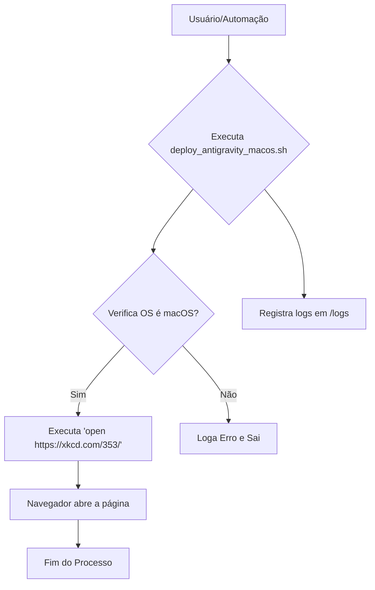

# Arquitetura do Componente Antigravity
**Versão:** 1.0.0
**Data:** 2025-12-02

## 1. Introdução

Este documento descreve a arquitetura do componente `antigravity`. A arquitetura foi projetada para ser extremamente simples, servindo como um caso de teste para as automações e a governança do repositório de dotfiles.

## 2. Visão Geral

O componente `antigravity` não possui uma arquitetura de software complexa. Ele consiste em um único script de shell e um conjunto de documentos e prompts que o cercam.

O fluxo de trabalho principal é o seguinte:
1.  Um usuário ou um processo automatizado invoca o script `deploy_antigravity_macos.sh`.
2.  O script verifica se o ambiente é macOS.
3.  O script utiliza o comando `open` do macOS para abrir uma URL específica no navegador padrão do usuário.
4.  Logs da execução são gerados na pasta `logs`.

## 3. Componentes

| Componente                               | Tecnologia | Responsabilidade                                                              |
| ---------------------------------------- | ---------- | ----------------------------------------------------------------------------- |
| `deploy_antigravity_macos.sh`            | Bash       | Orquestrar a "implantação", que consiste em abrir a URL do XKCD.              |
| `README.md`                              | Markdown   | Fornecer uma visão geral do projeto e instruções iniciais.                    |
| Documentação (`/docs`)                   | Markdown   | Descrever a arquitetura, guias de uso e outras informações relevantes.        |
| Prompts (`/prompts`)                     | Markdown   | Conter os prompts de sistema para que a IA possa entender e gerenciar o componente. |
| Logs (`/logs` e `/audit`)                | Text/Log   | Armazenar registros de execução e auditoria para rastreabilidade.             |

## 4. Diagrama de Fluxo

## 5. Considerações de Design

-   **Simplicidade:** A principal diretriz foi manter o componente o mais simples possível para focar na automação do ciclo de vida (criação, deploy, auditoria).
-   **Dependência Mínima:** O script depende apenas de comandos básicos do macOS (`uname`, `open`), não exigindo instalações adicionais.
-   **Modularidade:** Embora simples, o componente está estruturado em sua própria pasta, permitindo que seja gerenciado de forma independente.
