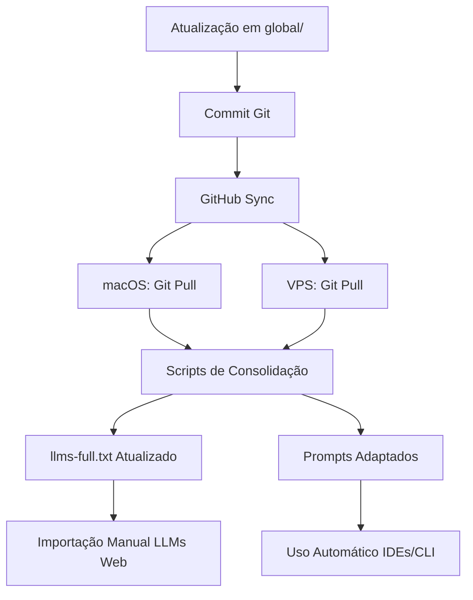

# 🏛️ GOVERNANÇA E EXPANSÃO - System Prompts Globais

**Versão:** 2.0.0
**Data:** 2025-11-28
**Status:** Ativo
**Objetivo:** Definir padrões de atualização, versionamento e expansão do sistema

---

## 🎯 VISÃO GERAL

Este documento define as **regras fundamentais** para:

- ✅ Expansão contínua do repositório
- ✅ Padrão de atualização integrada entre sistemas
- ✅ Sistema de versionamento que torna versões antigas obsoletas
- ✅ Distinção clara entre **global** e **específico de projeto**
- ✅ Melhores práticas de engenharia de contexto
- ✅ Arquitetura global Ubuntu + macOS Silicon
- ✅ Integração GitHub Copilot Pro
- ✅ Variáveis de ambiente padronizadas
- ✅ Status de implantação atual

---

## 📈 EXPANSÃO DO REPOSITÓRIO

### Princípios de Expansão

**Este repositório é evolutivo e pode expandir-se continuamente.**

#### Áreas de Expansão Permitidas

1. **Novos Prompts Globais**
   - Adicionar novos prompts em `global/`
   - Seguir nomenclatura padronizada
   - Documentar em README.md

2. **Novos Engines**
   - Adicionar novos engines em `prompts_temp/engines/`
   - Atualizar `_index_manifest.yaml`
   - Documentar uso específico

3. **Novos Scripts de Automação**
   - Adicionar em `scripts/`
   - Seguir padrão de nomenclatura
   - Incluir documentação inline

4. **Novas Plataformas**
   - Adicionar em `platforms/`
   - Criar documentação específica
   - Integrar com sistema existente

5. **Novos Templates**
   - Adicionar em `templates/`
   - Seguir estrutura padrão
   - Documentar uso

#### Processo de Expansão

1. **Proposta:** Documentar necessidade e escopo
2. **Desenvolvimento:** Criar em `prompts_temp/` primeiro
3. **Validação:** Testar em múltiplos contextos
4. **Promoção:** Mover para `global/` após validação
5. **Documentação:** Atualizar README.md e documentação relacionada

---

## 🔄 PADRÃO DE ATUALIZAÇÃO INTEGRADA

### Princípio Fundamental

**Uma única atualização deve propagar-se automaticamente para todos os sistemas integrados.**

### Sistemas Integrados

| Sistema | Localização | Método de Atualização |
|---------|------------|----------------------|
| **macOS Silicon** | `~/Dotfiles/system_prompts/global/` | Git pull + scripts |
| **VPS Ubuntu** | `/home/admin/Dotfiles/system_prompts/global/` | Git pull + scripts |
| **GitHub Copilot** | Via `.cursorrules` symlinks | Automático via Git |
| **ChatGPT/Claude/Gemini** | Custom Instructions | Manual (via `llms-full.txt`) |
| **Ollama/LM Studio** | Local models | Via scripts de consolidação |
| **Hugging Face** | MCP Server | Via integração configurada |

### Fluxo de Atualização Padrão



### Script de Atualização Integrada

```bash
#!/usr/bin/env bash
# Atualização integrada completa

# 1. Atualizar repositório local
git pull origin main

# 2. Executar auditoria (se necessário)
./scripts/master-auditoria-completa.sh

# 3. Consolidar para LLMs
./scripts/consolidar-llms-full.sh

# 4. Adaptar prompts
./scripts/coletar-e-adaptar-prompts.sh

# 5. Sincronizar VPS (se aplicável)
./scripts/deploy-scripts-vps.sh
```

---

## 📋 SISTEMA DE VERSIONAMENTO

### Versionamento Semântico

**Formato:** `MAJOR.MINOR.PATCH`

- **MAJOR:** Mudanças incompatíveis (torna versões anteriores obsoletas)
- **MINOR:** Novas funcionalidades compatíveis
- **PATCH:** Correções de bugs compatíveis

### Regra de Obsolescência

**Quando uma nova versão MAJOR é lançada:**

1. ✅ Versão anterior é marcada como **OBSOLETA**
2. ✅ Arquivo antigo é movido para `archive/` ou renomeado com sufixo `_obsoleto`
3. ✅ README.md atualizado com aviso de obsolescência
4. ✅ Nova versão torna-se a **única versão ativa**
5. ✅ Scripts atualizados para usar nova versão

### Estrutura de Versionamento

```
global/
├── CURSOR_2.0_SYSTEM_PROMPT_FINAL.md (v2.0.0 - ATIVO)
├── archive/
│   └── CURSOR_2.0_SYSTEM_PROMPT_FINAL_v1.0.0_obsoleto.md
└── CHANGELOG.md (histórico de versões)
```

### Changelog Obrigatório

Cada atualização deve incluir:

```markdown
## [Versão] - YYYY-MM-DD

### Adicionado
- Novas funcionalidades

### Modificado
- Mudanças em funcionalidades existentes

### Obsoleto
- Funcionalidades marcadas para remoção

### Removido
- Funcionalidades removidas

### Corrigido
- Correções de bugs
```

---

## 🌐 GLOBAL vs ESPECÍFICO DE PROJETO

### Critérios para Global

**Um prompt/configuração é GLOBAL se:**

- ✅ Aplica-se a **todos os projetos** sem exceção
- ✅ Define **comportamento padrão** do sistema
- ✅ É usado por **múltiplas ferramentas** (IDEs, LLMs, CLI)
- ✅ Define **políticas de segurança** ou **regras operacionais**
- ✅ É **independente de contexto de projeto**

**Localização:** `~/Dotfiles/system_prompts/global/`

### Critérios para Específico de Projeto

**Um prompt/configuração é ESPECÍFICO se:**

- ✅ Aplica-se apenas a **um projeto específico**
- ✅ Define **comportamento customizado** para contexto único
- ✅ Contém **configurações de projeto** (dependências, estrutura)
- ✅ É usado por **ferramentas específicas** do projeto
- ✅ Depende de **contexto de projeto**

**Localização:** `[projeto]/.cursorrules` ou `[projeto]/prompts/`

### Regra de Ouro

> **"Se você precisa pensar duas vezes se algo é global ou específico, provavelmente é específico."**

### Exemplos

#### Global ✅
- `universal.md` - Prompt base para todos LLMs
- `icloud_protection.md` - Política de proteção iCloud
- `CURSOR_2.0_SYSTEM_PROMPT_FINAL.md` - Prompt completo Cursor
- Regras de segurança e boas práticas

#### Específico de Projeto ✅
- `.cursorrules` em projeto Python específico
- Configurações de linting por projeto
- Prompts de desenvolvimento específicos de framework
- Variáveis de ambiente de projeto

---

## 🏗️ MELHORES PRÁTICAS DE ENGENHARIA DE CONTEXTO

### Princípios Fundamentais

1. **Contexto Estruturado**
   - Hierarquia clara de informações
   - Seções bem definidas
   - Metadados consistentes

2. **Versionamento Explícito**
   - Versão em cada arquivo
   - Data de atualização
   - Changelog mantido

3. **Validação Contínua**
   - Scripts de validação automática
   - Testes em múltiplos contextos
   - Verificação de consistência

4. **Documentação Completa**
   - README atualizado
   - Exemplos de uso
   - Troubleshooting documentado

5. **Automação Máxima**
   - Scripts para todas as operações repetitivas
   - Pipeline automatizado
   - Integração contínua

### Padrões de Estrutura

#### Estrutura de Prompt Padrão

```markdown
# [TÍTULO DO PROMPT]

**Versão:** 2.0.0
**Data:** 2025-11-28
**Status:** Ativo/Obsoleto/Deprecated
**Escopo:** Global/Projeto Específico

---

## 🎯 OBJETIVO
[Objetivo claro e específico]

## 📋 CONTEXTO
[Contexto necessário para uso]

## ⚙️ REGRAS
[Regras e diretrizes]

## 📊 FORMATO DE SAÍDA
[Formato esperado]

## 🔗 REFERÊNCIAS
[Links e referências]

---

**Versão:** 2.0.0
**Última Atualização:** 2025-11-28
**Status:** [Status atual]
```

---

## 🖥️ ARQUITETURA GLOBAL - macOS Silicon + Ubuntu

### Ambiente macOS Silicon

**Hardware:**
- MacBook Pro (Mac16,1)
- Apple M4 (10 cores)
- 24 GB RAM
- ~926GB disponível

**Sistema:**
- macOS Tahoe 26.1
- Darwin 25.1.0
- Shell: zsh
- Package Manager: Homebrew (/opt/homebrew)

**Diretórios Críticos:**
- `~/Dotfiles/system_prompts/global/` - System prompts globais
- `~/.cursor/rules/` - Symlinks para prompts Cursor
- `~/.config/` - Configurações XDG-compliant
- `~/Projects/` - Projetos de desenvolvimento

### Ambiente VPS Ubuntu

**Sistema:**
- Ubuntu 24.04 LTS
- Usuário: admin
- Hostname: senamfo.com.br
- IP: 147.79.81.59

**Diretórios Críticos:**
- `/home/admin/Dotfiles/system_prompts/global/` - System prompts globais
- `/home/admin/infra-vps/` - Repositório infraestrutura
- `/home/admin/padronizacao_arquitetura/` - Documentação padronização

**Serviços:**
- Docker 29.0.4
- Coolify, n8n, Traefik
- PostgreSQL, Redis

### Sincronização Entre Ambientes

**Método:** Git + Scripts de Deploy

**Fluxo:**
1. Desenvolvimento no macOS
2. Commit e push para GitHub
3. Pull automático/manual na VPS
4. Scripts de validação e aplicação

---

## 🔗 INTEGRAÇÃO GITHUB COPILOT PRO

### Configuração

**Assinatura:** GitHub Copilot Pro Ativa

**Integração:**
- Cursor 2.x com Copilot integrado
- VSCode com extensão Copilot
- GitHub CLI configurado

### Uso de Prompts

**Cursor:**
- Prompts carregados via `.cursorrules`
- Symlinks de `global/` para `~/.cursor/rules/`
- Atualização automática via Git

**VSCode:**
- Custom Instructions via extensão
- Prompts em `global/` referenciados
- Sincronização manual via `llms-full.txt`

### Variáveis de Ambiente GitHub

```bash
# GitHub Copilot
export GITHUB_TOKEN="$(op read op://1p_macos/GitHub/copilot_token)"
export GITHUB_USER="senal88"
export GITHUB_REPO_DOTFILES="Dotfiles"
export GITHUB_REPO_INFRA="infraestrutura-vps"
```

---

## 🔧 VARIÁVEIS DE AMBIENTE PADRONIZADAS

### macOS Silicon

```bash
# Dotfiles
export DOTFILES_DIR="${HOME}/Dotfiles"
export SYSTEM_PROMPTS_DIR="${DOTFILES_DIR}/system_prompts/global"

# Homebrew
export HOMEBREW_PREFIX="/opt/homebrew"
export PATH="${HOMEBREW_PREFIX}/bin:${PATH}"

# Python
export PYTHON_VERSION="3.9.6"
export PYENV_ROOT="${HOME}/.pyenv"

# Node.js
export NODE_VERSION="v25.1.0"
export NVM_DIR="${HOME}/.nvm"

# Docker
export DOCKER_HOST="unix:///var/run/docker.sock"

# 1Password
export OP_VAULT_MACOS="1p_macos"
export OP_VAULT_VPS="1p_vps"

# GitHub
export GITHUB_USER="senal88"
export GITHUB_TOKEN="$(op read op://1p_macos/GitHub/copilot_token 2>/dev/null || echo '')"

# Hugging Face
export HF_HOME="${HOME}/.cache/huggingface"
export HF_TOKEN="$(op read op://1p_macos/HuggingFace/token 2>/dev/null || echo '')"
```

### VPS Ubuntu

```bash
# Dotfiles
export DOTFILES_DIR="/home/admin/Dotfiles"
export SYSTEM_PROMPTS_DIR="${DOTFILES_DIR}/system_prompts/global"

# Infraestrutura
export INFRA_VPS_DIR="/home/admin/infra-vps"
export PADRONIZACAO_DIR="/home/admin/padronizacao_arquitetura"

# Docker
export DOCKER_HOST="unix:///var/run/docker.sock"
export COMPOSE_PROJECT_NAME="senamfo"

# Domínio
export DOMAIN_PRINCIPAL="senamfo.com.br"
export VPS_IP="147.79.81.59"

# 1Password
export OP_VAULT_VPS="1p_vps"
export OP_VAULT_MACOS="1p_macos"

# GitHub
export GITHUB_USER="senal88"
export GITHUB_REPO_INFRA="infraestrutura-vps"
```

### Plataformas Integradas

#### Hugging Face

```bash
export HF_HOME="${HOME}/.cache/huggingface"
export HF_TOKEN="$(op read op://1p_macos/HuggingFace/token)"
export HF_DATASETS_CACHE="${HF_HOME}/datasets"
export HF_MODELS_CACHE="${HF_HOME}/models"
```

#### APIs de LLMs

```bash
# OpenAI
export OPENAI_API_KEY="$(op read op://1p_macos/OpenAI/api_key)"

# Anthropic
export ANTHROPIC_API_KEY="$(op read op://1p_macos/Anthropic/api_key)"

# Google Gemini
export GOOGLE_API_KEY="$(op read op://1p_macos/Google/gemini_api_key)"
```

---

## 📊 STATUS ATUAL DE IMPLANTAÇÃO

### ✅ Implementado e Funcional

#### Sistema de Coletas
- ✅ Auditoria completa macOS
- ✅ Auditoria completa VPS
- ✅ Scripts de análise e síntese
- ✅ Consolidação para LLMs

#### Prompts Globais
- ✅ Prompt universal base
- ✅ Prompt Cursor 2.0 completo
- ✅ Prompts de revisão de memórias
- ✅ Prompt de auditoria VPS
- ✅ Política de proteção iCloud

#### Área de Incubação
- ✅ Estrutura `prompts_temp/` completa
- ✅ 5 estágios de desenvolvimento
- ✅ 6 engines adaptados
- ✅ Checklists de lifecycle e avaliação

#### Scripts de Automação
- ✅ Coleta automatizada
- ✅ Análise e síntese
- ✅ Consolidação LLMs
- ✅ Deploy VPS
- ✅ Adaptação de prompts

#### Integrações
- ✅ GitHub Copilot Pro
- ✅ 1Password CLI
- ✅ Hugging Face MCP
- ✅ Variáveis de ambiente padronizadas

### ⏳ Em Desenvolvimento

- ⏳ Automação completa de atualização integrada
- ⏳ CI/CD para validação automática
- ⏳ Dashboard de status de implantação
- ⏳ Testes automatizados cross-platform

### 📋 Planejado

- 📋 Expansão para mais engines
- 📋 Integração com mais plataformas
- 📋 Sistema de métricas e monitoramento
- 📋 Documentação interativa

---

## 🔄 PROCESSO DE ATUALIZAÇÃO PADRÃO

### 1. Desenvolvimento

```bash
# Criar/editar prompt em prompts_temp/
cd ~/Dotfiles/system_prompts/global/prompts_temp/stage_00_coleta
# ... desenvolvimento ...

# Processar através dos estágios
./scripts/coletar-e-adaptar-prompts.sh
```

### 2. Validação

```bash
# Validar estrutura
./scripts/verificar-dependencias.sh

# Testar em múltiplos contextos
# - Cursor
# - ChatGPT
# - Claude
# - Ollama
```

### 3. Promoção

```bash
# Mover para global/ após validação
mv prompts_temp/stage_04_pre_release/[prompt].md global/

# Atualizar versionamento
# Atualizar README.md
# Atualizar CHANGELOG.md
```

### 4. Sincronização

```bash
# Commit e push
git add .
git commit -m "feat: adicionar novo prompt [nome] vX.Y.Z"
git push origin main

# Sincronizar VPS
./scripts/deploy-scripts-vps.sh
```

### 5. Consolidação

```bash
# Atualizar llms-full.txt
./scripts/consolidar-llms-full.sh

# Adaptar para engines
./scripts/coletar-e-adaptar-prompts.sh
```

---

## 📝 CHECKLIST DE EXPANSÃO

Antes de adicionar novo conteúdo:

- [ ] Verificar se é realmente **global** ou específico de projeto
- [ ] Seguir nomenclatura padronizada
- [ ] Incluir versionamento semântico
- [ ] Documentar em README.md
- [ ] Criar em `prompts_temp/` primeiro (se aplicável)
- [ ] Validar em múltiplos contextos
- [ ] Atualizar `_index_manifest.yaml` (se aplicável)
- [ ] Atualizar CHANGELOG.md
- [ ] Testar scripts de automação
- [ ] Sincronizar com VPS (se aplicável)

---

## 🔗 REFERÊNCIAS

- **README.md** - Documentação principal
- **ARQUITETURA_COLETAS.md** - Arquitetura de coletas
- **ANALISE_ARQUITETURA.md** - Análise atual
- **prompts_temp/README.md** - Área de incubação
- **README_VPS.md** - Scripts VPS

---

**Versão:** 2.0.0
**Última Atualização:** 2025-11-28
**Status:** Ativo e em Expansão Contínua

