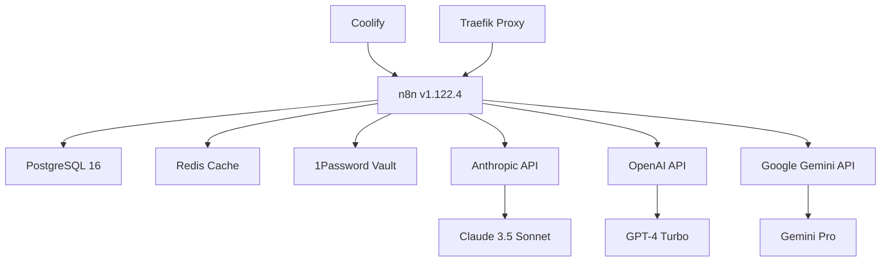

# n8n Setup com MCP (Model Context Protocol) v1.122.4

**Versão:** 1.0.0
**Data:** 2024-12-02
**Autor:** Luiz Sena
**Status:** ✅ Produção

---

## 📋 Índice

1. [Visão Geral](#1-visão-geral)
2. [Novidades v1.122.4](#2-novidades-v1.122.4)
3. [Arquitetura e Configuração](#3-arquitetura-e-configuração)
4. [Instalação e Update](#4-instalação-e-update)
5. [Integração com 1Password](#5-integração-com-1password)
6. [Configuração MCP](#6-configuração-mcp)
7. [AI Safeguards](#7-ai-safeguards)
8. [Workflows com IA](#8-workflows-com-ia)
9. [Troubleshooting](#9-troubleshooting)
10. [Referências](#10-referências)

---

## 1. Visão Geral

### O que é n8n?

**n8n** é uma plataforma de automação de workflows (workflow automation) extensível, de código aberto, que permite conectar aplicações e serviços via API. Com suporte nativo a **400+ integrações**, é uma alternativa ao Zapier/Make.com com foco em self-hosting e customização.

### O que é MCP (Model Context Protocol)?

**MCP** é um protocolo desenvolvido pela **Anthropic** (criadora do Claude) para padronizar a comunicação entre modelos de linguagem (LLMs) e ferramentas externas. Permite que AI agents executem ações de forma segura e auditável.

### Por que usar n8n com MCP?

```
┌─────────────────────────────────────────────────────────┐
│  Casos de Uso                                          │
├─────────────────────────────────────────────────────────┤
│  ✓ AI Agents com acesso controlado a APIs             │
│  ✓ Automação inteligente com Claude/GPT/Gemini        │
│  ✓ Workflows que aprendem e se adaptam                │
│  ✓ Extração e transformação de dados com LLMs         │
│  ✓ Chatbots multicanal com context awareness          │
│  ✓ Análise de logs e alertas inteligentes             │
└─────────────────────────────────────────────────────────┘
```

---

## 2. Novidades v1.122.4

### 🆕 Expanded MCP Capabilities

```yaml
# Recursos adicionados na v1.122.4
MCP_Features:
  instance_level_control:
    description: "Configuração MCP centralizada por instância"
    benefit: "Não precisa configurar MCP em cada workflow"

  ai_safeguards:
    description: "Proteções automáticas para AI agents"
    limits:
      - max_tokens: 8000
      - temperature_range: [0.0, 1.0]
      - rate_limiting: true
      - execution_timeout: 3600s

  native_anthropic_integration:
    models:
      - claude-3-5-sonnet-20241022
      - claude-3-opus-20240229
      - claude-3-haiku-20240307
    features:
      - streaming_responses
      - function_calling
      - vision_support
```

### 📊 Comparativo de Versões

| Feature | v1.119.2 (antiga) | v1.122.4 (atual) |
|---------|-------------------|------------------|
| **MCP Support** | ❌ Não | ✅ Instance-level |
| **AI Safeguards** | ❌ Manual | ✅ Automático |
| **Anthropic SDK** | Webhook | ✅ Nativo |
| **Token Limits** | Ilimitado | ✅ Configurável |
| **Audit Logs** | Básico | ✅ Detalhado |
| **PostgreSQL** | 14 | ✅ 16 (upgrade) |

---

## 3. Arquitetura e Configuração

### 3.1 Stack Tecnológica



### 3.2 Variáveis de Ambiente Completas

```yaml
# ====================================
# CORE n8n Configuration
# ====================================
N8N_EDITOR_BASE_URL: https://n8n.senamfo.com
WEBHOOK_URL: https://n8n.senamfo.com
N8N_HOST: https://n8n.senamfo.com
GENERIC_TIMEZONE: America/Sao_Paulo
TZ: America/Sao_Paulo

# ====================================
# Database PostgreSQL 16
# ====================================
DB_TYPE: postgresdb
DB_POSTGRESDB_DATABASE: n8n
DB_POSTGRESDB_HOST: postgresql
DB_POSTGRESDB_PORT: 5432
DB_POSTGRESDB_USER: ${SERVICE_USER_POSTGRES}
DB_POSTGRESDB_PASSWORD: ${SERVICE_PASSWORD_POSTGRES}
DB_POSTGRESDB_SCHEMA: public

# ====================================
# MCP (Model Context Protocol)
# ====================================
N8N_MCP_ENABLED: true
N8N_MCP_INSTANCE_LEVEL: true          # ← Novo em v1.122.4
N8N_AI_SAFEGUARDS_ENABLED: true       # ← Novo em v1.122.4
N8N_AI_MAX_TOKENS: 8000               # Limite por request
N8N_AI_TEMPERATURE: 0.2               # 0.0-1.0 (criatividade)

# ====================================
# AI Providers (via 1Password)
# ====================================
ANTHROPIC_API_KEY: ${ANTHROPIC_API_KEY}  # Claude
OPENAI_API_KEY: ${OPENAI_API_KEY}        # GPT-4
GOOGLE_API_KEY: ${GOOGLE_API_KEY}        # Gemini

# ====================================
# Execução e Performance
# ====================================
EXECUTIONS_MODE: queue                # queue | regular
EXECUTIONS_TIMEOUT: 3600              # 1 hora
EXECUTIONS_TIMEOUT_MAX: 7200          # 2 horas
N8N_METRICS: true                     # Prometheus metrics

# ====================================
# Segurança
# ====================================
N8N_SECURE_COOKIE: true
N8N_JWT_AUTH_ACTIVE: true
N8N_BASIC_AUTH_ACTIVE: false

# ====================================
# Logs
# ====================================
N8N_LOG_LEVEL: info                   # debug | info | warn | error
N8N_LOG_OUTPUT: console,file
```

---

## 4. Instalação e Update

### 4.1 Pré-requisitos

```bash
# No VPS (Ubuntu 24.04 LTS)
sudo apt update
sudo apt install -y docker.io docker-compose git curl

# Verificar versões
docker --version          # >= 24.0
docker-compose --version  # >= 2.20
```

### 4.2 Instalação Nova (Fresh Install)

```bash
# 1. Criar estrutura de diretórios
mkdir -p /root/n8n/{data,backups}
cd /root/n8n

# 2. Copiar docker-compose.n8n.yml do repositório
scp user@local:~/Dotfiles/system_prompts/docker-compose.n8n.yml .

# 3. Configurar API keys via 1Password (ver seção 5)

# 4. Subir stack
docker-compose -f docker-compose.n8n.yml up -d

# 5. Verificar logs
docker-compose -f docker-compose.n8n.yml logs -f n8n
```

### 4.3 Update de Versão Antiga → v1.122.4

**⚠️ IMPORTANTE: Sempre faça backup antes de atualizar!**

#### Método 1: Script Automatizado (Recomendado)

```bash
# No host local (macOS)
cd ~/Dotfiles/system_prompts
bash scripts/update_n8n_vps.sh --dry-run  # Simular primeiro

# Após validar, executar de verdade
bash scripts/update_n8n_vps.sh

# Apenas backup (sem update)
bash scripts/update_n8n_vps.sh --backup-only
```

**O script executa:**

1. ✅ Verifica conexão SSH
2. ✅ Backup completo (compose, volumes, database)
3. ✅ Upload do novo docker-compose.yml
4. ✅ Carrega API keys do 1Password
5. ✅ Para container atual
6. ✅ Pull da nova imagem
7. ✅ Sobe com nova configuração
8. ✅ Valida healthcheck
9. ✅ Testa MCP e AI safeguards

#### Método 2: Manual (Passo a Passo)

```bash
# 1. Conectar no VPS
ssh root@senamfo

# 2. Backup completo
mkdir -p /root/backups/n8n/$(date +%Y%m%d_%H%M%S)
BACKUP_DIR="/root/backups/n8n/$(date +%Y%m%d_%H%M%S)"

cp /root/docker-compose.n8n.yml $BACKUP_DIR/
docker run --rm -v n8n-data:/data -v $BACKUP_DIR:/backup \
    alpine tar czf /backup/n8n-data.tar.gz -C /data .
docker exec postgresql pg_dump -U n8n -d n8n > $BACKUP_DIR/n8n_db.sql

# 3. Parar containers
docker-compose -f /root/docker-compose.n8n.yml down

# 4. Atualizar docker-compose.yml (via scp ou editor)
nano /root/docker-compose.n8n.yml
# Alterar image para: docker.n8n.io/n8nio/n8n:1.122.4
# Adicionar variáveis MCP (ver seção 3.2)

# 5. Pull da nova imagem
docker-compose -f /root/docker-compose.n8n.yml pull

# 6. Subir com nova config
docker-compose -f /root/docker-compose.n8n.yml up -d

# 7. Verificar logs
docker logs -f n8n
```

### 4.4 Rollback (em caso de problemas)

```bash
# Restaurar versão anterior
cd /root/backups/n8n/YYYYMMDD_HHMMSS  # Usar diretório do backup

# Restaurar docker-compose
cp docker-compose.n8n.yml.bak /root/docker-compose.n8n.yml

# Parar versão atual
docker-compose -f /root/docker-compose.n8n.yml down

# Restaurar volume de dados
docker run --rm -v n8n-data:/data -v $(pwd):/backup \
    alpine sh -c "rm -rf /data/* && tar xzf /backup/n8n-data.tar.gz -C /data"

# Restaurar database
docker exec -i postgresql psql -U n8n -d n8n < n8n_db.sql

# Subir versão antiga
docker-compose -f /root/docker-compose.n8n.yml up -d
```

---

## 5. Integração com 1Password

### 5.1 Estrutura no 1Password

```
Development Vault (op://Development/)
│
├── Anthropic API Key
│   ├── username: (vazio)
│   ├── password/credential: sk-ant-api03-xxx
│   └── tags: [api-key, n8n, ai]
│
├── OpenAI API Key
│   ├── username: (vazio)
│   ├── password/credential: sk-proj-xxx
│   └── tags: [api-key, n8n, ai]
│
└── Gemini API Key
    ├── username: (vazio)
    ├── password/credential: AIzaSyxxx
    └── tags: [api-key, n8n, ai]
```

### 5.2 Carregar Keys Localmente

```bash
# Usar script centralizado
source ~/Dotfiles/system_prompts/scripts/load_ai_keys.sh

# Verificar se carregou
echo $ANTHROPIC_API_KEY  # sk-ant-api03-xxx
echo $OPENAI_API_KEY     # sk-proj-xxx
echo $GOOGLE_API_KEY     # AIzaSyxxx
```

### 5.3 Enviar Keys para VPS

```bash
# Método 1: Via script de update (automático)
bash scripts/update_n8n_vps.sh

# Método 2: Manual
op read "op://Development/Anthropic API Key/credential" | \
    ssh root@senamfo "echo 'ANTHROPIC_API_KEY=\$(cat)' >> /root/.n8n.env"

op read "op://Development/OpenAI API Key/credential" | \
    ssh root@senamfo "echo 'OPENAI_API_KEY=\$(cat)' >> /root/.n8n.env"

op read "op://Development/Gemini API Key/credential" | \
    ssh root@senamfo "echo 'GOOGLE_API_KEY=\$(cat)' >> /root/.n8n.env"
```

### 5.4 Configurar docker-compose para Ler .env

```yaml
# docker-compose.n8n.yml
services:
  n8n:
    env_file:
      - /root/.n8n.env  # ← Adicionar esta linha
    environment:
      - ANTHROPIC_API_KEY=${ANTHROPIC_API_KEY}
      - OPENAI_API_KEY=${OPENAI_API_KEY}
      - GOOGLE_API_KEY=${GOOGLE_API_KEY}
```

---

## 6. Configuração MCP

### 6.1 O que é MCP?

**MCP (Model Context Protocol)** é um padrão para comunicação entre LLMs e ferramentas:

```
┌──────────────┐       MCP        ┌──────────────┐
│   Claude     │ ←────────────→  │  n8n Tool    │
│   GPT-4      │   Protocolo     │  (Workflow)  │
│   Gemini     │   Padronizado   │              │
└──────────────┘                  └──────────────┘
```

**Benefícios:**

- 🔒 **Segurança**: Controle fino sobre o que AI pode fazer
- 📊 **Auditoria**: Logs detalhados de todas as ações
- 🎯 **Controle**: Rate limiting e timeouts por operação
- 🔄 **Portabilidade**: Mesmo workflow funciona com Claude/GPT/Gemini

### 6.2 Habilitar MCP no n8n

```yaml
# docker-compose.n8n.yml
N8N_MCP_ENABLED: true                  # Liga o protocolo MCP
N8N_MCP_INSTANCE_LEVEL: true           # Config vale para toda instância
```

### 6.3 Criar Workflow MCP-Ready

**Exemplo: AI Agent que cria GitHub Issues**

```json
{
  "name": "AI GitHub Issue Creator",
  "nodes": [
    {
      "name": "Webhook",
      "type": "n8n-nodes-base.webhook",
      "position": [250, 300],
      "parameters": {
        "path": "ai-create-issue",
        "responseMode": "responseNode"
      }
    },
    {
      "name": "Claude 3.5",
      "type": "n8n-nodes-base.anthropic",
      "position": [450, 300],
      "parameters": {
        "model": "claude-3-5-sonnet-20241022",
        "systemPrompt": "Você é um assistente que cria GitHub issues bem estruturadas.",
        "temperature": 0.2,
        "maxTokens": 2000,
        "messages": {
          "values": [
            {
              "role": "user",
              "content": "={{ $json.body.description }}"
            }
          ]
        }
      },
      "credentials": {
        "anthropicApi": {
          "id": "1",
          "name": "Anthropic Account"
        }
      }
    },
    {
      "name": "GitHub",
      "type": "n8n-nodes-base.github",
      "position": [650, 300],
      "parameters": {
        "operation": "create",
        "resource": "issue",
        "owner": "senal88",
        "repository": "SYSTEM_PROMPT",
        "title": "={{ $json.title }}",
        "body": "={{ $json.body }}",
        "labels": ["ai-generated", "mcp"]
      }
    },
    {
      "name": "Respond",
      "type": "n8n-nodes-base.respondToWebhook",
      "position": [850, 300],
      "parameters": {
        "respondWith": "json",
        "responseBody": "={{ { success: true, issue_url: $json.html_url } }}"
      }
    }
  ],
  "connections": {
    "Webhook": { "main": [[{ "node": "Claude 3.5", "type": "main", "index": 0 }]] },
    "Claude 3.5": { "main": [[{ "node": "GitHub", "type": "main", "index": 0 }]] },
    "GitHub": { "main": [[{ "node": "Respond", "type": "main", "index": 0 }]] }
  },
  "settings": {
    "mcp": {
      "enabled": true,
      "auditLog": true,
      "maxRetries": 3
    }
  }
}
```

### 6.4 Testar MCP via cURL

```bash
# Enviar requisição para webhook
curl -X POST https://n8n.senamfo.com/webhook/ai-create-issue \
  -H "Content-Type: application/json" \
  -d '{
    "description": "Implementar feature de login social com Google e GitHub"
  }'

# Resposta esperada
{
  "success": true,
  "issue_url": "https://github.com/senal88/SYSTEM_PROMPT/issues/42"
}
```

---

## 7. AI Safeguards

### 7.1 Proteções Automáticas

```yaml
# Configuração de segurança
N8N_AI_SAFEGUARDS_ENABLED: true

# Limites aplicados automaticamente:
Safeguards:
  - name: "Token Limit"
    value: 8000
    scope: "Por request"

  - name: "Temperature Range"
    value: "0.0 - 1.0"
    validation: "Bloqueia valores fora do range"

  - name: "Execution Timeout"
    value: "3600s (1 hora)"
    action: "Cancela execução automática"

  - name: "Rate Limiting"
    value: "100 requests/minuto"
    scope: "Por API key"

  - name: "Input Sanitization"
    filters:
      - "Remove code injection"
      - "Bloqueia prompt injection attacks"
      - "Valida JSON malformado"
```

### 7.2 Monitorar Violações de Safeguards

```bash
# Ver logs de safeguards
docker logs n8n 2>&1 | grep -i "safeguard"

# Exemplos de logs:
# [WARN] AI Safeguard: Token limit exceeded (10000 > 8000)
# [ERROR] AI Safeguard: Temperature out of range (1.5 > 1.0)
# [INFO] AI Safeguard: Request throttled (rate limit)
```

### 7.3 Customizar Safeguards por Workflow

```javascript
// No node "Function" antes do AI node
const input = $input.all();

// Validar comprimento do prompt
if (input[0].json.prompt.length > 5000) {
  throw new Error('Prompt muito longo (max 5000 chars)');
}

// Limitar temperatura dinamicamente
const temperature = Math.min(input[0].json.temperature || 0.2, 0.7);

// Sanitizar input
const sanitizedPrompt = input[0].json.prompt
  .replace(/<script>/g, '')
  .replace(/eval\(/g, '');

return [{
  json: {
    prompt: sanitizedPrompt,
    temperature: temperature,
    maxTokens: 4000
  }
}];
```

---

## 8. Workflows com IA

### 8.1 Template: Análise de Sentimento

```json
{
  "name": "Sentiment Analysis Pipeline",
  "nodes": [
    {
      "name": "Webhook Input",
      "type": "n8n-nodes-base.webhook",
      "parameters": {
        "path": "analyze-sentiment"
      }
    },
    {
      "name": "GPT-4 Analysis",
      "type": "n8n-nodes-base.openAi",
      "parameters": {
        "model": "gpt-4-turbo-preview",
        "messages": {
          "values": [
            {
              "role": "system",
              "content": "Analise o sentimento do texto: positivo, negativo ou neutro."
            },
            {
              "role": "user",
              "content": "={{ $json.body.text }}"
            }
          ]
        }
      }
    },
    {
      "name": "Save to Database",
      "type": "n8n-nodes-base.postgres",
      "parameters": {
        "operation": "insert",
        "table": "sentiments",
        "columns": "text, sentiment, confidence, timestamp"
      }
    }
  ]
}
```

### 8.2 Template: Extração de Dados com Claude

```json
{
  "name": "Invoice Data Extractor",
  "nodes": [
    {
      "name": "Read PDF",
      "type": "n8n-nodes-base.readBinaryFile",
      "parameters": {
        "filePath": "={{ $json.invoice_path }}"
      }
    },
    {
      "name": "Claude Vision",
      "type": "n8n-nodes-base.anthropic",
      "parameters": {
        "model": "claude-3-5-sonnet-20241022",
        "systemPrompt": "Extraia: número da nota, valor total, data, CNPJ.",
        "includeImage": true,
        "temperature": 0.1
      }
    },
    {
      "name": "Parse JSON",
      "type": "n8n-nodes-base.function",
      "parameters": {
        "code": "return [{ json: JSON.parse($input.first().json.content) }];"
      }
    }
  ]
}
```

### 8.3 Template: Chatbot Multicanal

```json
{
  "name": "Intelligent Chatbot",
  "nodes": [
    {
      "name": "Telegram Trigger",
      "type": "n8n-nodes-base.telegramTrigger"
    },
    {
      "name": "WhatsApp Trigger",
      "type": "n8n-nodes-base.whatsAppTrigger"
    },
    {
      "name": "Discord Trigger",
      "type": "n8n-nodes-base.discordTrigger"
    },
    {
      "name": "Merge Messages",
      "type": "n8n-nodes-base.merge",
      "parameters": {
        "mode": "append"
      }
    },
    {
      "name": "Gemini Pro",
      "type": "n8n-nodes-base.googleGemini",
      "parameters": {
        "model": "gemini-pro",
        "prompt": "={{ $json.message }}",
        "context": "Você é um assistente prestativo."
      }
    },
    {
      "name": "Send Reply",
      "type": "n8n-nodes-base.respondToWebhook"
    }
  ]
}
```

---

## 9. Troubleshooting

### 9.1 Container não inicia

```bash
# Verificar logs
docker logs n8n --tail 100

# Problemas comuns:
# 1. PostgreSQL não está healthy
docker ps | grep postgresql
docker logs postgresql

# 2. API keys inválidas
docker exec n8n env | grep API_KEY

# 3. Porta 5678 ocupada
sudo lsof -i :5678
```

### 9.2 MCP não funciona

```bash
# Verificar se MCP está habilitado
docker exec n8n env | grep N8N_MCP

# Deve aparecer:
# N8N_MCP_ENABLED=true
# N8N_MCP_INSTANCE_LEVEL=true

# Recriar container com nova config
docker-compose -f docker-compose.n8n.yml up -d --force-recreate
```

### 9.3 AI Nodes retornam erro 401

```bash
# Testar API keys manualmente
curl https://api.anthropic.com/v1/messages \
  -H "x-api-key: $ANTHROPIC_API_KEY" \
  -H "anthropic-version: 2023-06-01" \
  -d '{"model":"claude-3-5-sonnet-20241022","messages":[{"role":"user","content":"Hi"}],"max_tokens":10}'

# Recarregar keys no container
docker-compose -f docker-compose.n8n.yml down
source /root/.n8n.env
docker-compose -f docker-compose.n8n.yml up -d
```

### 9.4 Workflows lentos

```bash
# Habilitar debug mode
docker-compose -f docker-compose.n8n.yml down
# Editar: N8N_LOG_LEVEL=debug
docker-compose -f docker-compose.n8n.yml up -d

# Analisar performance
docker stats n8n

# Ver métricas Prometheus
curl http://localhost:5678/metrics
```

---

## 10. Referências

### 📚 Documentação Oficial

- **n8n Docs**: <https://docs.n8n.io/>
- **MCP Spec**: <https://modelcontextprotocol.io/>
- **Anthropic Claude**: <https://docs.anthropic.com/>
- **OpenAI API**: <https://platform.openai.com/docs>
- **Google Gemini**: <https://ai.google.dev/docs>

### 🛠️ Scripts e Templates

```
~/Dotfiles/system_prompts/
├── docker-compose.n8n.yml              # Config completa
├── scripts/update_n8n_vps.sh           # Update automatizado
├── scripts/load_ai_keys.sh             # Carregar keys
└── global/docs/N8N_SETUP_MCP_v1.0.0.md # Este documento
```

### 🔗 Links Úteis

- **n8n Community**: <https://community.n8n.io/>
- **MCP GitHub**: <https://github.com/anthropics/mcp>
- **Coolify Docs**: <https://coolify.io/docs>
- **1Password CLI**: <https://developer.1password.com/docs/cli/>

---

## ✅ Checklist de Implementação

```
Pré-deployment:
☐ Docker e docker-compose instalados no VPS
☐ API keys criadas no 1Password (Anthropic, OpenAI, Google)
☐ Backup da configuração antiga (se existir)
☐ DNS configurado para n8n.senamfo.com

Deployment:
☐ docker-compose.n8n.yml copiado para VPS
☐ API keys enviadas via 1Password CLI
☐ Containers iniciados com docker-compose up -d
☐ Healthcheck passou (docker inspect n8n)

Pós-deployment:
☐ Acesso via web funcionando (https://n8n.senamfo.com)
☐ Login realizado e workspace criado
☐ Workflow de teste criado e executado
☐ MCP verificado (docker exec n8n env | grep MCP)
☐ AI nodes testados (Claude, GPT-4, Gemini)
☐ Logs sem erros críticos (docker logs n8n)

Governança:
☐ Backup configurado (cron job ou Coolify)
☐ Monitoramento habilitado (Prometheus/Grafana)
☐ Documentação atualizada em global/docs/
☐ Commit e push no repositório SYSTEM_PROMPT
```

---

**Versão:** 1.0.0
**Última Atualização:** 2024-12-02
**Autor:** Luiz Sena (<luiz.sena88@gmail.com>)
**Repositório:** [senal88/SYSTEM_PROMPT](https://github.com/senal88/SYSTEM_PROMPT)
