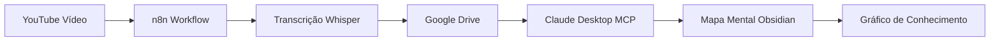

# Projeto: Segundo Cérebro IA

## Claude MCP + Obsidian + n8n + YouTube Transcription

**Versão:** 1.0.0
**Data:** 2025-12-02
**Autor:** Luiz Sena
**Status:** 🚧 Em Desenvolvimento

---

## 📋 Visão Geral

Sistema integrado de gestão de conhecimento que combina:

- **Claude Desktop** com MCP servers (Obsidian + YouTube)
- **Obsidian** como vault de segundo cérebro
- **Mind Maps NextGen** para visualização de conceitos
- **n8n** para automação de transcrições
- **1Password** para gestão segura de credenciais

### Fluxo de Conhecimento



---

## 🏗️ Estrutura do Projeto

```
segundo-cerebro-ia/
├── obsidian-vault/          # Vault do Obsidian
│   ├── .obsidian/           # Configurações Obsidian
│   │   ├── plugins/         # Mind Maps NextGen, etc
│   │   └── config/
│   ├── mapas-mentais/       # Mapas criados pelo Claude
│   ├── transcricoes/        # Transcrições de áudio/vídeo
│   ├── conceitos/           # Notas atômicas de conceitos
│   └── projetos/            # Notas de projetos
│
├── claude-config/           # Configuração Claude Desktop
│   ├── claude_desktop_config.json
│   └── mcp-servers/         # Servers MCP instalados
│
├── n8n-workflows/           # Workflows de automação
│   ├── transcricao-audio.json
│   ├── youtube-to-obsidian.json
│   └── mapa-mental-automatico.json
│
├── scripts/                 # Scripts de automação
│   ├── setup-segundo-cerebro.sh
│   ├── load-obsidian-keys.sh
│   ├── backup-vault.sh
│   └── sync-claude-obsidian.sh
│
├── templates/               # Templates Obsidian
│   ├── mapa-mental.md
│   ├── nota-atomica.md
│   └── projeto.md
│
├── docs/                    # Documentação
│   ├── SETUP.md
│   ├── WORKFLOW.md
│   └── TROUBLESHOOTING.md
│
└── config/                  # Configurações gerais
    ├── obsidian-settings.json
    ├── cloudinary-config.json
    └── 1password-references.json
```

---

## 🎯 Funcionalidades

### 1. Transcrição Automática de Áudio/Vídeo

- ✅ Upload para Google Drive trigger
- ✅ Detecção automática de arquivos de áudio
- ✅ Transcrição via OpenAI Whisper
- ✅ Transcode via Cloudinary
- ✅ Salvamento em Google Docs

### 2. Claude MCP Obsidian Integration

- ✅ Leitura/escrita de arquivos no vault
- ✅ Criação de mapas mentais estruturados
- ✅ Marcação automática de conceitos [[double bracket]]
- ✅ Execução de comandos Obsidian via MCP

### 3. YouTube Transcript Integration

- ✅ Extração de transcrições de vídeos YouTube
- ✅ Conversão para mapas mentais
- ✅ Integração com vault Obsidian

### 4. Geração de Mapas Mentais

- ✅ Formato compatível com Mind Maps NextGen
- ✅ Marcação abundante de conceitos (30%+ de palavras)
- ✅ Hierarquia clara com até 4 níveis
- ✅ Checkboxes para tarefas
- ✅ Formatação inline (negrito, itálico, links)

### 5. Gráfico de Conhecimento

- ✅ Conexões automáticas entre conceitos
- ✅ Visualização de relações no Obsidian Graph
- ✅ Descoberta de padrões emergentes

---

## 🔧 Tecnologias

| Componente | Tecnologia | Versão | Propósito |
|------------|-----------|--------|-----------|
| **Desktop AI** | Claude Desktop | Latest | Interface principal com MCP |
| **Knowledge Base** | Obsidian | 1.5+ | Vault de segundo cérebro |
| **Mind Mapping** | Mind Maps NextGen | Latest | Visualização de mapas |
| **Automation** | n8n | 1.122.4+ | Workflows de transcrição |
| **Transcription** | OpenAI Whisper | via API | Transcrição de áudio |
| **Media Processing** | Cloudinary | via API | Transcode de arquivos |
| **Storage** | Google Drive | via API | Armazenamento de arquivos |
| **Secrets** | 1Password | CLI | Gestão de credenciais |
| **MCP Server** | @fazer-ai/mcp-obsidian | Latest | Bridge Claude ↔ Obsidian |
| **MCP Server** | youtube-transcript | Latest | Extração de legendas YouTube |

---

## 📦 Dependências

### macOS

```bash
# Homebrew
brew install --cask obsidian
brew install --cask claude
brew install node
brew install bun
brew install jq
brew install --cask 1password-cli

# Node/Bun packages (global)
npm install -g @fazer-ai/mcp-obsidian
npm install -g @kimtaeyoon83/mcp-server-youtube-transcript
```

### APIs Necessárias

- ✅ OpenAI API Key (Whisper para transcrição)
- ✅ Cloudinary Account (transcode de áudio)
- ✅ Google Drive API (trigger e storage)
- ✅ Obsidian Local REST API (opcional, para automações avançadas)

---

## 🚀 Setup Rápido

### 1. Clonar/Criar Estrutura

```bash
cd ~/Dotfiles/system_prompts
mkdir -p segundo-cerebro-ia/{obsidian-vault,claude-config,n8n-workflows,scripts,templates,docs,config}
cd segundo-cerebro-ia
```

### 2. Configurar Claude Desktop

```bash
# Copiar config MCP
cp ~/Dotfiles/system_prompts/global/docs/obsidian-mcp/claude_desktop_config.json \
   claude-config/

# Instalar MCP servers
bunx @fazer-ai/mcp-obsidian@latest --help
bunx @kimtaeyoon83/mcp-server-youtube-transcript --help
```

### 3. Configurar Obsidian

```bash
# Criar vault
mkdir -p obsidian-vault/{mapas-mentais,transcricoes,conceitos,projetos}

# Instalar plugins (via interface Obsidian)
# - Mind Maps NextGen
# - Dataview (opcional)
# - Templater (opcional)
```

### 4. Configurar n8n Workflows

```bash
# Copiar workflow de transcrição
cp ~/Dotfiles/system_prompts/global/docs/obsidian-mcp/N8N\ -\ Transcrever\ áudio.json \
   n8n-workflows/transcricao-audio.json

# Importar no n8n via interface web
```

### 5. Configurar Credenciais (1Password)

```bash
# Criar entries no 1Password
op item create \
  --category="API Credential" \
  --title="Obsidian MCP API Key" \
  --vault="Development" \
  --tags="obsidian,mcp,segundo-cerebro" \
  credential[password]="<sua-api-key>"

op item create \
  --category="API Credential" \
  --title="Cloudinary API Credentials" \
  --vault="Development" \
  --tags="cloudinary,n8n" \
  cloud_name[text]="<seu-cloud-name>" \
  api_key[text]="<sua-api-key>" \
  api_secret[password]="<seu-api-secret>"
```

---

## 📝 Workflow de Uso

### Cenário 1: Transcrever e Mapear Podcast

```bash
# 1. Fazer upload do arquivo de áudio para pasta monitorada no Google Drive
# 2. n8n detecta automaticamente e inicia transcrição
# 3. Transcrição é salva no Google Drive
# 4. Abrir Claude Desktop:

Claude> Leia a transcrição do arquivo "podcast-nvidia.txt" do Google Drive
Claude> Crie um mapa mental estruturado sobre Performance Operacional com IA
Claude> Salve o mapa em obsidian-vault/mapas-mentais/nvidia-performance.md
Claude> Abra o arquivo no Obsidian
Claude> Execute o comando "Mind Maps NextGen: Visualizar Mapa"
```

### Cenário 2: Extrair Conceitos de Vídeo YouTube

```bash
Claude> Extraia a transcrição do vídeo https://youtube.com/watch?v=XXXXX
Claude> Crie um mapa mental sobre os conceitos principais
Claude> Marque todos os termos técnicos com [[double brackets]]
Claude> Salve como mapa-mental-youtube-XXXXX.md
Claude> Visualize no Obsidian
```

### Cenário 3: Criar Nota Atômica de Conceito

```bash
Claude> A partir do mapa mental "nvidia-performance.md"
Claude> Crie notas atômicas separadas para cada conceito marcado [[assim]]
Claude> Salve em obsidian-vault/conceitos/
Claude> Adicione links bidirecionais entre conceitos relacionados
```

---

## 🔐 Segurança

### Variáveis de Ambiente (via 1Password)

```bash
# Carregar credenciais
export OBSIDIAN_API_KEY=$(op read "op://Development/Obsidian MCP API Key/credential")
export CLOUDINARY_CLOUD_NAME=$(op read "op://Development/Cloudinary API Credentials/cloud_name")
export CLOUDINARY_API_KEY=$(op read "op://Development/Cloudinary API Credentials/api_key")
export CLOUDINARY_API_SECRET=$(op read "op://Development/Cloudinary API Credentials/api_secret")
export OPENAI_API_KEY=$(op read "op://Development/OpenAI API Key/credential")
```

### Script de Load Automático

```bash
# Será criado em scripts/load-obsidian-keys.sh
source ~/Dotfiles/system_prompts/segundo-cerebro-ia/scripts/load-obsidian-keys.sh
```

---

## 📊 Métricas de Sucesso

- ✅ **Densidade de Conceitos**: Mínimo 30% de palavras marcadas [[assim]]
- ✅ **Profundidade de Mapas**: Máximo 4 níveis hierárquicos
- ✅ **Conexões por Nota**: Média de 5+ links por nota atômica
- ✅ **Tempo de Transcrição**: < 5min para áudio de 1 hora
- ✅ **Tamanho do Grafo**: 500+ nós interconectados em 3 meses

---

## 🎓 Conceitos-Chave

### Segundo Cérebro (Second Brain)

Sistema externo de gestão de conhecimento baseado no método PARA:

- **P**rojetos: Iniciativas com deadline
- **A**reas: Responsabilidades contínuas
- **R**ecursos: Tópicos de interesse
- **A**rquivo: Itens inativos

### Zettelkasten

Método de notas atômicas interconectadas:

- Uma ideia = uma nota
- Links bidirecionais entre conceitos
- Emergência de padrões através de conexões

### Model Context Protocol (MCP)

Protocolo para integração de LLMs com ferramentas:

- Bridge entre Claude e Obsidian
- Execução de comandos no vault
- Leitura/escrita de arquivos

### Mind Mapping

Visualização hierárquica de conceitos:

- Centro = ideia principal
- Ramos = conceitos relacionados
- Cores = níveis de profundidade

---

## 🛠️ Próximos Passos

1. ⏳ Executar script de setup automatizado
2. ⏳ Criar primeiro mapa mental de teste
3. ⏳ Validar integração Claude ↔ Obsidian
4. ⏳ Testar workflow de transcrição no n8n
5. ⏳ Documentar casos de uso adicionais

---

## 📚 Referências

- [Obsidian Documentation](https://help.obsidian.md/)
- [Mind Maps NextGen Plugin](https://github.com/fazer-ai/obsidian-mindmap-nextgen)
- [MCP Obsidian Server](https://github.com/fazer-ai/mcp-obsidian)
- [Building a Second Brain (Tiago Forte)](https://www.buildingasecondbrain.com/)
- [Zettelkasten Method](https://zettelkasten.de/)
- [Claude MCP Documentation](https://modelcontextprotocol.io/)

---

**Status:** 🚧 Projeto em setup inicial
**Próxima Ação:** Executar `scripts/setup-segundo-cerebro.sh`
